# 极客时间大数据训练营结业
## 作业一：基于SPark3.1.1分析一条 TPCDS SQL
## 作业二：基于Lambda架构的数据平台架构设计

## 作业三
### 简述 HDFS 的读写流程
#### HDFS写流程
- 1 客户端发起文件上传请求，通过RPC与NameNode建立通讯，NameNode检查目标文件是否已存在，父目录是否存在，返回是否可以上传
- 2 客户端将要上传的文件进行分块(默认每块128MB)
- 3 客户端向NameNode发送第一个Block该传输到哪些DataNode服务器上的写数据请求
- 4 NameNode根据配置文件中指定的备份数量及机架感知原理进行文件分配，返回可用的DataNode的地址，假设为A,B,C
- 5 客户端通过RPC建立PipeLine，客户端向可用DataNode中的一台机器假设为A上传数据，A收到请求继续调用B，B再调用C，整个PipeLine建立完成，再逐级返回给客户端(C调用B，B调用A，A返回给客户端)。
- 6 客户端开始往A上传第一个Block，以Packet为单位(默认64K),A收到一个Packet就会传给B，B传给C；A每传一个packet会放入一个应答队列等待应答。
- 7 数据被分割成一个个Packet数据包在Pipeline上依次传输，在Pipeline反方向上，逐个发送Ack(命令正确应答)，最终由Pipeline中第一个DataNode节点A将PipeLine Ack发送给客户端;
- 8 写入完成后，DataNode向NameNode发送消息更新元数据，NameNode更新记录内存中DataNode和Block的关系。
- 9 客户端关闭同DataNode建立的pipeline。
- 10 按照上面的方式从第3步开始，客户端再次向NameNode请求上传第2个Block，之后第3个，......, 第N个Block。 

#### HDFS读流程
- 1 客户端向NameNode发起RPC请求，来确定请求文件Block所在的位置
- 2 NameNode视情况返回文件的部分或者全部Block列表，对于每个Block，NameNode都会返回含有该Block副本的DataNode地址；返回的DataNode地址，会按照集群拓扑结构得出DataNode与客户端距离，然后进行排序，排序两个规则：网络拓扑结构中距离客户端近的靠前；心跳机制中超时汇报的DataNode状态为STALE，排靠后；
- 3 客户端选取排序靠前的DataNode来读取Block，如果客户端本身就是DataNode,那么将从本地直接获取数据(短路读取特性)
- 4 底层上本质上建立 Socket Stream(FSDataInputStream)，重复调用调用父类DataInputStream的read方法，并行读取数据(如果失败则重新读取)，直到该Block数据读取完毕。
- 5 读取完一个Block进行checksum验证，如果读取DataNode时出现错误，客户端会通知NameNode，然后再从下一个拥有该Block副本的DataNode继续读。
- 6 当读完列表的Block后，若文件读取还没有结束，客户端会继续向NameNode获取下一批的Block列表
- 7 返回后续Block列表
- 8 最终关闭读流，并将读取来所有的Block合并成一个完整的最终文件。

### 简述 Spark Shuffle 的工作原理
Shuffle只发生在两个Stage之间，在Partition内部进行数据的重新排布。Spak Shuffle分为shuffle write阶段(map side)和shuffle read阶段(reduce side),Spark1.2前使用HashShuffle算法,1.2之后主要使用SortShuffle。
- Shuffle Write阶段根据RDD分区数决定任务个数，该阶段将状态以及Shuffle文件的位置信息封装到MapState对象中，之后发送给Driver。
> HashShuffle算法中，Shuffle write阶段,每个task根据记录的Key进行哈希取模操作(hash(key) % reduceNum),相同结果的记录会写到同一个磁盘文件中。会先将数据写入内存缓冲区,当内存缓冲填满之后,才会溢写(spill)到磁盘文件中。
- Shuffle Read阶段通过park.sql.shuffle.partitions决定任务个数，该阶段从Driver中拉取MapState，经过解析来执行Reduce操作。
> HashShuffle算法中，Shuffle read阶段,从各个节点上通过网络拉取到reduce任务所在的节点,然后进行key的聚合或连接等操作。 一般来说,拉取Shuffle中间结果的过程是一边拉取一边聚合的。每个shuffle read task都会有一个自己的buffer缓冲区,每次只能拉取与buffer缓冲区相同大小的数据,然后在内存中进行聚合。聚合完一批数据后,再拉取下一批数据,直到最后将所有数据到拉取完,得到最终的结果。

SortShuffle运行机制又分成普通运行机制和bypass运行机制两种。Task的数据会先写入一个内存数据结构中,当内存满了之后,会根据Key进行排序,然后分批溢写到本地磁盘。溢写过程只会产生两个磁盘文件， 数据文件和索引文件(其中标识了各个task的数据在文件中的start offset与end offset)
### 简述 Flink SQL 的工作原理
Flink SQL基于Apache Calcite来实现的标准SQL，是构建在Table API之上的更高级的接口。利用Apache Calcite将SQL翻译为关系代数表达式，使用表达式折叠，下推优化等优化技术生成物理执行计划，利用Codegen技术生成高效执行代码。Flink内部所有数据库和表的元数据信息存放在Flink CataLog内部目录结构中，其中包括表结构信息和数据源信息等。将输入的SQL转化为可以执行的JobGraph便可以提交给Flink去执行，整个执行流程描述如下：
- 1 SQL语法解析
> 利用Apache Calcite SQL Parser通过java cc解析成AST(语法树),在Calcite中用SqlNode表示AST
- 2 Sql Validator
> 获取 Catalog 中元数据的信息进行语法分析和验证
- 3 生成逻辑计划(Logical Plan)
> 将SqlNode表示的AST转换成RelNode表示的关系代数表达式，得到逻辑计划。
- 4 逻辑计划优化，得到Optimized LogicalPlan
> 基于Calcite Rules优化逻辑计划，再基于Flink定制的一些优化Rules优化Logical Plan。Flink SQL目前常见的优化器有：
> - 表达式折叠(Expression Reduce)，也就是，优化器在优化过程中会递归遍历树上节点，尽可能预计算出每个表达式的值。
> - 下推优化(PushDown Optimization),其中有谓词下推(Predicate Pushdown)、列裁剪(Projection Pushdown)等。

- 5 根据逻辑计划生成物理执行计划
> 物理计划会根据物理实现特性，根据每一个节点的Cost,生成具体实现方式，比如Join是使用SortMergeJoin、HashJoin或BroadcastHashJoin等。优化器在生成逻辑执行计划时会计算整棵树上每一个节点的Cost，对于有多种实现方式的节点(比如Join节点)，优化器会展开所有可能的Join方式分别计算，最终整条路径上Cost最小的实现方式就被选中成为Final Physical Plan。
- 6 通过代码生成技术(CodeGen)生成transformation，再进一步编译为可执行的JobGraph

