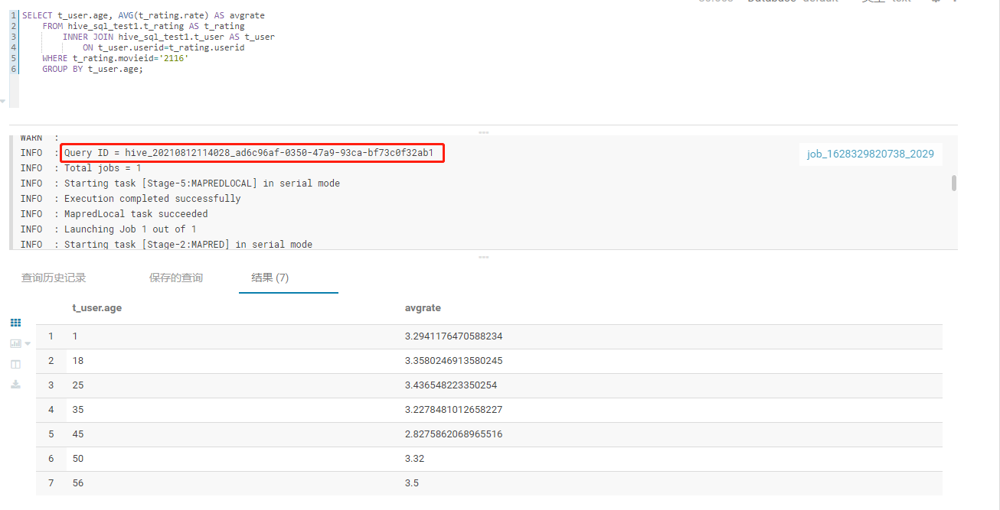
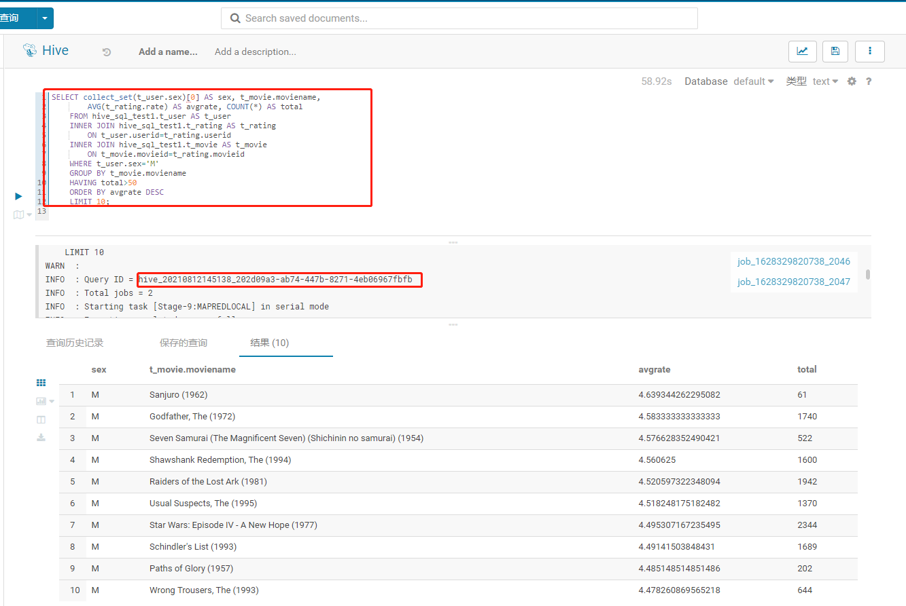
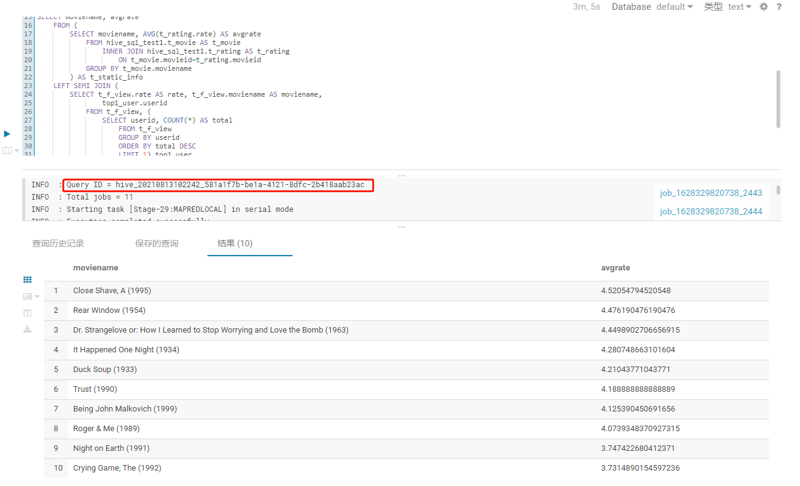

## MR:手机流量统计

代码路径:
https://github.com/DepInjoy/geektime/tree/main/BigDataTraining/src/main/java/jike/hadoop/phoneDataProcess


在Haoop集群提交指令
```shell
yarn jar BigDataTraining.jar jike.hadoop.phoneDataProcess.PhoneDataProcessor xieyue/HTTP_20130313143750.dat xieyue/out
```

任务执行结果


执行结果


## RPC:获取学号

代码路径:
https://github.com/DepInjoy/geektime/tree/main/BigDataTraining/src/main/java/jike/hadoop/studentIdRPC


## 使用JAVA API 操作HBase:

代码路径：https://github.com/DepInjoy/geektime/tree/main/BigDataTraining/src/main/java/jike/hadoop/hbaseAction

提交指令
```shell
yarn jar BigDataTraining.jar jike.hadoop.hbaseAction.StudentInfoProcessor
```


## HIve

### 查询一

查询语句：
```sql
SELECT t_user.age, AVG(t_rating.rate) AS avgrate
    FROM hive_sql_test1.t_rating AS t_rating
        INNER JOIN hive_sql_test1.t_user AS t_user
            ON t_user.userid=t_rating.userid
    WHERE t_rating.movieid='2116'
    GROUP BY t_user.age;
```


### 查询二
查询语句：
```sql
SELECT collect_set(t_user.sex)[0] AS sex, t_movie.moviename,
        AVG(t_rating.rate) AS avgrate, COUNT(*) AS total
    FROM hive_sql_test1.t_user AS t_user
    INNER JOIN hive_sql_test1.t_rating AS t_rating
        ON t_user.userid=t_rating.userid
    INNER JOIN hive_sql_test1.t_movie AS t_movie
        ON t_movie.movieid=t_rating.movieid
    WHERE t_user.sex='M'
    GROUP BY t_movie.moviename
    HAVING total>50
    ORDER BY avgrate DESC
    LIMIT 10;
```


### 查询三

查询语句：

```sql
CREATE VIEW IF NOT EXISTS t_f_view AS
    SELECT t_user.userid AS userid,
            t_movie.moviename AS moviename,
            t_rating.rate AS rate
        From hive_sql_test1.t_movie AS t_movie
        INNER JOIN hive_sql_test1.t_rating AS t_rating
            ON t_movie.movieid=t_rating.movieid
        INNER JOIN hive_sql_test1.t_user AS t_user
            ON t_rating.userid=t_user.userid
        WHERE t_user.sex='F';

SELECT moviename, avgrate
    FROM (
        SELECT moviename, AVG(t_rating.rate) AS avgrate
            FROM hive_sql_test1.t_movie AS t_movie
                INNER JOIN hive_sql_test1.t_rating AS t_rating
                    ON t_movie.movieid=t_rating.movieid
            GROUP BY t_movie.moviename
        ) AS t_static_info
    LEFT SEMI JOIN (
        SELECT t_f_view.rate AS rate, t_f_view.moviename AS moviename,
                top1_user.userid
            FROM t_f_view, (
                SELECT userid, COUNT(*) AS total
                    FROM t_f_view
                    GROUP BY userid
                    ORDER BY total DESC
                    LIMIT 1) top1_user
            WHERE t_f_view.userid=top1_user.userid
            ORDER BY rate DESC
            LIMIT 10
        ) t_top1user_top10rate
    ON t_static_info.moviename=t_top1user_top10rate.moviename
    ORDER BY avgrate DESC;
```



## Presto
### HyperLogLog算法
#### 用途和实际案例
主要用途是基数统计，例如
-1 统计页面的UV
-2 统计访问量(IP数)
-3 统计在线用户数
-4 统计每天搜索不同词条的个数
-5 统计注册 IP 数
-6 统计在线用户数
-7 统计用户每天搜索不同词条的个数

```sql
select approx_distinct(user_id) from user_visits;
select distinct count(user_id) from user_visits;
```

## Flink作业
每分钟（小时）计算在五分钟（小时）内每个账号的平均交易金额
```shell
git clone https://github.com/apache/flink-playgrounds.git
```
功能实现: geektime\BigDataTraining\src\main\java\jike\flink\SpendReport.java

## 环境相关
配置hosts:
```
47.101.206.149		jikehadoop01
47.101.216.12		jikehadoop02
47.101.204.23		jikehadoop03
47.101.202.85		jikehadoop04
47.101.72.185		jikehadoop05
139.196.15.153		jikehadoop06
106.15.39.86		jikehadoop07
139.196.162.22		jikehadoop08
```


