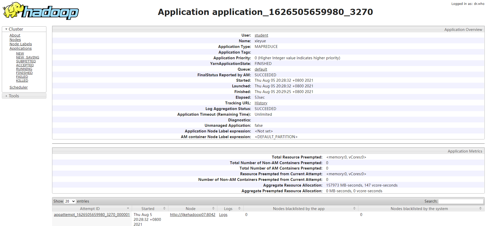
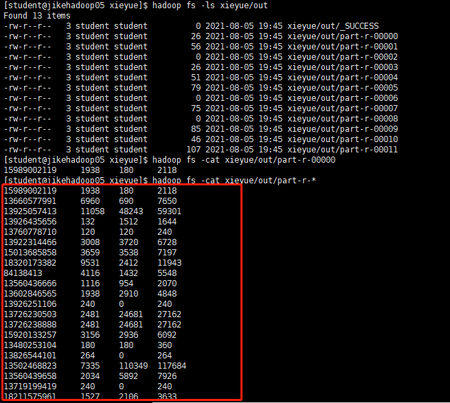
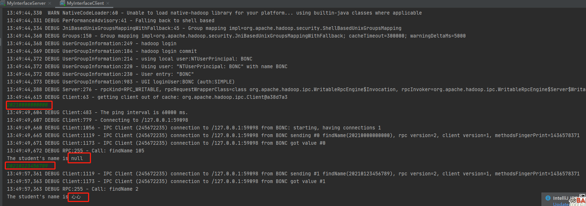
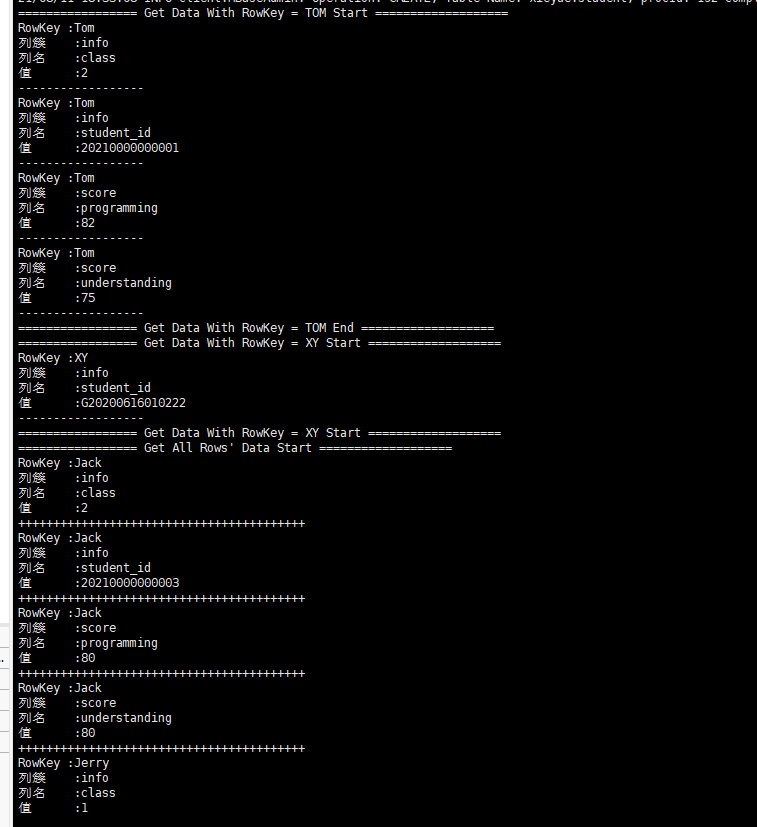

## MR:手机流量统计

代码路径:
https://github.com/DepInjoy/geektime/tree/main/BigDataTraining/src/main/java/jike/hadoop/phoneDataProcess


在Haoop集群提交指令
```shell
yarn jar BigDataTraining.jar jike.hadoop.phoneDataProcess.PhoneDataProcessor xieyue/HTTP_20130313143750.dat xieyue/out
```

任务执行结果


执行结果



## RPC:获取学号

代码路径:
https://github.com/DepInjoy/geektime/tree/main/BigDataTraining/src/main/java/jike/hadoop/studentIdRPC



## 使用JAVA API 操作HBase:

代码路径：https://github.com/DepInjoy/geektime/tree/main/BigDataTraining/src/main/java/jike/hadoop/hbaseAction

提交指令
```shell
yarn jar BigDataTraining.jar jike.hadoop.hbaseAction.StudentInfoProcessor
```



## 环境相关
配置hosts:
```
47.101.206.149		jikehadoop01
47.101.216.12		jikehadoop02
47.101.204.23		jikehadoop03
47.101.202.85		jikehadoop04
47.101.72.185		jikehadoop05
139.196.15.153		jikehadoop06
106.15.39.86		jikehadoop07
139.196.162.22		jikehadoop08
```


