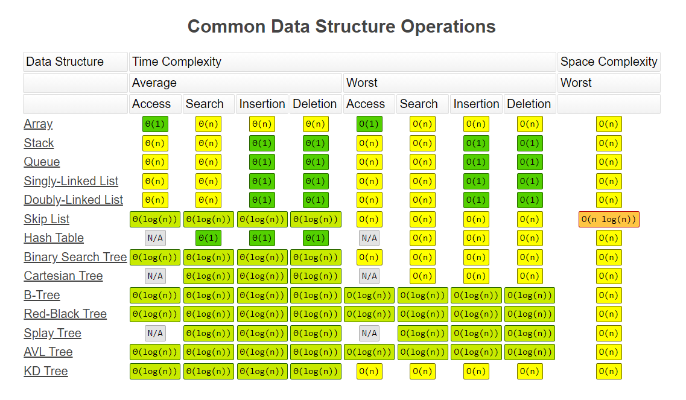
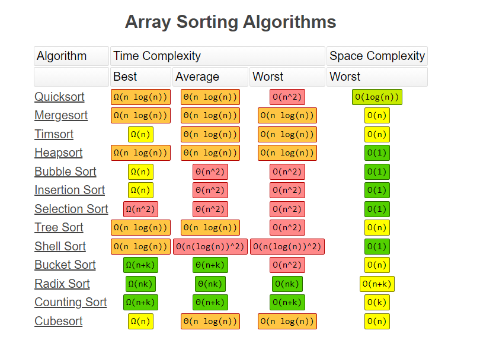

该目录主要是对算法和数据结构学习的记录和总结

# 数据结构
常见数据结构和操作复杂度

图片来源(https://www.bigocheatsheet.com/)
## 树
[树](./doc/Tree.md)

# 算法

## 缓存策略
参见[缓存策略](./CacheReplacePolicies/README.md)

# 排序算法

图片来源(https://www.bigocheatsheet.com/)

一些自我探索式实现和总结，参见[排序算法](./Sort/README.md)
