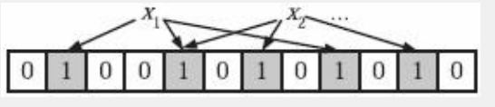
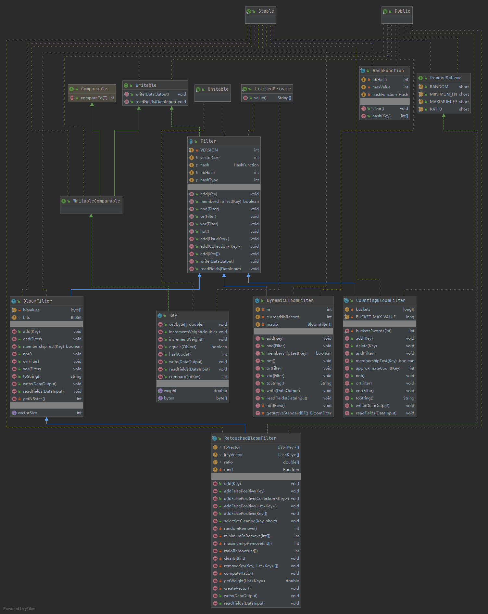

# 布隆滤波器

Bloom Filter，也就是布隆过滤器，是由Howard Bloom在1970年提出的二进制向量数据结构，它具有很好的空间和时间效率，尤其是空间效率极高，BF常常被用来检测某个元素是否是巨量数据集合中的成员。

## 原理

BF使用长度为m的位数组来存储集合信息，同时使用k个相互独立的哈希函数将数据映射到位数组空间。基本思想如下：首先，将长度为m的位数组元素全部置为0。对于集合S中的某个成员a，分别使用k个哈希函数对其计算，$h_i(a)=x(1\le i\le k, 1 \le x \le m )$，则将位数组的第x位置为1，对于成员a来说，经过k个哈希函数计算后，可能会将位数组中的w位($w\le k$)置为1。对于集合中的其他成员也如此处理，这样即可完成位数组空间的集合表示。其算法流程如下：

```C++
BloomFilter(set A, hash_functions, integer m)
	filter [1….m]= 0;   //大小为m的位数组初始化为0
	foreach ai in A:
		foreach hash function hj:
 			filter[hj(ai)] = 1;
 		end foreach
	end foreach
    return filter
```


当查询某个成员a是否在集合S中出现时，使用相同的k个哈希函数计算，如果其对应位数组中的w位（$w \le k$）都为1，则判断成员a属于集合S，只要w位中有任意一位为0，则判断成员a不属于集合S，其算法流程如下：

```c++
MembershipTest (element, filter, hash_functions)
	foreach hash function hj:
	if filter[hj(element)] ！= 1 then
		return False
	end foreach
	return true
```


## 误判率的计算和使用

BF使用位数组和哈希函数来表征集合，并不需要实际存储集合数据本身内容，所以其空间利用率非常高，但是有个潜在问题，即在查询某个成员是否属于集合时，如果某个成员不在集合中，有可能BF会得出其在集合中的结论，发生误判（False Positive）。但是，不会发生漏判（False Negative）的情况，即如果某个成员确实属于集合，那么BF一定能够给出正确判断。所以BF只能使用在允许发生一定误判的场景，而在要求百分之百精确判断集合成员的场景下不能使用。

为何BF会发生误判呢？如下示例:
								
位数组长度为12，使用3个哈希函数，图中表示集合中两个成员`x1`和`x2`已经通过上文所述算法表现到位数组集合中了（3个哈希函数值对应位置都设置为1）。如果此时查询不属于集合的成员`x3`是否在集合中，而正好3个哈希函数对`x3`计算后对应的位置分别是2、7和11，那么根据判断规则，BF会认为`x3`属于集合，因为其对应位置都为1，此时就发生了误判现象。


当向一个m bits大小的`BloomFilter`插入n个key后，误判率怎么计算？

1.  BF中的任何一个bit在第一个元素的第一个hash函数执行完之后为 0的概率是: $1-\frac{1}{m} $
2.  BF中的任何一个bit在第一个元素的k个hash函数执行完之后为 0的概率是:$(1-\frac{1}{m})^k$
3.  BF中的任何一个bit在所有的n元素都添加完之后为0的概率是:$(1-\frac{1}{m})^{kn}$
4.  BF中的任何一个bit在所有的n元素都添加完之后为1的概率是:$1-(1-\frac{1}{m})^{kn}$
5.  一个不存在的元素被k个hash函数映射后k个bit都是1的概率是:$[1-(1-\frac{1}{m})^{kn}]^k\approx (1-e^{\frac{-kn}{m} })^k$


影响误判率的因素，包括集合大小`n`、哈希函数的个数`k`和位数组大小`m`。

- 假设n和m已知，使得误判率可以达到最低的Hash函数的个数

    ​						$k=\frac{m}{n}\ln_{}{2} $

- 假设已知集合大小`n`和误判率`p`,计算给BF分配多大内存合适，也就是需要确定m
    的大小。这是实际应用中最常见的场景。

    ​							$m=-\frac{n\ln_{}{p} }{{(\ln{}{2})}^2} $

## 改进：计数Bloom Filter

基本的BF在使用时有个缺点：无法删除集合成员，只能增加成员并对其查询，其根本原因是其基本信息单元是1个比特位，所以只能表达两种状态(存在或不存在)，致使其表达能力非常有限。无法删除集合成员这个缺点限制了基本BF的使用场景，因为很多场景下集合成员是动态变化的，有增有减，此时BF就无法使用，因为它只能处理集合成员递增的情形。

计数BF（Counting Bloom Filter）对此做出了改进，使得BF可以删除集合成员，这样就大大拓展了BF的使用范围。改进的思路很直接，将基本信息单元由1比特位拓展为多个比特位，一般情况采取3或4比特位为单元，这样就可以有更多表达能力。将集合成员加入位数组时，根据k个哈希函数计算，此时对应位置的信息单元由多个比特位构成，所以将原先的数值加1即可。查询集合成员时，只要对应位置的信息单元都不为0即可认为该成员属于集合。而删除成员，只要将对应位置的计数减1即可。

计数BF拓展了BF的应用场景，对应的代价是增加了位数组大小，如果采取3比特位作为基本单元的话，则位数组大小增加3倍。另外，存在计数溢出的可能，因为比特位表达能力仍然有限，这样当计数很大的时候存在计数溢出问题。

## 实际应用

因为BF的极高空间利用率，其在各个领域获得了非常广泛的使用，尤其是数据量极大且容忍一定误判率的场合。

- Google Chrome浏览器使用它进行恶意URL的判断
- 网络爬虫使用它对已经爬取过的URL进行判断
- 缓存使用BF来对海量数据进行查找
- 比特币使用BF对历史交易进行验证
- 数据库领域使用BF来实现Bloom Join，即加速两个大小差异巨大的表的Join过程
- `BigTable`将`SSTable`文件中包含的数据记录Key形成BF结构并将其放入内存，这样就能极高地提高查询速度，对于改善读操作有巨大的帮助作用。在这种场景下，BF的误判并不会造成严重影响，如果发生误判，定做增加一次读磁盘操作，而不会漏判则发挥了更大的作用，避免了读操作失败。Cassandra在实现时也采取了类似思路。
- Google的流式计算系统`MillWheel`在保证数据记录“恰好送达一次”语义时对重复记录的检测也采用了类似`BigTable`的BF用法。


## 开源实现解读

### ClickHouse布隆滤波器

基于21.12分支，布隆滤波器源码实现位于`src\Interpreters\BloomFilter.cpp`和`src\Interpreters\BloomFilterHash.h`中，主要由

- `BloomFilterParameters`:BF的关键输入参数
- `BloomFilter`：布隆滤波器的实现体。
- `BloomFilterHash::calculationBestPractices`:以类似于LookTable的原理使得可以根据用户传入的误判率的大小反推出布隆滤波器的最佳Hash函数个数k和m/n取值。

来完成主要职责。接下来按照上述模块的顺序来了解相关实现

#### BloomFilterParameters

关于布隆滤波器的关键构造参数：

```C++
/**
 * @brief       BloomFilter构造关键参数
 * 
 * @param filter_size_      位数组的个数m
 * @param filter_hashes_    Hash函数的个数
 * @param seed_             生成哈希函数的random seed
 */
BloomFilterParameters::BloomFilterParameters(size_t filter_size_,
                                             size_t filter_hashes_, size_t seed_)
    : filter_size(filter_size_), filter_hashes(filter_hashes_), seed(seed_) {
    if (filter_size == 0)
        throw Exception("The size of bloom filter cannot be zero",
                        ErrorCodes::BAD_ARGUMENTS);
    if (filter_hashes == 0)
        throw Exception("The number of hash functions for bloom filter cannot be zero",
                        ErrorCodes::BAD_ARGUMENTS);
    if (filter_size > MAX_BLOOM_FILTER_SIZE)
        throw Exception(ErrorCodes::BAD_ARGUMENTS, 
                        "The size of bloom filter cannot be more than {}",
                        MAX_BLOOM_FILTER_SIZE);
}
```

#### BloomFilter

布隆滤波器的主要实现和相关接口,主要提供了两组接口：

- `add/find`接口，主要计算过程是计算出Hash并映射出bit偏移量，通过或操作来修改0-1的分布值
- `addHashWithSeed/findHashWithSeed`接口，与`add/find`接口实现类似，区别在于计算bit偏移量的方式不同

```C++
/**
 * @brief Construct a new Bloom Filter:: Bloom Filter object
 * 
 * @param size_ 
 * @param hashes_   hash函数个数
 * @param seed_     生成哈希函数的random seed 
 */
BloomFilter::BloomFilter(size_t size_, size_t hashes_, size_t seed_)
    : size(size_), hashes(hashes_), seed(seed_),
        words((size + sizeof(UnderType) - 1) / sizeof(UnderType)),  // BF存储的元素个数
        filter(words, 0) {
    assert(size != 0);
    assert(hashes != 0);
}

bool BloomFilter::find(const char * data, size_t len) {
    size_t hash1 = CityHash_v1_0_2::CityHash64WithSeed(data, len, seed);
    size_t hash2 = CityHash_v1_0_2::CityHash64WithSeed(
        	data, len, SEED_GEN_A * seed + SEED_GEN_B);

    for (size_t i = 0; i < hashes; ++i) {
        size_t pos = (hash1 + i * hash2 + i * i) % (8 * size);
        if (!(filter[pos / (8 * sizeof(UnderType))] & 
              (1ULL << (pos % (8 * sizeof(UnderType))))))
            return false;
    }
    return true;
}

void BloomFilter::add(const char * data, size_t len) {
    // 1. 由CityHash64生成两个Hash值, hash1和hash2
    size_t hash1 = CityHash_v1_0_2::CityHash64WithSeed(data, len, seed);
    size_t hash2 = CityHash_v1_0_2::CityHash64WithSeed(
        	data, len, SEED_GEN_A * seed + SEED_GEN_B);

    for (size_t i = 0; i < hashes; ++i) {
        // 2. 计算bit偏移
        size_t pos = (hash1 + i * hash2 + i * i) % (8 * size);
        // 3. 每个word包含64位，通过或运算修改word内bit的0-1分布
        filter[pos / (8 * sizeof(UnderType))] |= (1ULL << (pos % (8 * sizeof(UnderType))));
    }
}

// 与add接口实现类似,区别在于计算bit偏移量的方式不同
void BloomFilter::addHashWithSeed(const UInt64 & hash, const UInt64 & hash_seed) {
    size_t pos = CityHash_v1_0_2::Hash128to64(
        	CityHash_v1_0_2::uint128(hash, hash_seed)) % (8 * size);
    filter[pos / (8 * sizeof(UnderType))] |= (1ULL << (pos % (8 * sizeof(UnderType))));
}

bool BloomFilter::findHashWithSeed(const UInt64 & hash, const UInt64 & hash_seed) {
    size_t pos = CityHash_v1_0_2::Hash128to64(
        	CityHash_v1_0_2::uint128(hash, hash_seed)) % (8 * size);
    return bool(filter[pos / (8 * sizeof(UnderType))]
                & (1ULL << (pos % (8 * sizeof(UnderType)))));
}
```

#### 最佳实践

理论上，在m/n固定的情况下，存在一个k值使得误判概率p最小。该实现以LookTable的方式根据输入的最大误判率找到由m/n和k组成的pair。

```C++
    /**
     * @brief   理论上，在m/n固定的情况下，存在一个k值使得误判概率p最小。其中:
     *              m : 位数组的个数
     *              k : Hash函数的个数
     *              n : 集合的大小，放入BloomFiliter中元素的个数
     *          该函数实现可以根据用户传入的误判率的大小反推出该bf的最佳k和m/n取值,
     *			类似于loookupTable原理
     * 
     * @param max_conflict_probability      最大误判概率
     * @return std::pair<size_t, size_t>    由m/n和hash函数个数组成的pair
     */
    static std::pair<size_t, size_t> calculationBestPractices(
        double max_conflict_probability) {
        static const size_t MAX_BITS_PER_ROW = 20;
        static const size_t MAX_HASH_FUNCTION_COUNT = 15;

        //For the smallest index per level in probability_lookup_table
        static const size_t min_probability_index_each_bits[] =
        	{0, 0, 1, 2, 3, 3, 4, 5, 6, 6, 7, 8, 8, 9, 10, 10, 11, 12, 12, 13, 14};
		
        // 误判率LookupTable
        static const long double probability_lookup_table
            [MAX_BITS_PER_ROW + 1][MAX_HASH_FUNCTION_COUNT] = ....
        
        // 其中, bits_per_row代表m/n,size_of_hash_functions代表Hash函数个数k
        for (size_t bits_per_row = 1; bits_per_row < MAX_BITS_PER_ROW;
             ++bits_per_row) {
            // 存在m/n和k的最小误差率小于用户输入的误差率
            if (probability_lookup_table[bits_per_row[min_probability_index_each_bits
					[bits_per_row]] <=max_conflict_probability) {
                size_t max_size_of_hash_functions = min_probability_index_each_bits[
                    	bits_per_row];
                for (size_t size_of_hash_functions = max_size_of_hash_functions; 
                     size_of_hash_functions > 0; --size_of_hash_functions)
                    if (probability_lookup_table[bits_per_row][
                        	size_of_hash_functions] > max_conflict_probability)
                        return std::pair<size_t, size_t>(
                        	bits_per_row, size_of_hash_functions + 1);
            }
        }

        return std::pair<size_t, size_t>(MAX_BITS_PER_ROW - 1, 
        		min_probability_index_each_bits[MAX_BITS_PER_ROW - 1]);
    }
```

### HDFS布隆滤波器

基于Hadoop 3.3.2分支了解BloomFiliter的实现，相关实现位于`hadoop\hadoop-common-project\hadoop-common\src\main\java\org\apache\hadoop\util\bloom\BloomFilter.java`



#### 基本BF:`BloomFilter`

```java
/**
   * Constructor
   * @param vectorSize The vector size of <i>this</i> filter.
   * @param nbHash The number of hash function to consider.
   * @param hashType type of the hashing function (see
   * {@link org.apache.hadoop.util.hash.Hash}).
   */
  public BloomFilter(int vectorSize, int nbHash, int hashType) {
    super(vectorSize, nbHash, hashType);

    bits = new BitSet(this.vectorSize);
  }
```


#### 计数BF:`CountingBloomFilter`

```

```


#### 可扩容BF:`DynamicBloomFilter`

#### RetouchedBloomFilter


## 参考资料

- 《大数据日知录》：3.1布隆过滤器（Bloom Filter）
- [ClickHouse 源码阅读计划（四）BloomFilter的应用](https://zhuanlan.zhihu.com/p/395152159)

