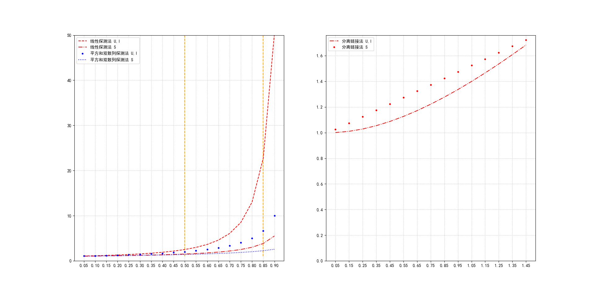

```
http://portal.acm.org/citation.cfm?id=362692&dl=ACM&coll=portal">Space/Time Trade-Offs in Hash Coding with Allowable Errors
```

在BloomFilter中关于误判概率的讨论的比较多的是m、n和k的影响，在看Hadoop中BloomFilter在注释中看到了这个链接，它关注的是在允许的误差范围内空间和时间的权衡。


# Hash函数

“散列(Hashing)” 的基本思想是：

- (1) 以关键字key为自变量，通过一个确定的函数$h$（散列函数）计算出对应的函数值$h(key)$，作为数据对象的存储地址。涉及**散列函数构造**。
- (2) 可能不同的关键字会映射到同一个散列地址上，即$h(key_i ) = h(key_j)$（当$key_i \ne key_j$），称为“冲突(Collision)”。此时需要**冲突解决策略**。


装填因子（Loading Factor）：设散列表空间大小为m，填入表中元素个数是n，则称α＝ n / m为散列表的装填因子


## 散列函数构造
字符关键词的散列函数构造，可以采用下面的方式：
- ASCII码加和法，简单的散列函数
对字符型关键词key定义散列函数
$h(key) = (\sum key[i]) \mod TableSize$

- 简单的改进——前3个字符移位法
$h(key) = (key[0] * 27^2 +  key[1] * 27 + key[2]) \mod TableSize$

- 移位法-好的散列函数
涉及关键词所有n个字符，并且分布得很好
$h(key) = (\sum_{i=0}^{n-1} key[n-i-1]*32^i) \mod TableSize$
```C++
Index Hash ( const char *Key, int TableSize ) { 
	unsigned int h = 0; /* 散列函数值，初始化为0 */
	while ( *Key != ‘\0’) /* 位移映射 */
 	h = ( h << 5 ) + *Key++;
 	return h % TableSize;
}
```
### 直接定址法

取关键词的某个线性函数值为散列地址，即$h(key) = a * key + b (a、b为常数)$


### 除留余数法

散列函数为：$h(key) = key \mod p$， 一般，p取素数


### 数字分析法

分析数字关键字在各位上的变化情况，取比较随机的位作为散列地址。


### 折叠法

把关键词分割成位数相同的几个部分，然后叠加。

```
例如，56793542

	542
 	793
+ 	056
———------
	1391
```


### 平方取中法

> 例如，56793542，h(56793542) = 641
>  	56793542
>  x 	56793542
> —————————--------
> 322550**641**2905764


## 冲突解决策略

常用处理冲突的思路：

- 开放地址法：换个位置
- 链地址法：同一位置的冲突对象组织在一起

| 开放地址法                                              | 分离链法                                                     |
| ------------------------------------------------------- | ------------------------------------------------------------ |
| 散列表是一个数组，存储效率高，随机查找<br/>有“聚集”现象 | 散列表是顺序存储和链式存储的结合，链表部分的存储效率和查找效率都比较低。<br/>关键字删除不需要“懒惰删除”法，从而没有存储“垃圾”。<br/>太小的α可能导致空间浪费，大的α又将付出更多的时间代价。<br/>不均匀的链表长度导致时间效率的严重下降。 |

### 开放定址法(Open Addressing)

一旦产生了冲突该地址已有其它元素），就按某种规则去寻找另一空地址。 

- 若发生了第 i 次冲突，试探的下一个地址将增加$d_i$，基本公式是$\begin{align}
    h_i(key) & = (h(key)+d_i) \mod TableSize & (1 \le i \lt TableSize)
    \end{align}$

- $d_i$ 决定了不同的解决冲突方案：
    - 线性探测 $d_i=i$
    - 平方探测 $d_i=\pm i^2$
    - 双散列 $d_i=i*h_2(key)$


- 


#### 线性探测法

Linear Probing，以增量序列 1，2，……，（TableSize -1)循环试探下一个存储地址。


#### 平方探测法

Quadratic Probing，也是二次探测。以增量序列$1^2$，-$1^2$，$2^2$，-$2^2$，……，$q^2$，-$q^2$ 且$q \le \left \lfloor TableSize/2 \right \rfloor $循环试探下一个存储地址

平方探测法有可能会存在有空间，但是平方探测找不到的情况。如下例$h(k)=k \mod 5$

| 5    | 6    | 7    |      |      |
| ---- | ---- | ---- | ---- | ---- |
| 0    | 1    | 2    | 3    | 4    |

插入11，$h(11)=1$

探测序列$1+1=2, 1-1=0, (1+2^2)\mod 5=0, (1-2^2)\mod 5=2, (1+3^2)\mod 5=0, (1-3^2)\mod 5=2, (1+4^2)\mod 5=2,…$


**【有定理显示】**：如果散列表长度TableSize是某个$4k+3 (k是正整
数)$形式的素数时，平方探测法就可以探查到整个散列表空间。


#### 双散列探测法

Double Hashing，$d_i 为i*h_2(key)，h_2(key)是另一个散列函数$， 探测序列成：$h_2(key)，2h_2(key)，3h_2(key)，……$

- 对任意的key，$h_2(key) \ne 0$
- 探测序列还应该保证所有的散列存储单元都应该能够被探测到。选择以下形式有良好的效果：$h_2(key) = p - (key \mod p)$
    其中：$p \lt TableSize$，p、TableSize都是素数。


**Note:** 在开放地址散列表中，删除操作要很小心。通常只能“懒惰删除”，即需要增加一个“删除标记(Deleted)”，而并不是真正删除它。以便查找时不会“断链”。其空间可以在下次插入时重用。


#### 再散列

 当散列表元素太多（即装填因子 α太大）时，查找效率会下降；

- 实用最大装填因子一般取$0.5 \le \alpha  \le 0.85$
- 当装填因子过大时，解决的方法是加倍扩大散列表，这个过程叫做“再散列（Rehashing）”


### 分离链接法

Separate Chaining，将相应位置上冲突的所有关键词存储在同一个单链表中。


## 性能分析
平均查找长度（ASL）用来度量散列表查找效率：成功、不成功
- 成功平均查找长度(ASLs)：查找表中关键词的平均查找比较次数（其冲突次数加1）  
- 不成功平均查找长度 (ASLu)：不在散列表中的关键词的平均查找次数（不成功）

关键词的比较次数，取决于产生冲突的多少, 影响产生冲突多少有以下三个因素:
- 散列函数是否均匀
- 处理冲突的方法
- 散列表的装填因子$ \alpha $

分析：不同冲突处理方法、装填因子对效率的影响

### 线性探测法的查找性能
可以证明，线性探测法的期望探测次数 满足下列公式：
$\begin{align}
p = \left\{\begin{matrix} 
  \frac{1}{2}[1+\frac{1}{{1-\alpha}^2} ] & （对插入和不成功查找而言） \\  
  \frac{1}{2}[1+\frac{1}{1-\alpha} ] & （对成功查找而言）
\end{matrix}\right.  
\end{align}$


### 平方和双散列探测法的查找性能

可以证明，平方探测法和双散列探测法探测次数 满足下列公式：

$\begin{align}
p = \left\{\begin{matrix} 
  \frac{1}{1-\alpha} & （对插入和不成功查找而言） \\  
  -\frac{1}{\alpha}ln{(1-\alpha)} & （对成功查找而言）
\end{matrix}\right.  
\end{align}$


### 分离链接法的查找性能

所有地址链表的平均长度定义成装填因子α，α有可能超过1。不难证明：其期望探测次数 p为：

$\begin{align}
p = \left\{\begin{matrix} 
  \alpha + e^{-\alpha } &（对插入和不成功查找而言） \\  
  1 + \frac{\alpha}{2} & （对成功查找而言）\\
\end{matrix}\right.  
\end{align}$



上图，U表示不成功查找，I表示插入，S表示成功查找


在开放地址法中：

- 当装填因子α< 0.5的时候，各种探测法的期望探测次数不大，也比较接近。
- 随着$\alpha $的增大，线性探测法的期望探测次数增加较快，不成功查找和插入操作的期望探测次数比成功查找的期望探测次数要大。
- 合理的的最大装入因子α应 该不超过0.85。

哈希表的平均查找长度是装填因子$\alpha$的函数，而不 是$N$的函数。 用哈希表构造查找表时，可以选择一个适当的装填因子$ \alpha$ ，使得平均查找长度限定在某个范围 内。

## 练习题

- https://leetcode.com/problems/valid-anagram/description/

- https://leetcode.com/problems/two-sum/description/

-  https://leetcode.com/problems/3sum/description/

- https://leetcode.com/problems/4sum/

- https://leetcode.com/problems/group-anagrams/description/


## 附录

性能分析Python实现

```python
import matplotlib.pyplot as plt
import numpy as np

plt.rcParams['font.sans-serif'] = ['SimHei']  # 用来正常显示中文标签
plt.rcParams['axes.unicode_minus'] = False  # 用来正常显示负号

x = np.arange(0.05, 0.95, 0.05)

y_su = 0.5*(1+1/(1-x)**2)
y_ss = 0.5*(1+1/(1-x))

y_du = 1/(1-x)
y_ds = np.multiply(-1/x, np.log(1-x))

y_max = max(y_su.max(), y_ss.max(), y_du.max(), y_ds.max())
y_min = min(y_su.min(), y_ss.min(), y_du.min(), y_ds.min())

plt.figure()
ax1 = plt.subplot(1, 2, 1)
ax1.plot(x, y_su, '--', color='red', label="线性探测法 U,I")
ax1.plot(x, y_ss, '-.', color='red', label="线性探测法 S")
ax1.plot(x, y_du, '.', color='blue', label="平方和双散列探测法 U,I")
ax1.plot(x, y_ds, ':', color='blue', label="平方和双散列探测法 S")

ax1.vlines(0.5, y_min, y_max, colors="orange", linestyles="dashed")
ax1.vlines(0.85, y_min, y_max, colors="orange", linestyles="dashed")
ax1.legend()
plt.grid(linestyle=':')
plt.xticks(x)
plt.ylim(0, 50)

ax2=plt.subplot(1, 2, 2)
x = np.arange(0.05, 1.5, 0.1)
y_lu = x + np.exp(-x)
y_ls = 1 + x/2
ax2.plot(x, y_lu, "-.", color='red', label="分离链接法 U,I")
ax2.plot(x, y_ls, '.', color='red', label="分离链接法 S")
ax2.legend()
plt.grid(linestyle=':')
plt.xticks(x)
plt.ylim(0)
plt.show()
```


