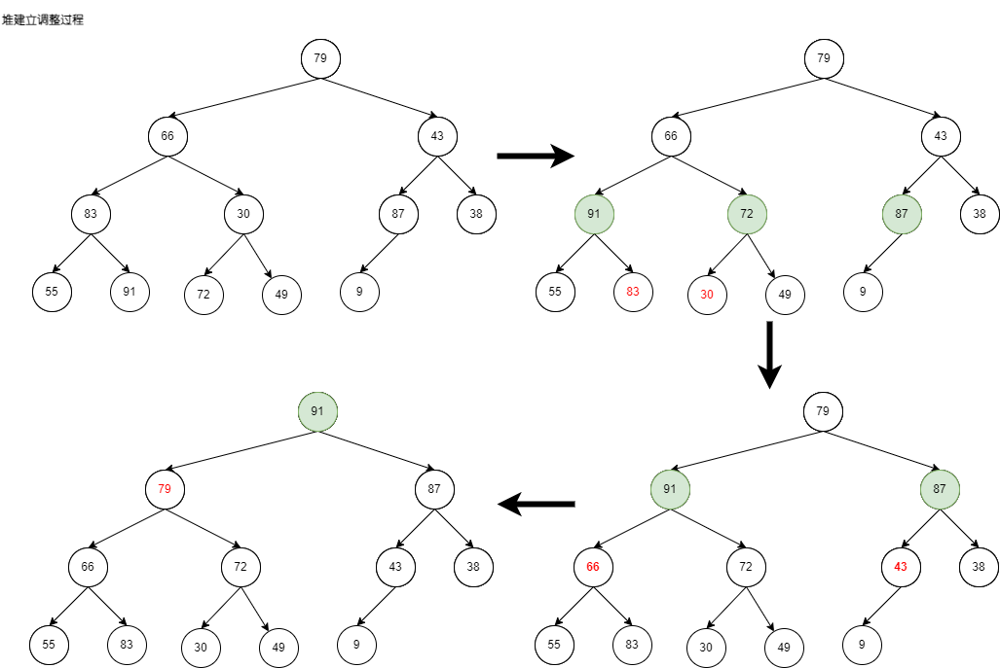

# 堆和比较器


## 比较器

比较器，实质就是重载比较运算符

1. 比较器可以很好的应用在特殊标准的排序上
2. 比较器可以很好的应用在根据特殊标准排序的结构上
3. 容易实现，还可用于范型编程

下面自定义了一个`student`结构，实现按照首先按照ID升序再按照Age降序，最后按照Name升序进行排序，来实现比较器。

### C++比较器

C++中定义了一些[比较运算符Comparison Operators](https://en.cppreference.com/w/cpp/language/operator_comparison),在编码实现上实现的套路是类似的，堆可以分为大顶堆和小顶堆，在此重点关注<运算符以及重载。

```C++
/**
 * @brief   类型T实现<运算符
 */
bool T::operator <(const T2 &b) const;

/**
 * @brief   非成员函数,实现<运算符
 * 
 * @return  如果lhs小于rhs返回true,否则返回false
 */
bool operator <(const T &a, const T2 &b);

/**
 * @brief	函数对象结构体来实现<运算
*/
struct XXXComparator {
    bool operator(const T& lst, const T2& rst);
}
```

在代码实现上主要有三种实现方式：

1.  对自定义的`struct/class`，重写它的`operator <`方法。
2.  通过写一个外部的比较函数，实现`<`方法，适合于
    1.  比较内置数据类型，例如对`string`按照长度进行排序。
    2.  无法修改需要比较的类型。
    3.  除类型自定义的比较方式以外的比较方法。

3. 通过函数对象结构体来实现`<`方法

代码详见[自定义比较器](https://github.com/DepInjoy/geektime/blob/main/algorithm/CPP/Comparator/CustomComparator.cpp)

### Java比较器

Java可以通过两种方式来实现比较器，一种是继承`Comparable`，并重写`compareTo`接口.

```java
public interface Comparable<T> {
    /**
     * @param   o the object to be compared.
     * @return  a negative integer, zero, or a positive integer as this object
     *          is less than, equal to, or greater than the specified object.
     *
     * @throws NullPointerException if the specified object is null
     * @throws ClassCastException if the specified object's type prevents it
     *         from being compared to this object.
     */
    public int compareTo(T o);
}
```

另外一种是借助`Comparator`函数式编程接口来实现

```java
@FunctionalInterface
public interface Comparator<T> {
    int compare(T o1, T o2);
}
```

代码详见[自定义Java比较器](https://github.com/DepInjoy/geektime/blob/main/algorithm/Java/algorithm-project/src/main/java/algorithm/training/struct/Heap/C06_01_Comparator.java)


### Python比较器

Python的比较器也可以通过重载<运算符

```python
class XXX:
    '''
    重载<运算符, self<other返回true，否则返回false
    '''
	def __lt__(self, other)
```

以及自定义比较函数的方式，借助内置的`functools.cmp_to_key`重写元素比较方法

```python
from functools import cmp_to_key

'''
自定义比较函数重写元素比较方法
	返回正数,如果st1>st2
    返回负数,如果st1<st2
    返回0,如果st1=st2
'''
def cmp(t1, t2):
    ......

'通过排序示例自定义比较函数的调用方式'
sorted(l, key=cmp_to_key(cmp))
```

代码详见[自定义Python比较器](https://github.com/DepInjoy/geektime/blob/main/algorithm/Python/Comparator/CustomComparator.py)


## 堆(Heap)

堆是一颗数组表示的完全二叉树，根据任意节点是其子树所有节点的最大值(或最小值)，可以将其划分为大顶堆(或小顶堆)。

对于有N个节点，树的高度是`log(N)`。堆表示示例：


在堆的表示第一个元素不存放元素，存放一个哨兵，这样便于之后更快速的操作，那么

- 舍弃0号元素，对于$i$位置的元素，其左右孩子的索引分别为$2i$和$2i+1$，其父节点$\frac{i}{2}$。
- 不弃用0号元素，对于$i$位置的元素，其左右孩子的索引分别为$2i+1$和$2i+2$,其父节点为$\frac{i-1}{2}$


### 堆的数据抽象数据类型描述

**类型名称：**最大堆(`MaxHeap`)

**数据对象集：**完全二叉树，每个结点的元素值**不小于**其子结点的元素值

**操作集：最大堆**$H \in MaxHeap$，元素$item \in MaxHeap$主要操作有:

- `MaxHeap Create( int MaxSize )`：创建一个空的最大堆
- `Boolean IsFull( MaxHeap H )`：判断最大堆H是否已满
- `Insert( MaxHeap H, ElementType item )`：将元素item插入最大堆H
- `Boolean IsEmpty( MaxHeap H )`：判断最大堆H是否为空
- `ElementType DeleteMax( MaxHeap H )`：返回H中最大元素(高优先级)


### 堆操作

堆中记录有堆大小和容量，可以很容易实现判断堆是否满和为空，下面主要关注一下几个相对复杂一些的操作实现。

#### 元素插入

堆是完全二叉树，时间复杂度$T(N)=O(logN)$，实现思想：

- 将其插入堆中最后一个元素的位置，确保堆依然是完全二叉树
- 堆调整，依次过滤节点，对不符合规则(根节点必须是其子树所有节点的最大值(或最小值))的元素进行交换，直到找到要插入元素的位置为止。


下面是`MOOC`浙大的《数据结构和算法》课程以大根堆为例实现的插入实现的主体，以供参考

```C++
/* 将元素item 插入最大堆H，其中H->Elements[0]已经定义为哨兵 */
void Insert( MaxHeap H, ElementType item ) {
    /* i指向插入后堆中的最后一个元素的位置 */
 	i = ++H->Size;
    /* 向下过滤结点 */
 	for ( ; H->Elements[i/2] < item; i/=2 )
 		H->Elements[i] = H->Elements[i/2];
     /* 将item 插入 */
 	H->Elements[i] = item;
}
```


#### 元素删除

取出根结点（最大/小值）元素，同时删除堆的一个结点，将堆中最后一个元素当作根节点(确保依然是完全树)进行堆调整，实现思想

- 取出根节点，并作为最终的返回结果
- 用堆中最后一个元素当作根节点，然后从第一层开始进行节点过滤。


下面是`MOOC`浙大的《数据结构和算法》课程以大根堆为例实现的删除实现的主体，以供参考

```C++
/* 从最大堆H中取出键值为最大的元素，并删除一个结点 */
ElementType DeleteMax( MaxHeap H ) { 
	MaxItem = H->Elements[1]; /* 取出根结点最大值 */
 	/* 用最大堆中最后一个元素从根结点开始向上过滤下层结点 */
 	temp = H->Elements[H->Size--];
 	for( Parent=1; Parent*2<=H->Size; Parent=Child ) {
        Child = Parent * 2;
        /* Child指向左右子结点的较大者 */
 		if( (Child!= H->Size) &&(H->Elements[Child] < H->Elements[Child+1])) Child++;
 		if( temp >= H->Elements[Child] )
            break;
 		else /* 移动temp元素到下一层 */
 			H->Elements[Parent] = H->Elements[Child];
 	}
 	H->Elements[Parent] = temp;
 
    return MaxItem;
```


#### 堆建立

堆被应用到堆排序中，此时会涉及将已经存在的N个元素按照堆的要求存在在一个一维数组中，下面以大根堆为例，来了解堆的建立，有两种实现方式：

- 方式一：通过插入操作，经N个元素依次插入到出师为空的堆中，时间代价最大值为`O(NlogN)`
- 方式二：在线性时间复杂度$O(N)$下建立最大堆：
    - ① 将N个元素按输入顺序存入，先满足完全二叉树的结构特性
    - ② 从存在根节点的底层的根节点开始调整节点的位置依次调整各结点位置，以满足最大堆的有序特性。




对于有$N$个节点的堆，树的高度为$logN$,设$k-1=logN$

|     节点数      | 最多交换次数 |
| :-------------: | :----------: |
|  $\frac{N}{4}$  |      1       |
|  $\frac{N}{8}$  |      2       |
| $\frac{N}{16}$  |      3       |
|     ......      |    ......    |
| $\frac{N}{2^k}$ |    $k-1$     |


$T(N)=\frac{N}{4}+\frac{N}{8}\times2+\frac{N}{16}\times3 + ... + \frac{N}{2^k}\times(k-1)$
$2T(N)=\frac{N}{2}+\frac{N}{4}\times2+\frac{N}{8}\times3 + ... + \frac{N}{2^{k-1}}\times(k-1)$
$2T(N)-T(N)=\frac{N}{2}+\frac{N}{4}+\frac{N}{8} + ... + \frac{N}{2^{k-1}} - \frac{N}{2^k}\times(k-1) \le N - (log_{2}{N}-1) \le N$

