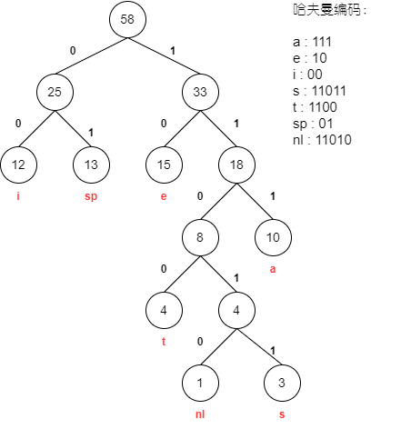

# 哈夫曼树

**带权路径长度(`WPL`)**：设二叉树有$n$个叶子结点，每个叶子结点带有权值$w_k$，从根结点到每个叶子结点的长度为$l_k$，则每个叶子结点的带权路径长度之和就是:

​											$WPL = \sum_{k=1}^{n}w_k l_k $

哈夫曼树(Huffman Tree)，也是最优二叉树，即`WPL`最小的二叉树。


## 数据抽象和实现

```C++
typedef struct TreeNode *HuffmanTree;
struct TreeNode{
	int Weight;
	HuffmanTree Left, Right;
}

/*
	Huffman树的构造:每次把权值最小的两棵二叉树合并
	整体复杂度为O(NlogN)
*/
HuffmanTree Huffman( MinHeap H ) { /* 假设H->Size个权值已经存在H->Elements[]->Weight里 */
	int i; HuffmanTree T;
 	BuildMinHeap(H); /*将H->Elements[]按权值调整为最小堆*/
 	for (i = 1; i < H->Size; i++) { /*做H->Size-1次合并*/
 		T = malloc( sizeof( struct TreeNode) ); /*建立新结点*/
 		T->Left = DeleteMin(H);
 		/*从最小堆中删除一个结点，作为新T的左子结点*/
 		T->Right = DeleteMin(H);
 		/*从最小堆中删除一个结点，作为新T的右子结点*/
 		T->Weight = T->Left->Weight+T->Right->Weight;
 		/*计算新权值,并插入最小堆*/
 		Insert( H, T );
 	}
 	T = DeleteMin(H);
 	return T;
}
```


## 应用

### 哈夫曼编码

给定一段字符串，如何对字符进行编码，可以使得该字符串的编码，存储空间最少？

> 假设有一段文本，包含58个字符，并由以下7个字符构：a，e，i，s，t，空格（sp），换行（nl）；这7字符出现的次数不同。如何对这7个字符进行编码，使得总编码空间最少？
>
> 1. 用等长ASCII编码：58 ×8 = 464位；
> 2. 用等长3位编码：58 ×3 = 174位；
> 3. 不等长编码：出现频率高的字符用的编码短些，出现频率低的字符则可以编码长些

| 字符 |  a   |  e   |  i   |  s   |  t   |  sp  |  nl  |
| :--: | :--: | :--: | :--: | :--: | :--: | :--: | :--: |
| 频次 |  10  |  15  |  12  |  3   |  4   |  13  |  1   |



$Cost = 3*10 + 2*15 + 2*12 + 5*3 + 4*4 + 2*13 + 5*1 = 146$

