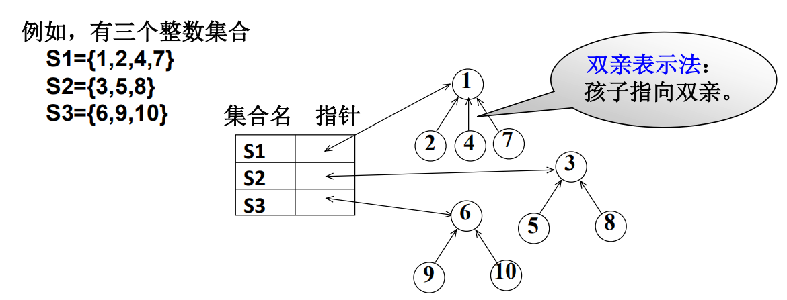
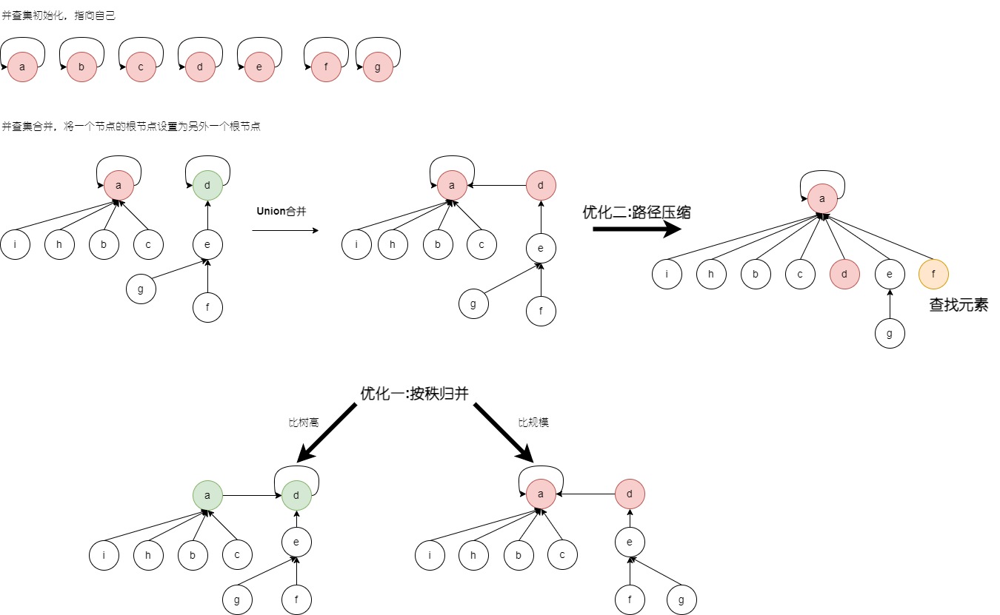

# 集合

集合运算：交、并、补、差，判定一个元素是否属于某一集合


## 并查集

并查集(Union Set)，运用于集合的合并、判断某元素是否属于某个集合。⽤于处理⼀些不交集（Disjoint Sets）的合并及查询问题，常用于解决连通性问题。


### 并查集数据抽象


### 集合存储实现

可以用树结构表示集合，树的每个结点代表一个集合元素。双亲表示法：孩子指向双亲。



采用数组存储形式，**数组中每个元素的类型描述为：**

```C++
// 负数表示根结点，非负数表示双亲结点的下标。
typedef struct {
	ElementType Data;
	int Parent;
} SetType;
```

| 下标 |Data | Parent |
| :--: |---- | ------ |
|  0   |1    | -1     |
|  1   | 2   | 0      |
|  2   |3    | -1     |
|  3   |4    | 0      |
|  4   |5    | 2      |
|  5   |6    | -1     |
|  6   |7    | 0      |
|  7   |8    | 2      |
|  8   |9    | 5      |
|  9   |10   | 5      |

### 合并优化

#### 按秩归并

针对`union`操作,按秩归并有两种实现方式：

- 根据树的高度，将矮树合并到高树上

    ```C++
    if ( Root2高度 > Root1高度 )
    	S[Root1] = Root2;
    else {
    	if ( 两者等高 ) 树高++;
    	S[Root2] = Root1;
    }
    ```

- 根据树的规模，将小树贴到大树上

    ```C++
    // S[Root] = -元素个数
    void Union( SetType S, SetName Root1, SetName Root2 ) {
        if ( S[Root2]<S[Root1] ){
    		S[Root2] += S[Root1]; 
    		S[Root1] = Root2; 
    	} else {
    		S[Root1] += S[Root2];
    		S[Root2] = Root1; 
    	}
    }
    ```

    

#### 路径压缩

在查找时进行，对于查找的元素X，先找到跟，将根变成X的父节点再返回。





**【引理(Tarjan)】** 令$T(M,N)$为交错执行$M\ge N$ 次带路径压缩的查找和$N-1$ 次按秩归并的最坏情况时间，则存在正常数$k_1$和$k_2$使得：

​			$k_1 M \alpha(M,N) \le T(M, N) \le k_2 M \alpha(M, N)$

​			$Ackermann$函数和$\alpha(M,N)$

​			$\begin{align}
A(i,j) & = \left\{\begin{matrix} 
2^j  & i = 1 and j  \ge 1 \\
A(i-1, 2) & i = 1 and j = 1 \\
A(i-1, A(i, j-1)) & i\ge2 and j \ge 2\\
\end{matrix} \right.
\end{align}$


​			$\begin{align}\alpha(M, N) = min\{ i \gt 1 | A(i, \left \lfloor M/N \right \rfloor ) > logN \} \le O(log^*{N} )
\end{align}$

​			$log^*{N}$($Ackermann$反函数)=对$N$求对数直到结果$\le 1$的次数

虽然$N$可以取无穷大，但是对于人类可以处理的最大整数而言，$O(log^*{N}) \le 4$


关于是否进行路径压缩决定因素在于查找次数$M$乘以一个常数或者一个$logN$。当N趋于无穷大，$log(N)$也是趋于无穷大，而常数却是固定的。而路径压缩只有当$N$充分大时候才可以看出差别。当$N$到达$10^6$级别时，便可以看出进行路径压缩和不进行路径压缩的差距。


### 代码模板

参考[ACWing](https://www.acwing.com/blog/content/404/)

#### 朴素并查集

```C++
    int p[N]; //存储每个点的祖宗节点

    // 返回x的祖宗节点
    int find(int x) {
        if (p[x] != x) p[x] = find(p[x]);
        return p[x];
    }

    // 初始化，假定节点编号是1~n
    for (int i = 1; i <= n; i ++ ) p[i] = i;

    // 合并a和b所在的两个集合：
    p[find(a)] = find(b);
```

#### 维护size的并查集

```C++
	int p[N], size[N];
    //p[]存储每个点的祖宗节点, size[]只有祖宗节点的有意义，表示祖宗节点所在集合中的点的数量

    // 返回x的祖宗节点
    int find(int x) {
        if (p[x] != x) p[x] = find(p[x]); // 路径压缩
        return p[x];
    }

    // 初始化，假定节点编号是1~n
    for (int i = 1; i <= n; i ++) {
        p[i] = i;
        size[i] = 1;
    }

    // 合并a和b所在的两个集合：
    size[find(b)] += size[find(a)];
    p[find(a)] = find(b);
```

#### 维护到祖宗节点距离的并查集

```C++
    int p[N], d[N];
    //p[]存储每个点的祖宗节点, d[x]存储x到p[x]的距离

    // 返回x的祖宗节点
    int find(int x) {
        if (p[x] != x) {
            int u = find(p[x]);
            d[x] += d[p[x]];
            p[x] = u;
        }
        return p[x];
    }

    // 初始化，假定节点编号是1~n
    for (int i = 1; i <= n; i ++ ) {
        p[i] = i;
        d[i] = 0;
    }

    // 合并a和b所在的两个集合：
    p[find(a)] = find(b);
    d[find(a)] = distance; // 根据具体问题，初始化find(a)的偏移量
```


### 练习题目

- https://leetcode.com/problems/number-of-islands/

- https://leetcode.com/problems/friend-circles/

