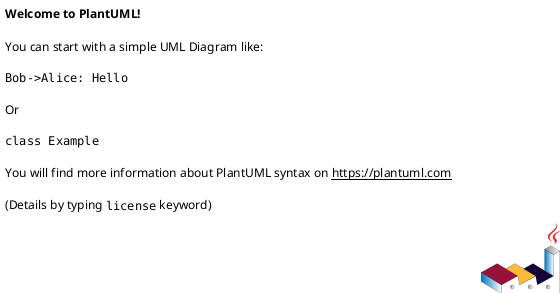
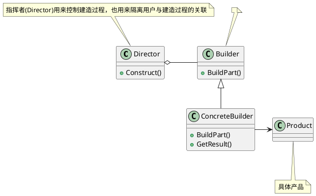

# 设计原则

| 设计原则     | 关键点                                                      | 应用场景 |
| ------------ | ----------------------------------------------------------- | -------- |
| 开放封闭原则 | 对扩展开放，对更改封闭 也就是通过新增代码实现程序的改动 |          |
| 迪米特法则   | 强调类间的松耦合 信息隐藏促进软件复用                   |          |
|              |                                                             |          |

## 开放封闭原则

<b>开放-封闭原则，是说软件实体(类、模块、函数等等)应该可以扩展，但是不可修改。</b>它有两个特征，一个是说对于扩展是开放(Open for extension)，另一个是说‘对于更改是封闭的(Closed for modification)[ASD]。

面对需求，对程序的改动是通过增加新代码进行的，而不是更改现有的代码[ASD]，这是开放-封闭原则的精神所在。

> 大鸟：“我们在做任何系统的时候，都不要指望系统一开始时需求确定，就再也不会变化，这是不现实也不科学的想法，而既然需求是一定会变化的，那么如何在面对需求的变化时，设计的软件可以相对容易修改，不至于说，新需求一来，就要把整个程序推倒重来。怎样的设计才能面对需求的改变却可以保持相对稳定，从而使得系统可以在第一个版本以后不断推出新的版本呢？[ASD]，开放-封闭给我们答案。

何时应对变化？

> 大鸟：“开放-封闭原则的意思就是说，你设计的时候，时刻要考虑，尽量让这个类是足够好，写好了就不要去修改了，如果新需求来，我们增加一些类就完事了，原来的代码能不动则不动。”
>
> 小菜：“这可能做到吗？我深表怀疑呀，怎么可能写完一个类就再也不改了呢？”
>
> 大鸟：“你说得没错，绝对的对修改关闭是不可能的。无论模块是多么的‘封闭’，都会存在一些无法对之封闭的变化。既然不可能完全封闭，<b>设计人员必须对于他设计的模块应该对哪种变化封闭做出选择。他必须先猜测出最有可能发生的变化种类，然后构造抽象来隔离那些变化[ASD]。</b>”
>
> 小菜：“那还是需要猜测程序可能会发生的变化，猜对了，那是成功，猜错了，那就完全走到另一面去了，把本该简单的设计做得非常复杂，很不划算呀。而且事先猜测，这又是很难做到的。”
>
> 大鸟：“你说得没错，我们是很难预先猜测，但我们却可以在发生小变化时，就及早去想办法应对发生更大变化的可能。也就是说，<b>等到变化发生时立即采取行动</b>[ASD]。”
>
> 大鸟：“<b>在我们最初编写代码时，假设变化不会发生。当变化发生时，创建抽象来隔离以后发生的同类变化</b>[ASD]

并不是任何时候应对变化都容易，我们希望在尽早知道可能发生的变化，查明变化等待时间越长，抽象和分离越困难，创造正确的抽象也越难。

> 大鸟：“并不是什么时候应对变化都是容易的。<b>我们希望的是在开发工作展开不久就知道可能发生的变化。查明可能发生的变化所等待的时间越长，要创建正确的抽象就越困难[ASD]。</b>”
>
> 小菜：“这个我能理解，如果加减运算都在很多地方应用了，再考虑抽象、考虑分离，就很困难。”
>
> 大鸟：“<b>开放-封闭原则是面向对象设计的核心所在。遵循这个原则可以带来面向对象技术所声称的巨大好处，也就是可维护、可扩展、可复用、灵活性好。开发人员应该仅对程序中呈现出频繁变化的那些部分做出抽象，然而，对于应用程序中的每个部分都刻意地进行抽象同样不是一个好主意。拒绝不成熟的抽象和抽象本身一样重要[ASD]</b>。

## 迪米特法则

迪米特法则(LoD)也叫最少知识原则，[J&DP]如果两个类不必彼此直接通信，那么这两个类就不应当发生直接的相互作用。如果其中一个类需要调用另一个类的某一个方法的话，可以通过第三者转发这个调用。[J&DP]迪米特法则首先强调的前提是在类的结构设计上，每一个类都应当尽量降低成员的访问权限[J&DP]，也就是说，一个类包装好自己的private状态，不需要让别的类知道的字段或行为就不要公开。

迪米特法则其根本思想，是强调了类之间的松耦合。在程序设计时，类之间的耦合越弱，越有利于复用，一个处在弱耦合的类被修改，不会对有关系的类造成波及。也就是说，信息的隐藏促进了软件的复用。

# 设计模式

| 设计模式     | 描述 | 类比场景 | 使用场景 |
| ------------ | ---- | -------- | -------- |
| 外观设计模式 |      |          |          |
| 建造者模式   |      |          |          |
|              |      |          |          |

## 工厂设计模式

## 模版方法模式

## 外观设计模式

<b>外观模式(Facade)，为子系统中的一组接口提供一个一致的界面，此模式定义了一个高层接口，这个接口使得这一子系统更易使用。[DP]</b>

在《大话设计模式》中指出，适合使用外观模式的场景：需要分三个阶段来说，

1. 在设计初期阶段，应该要有意识的将不同的两个层分离。比如经典的三层架构，就需要考虑在数据访问层和业务逻辑层、业务逻辑层和表示层的层与层之间建立外观Facade，这样可以为复杂的子系统提供一个简单的接口，使得耦合大大降低。
2. 在开发阶段，子系统往往因为不断的重构演化而变得越来越复杂，大多数的模式使用时也都会产生很多很小的类，这本是好事，但也给外部调用它们的用户程序带来了使用上的困难，增加外观Facade可以提供一个简单的接口，减少它们之间的依赖。
3. 第三，在维护一个遗留的大型系统时，可能这个系统已经非常难以维护和扩展了，但因为它包含非常重要的功能，新的需求开发必须要依赖于它。此时用外观模式Facade也是非常合适的。你可以为新系统开发一个外观Facade类，来提供设计粗糙或高度复杂的遗留代码的比较清晰简单的接口，让新系统与Facade对象交互，Facade与遗留代码交互所有复杂的工作。[R2P]

---

## 建造者模式

如果你需要将一个复杂对象的构建与它的表示分离，使得同样的构建过程可以创建不同的表示的意图时，我们需要应用建造者(Builder)模式，又叫生成器模式。建造者模式可以将一个产品的内部表象与产品的生成过程分割开来，从而可以使一个建造过程生成具有不同的内部表象的产品对象。采用建造者模式，那么用户就只需指定需要建造的类型就可以得到它们，而具体建造的过程和细节就不需知道了。

<b>建造者模式(Builder)，将一个复杂对象的构建与它的表示分离，使得同样的构建过程可以创建不同的表示。[DP]</b>

什么时候需要使用建造者模式呢？它主要是<b>用于创建一些复杂的对象，这些对象内部构建间的建造顺序通常是稳定的，但对象内部的构建通常面临着复杂的变化。建造者模式是在当创建复杂对象的算法应该独立于该对象的组成部分以及它们的装配方式时适用的模式。</b>

建造者模式使得建造代码与表示代码分离，由于建造者隐藏了该产品是如何组装的，所以若需要改变一个产品的内部表示，只需要再定义一个具体的建造者

---

# 参考资料

1. 《大话设计模式》
