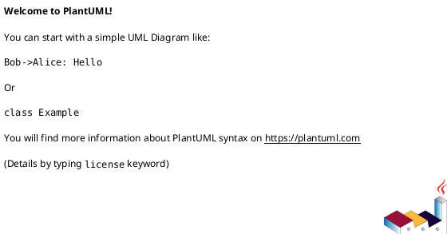
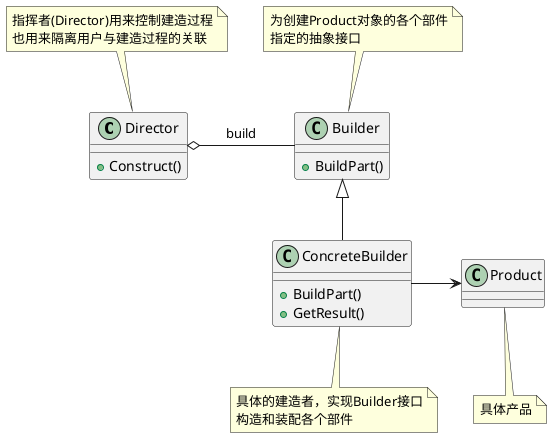
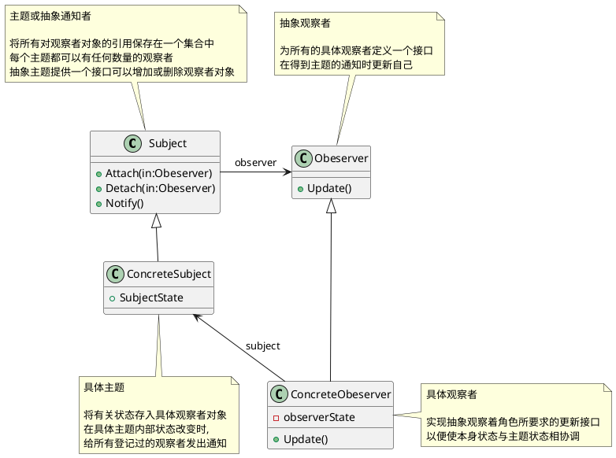
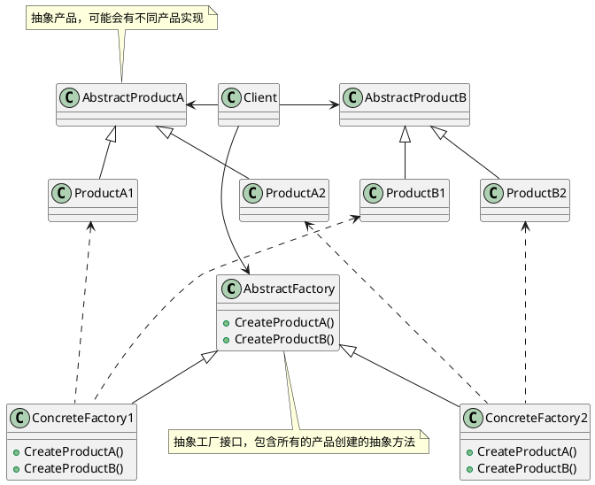
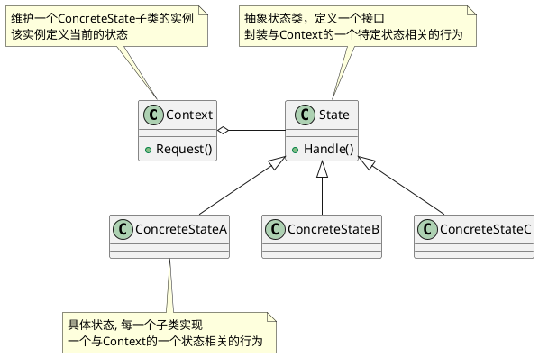
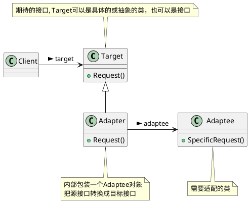
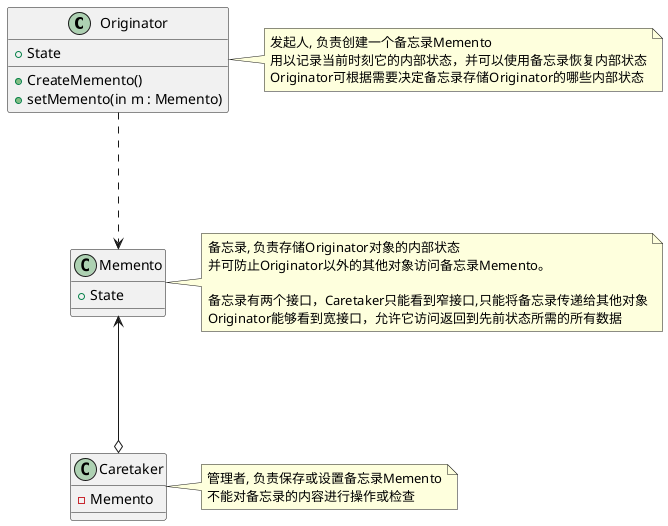
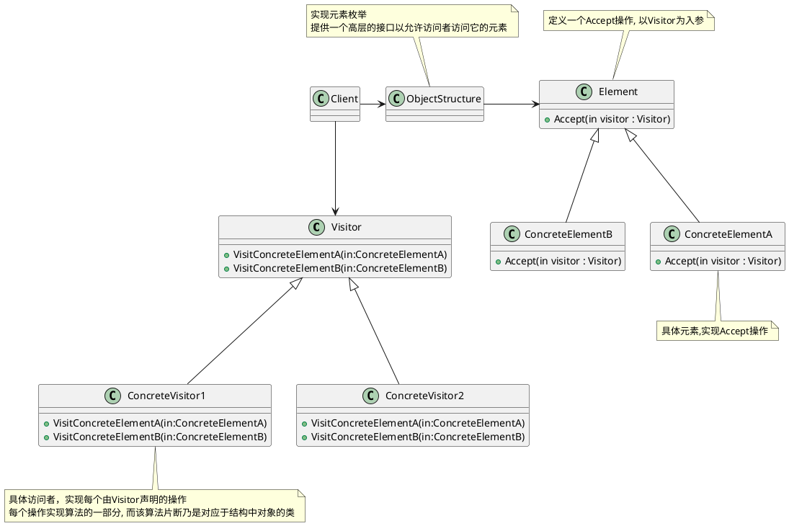

# 设计原则

| 设计原则     | 关键点                                                       | 应用场景 |
| ------------ | ------------------------------------------------------------ | -------- |
| 单一职责原则 | 就一个类而言，应该仅有一个引起它变化的原因<br/>软件设计很多内容就是发现职责并把这些职责相互分离 |          |
| 依赖倒转原则 | 抽象不应该依赖细节，细节应该依赖于抽象<br/>针对接口编程，不应该针对实现编程 |          |
| 里氏替换原则 | 子类型必须能够替换掉它们的父类型<br/>使得继承复用成为了可能  |          |
| 开放封闭原则 | 对扩展开放，对更改封闭<br/>也就是通过新增代码实现程序的改动  |          |
| 迪米特法则   | 强调类间的松耦合<br/>信息隐藏促进软件复用                    |          |
|              |                                                              |          |


## 单一职责原则
<b><font color=FA8072>单一职责原则(SRP)，就一个类而言，应该仅有一个引起它变化的原因</font></b>[ASD]。如果一个类承担的职责过多，就等于把这些职责耦合在一起，一个职责的变化可能会削弱或者抑制这个类完成其他职责的能力。这种耦合会导致脆弱的设计，当变化发生时，设计会遭受到意想不到的破坏[ASD]。

<b><font color=FA8072>软件设计真正要做的许多内容，就是发现职责并把那些职责相互分离</font></b>[ASD]。其实要去判断是否应该分离出类来，就是如果你能够想到多于一个的动机去改变一个类，那么这个类就具有多于一个的职责[ASD]，就应该考虑类的职责分离。


## 依赖倒转原则
<b><font color=FA8072>依赖倒转原则，是说抽象不应该依赖细节，细节应该依赖于抽象</font></b>，也就是要针对接口编程，不要对实现编程。
- A. 高层模块不应该依赖低层模块。两个都应该依赖抽象。
- B．抽象不应该依赖细节。细节应该依赖抽象。[ASD]


## 里氏替换原则
一个软件实体如果使用的是一个父类的话，那么一定适用于其子类，而且它察觉不出父类对象和子类对象的区别。也就是说，在软件里面，把父类都替换成它的子类，程序的行为没有变化，简单地说，子类型必须能够替换掉它们的父类型[ASD]。<b><font color=FA8072>里氏代换原则(LSP)：子类型必须能够替换掉它们的父类型。</font></b>[ASD]

里氏替换原则使得继承复用成为了可能，只有当子类可以替换掉父类，软件单位的功能不受到影响时，父类才能真正被复用，而子类也能够在父类的基础上增加新的行为。

> 小菜：“由于有里氏代换原则，才使得开放-封闭成为了可能。”
> 大鸟：“这样说是可以的，正是由于子类型的可替换性才使得使用父类类型的模块在无需修改的情况下就可以扩展。不然还谈什么扩展开放，修改关闭呢。再回过头来看依赖倒转原则，高层模块不应该依赖低层模块，两个都应该依赖抽象，对这句话你就会有更深入的理解了。

<br/>
依赖倒转其实可以说是面向对象设计的标志，用哪种语言来编写程序不重要，如果编写时考虑的都是如何针对抽象编程而不是针对细节编程，即程序中所有的依赖关系都是终止于抽象类或者接口，那就是面向对象的设计，反之那就是过程化的设计了[ASD]。

## 开放封闭原则

<b><font color=FA8072>开放-封闭原则，是说软件实体(类、模块、函数等等)应该可以扩展，但是不可修改。</font></b>它有两个特征，一个是说对于扩展是开放(Open for extension)，另一个是说‘对于更改是封闭的(Closed for modification)[ASD]。

面对需求，对程序的改动是通过增加新代码进行的，而不是更改现有的代码[ASD]，这是开放-封闭原则的精神所在。

> 大鸟：“我们在做任何系统的时候，都不要指望系统一开始时需求确定，就再也不会变化，这是不现实也不科学的想法，而既然需求是一定会变化的，那么如何在面对需求的变化时，设计的软件可以相对容易修改，不至于说，新需求一来，就要把整个程序推倒重来。怎样的设计才能面对需求的改变却可以保持相对稳定，从而使得系统可以在第一个版本以后不断推出新的版本呢？[ASD]，开放-封闭给我们答案。

何时应对变化？

> 大鸟：“开放-封闭原则的意思就是说，你设计的时候，时刻要考虑，尽量让这个类是足够好，写好了就不要去修改了，如果新需求来，我们增加一些类就完事了，原来的代码能不动则不动。”
>
> 小菜：“这可能做到吗？我深表怀疑呀，怎么可能写完一个类就再也不改了呢？”
>
> 大鸟：“你说得没错，绝对的对修改关闭是不可能的。无论模块是多么的‘封闭’，都会存在一些无法对之封闭的变化。既然不可能完全封闭，<b><font color=FA8072>设计人员必须对于他设计的模块应该对哪种变化封闭做出选择。他必须先猜测出最有可能发生的变化种类，然后构造抽象来隔离那些变化[ASD]。</font></b>”
>
> 小菜：“那还是需要猜测程序可能会发生的变化，猜对了，那是成功，猜错了，那就完全走到另一面去了，把本该简单的设计做得非常复杂，很不划算呀。而且事先猜测，这又是很难做到的。”
>
> 大鸟：“你说得没错，我们是很难预先猜测，但我们却可以在发生小变化时，就及早去想办法应对发生更大变化的可能。也就是说，<b><font color=FA8072>等到变化发生时立即采取行动</font></b>[ASD]。”
>
> 大鸟：“<b><font color=FA8072>在我们最初编写代码时，假设变化不会发生。当变化发生时，创建抽象来隔离以后发生的同类变化</font></b>[ASD]


并不是任何时候应对变化都容易，我们希望在尽早知道可能发生的变化，查明变化等待时间越长，抽象和分离越困难，创造正确的抽象也越难。

> 大鸟：“并不是什么时候应对变化都是容易的。<b><font color=FA8072>我们希望的是在开发工作展开不久就知道可能发生的变化。查明可能发生的变化所等待的时间越长，要创建正确的抽象就越困难[ASD]。</font></b>”
>
> 小菜：“这个我能理解，如果加减运算都在很多地方应用了，再考虑抽象、考虑分离，就很困难。”
>
> 大鸟：“<b><font color=FA8072>开放-封闭原则是面向对象设计的核心所在。遵循这个原则可以带来面向对象技术所声称的巨大好处，也就是可维护、可扩展、可复用、灵活性好。开发人员应该仅对程序中呈现出频繁变化的那些部分做出抽象，然而，对于应用程序中的每个部分都刻意地进行抽象同样不是一个好主意。拒绝不成熟的抽象和抽象本身一样重要[ASD]</font></b>。


## 迪米特法则

迪米特法则(LoD)也叫最少知识原则，[J&DP]如果两个类不必彼此直接通信，那么这两个类就不应当发生直接的相互作用。如果其中一个类需要调用另一个类的某一个方法的话，可以通过第三者转发这个调用。[J&DP]迪米特法则首先强调的前提是在类的结构设计上，每一个类都应当尽量降低成员的访问权限[J&DP]，也就是说，一个类包装好自己的private状态，不需要让别的类知道的字段或行为就不要公开。

迪米特法则其根本思想，是强调了类之间的松耦合。在程序设计时，类之间的耦合越弱，越有利于复用，一个处在弱耦合的类被修改，不会对有关系的类造成波及。也就是说，信息的隐藏促进了软件的复用。

# 设计模式


| 设计模式     | 描述                                                         | 类比场景   | 适用场景                                                     |
| ------------ | ------------------------------------------------------------ | ---------- | ------------------------------------------------------------ |
| 简单工厂模式 |                                                              |            |                                                              |
| 策略模式     |                                                              |            |                                                              |
| 装饰模式     |                                                              |            |                                                              |
| 代理模式     |                                                              |            |                                                              |
| 工厂方法模式 |                                                              |            |                                                              |
| 原型模式     |                                                              |            |                                                              |
| 模板方法模式 |                                                              |            |                                                              |
| 外观模式     | 为子系统中的一组接口提供一个一致的界面                       |            |                                                              |
| 建造者模式   | 将一个复杂对象的构建与它的表示分离，使得同样的构建过程可以创建不同的表示<br/>将一个产品的内部表象与产品的生成过程分割开来，<br/>从而使一个建造过程生成具有不同的内部表象的产品对象 |            |                                                              |
| 观察者模式   | 定义了一种一对多的依赖关系, 让多个观察者对象同时监听某一个主题对象。<br/>主题对象在状态发生变化时，会通知所有观察者对象，使它们能够自动更新自己 |            | 当一个对象的改变需要同时改变其他对象的时候<br/>不知道具体有多少对象有待改变 |
| 抽象工厂模式 | 提供一个创建一系列相关或相互依赖对象的接口，而无需指定它们具体的类 | 多个DB连接 | 涉及多个系列产品问题                                         |
| 状态模式     | 当一个对象的内在状态改变时允许改变其行为，看起来像是改变了其类 |            | 当控制一个对象状态转换的条件表达式过于复杂时的情况<br/>把状态的判断逻辑转移到表示不同状态的一系列类当中，可以把复杂的判断逻辑简化 |
| 适配器模式   | 将一个类的接口转换成客户希望的另外一个接口                   |            | 希望复用一些现存的类，但是接口又与复用环境要求不一致的情况   |
| 备忘录模式   | 在不破坏封装性的前提下，捕获一个对象的内部状态，并在该对象之外保存这个状态 |            | 适用于功能比较复杂的，但需要维护或记录属性历史的类，或者需要保存的属性只是众多属性中的一小部分时，Originator可以根据保存的Memento信息还原到前一状态 |


## 简单工厂模式

## 策略模式

## 装饰模式

## 代理模式

## 工厂方法模式

## 原型模式

## 模版方法模式


## 外观模式

<b><font color=FA8072>外观模式(Facade)，为子系统中的一组接口提供一个一致的界面，此模式定义了一个高层接口，这个接口使得这一子系统更易使用。[DP]</font></b>




在《大话设计模式》中指出，适合使用外观模式的场景：需要分三个阶段来说，

1. 在设计初期阶段，应该要有意识的将不同的两个层分离。比如经典的三层架构，就需要考虑在数据访问层和业务逻辑层、业务逻辑层和表示层的层与层之间建立外观Facade，这样可以为复杂的子系统提供一个简单的接口，使得耦合大大降低。
2. 在开发阶段，子系统往往因为不断的重构演化而变得越来越复杂，大多数的模式使用时也都会产生很多很小的类，这本是好事，但也给外部调用它们的用户程序带来了使用上的困难，增加外观Facade可以提供一个简单的接口，减少它们之间的依赖。
3. 第三，在维护一个遗留的大型系统时，可能这个系统已经非常难以维护和扩展了，但因为它包含非常重要的功能，新的需求开发必须要依赖于它。此时用外观模式Facade也是非常合适的。你可以为新系统开发一个外观Facade类，来提供设计粗糙或高度复杂的遗留代码的比较清晰简单的接口，让新系统与Facade对象交互，Facade与遗留代码交互所有复杂的工作。[R2P]

---


## 建造者模式

如果你需要将一个复杂对象的构建与它的表示分离，使得同样的构建过程可以创建不同的表示的意图时，我们需要应用建造者(Builder)模式，又叫生成器模式。建造者模式可以将一个产品的内部表象与产品的生成过程分割开来，从而可以使一个建造过程生成具有不同的内部表象的产品对象。采用建造者模式，那么用户就只需指定需要建造的类型就可以得到它们，而具体建造的过程和细节就不需知道了。

<b><font color=FA8072>建造者模式(Builder)，将一个复杂对象的构建与它的表示分离，使得同样的构建过程可以创建不同的表示。[DP]</font></b>



什么时候需要使用建造者模式呢？它主要是<b><font color=FA8072>用于创建一些复杂的对象，这些对象内部构建间的建造顺序通常是稳定的，但对象内部的构建通常面临着复杂的变化。建造者模式是在当创建复杂对象的算法应该独立于该对象的组成部分以及它们的装配方式时适用的模式。</font></b>

建造者模式使得建造代码与表示代码分离，由于建造者隐藏了该产品是如何组装的，所以若需要改变一个产品的内部表示，只需要再定义一个具体的建造者。

---


## 观察者模式

观察者模式又叫做发布-订阅(Publish/Subscribe)模式。观察者模式定义了一种一对多的依赖关系, 让多个观察者对象同时监听某一个主题对象。这个主题对象在状态发生变化时，会通知所有观察者对象，使它们能够自动更新自己。[DP]



> 小菜: “用观察者模式的动机是什么呢？”
> 大鸟：“问得好，<b><font color=FA8072>将一个系统分割成一系列相互协作的类有一个很不好的副作用，那就是需要维护相关对象间的一致性。我们不希望为了维持一致性而使各类紧密耦合，这样会给维护、扩展和重用都带来不便[DP]。而观察者模式的关键对象是主题Subject和观察者Observer，一个Subject可以有任意数目的依赖它的Observer，一旦Subject的状态发生了改变，所有的Observer都可以得到通知。</font></b> Subject发出通知时并不需要知道谁是它的观察者，也就是说，具体观察者是谁，它根本不需要知道。而任何一个具体观察者不知道也不需要知道其他观察者的存在。”

> 小菜: “什么时候考虑使用观察者模式呢？”
> 
> “<b><font color=FA8072>当一个对象的改变需要同时改变其他对象的时候。而且它不知道具体有多少对象有待改变时，应该考虑使用观察者模式。</font></b>当一个抽象模型有两个方面，其中一方面依赖于另一方面，这时用观察者模式可以将这两者封装在独立的对象中使它们各自独立地改变和复用。”
> 
> "总的来讲，观察者模式所做的工作其实就是在解除耦合。让耦合的双方都依赖于抽象，而不是依赖于具体。从而使得各自的变化都不会影响另一边的变化。"

---

观察者模式的缺点是什么？
抽象通知者还是依赖抽象观察者，也就是说，万一没有了抽象观察者这样的接口，通知的功能就无法完成。另外就是每个具体观察者，它不一定要调用Update方法。

如果通知者和观察者之间根本就互相不知道，由客户端来决定通知谁，那就好了。

---

### 事件委托
委托就是一种引用方法的类型。一旦为委托分配了方法，委托将与该方法具有完全相同的行为。委托方法的使用可以像其他任何方法一样，具有参数和返回值。委托可以看作是对函数的抽象，是函数的‘类’，委托的实例将代表一个具体的函数。

一旦为委托分配了方法，委托将与该方法具有完全相同的行为。而且，一个委托可以搭载多个方法，所有方法被依次唤起。更重要的是，它可以使得委托对象所搭载的方法并不需要属于同一个类。委托对象所搭载的所有方法必须具有相同的原形和形式，也就是拥有相同的参数列表和返回值类型。


## 抽象工厂模式

抽象工厂模式(Abstract Factory)，提供一个创建一系列相关或相互依赖对象的接口，而无需指定它们具体的类。[DP]适合于解决涉及多个产品系列问题。



通常是在运行时创建一个`ConcreteFactory`类的实例，这个具体的工厂再创建具有特定实现的产品对象，也就是说，为创建不同的产品对象，客户端应使用不同的具体工厂。

> "这样做的好处是什么呢？"
>
> 最大的好处便是易于交换产品系列，由于具体工厂类，例如IFactory factory = new AccessFactory()，在一个应用中只需要在初始化的时候出现一次，这就使得改变一个应用的具体工厂变得非常容易，它只需要改变具体工厂即可使用不同的产品配置。我们的设计不能去防止需求的更改，那么我们的理想便是让改动变得最小，现在如果你要更改数据库访问，我们只需要更改具体工厂就可以做到。第二大好处是，它让具体的创建实例过程与客户端分离，客户端是通过它们的抽象接口操纵实例，产品的具体类名也被具体工厂的实现分离，不会出现在客户代码中。
>
> "抽象工厂模式也有缺点。你想得出来吗？"
>
> 抽象工厂模式可以很方便地切换两个数据库访问的代码，但是如果你的需求来自增加功能，比如我们现在要增加项目表Project，你需要改动哪些地方？那就至少要增加三个类，IProject、SqlserverProject、AccessProject，还需要更改IFactory、SqlserverFactory和AccessFactory才可以完全实现。
>
> "我的客户端程序类显然不会是只有一个，有很多地方都在使用IUser或IDepartment，而这样的设计，其实在每一个类的开始都需要声明IFactory factory = new SqlserverFactory()，如果我有100个调用数据库访问的类，是不是就要更改100次IFactory factory = new AccessFactory()这样的代码才行？这不能解决我要更改数据库访问时，改动一处就完全更改的要求呀！


### 简单工厂模式改进抽象工厂


### 反射+配置改进


## 状态模式

状态模式（State），当一个对象的内在状态改变时允许改变其行为，这个对象看起来像是改变了其类[DP]。状态模式主要解决的是当控制一个对象状态转换的条件表达式过于复杂时的情况。把状态的判断逻辑转移到表示不同状态的一系列类当中，可以把复杂的判断逻辑简化。




> “状态模式的好处是将与特定状态相关的行为局部化，并且将不同状态的行为分割开来[DP]。”
>
> “将特定的状态相关的行为都放入一个对象中，由于所有与状态相关的代码都存在于某个ConcreteState中，所以通过定义新的子类可以很容易地增加新的状态和转换[DP]。”
>
> “这样做的目的就是为了消除庞大的条件分支语句，大的分支判断会使得它们难以修改和扩展，就像我们最早说的刻版印刷一样，任何改动和变化都是致命的。状态模式通过把各种状态转移逻辑分布到State的子类之间，来减少相互间的依赖，好比把整个版面改成了一个又一个的活字，此时就容易维护和扩展了。”


> “什么时候应该考虑使用状态模式呢？”
>
> “当一个对象的行为取决于它的状态，并且它必须在运行时刻根据状态改变它的行为时，就可以考虑使用状态模式了。另外如果业务需求某项业务有多个状态，通常都是一些枚举常量，状态的变化都是依靠大量的多分支判断语句来实现，此时应该考虑将每一种业务状态定义为一个State的子类。这样这些对象就可以不依赖于其他对象而独立变化了，某一天客户需要更改需求，增加或减少业务状态或改变状态流程，对你来说都是不困难的事。”


## 适配器模式

适配器模式(Adapter)，将一个类的接口转换成客户希望的另外一个接口。Adapter模式使得原本由于接口不兼容而不能一起工作的那些类可以一起工作[DP]。在软件开发中，系统的数据和行为都正确，但接口不符时，可以考虑用适配器，目的是使控制范围之外的一个原有对象与某个接口匹配。适配器模式主要应用于希望复用一些现存的类，但是接口又与复用环境要求不一致的情况，比如在需要对早期代码复用一些功能等应用上很有实际价值。

在GoF的设计模式中，对适配器模式讲了两种类型

- 类适配器模式，通过多重继承对一个接口与另一个接口进行匹配。

- 对象适配器模式，


对象适配器模式UML类图



## 备忘录模式

备忘录(Memento)：<b><font color=FA8072>在不破坏封装性的前提下，捕获一个对象的内部状态，并在该对象之外保存这个状态。这样以后就可将该对象恢复到原先保存的状态</font></b>[DP]。



```
Originator（
Memento（。Caretaker（
```


> 小菜：“把要保存的细节给封装在了Memento中了，哪一天要更改保存的细节也不用影响客户端了。那么这个备忘录模式都用在一些什么场合呢？”
>
> 大鸟：“<b><font color=FA8072>Memento模式比较适用于功能比较复杂的，但需要维护或记录属性历史的类，或者需要保存的属性只是众多属性中的一小部分时，Originator可以根据保存的Memento信息还原到前一状态。</font></b>”
>
> 小菜：“我记得好像命令模式也有实现类似撤销的作用？”
>
> 大鸟：“如果在某个系统中使用命令模式时，需要实现命令的撤销功能，那么命令模式可以使用备忘录模式来存储可撤销操作的状态[DP]。有时一些对象的内部信息必须保存在对象以外的地方，但是必须要由对象自己读取，这时，使用备忘录可以把复杂的对象内部信息对其他的对象屏蔽起来[DP]，从而可以恰当地保持封装的边界。”
>
> “我感觉可能最大的作用还是在<b><font color=FA8072>当角色的状态改变的时候，有可能这个状态无效，这时候就可以使用暂时存储起来的备忘录将状态复原</font></b>[DP]

## 组合模式

## 迭代器模式

## 单例模式

## 桥接模式

## 命令模式

## 职责链模式

## 中介模式


## 享元模式

## 解释器模式

## 访问者模式

访问者模式(Visitor)，表示一个作用于某对象结构中的各元素的操作。它使你可以在不改变各元素的类的前提下定义作用于这些元素的新操作。[DP]



<b><font color=FA8072>访问者模式适用于数据结构相对稳定的系统, 它把数据结构和作用于结构上的操作之间的耦合解脱开，使得操作集合可以相对自由地演化。</font></b>


> 小菜： “访问者模式的目的是什么？“
> 大鸟：“<b><font color=FA8072>访问者模式的目的是要把处理从数据结构分离出来</font></b>。很多系统可以按照算法和数据结构分开，如果这样的系统有比较稳定的数据结构，又有易于变化的算法的话，使用访问者模式就是比较合适的，因为访问者模式使得算法操作的增加变得容易。反之，如果这样的系统的数据结构对象易于变化，经常要有新的数据对象增加进来，就不适合使用访问者模式。”
>
> “那其实<b><font color=FA8072>访问者模式的优点就是增加新的操作很容易</font></b>，因为增加新的操作就意味着增加一个新的访问者。访问者模式将有关的行为集中到一个访问者对象中。”
>
> 访问者的缺点其实也就是使增加新的数据结构变得困难了。

# 参考资料

1. 《大话设计模式》
