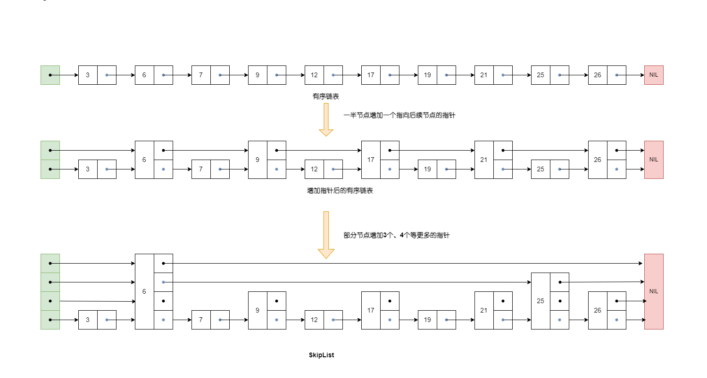
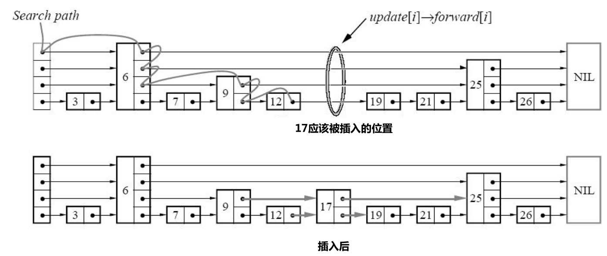

SkipList由William Pugh于1990年提出，这是一种可替代平衡树的数据结构，不像平衡树需要强制保持树的平衡，SkipList依靠随机生成数以一定概率来保持数据的平衡分布。尽管在最坏情况下SkipList的效率要低于平衡树，但是大多数情况下其效率仍然非常高，其插入、删除、查找数据的时间复杂度都是$O(logN)$。

除了高效外其实现和维护也非常简单，所以在很多大数据系统中在维护有序列表高效读／写的场景下会采用SkipList，比如LevelDB在实现其用于内存中暂存数据的结构MemTable就是使用SkipList实现的，Redis在实现Sorted Set数据结构时采用的也是SkipList，再如Lucene中也使用SkipList来对倒排列表进行快速查找。

<center>
    
</center>


# 数据操作

SkipList依赖随机数来以一定概率保持数据的平衡，具体而言，就是在插入节点的时候，随机决定该节点应该有多少个指向后续节点的指针，有几个指针就称这个节点是几层的(Level)。整个链表中的最高层级用`MaxLevel`来标明，链表的表头具有`MaxLevel`层级。

## 数据查找

对SkipList中的数据进行查找的伪码
```sql
search(list, searchKey)
    x := list->header
    -- loop invariant: x->key < searchKey
    for i := list->level downto 1 do
        while x->forward[i]->key < searchKey do
            -- i表示层级,forward[i]表示节点后方的指针
            x := x->forward[i]
    	-- x->key < searchKey <= x->forward[1]->key
    x := x->forward[1]
    if x->key = searchKey then return x->value
    else return failure
```
其主要的思想是：从链表头开始，从最高层依次向低层查找，同一层节点查找和普通有序表一致(顺序往后找到第一个大于或等于当前查找数值`searchKey`的节点)，当在本层级未找到时，就下降一个层级继续，直到找到或者发现链表中不包含`searchKey`为止。


## 插入数据

首先了解如何随机确定节点层级
```sql
randomLevel()
    |v| := 1
    -- random() that return a random value in[0...1)
    while random() < p and |v| < MaxLevel do
        |v| := |v| + 1
    return |v|
```

可以根据下面算法实现插入新数据，实现的主要逻辑：首先与查找算法一样找到`searchKey`应该插入的位置，在查找过程中往update数组中记录查找路径每层最后的节点；

- 如果找到相同key的节点，则只需更新其值即可
- 否则利用随机数确定新插入节点的层级，如果新节点层级数比目前链表中的`MaxLevel`要高，那么需要更新链表表头的层级指针信息并重设`MaxLevel`数值，然后生成新节点并插入链表，并根据update数组保留的信息调整各个层级的相关指针指向。

```sql
Inser(list, searchKey, newValue)
    -- update数组用于临时存放查找searchKey路径每层最后的节点
    -- 主要目的记录信息,使得插入节点像普通链表插入一样
	local update[1... maxLevel]

	x := list->header
	for i := list->level downto 1 do
        while x->forward[i]->key < searchKey do
        	-- i表示层级,forward[i]表示节点后方的指针
        	-- x->key < searchKey <= x->forward[i]->key
        	x := x->forward[i]
       update[i] := x
    x := x->forward[1]

    -- 找到了相同key节点更新值
    if x->key = searchKey then x->value := newValue
    else
        -- 没有找到相同key节点
        |v| := randomLevel()
        if |v| > list->level then
            for i := list->level + 1 to |v| do
                update[i] := list->header
        list->level = |v|
    x := makeNode(|v|, searchKey, value)
    for i := 1 to level do
        x->forward[i] := update[i]->forward[i]
        update[i]->forward[i] := x
        
```

下图形象地表达了插入17数值的过程:

<center>
    
    <div>插入17<div>
</center>


## 删除数据


主要逻辑：先查找`searchKey`在链表中的位置，如果找到，则根据update数组调整相应的指针指向，然后删除节点，如果发现某个层级删除这个节点后没有其他节点，那么会相应地调整`MaxLevel`的数值。

```sql
Delete(list searchKey)
	local update[1... maxLevel]
	x := list->header
	for i := list->level downto 1 do
        while x->forward[i]->key < searchKey do
        	-- i表示层级,forward[i]表示节点后方的指针
        	-- x->key < searchKey <= x->forward[i]->key
        	x := x->forward[i]
       update[i] := x
    x := x->forward[1]
    
    if x->key = searchKey then
    	for i := 1 to list->level do
    		if update[i]->forward[i] != x then break;
    		update[i]->forward[i] := x->forward[i]
    free(x)
    
    while list->level > 1 and
    		list->header->forward[list->level] = NIL do
    	list->level := list->level -1
```

