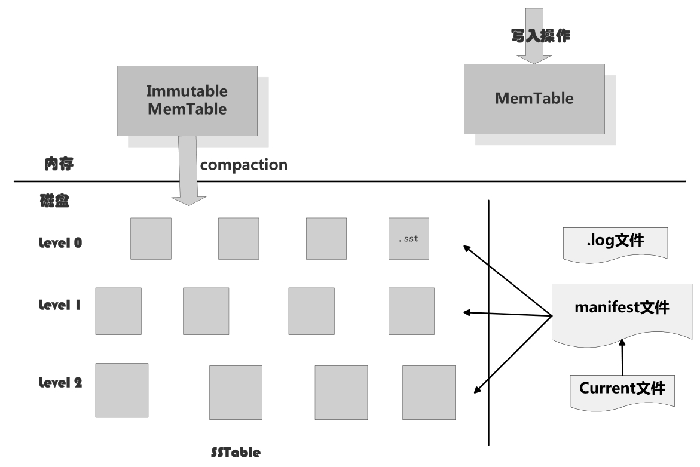
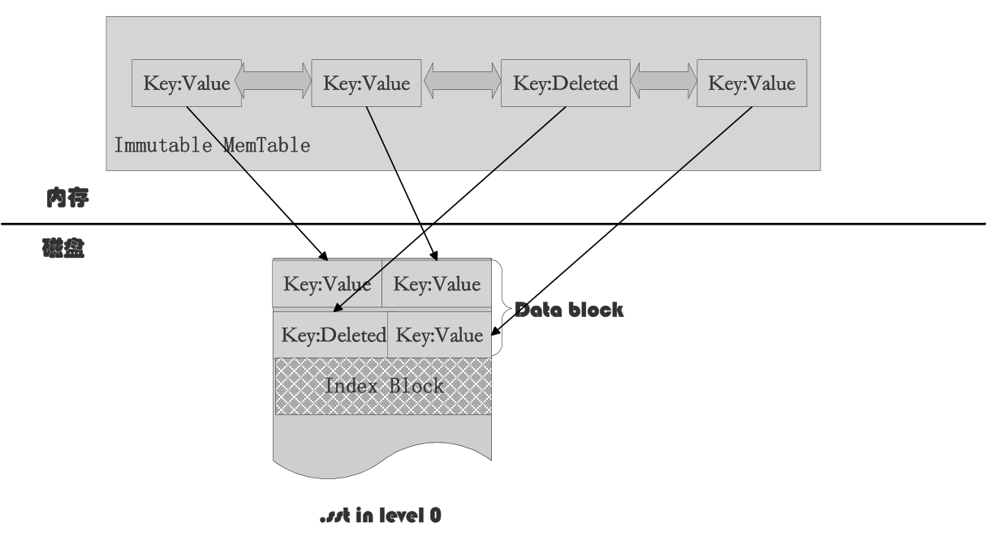
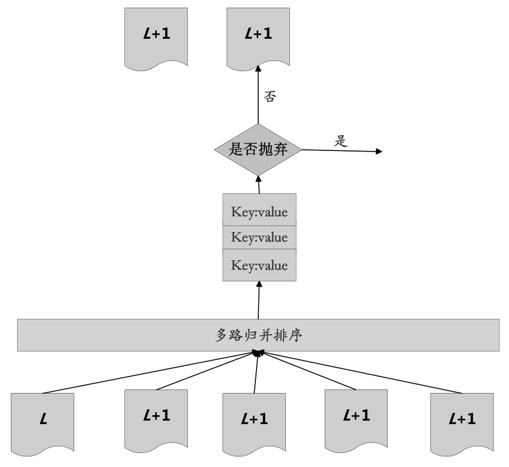

LSM树(Log-structured Merge-tree)的本质是将大量的随机写操作转换成批量的序列写，极大地提升磁盘数据写入速度，所以LSM树非常适合对写操作效率有高要求的应用场景。但是其对应付出的代价是读效率有所降低，这往往可以引入Bloom Filter或者缓存等优化措施来对读性能进行改善。

# LevelDB的LSM

构成LevelDB静态结构的包括6个主要部分：
- 内存中的MemTable和Immutable MemTable
- 磁盘上的几种主要文件：
    - log文件：主要用于确保崩溃不丢失数据，写入数据时先写log文件，之后写MemTable文件。
    - Current文件：记录当前manifest文件名。在LevleDB运行过程中，随着Compaction的进行，SSTable文件会发生变化，会有新的文件产生，旧文件废弃，manifest也会跟着反映这种变化，此时往往会生成新的manifest文件来记载这种变化，Current用来指出哪个manifest文件才是我们关心的那个manifest文件。
    - manifest文件：记载了SSTable各个文件的管理信息，比如属于哪个Level、文件名称、最小key和最大key各自是多少(SSTable中的文件是主键有序的，即文件中小key记录排在大key记录之前)。
    - SSTable文件：由内存中的数据不断导出并进行Compaction操作后形成。

    
    
LevelDB静态结构

写入`<key,value>`数据:，LevelDB会先往log文件里写入，成功后将记录插进MemTable中，这样基本就算完成了写入操作，因为一次写入操作只涉及一次磁盘顺序写和一次内存写入，而且MemTable采用了维护有序记录快速插入查找的SkipList数据结构。

当MemTable插入的数据占用内存到了一个界限后，需要将内存的记录导出到外存文件中，LevelDB会生成新的log文件和MemTable，原先的MemTable就成为Immutable MemTable(内容不可更改，只能读，不能写入或删除)。新到来的数据被记入新的log文件和MemTable，LevelDB后台调度会将ImmutableMemTable的数据导出到磁盘，形成一个新的SSTable文件。SSTable是由内存中的数据不断导出并进行Compaction操作后形成的，而且SSTable的所有文件是一种层级结构，第1层为Level 0，第2层为Level 1，依次类推，层级逐渐增高，这也是称之为LevelDB的原因。

SSTable中的文件是主键有序(文件中小key记录排在大key记录之前)，各个Level的SSTable都是如此，需要注意的是Level 0的SSTable文件（后缀为.sst）和其他Level的文件相比有特殊性：Level 0的.sst文件，两个文件可能存在key重叠。其他Level的SSTable文件来说，则不会出现同一层级内.sst文件的key重叠现象，也就是说Level L中的任意两个.sst文件，可以保证它们的key值是不会重叠的。

## Compaction

LevelDB的Compaction有2种Compaction，分别是

- Minor Compaction：目的是当内存中的MemTable大小到了一定值时，将内容保存到磁盘文件中。
- Major Compaction：当某个Level下的SSTable文件数目超过一定设置值后，LevelDB会从这个Level的SSTable中选择一个文件(Level>0)，将其和高一层级的Level+1的SSTable文件合并。

---

<b>Minor Compaction</b>

当MemTable中记录数量到了一定程度会转换为Immutable MemTable，此时不能往其中写入记录，只能从中读取KV内容。Immutable MemTable其实是一个SkipList多层级队列，其中的记录是根据key有序排列的。所以这个minor Compaction实现起来也很简单，就是按照Immutable MemTable中记录由小到大遍历，并依次写入一个Level 0的新建SSTable文件中，写完后建立文件的index数据，这样就完成了一次minor Compaction。从图中也可以看出，对于被删除的记录，在minor Compaction过程中并不真正删除这个记录，原因也很简单，这里只知道要删掉key记录，但是这个KV数据在哪里？这需要复杂的查找，所以在minor Compaction的时候并不做删除，只是将这个key作为一个记录写入文件中，至于真正的删除操作，在以后更高层级的Compaction中会去做。

    
    
Minor Compaction机理示意图

---

<b>Major Compaction</b>

对于大于0的层级中，每个SSTable文件内的key都是由小到大有序存储的，而且不同文件之间的key范围不会有任何重叠，因此选择一个文件就可以。对于Level 0的SSTable文件，虽然每个文件是根据key由小到大排列的，但是因为Level 0的文件是通过minor Compaction直接生成的，所以任意两个Level 0下的两个SSTable文件可能在key范围上有重叠，对于Level 0来说，指定某个文件后，本Level中很可能有其他SSTable文件的key范围有重叠，这种情况下，要找出所有有重叠的文件和Level 1的文件进行合并，即Level 0在进行文件选择的时候，可能会有多个文件参与major Compaction。

<b>LevelDB在选定某个Level进行Compaction后，还要选择是具体哪个文件要进行Compaction</b>，LevelDB采用轮流来，比如这次是文件A进行Compaction，那么下次就是在key range上紧挨着文件A的文件B进行Compaction，这样每个文件都会有机会轮流和高层的Level文件进行合并。

<b>如果选好了Level L的文件A和Level L+1的文件进行合并，那么应该选择Level L+1的哪些文件进行合并？</b>LevelDB选择L+1层中和文件A在key range上有重叠的所有文件来和文件A进行合并。

<b>选定了Level L的文件A，之后在Level L+1中找到了所有需要合并的文件B、C、D等，剩下的问题是具体如何进行magor合并的？就是说给定了一系列文件，每个文件内部是key有序的，如何对这些文件进行合并，使得新生成的文件仍然key有序，同时抛掉那些不再有价值的KV数据。</b>major Compaction的过程如下：对多个文件采用多路归并排序的方式，依次找出其中最小的key记录，也就是对多个文件中的所有记录重新进行排序。之后采取一定的标准判断这个key是否还需要保存，如果判断没有保存价值，那么直接抛掉，如果还需要继续保存，那么就将其写入Level L+1层中新生成的SSTable文件中。这样完成了对KV数据的一一处理，形成了一系列新的L+1层数据文件，之前的L层文件和L+1层参与Compaction的文件数据此时已经没有意义了，全部删除。这样就完成了L层和L+1层文件记录的合并过程。

    
    
SSTable Compaction

---

# 参考资料
1. 大数据日知录
