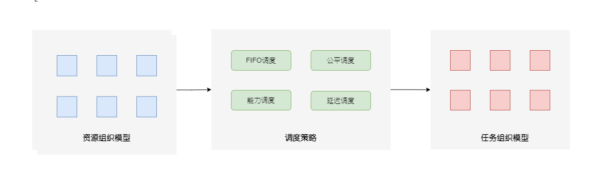
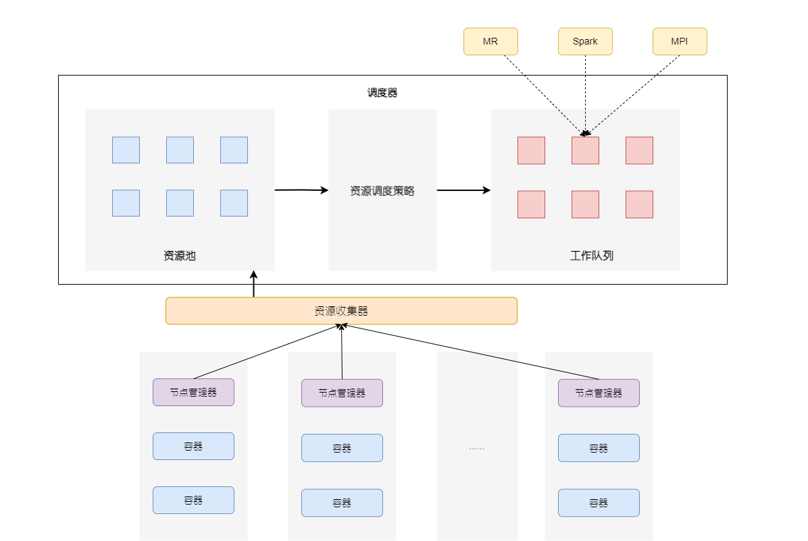
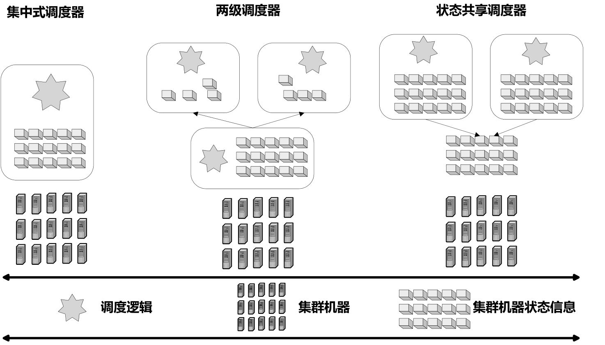

# 资源管理抽象模型

从现有的各种资源管理与调度系统中(YARN、Mesos、Corona、Quincy等)抽象出两个模型：资源管理的概念模型和通用架构。大部分资源管理系统都符合这两个抽象模型，在具体实现细节上会有所不同。

## 概念模型

从概念上讲，资源管理与调度系统的主要目的是将集群中的各种资源通过一定策略分配给用户提交到系统里的各种任务，常见的资源主要包括内存、CUP、网络资源与磁盘I/O资源4类。而这个概念模型主要强调三要素：资源组织模型、调度策略和任务组织模型。

    
    
抽象的资源管理调度概念模型

资源组织模型的主要目标是将集群中当前可用的各种资源采用一定的方式组织起来，以方便后续的资源分配过程。一个常见的资源组织方式是将资源组织成多层级队列的方式。

调度策略负责以一定方式将资源分配给提交给系统任务，常见调度策略包括FIFO、公平调度、能力调度、延迟调度等。

任务组织模型的主要目标是将多用户提交的多任务通过一定方式组织起来，以方便后续资源分配。

## 通用架构

集群中每台机器上会配置节点管理器，其主要职责是不断地向资源收集器汇报目前本机资源使用状况，并负责容器的管理工作。当某个任务被分配到本节点执行时，节点管理器负责将其纳入某个容器执行并对该容器进行资源隔离，以避免不同容器内任务的相互干扰。

通用调度器由资源收集器和资源调度策略构成，同时管理资源池和工作队列数据结构。资源收集器不断地从集群内各个节点收集和更新资源状态信息，并将其最新状况反映到资源池中，资源池列出目前可用的系统资源。资源调度策略是具体决定如何将资源池中的可用资源分配给工作队列的方法，常见的策略包括FIFO、公平调度策略和能力调度策略等。资源调度策略模块往往是可插拔的，实际系统应用者可以根据情况设定符合业务状况的调度策略。当用户新提交作业时，其进入工作队列等候分配使其可启动的资源。

    
    
抽象的通用资源管理框架

# 调度系统设计的基本问题

设计一个合理的资源管理与调度系统需要权衡和选择的相关因素。

## 资源异质性和工作负载异质性

异质性往往指的是组成元素构成的多元性和相互之间较大的差异性。在资源管理与调度场景下，往往有两类异质性需要考虑：资源异质性和工作负载（Workload）异质性。

资源异质性是从系统所拥有的资源角度来看，这对于大型数据中心来说很常见。比如数据中心的机器很难保证采用完全相同的配置，总会有些机器高配置，拥有大量的内存和计算以及存储资源，也会有很多低配硬件。在做资源分配的时候，必须要考虑这种硬件的资源差异性，<b>一般通过将资源分配单位细粒度划分为较小单元来解决</b>。

从任务角度来看，需要考虑工作负载异质性，这对于大型互联网公司来说很常见，因为各种服务和功能特性各异，对资源的需求差异也很大。比如对外服务强调高可用性以及资源的充分优先保障，而后台运行的批处理作业往往是由很多短任务构成的，所以需要调度决策过程要尽可能快，等等。一个好的资源管理与调度系统要充分考虑实际应用场景，这样才能在满足业务需求的前提下，充分实现集群的高资源利用率。

## 数据局部性(Data Locality)

大数据场景下的一个基本设计原则是：将计算任务推送到数据所在地进行。移动计算代码到数据所在地而非移动数据到计算任务所在地，这种设计哲学在大数据场景下非常常见的，这一般被称为“数据局部性”。

在资源管理与调度语境下，有3种类型的数据局部性：节点局部性(Node Locality)、机架局部性(Rack Locality)和全局局部性(Global Locality)。所谓节点局部性，是指可以将计算任务分配到数据所在的机器节点，这是数据局部性最优的一种情形，因为完成计算无须任何数据传输。机架局部性指的是虽然计算任务和所需数据分属两个不同的计算节点，但是这两个节点在同一个机架中，这也是效率较高的一种数据局部性，因为机架内机器节点间网络传输速度要明显高于机架间网络传输速度。其他的情况则属于全局局部性，此时需要跨机架进行网络传输，会产生较大的网络传输开销。

对于一个好的资源调度策略来说，应该尽可能保证节点局部性，即使不能保证这点也应尽可能追求机架局部性，这样才能压缩计算成本，尽快完成计算任务。当然，在以上两者都无法满足的情况下，资源调度系统也会通过网络传输将数据迁移来完成计算任务，虽然相对低效，但也远胜于资源空置。

## 抢占式和非抢占式调度

<b>在面临多用户多任务调度场景下，面对已分配资源，资源管理调度系统可以有两种不同类型的调度方式：抢占式调度与非抢占式调度。</b>

抢占式调度是指对于某个计算任务来说，如果空闲资源不足或者出现不同任务共同竞争同一资源，调度系统可以从比当前计算任务优先级低的其他任务中获取已分配资源，而被抢占资源的计算任务则需出让资源停止计算，在后续步骤中继续重新申请新资源来完成后续计算，有时甚至需要废弃已经完成的计算任务重新执行。Omega调度系统采用了抢占式调度方式。

非抢占式调度则只允许从空闲资源中进行分配，如果当前空闲资源不足，则须等待其他任务释放资源后才能继续向前推进。Mesos采用了非抢占式调度。

一般而言，对于强调高优先级任务执行效率的调度策略来说，往往会采纳抢占式调度方式，以此来保证这些任务即使在资源不足的情况下也能快速完成。而对于更强调资源分配公平性的调度策略来说，往往会采纳非抢占式调度方式。

## 资源分配的粒度

大数据场景下的计算任务往往由两层结构构成：作业级(Job)和任务级(Task)。一个作业由多个并发的任务构成，任务之间的依赖关系往往形成有向无环图(DAG)。<b>资源调度系统面临资源分配粒度问题。</b>

一种极端的情况是需要将作业的所有所需资源一次性分配完成，常被称为<b>群体分配(Gang Scheduler)或者全分或不分(All-or-Nothing)策略</b>。MPI任务就是一种典型的需要采纳群体分配策略的任务类型。

另外一种分配粒度是采取<b>增量满足式分配策略</b>b>，即对于某个作业来说，只要分配部分资源就能启动一些任务开始运行，随着空闲资源的不断出现，可以逐步增量式分配给作业其他任务以维持作业不断地向后推进，以MapReduce为代表的批处理任务一般采用增量满足式分配策略。

有一种特殊的增量满足式分配策略被称作<b>资源储备(Resource Hoarding)策略</b>。只有分配到一定量的资源作业才能启动，但是在未获得足够资源的时候，作业可以先持有目前已分配的资源，并等待其他作业释放资源,，这样从调度系统不断获取新资源并进行储备和累积，直到分配到的资源量达到最低标准后开始运行。采取“资源储备”策略的调度，在作业启动前，已分配给该作业的资源一直处于闲置状态。

## 饿死和死锁问题

如果资源管理与调度策略设计不当，会出现计算任务“饿死”以及整个资源调度系统死锁问题，一个合理的资源调度系统应该尽量避免出现这个问题。

所谓计算任务“饿死”现象，指的是这个计算任务持续长时间无法获得开始执行所需的最少资源量，导致一直处于等待执行的状态。比如，在资源紧张的情形下，有些低优先级的任务始终无法获得资源分配机会，如果不断出现新提交的高优先级任务，这些低优先级任务饿死。

死锁问题则是由于资源调度不当导致整个调度系统无法继续正常执行。比如，资源储备策略就有可能导致调度系统进入死锁状态。假设系统有两个作业A和B，且两者都采用“资源储备”策略，最小启动作业所需资源为所有资源的2/3，如果某时某刻两个作业各自被分配了所有资源的1/2，那么整个调度系统进入死锁状态。

由上述内容可见，调度系统出现死锁必然表现为某些作业处于“饿死”状态，但是有计算任务处于“饿死”情形并不一定意味着调度系统处于死锁状态。

## 资源隔离方法

相比Hadoop 1.0的Map和Reduce槽(Slot)的粗粒度资源分配方式，无论是YARN还是Mesos都采取了将各种资源（CPU、内存、网络带宽和I/O带宽）封装在容器中的细粒度资源分配方法，整个分布式资源管理系统封装了为数众多的资源容器，为了避免不同任务之间互相干扰，需要提供容器间的资源隔离方法。

目前对于资源隔离最常用的手段是Linux容器(Linux Container，LXC)，YARN和Mesos都采用了这种方式来实现资源隔离。LXC在资源管理方面依赖于Linux内核的cgroups子系统，cgroups子系统是Linux内核提供的一个基于进程组的资源管理的框架，可以为特定的进程组限定可以使用的资源。

# 资源管理和调度系统范型

目前有多种实现资源管理与调度功能的实际系统，根据其宏观运行机制，可以归纳出3种资源管理与调度系统范型：集中式调度器、两级调度器与状态共享调度器。

    
    
3种资源管理与调度系统范型

# 参考资料

1. 大数据日知录