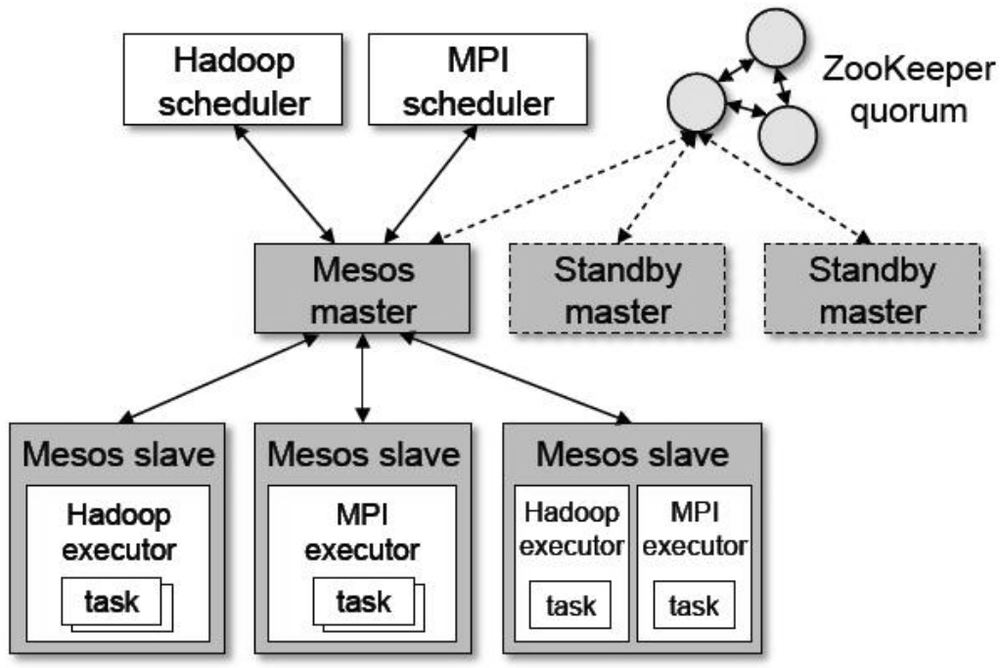
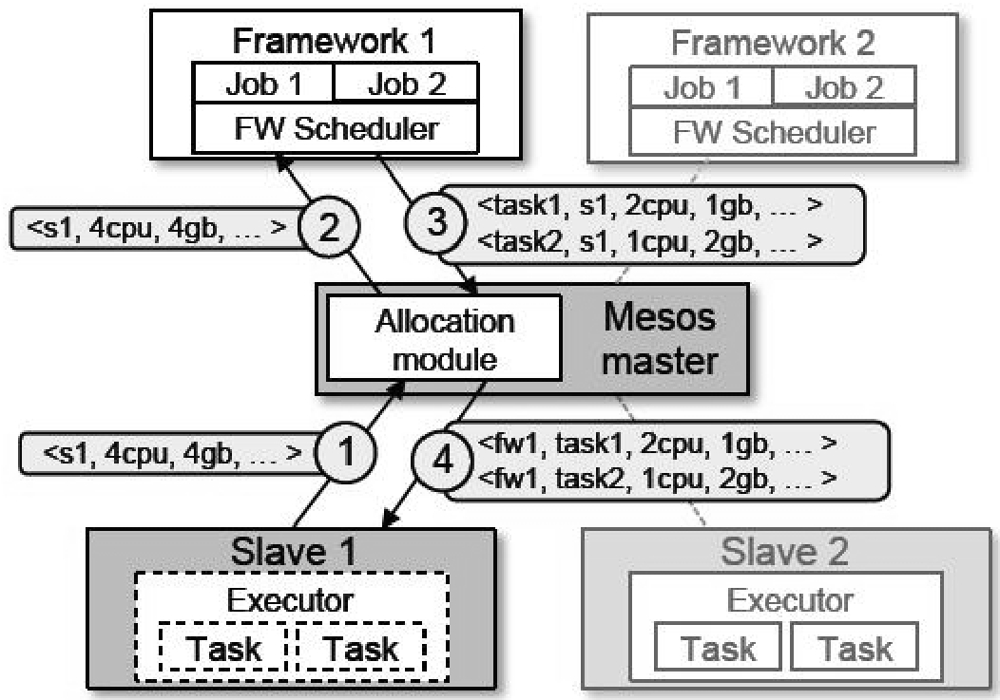

Mesos是美国加州大学伯克利分校AMPLab实验室推出的资源管理与调度系统，从其范型来讲是一个典型的两级调度器。<b>Mesos的设计哲学吸收了类似操作系统中微内核的思想，在中央调度器一级采取极简功能和极小接口，只是根据一定策略决定分配给各个框架多少资源，将数据局部性保证等具体资源调度策略下推到各个框架，这样可以减少中央调度器的负载，增加调度效率</b>，同时也因为其极简设计策略，使得中央调度器支持将来新出现的框架改动最小化，增加了调度系统的可扩展性和健壮性。

# 架构

Mesos采用了典型的主-从架构。中央调度器由多个主控服务器(Master)构成，通过ZooKeeper可以保证当正在工作的主控服务器出现故障时，备用主控服务器(Standby Master)可以快速将管理工作接替过来，以此增加整个调度系统的健壮性。

    
    
Mesos整体架构

主控服务器使用资源供应(Resource Offers)来将集群内的资源分配给各个计算框架，每份资源供应代表了一部分集群内可用的资源列表(包括内存、CPU等)。主控服务器通过资源供应决定为每个框架提供多少资源，每个框架自身的二级调度器做更细致的任务间资源分配。

为了增加灵活性，Mesos中央调度器的调度策略模块(Allocation Module)设置成可插拔的，系统管理者可以按需设置中央调度策略，同时Mesos提供了公平调度策略(DRF策略)和优先级调度策略两种不同类型的调度方式。

每个计算框架需要向Mesos注册两个接口：框架调度器(Scheduler)和执行器(Executor)。框架调度器起到两级调度器中的第二级调度器的功能，中央调度器将“资源供应”提交给框架调度器，框架调度器再按照自己的资源分配策略将其分配给自身的任务。执行器运行在集群中的从节点(Mesos Slave)中执行具体任务，执行器相互之间的资源隔离由Mesos通过Linux Container来获得保证。

# 调度实例

下图Mesos通过资源供应来分配集群资源的例子。

    

1. 1号从节点(Slave 1)向主控服务器汇报其有4个CUP和4 GB内存资源可用，主控服务器触发资源分配模块，由其分配策略告知主控服务器应该将所有资源分配给框架1(步骤1)。
2. 在步骤2，Mesos将这份资源封装为“资源供应”并将其传给框架1的调度器。
3. 框架1的调度器运行二级调度策略，将这份资源分配给两个任务，其中任务1分配了2个CPU和1GB内存，任务2分配了1个CUP和2GB内存（步骤3）。
4. 然后，Mesos将这两个任务分配给1号从节点，由从节点实际分配这些资源给对应任务并启动执行器执行任务，同时从节点还提供任务运行的资源隔离管理（步骤4）。

因为1号从节点提供的资源还有剩余，Mesos中央调度器还可以继续将其分配给框架2。通过这种方式，Mesos实现了一个典型的两级调度器。

---

<b>为了保证中央调度器功能和接口的极简化以增加系统的健壮性和可扩展性，Mesos不支持计算框架指定资源要求或者约束条件</b>（比如框架指定要在某些机器上运行以增加数据局部性），即计算框架只能被动接受被分配的资源，这样很难保证数据局部性。为了缓解这一点，Mesos提供了两项改进措施：<b>框架可拒绝所分配资源以及增加过滤器(Filter)机制</b>

计算框架在接收到资源供应后，可拒绝接收不满足需求的资源而继续等待后续资源分配，以此来使得二级调度器可以支持更加灵活高效的调度策略，但是这样会带来新的问题：Mesos如果通过交互反复被多个计算框架拒绝，那么资源分配效率会很低下。为了提升分配效率，计算框架可以向中央调度器注册过滤器，过滤器对框架希望接收的资源做出了描述，比如可以描述：只从机器列表L中提供资源或者只接收资源量超过R的机器列表这两种类型的过滤条件。通过这种方式，即可增加中央调度器和二级调度器之间的交互效率。

Mesos的整体架构和调度机制，类似于操作系统微内核思想而设计的中央调度极简化逻辑是非常重要的，这对于调度系统的效率、健壮性以及可扩展性都非常关键。Mesos比较<b>适合不同框架任务同质化场景</b>，尤其是大部分都是短作业的情景（比如Hadoop等批处理任务），因为从上述描述可知，Mesos<b>不支持抢占式调度</b>，资源分配出去后只能等待任务运行结束后自行释放，如果是大量短作业，那么资源释放速度较快，这样总有新资源可分配，对于后续的任务来说可以较快获得资源，避免长时间等待。

---