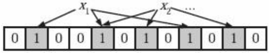

# 布隆过滤器

布隆过滤器(Bloom Filter)，是由Howard Bloom在1970年提出的二进制向量数据结构，具有很好的空间和时间效率，尤其是空间效率极高，BF常常被用来检测某个元素是否是巨量数据集合中的成员。

## 基本原理

BF可以高效地表征集合数据，其使用长度为m的位数组来存储集合信息，同时使用k个相互独立的哈希函数将数据映射到位数组空间。

<center>
    
</center>


其基本思想如下：首先，将长度为m的位数组元素全部置为0。对于集合S中的某个成员a，分别使用k个哈希函数对其计算，如果$h_i(a)=x, (1 \le i \le k, 1 \le x \le m)$，将位数组的第x位置为1，对于成员a来说，经过k个哈希函数计算后，可能会将位数组中的$w(w \le k)$位为1。对于集合中的其他成员也如此处理，这样即可完成位数组空间的集合表示。其算法流程如下：

```java
BloomFilter(set A, hash_functions, integer m)
	filter[1...m]= 0;   //大小为m的位数组初始化为0
 	foreach ai xin A:
 		foreach hash function hj:
 			filter[hj(ai)] = 1;
 		end foreach
	end foreach
	return filter
```

当查询某个成员a是否在集合S中出现时，使用相同的k个哈希函数计算，如果其对应位数组中的w位($w \le k$)都为1，则判断成员a
属于集合S，只要w位中有任意一位为0，则判断成员a不属于集合S，其算法流程如下：

```
 MembershipTest(element, filter, hash_functions)
 	foreach hash function hj:
 		if filter[hj(element)] != 1 then
 			return False
 		end foreach
	return True
```

在查询某个成员是否属于集合时，会发生误判（False Positive）。也就是说，如果某个成员不在集合中，有可能BF会得出其在集合中的结论。但是不会发生漏判（False Negative）的情况，即如果某个成员确实属于集合，那么BF一定能够给出正确判断。

## 误判率计算

集合大小n、哈希函数的个数k和位数组大小m会影响误判率,对其关系进行推导:
$$
\begin{array}{l}
某元素由Hash函数插入时相应位置不为1的概率为: 1-\frac{1}{m}\\
经过k个Hash函数，该位置仍然没有被置为1的概率为: (1-\frac{1}{m})^k\\
那么插入n个元素，该位置仍未被置为1的概率为: (1-\frac{1}{m})^{kn}\\
该位置被置为1的概率为：1 - (1-\frac{1}{m})^{kn} \\
在检测某个元素是否存在于集合中时，误判时会认为相应位置所有的Hash值对应的位置的值都是1，误判的概率\left[1 - (1-\frac{1}{m})^{kn} \right ]^k \\
由于\lim_{x \to 0} (1+\frac{1}{x})^{x} = e\\
\Rightarrow \left[1 - (1-\frac{1}{m})^{kn} \right ]^k = \left[1 - (1-\frac{1}{m})^{-m * -\frac{kn}{m}} \right ]^k \approx (1-e^{-\frac{kn}{m}})^k
\\
\\
\\
假设给定m和n，计算k为什么值时误判率最低？\\
对于误判函数f(k) = (1-e^{-\frac{kn}{m}})^k \\
记b = e^{(\frac{n}{m})},则f(k) = (1-b^{-k})^k \\
两边去对数则, ln[f(k)] = k * ln(1-b^{-k}),对其求导得 \\
\frac{1}{f(k)}*{f}'(k) = ln(1-b^{-k}) + k * \frac{1}{1-b^{-k}} * (-b^{-k}) * lnb * (-1) \\ 
= ln(1-b^{-k}) + k * \frac{b^{-k} * lnb}{1-b^{-k}} \\
令ln(1-b^{-k}) + k * \frac{b^{-k} * lnb}{1-b^{-k}} =0\\
\Rightarrow ln(1-b^{-k}) * (1-b^{-k}) =  -k * b^{-k} * lnb \\
\Rightarrow ln(1-b^{-k}) * (1-b^{-k}) =  b^{-k} * lnb^{-k} \\
\Rightarrow 1-b^{-k} = b^{-k} \\
\Rightarrow b^{-k} = \frac{1}{2} \\
\Rightarrow e^{(-\frac{kn}{m})} = \frac{1}{2} \\
\Rightarrow \frac{kn}{m} = ln2 \\
\Rightarrow k = ln2 * \frac{m}{n} = 0.7 *  \frac{m}{n}
\\
\\
\\
假设已知集合大小n，并设定好误判率p，需要计算给BF分配多大内存合适 \\
当k已经取得最优时：P(error) = 2^{-k} \\
\Rightarrow log_2P = -k \Rightarrow k = log_2\frac{1}{P} \\
\Rightarrow ln2 * \frac{m}{n} = log_2\frac{1}{P} \\
\Rightarrow \frac{m}{n} = \frac{1}{ln2} *log_2\frac{1}{P} = -\frac{lnp}{{ln2}^2}
\end{array}
$$
有上述关系可知：

集合大小n、哈希函数的个数k和位数组大小m和误判率之间的关系:
$$
\begin{array}{c}
误判率pfp= (1−e^\frac{-kn}{m})^k
\end{array}
$$


假设n和m已知，即已知位数组大小和集合元素个数，设定多少个哈希函数误判率能够达到最低呢？经过分析，最优的哈希函数个数为：
$$
\begin{array}{c}
k = \frac{m}{n} ln2
\end{array}
$$

假设已知集合大小n，并设定好误判率p，需要计算给BF分配多大内存合适，即确定m的大小。
$$
\begin{array}{c}
m = -\frac{nlnp}{(ln2)^2}
\end{array}
$$

## ClickHouse的BloomFiliter实现

上面的公式推导可以看到，当$\frac{m}{n}$固定，存在一个$k$使得误判率$p$最低，这就是k的最右取值。如表就展示了不同m/n和$k$的误判率

<center>
    
    <div>
        <a href="https://pages.cs.wisc.edu/~cao/papers/summary-cache/node8.html#SECTION00053000000000000000"> 不同m/n和k的误判率</a>
    </div>
</center>


ClickHouse就利用了查表的原理，根据输入的误判率的大小，反推出k和$\frac{m}{n}$的大小。相关实现详见`src\Interpreters\BloomFilterHash.h`中的`calculationBestPractices`函数。

```C++
    /**
     * @brief   理论上，在m/n固定的情况下，存在一个k值使得误判概率p最小。其中:
     *              m : 位数组的个数
     *              k : Hash函数的个数
     *              n : 集合的大小，放入BloomFiliter中元素的个数
     *          该函数实现可以根据用户传入的误判率的大小反推出该bf的最佳k和m/n取值,类似于loookupTable原理
     * 
     * @param max_conflict_probability      最大误判概率
     * @return std::pair<size_t, size_t>    由m/n和hash函数个数k组成的pair
     */
    static std::pair<size_t, size_t> calculationBestPractices(double max_conflict_probability)
```

ClickHouse的BloomFilter的实现源码位于`src\Interpreters\BloomFilter.cpp`,代码实现`BloomFilterParameters`封装了BF相关输入参数。

```C++
/**
 * @brief       BloomFiliter构造关键参数
 * 
 * @param filter_size_      位数组的个数m
 * @param filter_hashes_    Hash函数的个数
 * @param seed_             生成哈希函数的random seed
 * 
 */
BloomFilterParameters::BloomFilterParameters(size_t filter_size_, size_t filter_hashes_, size_t seed_)
    : filter_size(filter_size_), filter_hashes(filter_hashes_), seed(seed_)
```

`BloomFilter`负责实现布隆过滤器的功能，主要的功能接口:

```C++
// 布隆过滤器加入成员
void BloomFilter::add(const char * data, size_t len)

// 查找元素是否存在
bool BloomFilter::find(const char * data, size_t len)
```
## 参考资料

- [布隆过滤器 (Bloom Filter) 详解](https://www.cnblogs.com/allensun/archive/2011/02/16/1956532.html)
- [Bloom Filters - the math:含参数表格](https://pages.cs.wisc.edu/~cao/papers/summary-cache/node8.html#SECTION00053000000000000000)
- [ClickHouse 源码阅读计划（四）BloomFilter的应用](https://zhuanlan.zhihu.com/p/395152159)
- 大数据日知录：架构与算法

# 改进:计数布隆过滤器

基本BF在使用时有个缺点：无法删除集合成员，只能增加成员并对其查询。计数BF(Counting Bloom Filter)对此进行了改进，使得BF可以删除集合成员，大大拓展了BF的使用范围。

基本BF无法删除的根本原因是其基本信息单元是1个比特位，所以只能表达两种状态，致使其表达能力非常有限。计数BF改进的思路很直接，将基本信息单元由1比特位拓展为多个比特位，这样可以有更多表达能力，可以承载更多信息，一般情况采取3或4比特位为单元。这样，将集合成员加入位数组时，根据k个哈希函数计算，将对应位置的多比特构成的信息单元的数值加1。查询集合成员时，只需要相应位置的信息单元不为0即可认为该成员属于集合。删除成员时，需要将相应位置的信息单元的计数减1.

计数BF拓展了基本BF的应用场景，对应的代价是增加了位数组大小，如果采取3比特位作为基本单元的话，则位数组大小增加3倍。另外，因为比特位表达能力仍然有限，当计数很大的时候**存在计数溢出问题**。


## 参考资料

- [Counting Bloom Filter最早的论文](https://pages.cs.wisc.edu/~jussara/papers/00ton.pdf)
- 大数据日知录：架构与算法

# 改进:Dynamic Count Filter


# 实际应用

- Google Chrome浏览器使用它进行恶意URL的判断

- 网络爬虫使用它对已经爬取过的URL进行判断

- 缓存使用BF来对海量数据进行查找

- 比特币使用BF对历史交易进行验证

- 数据库领域使用BF来实现Bloom Join，即加速两个大小差异巨大的表的Join过程……

- BigTable利用BF提升读操作的效率。

    > BigTable中很多数据记录存储在磁盘的多个SSTable文件中，为了完成一次读操作，需要依次在这些SSTable中查找指定的Key，因为是磁盘操作且涉及多个文件，会对读操作效率有极大影响。BigTable将SSTable文件中包含的数据记录Key形成BF结构并将其放入内存，这样能极高地提高查询速度，对于改善读操作有巨大的帮助作用。在这种场景下，BF的误判并不会造成严重影响，如果发生误判，说明记录本来不在这个SSTable中而BF认为不是这样，顶多增加一次磁盘读操作，系统仍然会知道记录并不在这个SSTable中，可以继续去其他文件接着查找。此时BF的不会漏判则起了很大作用，因为如果发生漏判，则本来在某个SSTable文件中的记录会无法找到，这意味着读操作的失败，很明显这是不允许的。Cassandra在实现时也采取了类似思路。

- Google的流式计算系统MillWheel在保证数据记录“恰好送达一次”语义时对重复记录的检测也采用了类似BigTable的BF用法。
