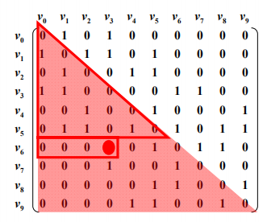

图(Graph)表示多对多的关系，包含：

- 一组顶点：通常用$V (Vertex)$表示顶点集合
- 一组边：通常用$E(Edge)$表示边的集合
    - 边是顶点对：$(v, w)  \in E$ ，其中$v, w \in V$  $v - w$
    - 有向边$< v, w>$表示从$v$指向$w$的边（单行线), $v \longrightarrow w$
    - 不考虑重边和自回路

图可以分为有向图或无向图。有向图的边可以类比为单行道，而无向图的边可以类比为双向车道。图可以包括多个相互隔离的子图。如果任意一对节点都存在一条路径，那么该图被称为连通图。

# 抽象数据类型定义

类型名称:图(Graph)

数据对象集:$G(V, E)$由一个非空有限顶点集合$V$和一个有限集合$E$组成

操作集，对于任意图$G \in Graph$以及$v \in V, e \in E$

- `Graph Create()`：创建并返回图
- `Graph InsertBertex(Graph G Vertex v)`：将顶点v插入G
- `Graph InsertEdge(Graph G, Edge e)`:将边e插入G
- `void DFS(Graph G, Vertex v)`从顶点v出发深度优先遍历图G
- `void BFS(Graph G, Vertex v)`：从顶点v出发宽度优先遍历图G
- `void ShortesPath(Graph G, Vertex v, int Dist[])`：计算图G中顶点v到任意其他顶点的最短距离
- `void MST(Graph G)`计算图G的最小生成树

## 图的表示

### 邻接矩阵$G[N][N]$

邻接矩阵是一个$N \times N$的布尔矩阵，其中N是节点数量，N个顶点从0到N-1编号，这是表示图的最常见的方法。每个顶点（或节点）存储一列相邻的顶点。在无向图中，边`(a，b)`会被存储两遍：在a的邻接顶点中存储一遍，在b的邻接顶点中存储一遍。
$$
G[i][j] = \begin{cases}
  & 1  & if <V_i, v_j>是G中的边 \\
  & 0 & otherwise
\end{cases}
$$
对于无向图存储，可以节省一半空间。用一个长度为$N(N+1)/2$的一维数组A存储$\{G_{00}, G_{10}, G_{11}, ...., G_{n-1 \ 0}, ..., G_{n-1 \ n-1}\}$，则$G_{ij}$在A中对应下标是
$$
(i * (i + 1)/2) + j
$$
对于网络中，只需要将$G[i][j]$的值定义为边$<v_i, v_j>$的权重即可。

<center>
    
</center>
邻接矩阵的优点在于：

1. 方便检查任意一对顶点间是否存在边；
2. 方便找任一顶点的所有“邻接点”(有边直接相连的顶点)；
3. 方便计算任一顶点的“度”（从该点发出的边数为“出度”，指向该点的边数为“入度”）,对于无向图：对应行（或列）非0元素的个数
    1. 对于有向图：对应行非0元素的个数是“出度”
    2. 对应列非0元素的个数是“入度

邻接矩阵的缺点在于：

1. 浪费空间 —— 存稀疏图(点很多而边很少)有大量无效元素，比较合适于稠密图(特别是完全图)。
2. 浪费时间 —— 统计稀疏图中一共有多少条边

### 邻接表$G[N]$

$G[N]$为指针数组，对应矩阵每行一个链表，只存非0元素。

邻接表法的优点：

1. 方便找任一顶点的所有“邻接点”

2. 节约稀疏图的空间。需要N个头指针 + 2E个结点（每个结点至少2个域）

3.  方便计算任一顶点的“度”？

    1. 对无向图：是的

    2. 对有向图：只能计算“出度”；需要构造“逆邻接表”（存指向自己的边）来方便计算“入度”

        

邻接表法的C++实现表示：

```C++
class Graph {
    public Node[] nodes;
}

class Node {
    public String name;
    public Node[] children;
}
```


## 图的搜索
两种常见的图搜索算法分别是深度优先搜索（depth-first search，DFS）和广度优先搜索（breadth-first search，BFS），如果我们想找到两个节点中的最短路径（或任意路径），BFS一般说来更加适宜。

### 深度优先搜索
实现DFS的伪代码。
```C++
void search(Node root) {
    if (root == null) return;
    visit(root);
    root.visited = true;
    for each (Node n in root.adjacent) {
        if (n.visited == false) {
            search(n);
        }
    }
}
```

### 宽度优先搜索
用到队列的迭代法往往最为有效。
```C++
void search(Node root) {
    Queue queue = new Queue();
    root.marked = true;
    queue.enqueue(root); // 加入队尾
    while (!queue.isEmpty()) {
        Node r = queue.dequeue(); // 从队列头部删除
        visit(r);
        foreach (Node n in r.adjacent) {
            if (n.marked == false) {
                n.marked = true;
                queue.enqueue(n)
            }
        }
    }
}
```

## 最短路径问题


## 最小生成树问题

## 双向搜索

双向搜索用于查找起始节点和目的节点间的最短路径。它本质上是从起始节点和目的节点同时开始的两个广度优先搜索。当两个搜索相遇时，我们即找到了一条路径。

> 在传统的广度优先搜索中，在搜索的第一层我们需要搜索至多k个节点。在第二层，对于第一层k个节点中的每个节点，我们需要搜索至多k个节点。所以，至此为止我们需要总计搜索`k^2`个节点。我们需要进行d次该操作，所以会搜索`O(k^d)`个节点。在双向搜索中，我们会有两个相遇于约`d/2`层处（最短路径的中点）的搜索。从s点和t点开始的搜索分别访问了大约`k^(d/2)`个节点。总计大约`2k^(d/2)`或`O(k^(d/2))`个节点。

## 

