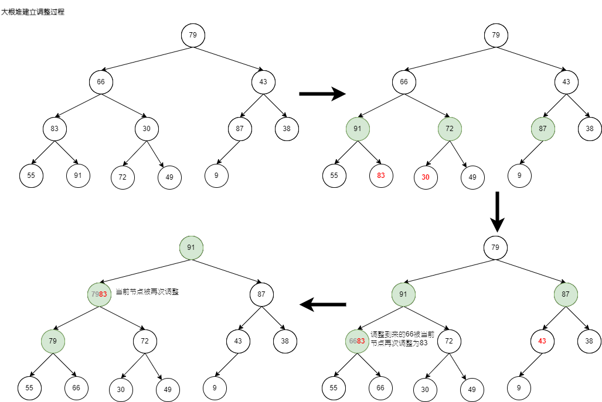

堆(Heap)是一颗数组表示的完全二叉树，根据任意节点是其子树所有节点的最大值(或最小值)，可以将其划分为大顶堆(或小顶堆)。对于有N个节点，树的高度是`log(N)`。

舍弃0号元素，堆示例:

# 基本性质
- 结构性：用数组表示的完全二叉树；
- 有序性：任一结点的关键字是其子树所有结点的最大值(或最小值)
  - 最大堆(MaxHeap),也称大顶堆：最大值
  - 最小堆(MinHeap),也称小顶堆 ：最小值


# 存储和表示
堆用数组表示的完全二叉树。堆中，第一个元素不存放元素，存放一个哨兵，便于之后操作，那么
- 舍弃0号元素，对于$i$位置的元素，其左右孩子的索引分别为$2i$和$2i+1$，其父节点$\frac{i}{2}$。
- 不弃用0号元素，对于$i$位置的元素，其左右孩子的索引分别为$2i+1$和$2i+2$,其父节点为$\frac{i-1}{2}$

# 抽象数据类型描述
1. 类型名称：最大堆（MaxHeap）
2. 数据对象集：完全二叉树，每个结点的元素值不小于其子结点的元素值
3. 操作集：最大堆$H \in MaxHeap$，元素$item \in ElementType$,主要操作有：
- `MaxHeap Create(int MaxSize)`：创建一个空的最大堆。
- `Boolean IsFull(MaxHeap H)`：判断最大堆H是否已满。
- `Insert(MaxHeap H, ElementType item)`：将元素item插入最大堆H
- `Boolean IsEmpty(MaxHeap H)`：判断最大堆H是否为空。
- `ElementType DeleteMax(MaxHeap H)`：返回H中最大元素(高优先级)。

```C++
typedef struct HeapStruct* MaxHeap;
struct HeapStruct {
  ElementType* Elements; // 存储堆元素的数组
  int Size;   // 堆的当前元素个数
  int Capacity; // 堆的最大容量
};
```

```C++
MaxHeap Create(int MaxSize) {
  /* 创建容量为MaxSize的空的最大堆 */
  MaxHeap H = malloc( sizeof( struct HeapStruct ) );
  H->Elements = malloc( (MaxSize+1) * sizeof(ElementType));
  H->Size = 0;
  H->Capacity = MaxSize; H->Elements[0] = MaxData; 
 /*定义“哨兵”为大于堆中所有可能元素的值，便于以后更快操作 */
  return H;
}
```

```C++
void Insert(MaxHeap H, ElementType item) {
    /* 将元素item 插入最大堆H，其中H->Elements[0]已经定义为哨兵 */
    int i;
    if(IsFull(H)) {
        printf("最大堆已满");
        return;
    }


    // i指向插入后堆中的最后一个元素的位置
    i = ++H->Size;
    // Note: H->Element[ 0 ] 是哨兵元素，它不小于堆中的最大元素，控制顺环结束
    for(; H->Elements[i/2] < item; i/=2) {
        // 向下过滤结点,这样的实现比交换数据要快
        H->Elements[i] = H->Elements[i/2]; 
    }
    // 将item 插入
    H->Elements[i] = item;
}
```

```C++
ElementType DeleteMax(MaxHeap H) {
    // 从最大堆H中取出键值为最大的元素，并删除一个结点
    int Parent, Child;
    ElementType MaxItem, temp;
    if(IsEmpty(H)) {
        printf("最大堆已为空");
        return;
    }
  
    MaxItem = H->Elements[1]; /* 取出根结点最大值 */
    /* 用最大堆中最后一个元素从根结点开始向上过滤下层结点 */
    temp = H->Elements[H->Size--];
    for(Parent = 1; Parent * 2 <= H->Size; Parent = Child) {
        Child = Parent * 2;
        if((Child!= H->Size) &&(H->Elements[Child] < H->Elements[Child+1])) {
            Child++; /* Child指向左右子结点的较大者 */
        }
          
        if(temp >= H->Elements[Child] ) {
            break;
        } else{ // 移动temp元素到下一层
            H->Elements[Parent] = H->Elements[Child];
        } 
    }
    H->Elements[Parent] = temp;
    return MaxItem;
}
```
## 创建堆
堆被应用到堆排序中，此时会涉及将已经存在的N个元素按照堆的要求存在在一个一维数组中，下面以大根堆为例，来了解堆的建立，有两种实现方式：

- 方式一：通过插入操作，经N个元素依次插入到出师为空的堆中，时间代价最大值为`O(NlogN)`
- 方式二：在线性时间复杂度$O(N)$下建立最大堆：
    - 将N个元素按输入顺序存入，先满足完全二叉树的结构特性
    - 从存在根节点的底层的根节点开始向下调整结点，以满足最大堆的有序特性。



线性时间建堆时间复杂度证明:
对于有$N$个节点的堆，树的高度为$logN$,设$k-1=logN$

|     节点数      | 最多交换次数 |
| :-------------: | :----------: |
|  $\frac{N}{4}$  |      1       |
|  $\frac{N}{8}$  |      2       |
| $\frac{N}{16}$  |      3       |
|     ......      |    ......    |
| $\frac{N}{2^k}$ |    $k-1$     |


$$
\begin{array}{l}
T(N)=\frac{N}{4}+\frac{N}{8}\times2+\frac{N}{16}\times3 + ... + \frac{N}{2^k}\times(k-1)\\
2T(N)=\frac{N}{2}+\frac{N}{4}\times2+\frac{N}{8}\times3 + ... + \frac{N}{2^{k-1}}\times(k-1) \\
2T(N)-T(N)=\frac{N}{2}+\frac{N}{4}+\frac{N}{8} + ... + \frac{N}{2^{k-1}} - \frac{N}{2^k}\times(k-1) \\
\le N - (log_{2}{N}-1) \le N
\end{array}
$$


## 实现模板
将堆实现的操作主要抽象成两种:
- 如果元素值变大需要将其下压，记为`down(i)`将元素向下调整
- 如果元素值变小需要将其上提，记为`up(i)`将元素向上调整。

那么，实际使用中常见的操作可以利用这两个接口进行如下描述
- 插入一个数,时间复杂度为`O(logN)`。
  ```C++
  heap[size++] = x;
  up(size);
  ```
- 删除最小值, 时间复杂度为`O(logN)`。实现核心思想:取出根节点，并作为最终的返回结果。用堆中最后一个元素当作根节点，然后从第一层开始向下调整(确保完全二叉树，然后堆调整)。
  ```C++
  heap[1] = heap[size--];
  down(1);
  ```
- 删除任意元素
  ```C++
  heap[k] = heap[size--];
  down(k), up(k);
  ```
- 修改任意元素
  ```C++
  heap[k] = x;
  down(k), up(k); // 只有一个操作有效
  ```
- 求最小值,时间复杂度为`O(1)`.
  ```c++
  heap[1]
  ```
- 给定一组数进行堆的构建,时间复杂度为`O(N)`。在具体的实现中，首先将N个元素按输入顺序存入，先满足完全二叉树的结构特性，再调整调整各结点位置，以满足最大堆的有序特性
  ```C++
  for (int i = size/2; i, i--) down(i);
  ```
## 实现模板
模板中堆的表示，小根堆
- `heap[N]`存储堆中的值, `heap[1]`是堆顶，`i`的左儿子是`2i`, 右儿子是`2i + 1`. 

堆中元素交换
```C++
// h[N]存储堆中的值, h[1]是堆顶，x的左儿子是2x, 右儿子是2x + 1
// hp[k]存储第k个插入的点在堆中的位置
// ph[k]存储堆中下标是k的点是第几个插入的
// 主要为模拟删除或修改堆中任意元素，其中ph和hp也可以采用其他结构进行存储
void heap_swap(int a, int b) {
    swap(hp[ph[a]], hp[ph[b]]);
    swap(ph[a], ph[b]);
    swap(h[a], h[b]);
}
```

元素下推
```C++
void down(int i) {
    int t = i;
    if (2*i <= size && heap[2*i] < heap[t]) t = 2*i;
    if (2*i+1 <= size && heap[2*i+1] < heap[t]) t = 2*i+1;
    if (t != i) {
        heap_swap(i, t);
        down(t);
    }
}
```

元素上推
```C++
void up(int i) {
    while(i/2 && h[i/2] > h[i]) {
        heap_swap(i/2, i);
        i = i >> 1;
    }
}
```
堆构建,时间复杂度为O(N)
```
for (int i = size/2; i; i--) down(i);
```