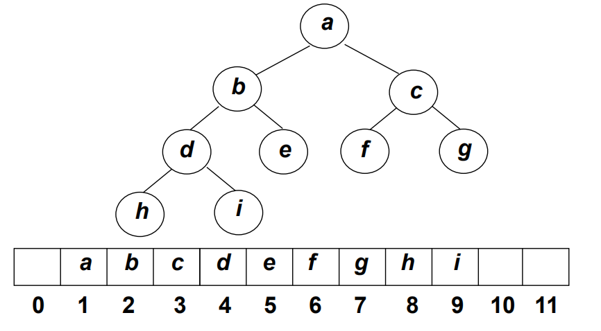
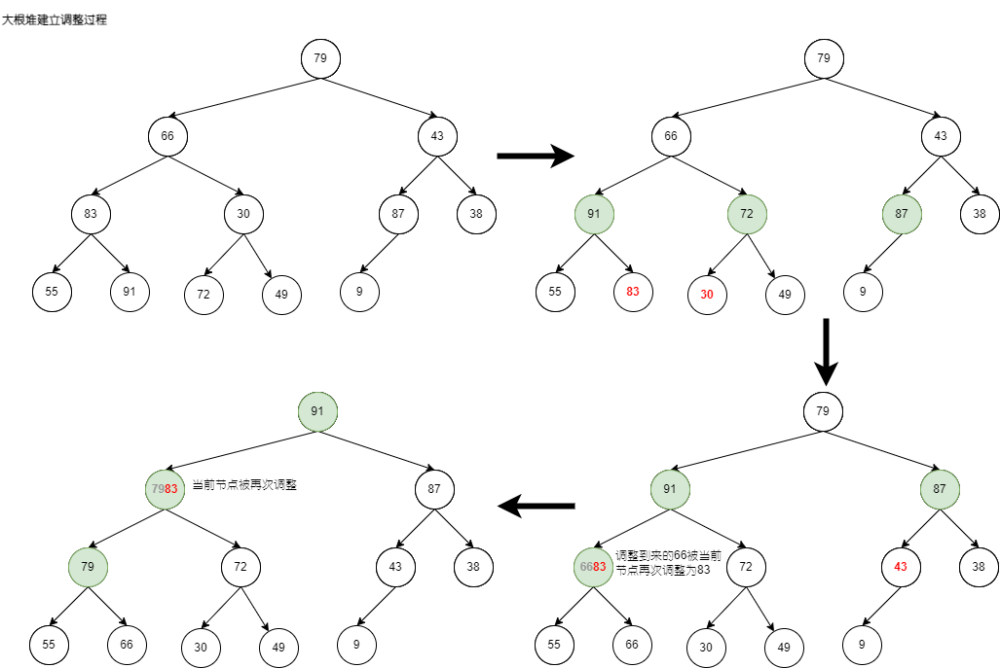

# 堆(Heap)

堆是一颗数组表示的完全二叉树，根据任意节点是其子树所有节点的最大值(或最小值)，可以将其划分为大顶堆(或小顶堆)。对于有N个节点，树的高度是`log(N)`。

舍弃0号元素，堆示例:

## 基本性质
- 结构性：用数组表示的完全二叉树；
- 有序性：任一结点的关键字是其子树所有结点的最大值(或最小值)
  - 最大堆(MaxHeap),也称大顶堆：最大值
  - 最小堆(MinHeap),也称小顶堆 ：最小值

## 存储和表示
堆用数组表示的完全二叉树。堆中，第一个元素不存放元素，存放一个哨兵，便于之后操作，那么
- 舍弃0号元素，对于$i$位置的元素，其左右孩子的索引分别为$2i$和$2i+1$，其父节点$\frac{i}{2}$。
- 不弃用0号元素，对于$i$位置的元素，其左右孩子的索引分别为$2i+1$和$2i+2$,其父节点为$\frac{i-1}{2}$


## 堆的操作
将堆实现的操作主要抽象成两种:
- 如果元素值变大需要将其下压，记为`down(i)`将元素向下调整
- 如果元素值变小需要将其上提，记为`up(i)`将元素向上调整。

那么，实际使用中常见的操作可以利用这两个接口进行如下描述
- 插入一个数,时间复杂度为`O(logN)`。
  ```C++
  heap[size++] = x;
  up(size);
  ```
- 删除最小值, 时间复杂度为`O(logN)`。实现核心思想:取出根节点，并作为最终的返回结果。用堆中最后一个元素当作根节点，然后从第一层开始向下调整(确保完全二叉树，然后堆调整)。
  ```C++
  heap[1] = heap[size--];
  down(1);
  ```
- 删除任意元素
  ```C++
  heap[k] = heap[size--];
  down(k), up(k);
  ```
- 修改任意元素
  ```C++
  heap[k] = x;
  down(k), up(k); // 只有一个操作有效
  ```
- 求最小值,时间复杂度为`O(1)`.
  ```c++
  heap[1]
  ```
- 给定一组数进行堆的构建,时间复杂度为`O(N)`。在具体的实现中，首先将N个元素按输入顺序存入，先满足完全二叉树的结构特性，再调整调整各结点位置，以满足最大堆的有序特性
  ```C++
  for (int i = size/2; i, i--) down(i);
  ```
## 实现模板
模板中堆的表示，小根堆
- `heap[N]`存储堆中的值, `heap[1]`是堆顶，`i`的左儿子是`2i`, 右儿子是`2i + 1`. 
元素下推
```C++
void down(int i) {
    int t = i;
    if (2*i <= size && heap[2*i] < heap[t]) t = 2*i;
    if (2*i+1 <= size && heap[2*i+1] < heap[t]) t = 2*i+1;
    if (t != i) {
        std::swap(heap[i], heap[t]);
        down(t);
    }
}
```
堆构建,时间复杂度为O(N)
```
for (int i = size/2; i; i--) down(i);
```
## 堆建立和线性操作时间复杂度证明

堆被应用到堆排序中，此时会涉及将已经存在的N个元素按照堆的要求存在在一个一维数组中，下面以大根堆为例，来了解堆的建立，有两种实现方式：

- 方式一：通过插入操作，经N个元素依次插入到出师为空的堆中，时间代价最大值为`O(NlogN)`
- 方式二：在线性时间复杂度$O(N)$下建立最大堆：
    - ① 将N个元素按输入顺序存入，先满足完全二叉树的结构特性
    - ② 从存在根节点的底层的根节点开始向下调整结点，以满足最大堆的有序特性。


线性时间建堆时间复杂度证明:
对于有$N$个节点的堆，树的高度为$logN$,设$k-1=logN$

|     节点数      | 最多交换次数 |
| :-------------: | :----------: |
|  $\frac{N}{4}$  |      1       |
|  $\frac{N}{8}$  |      2       |
| $\frac{N}{16}$  |      3       |
|     ......      |    ......    |
| $\frac{N}{2^k}$ |    $k-1$     |


$$
\begin{array}{l}
T(N)=\frac{N}{4}+\frac{N}{8}\times2+\frac{N}{16}\times3 + ... + \frac{N}{2^k}\times(k-1)\\
2T(N)=\frac{N}{2}+\frac{N}{4}\times2+\frac{N}{8}\times3 + ... + \frac{N}{2^{k-1}}\times(k-1) \\
2T(N)-T(N)=\frac{N}{2}+\frac{N}{4}+\frac{N}{8} + ... + \frac{N}{2^{k-1}} - \frac{N}{2^k}\times(k-1) \\
\le N - (log_{2}{N}-1) \le N
\end{array}
$$

