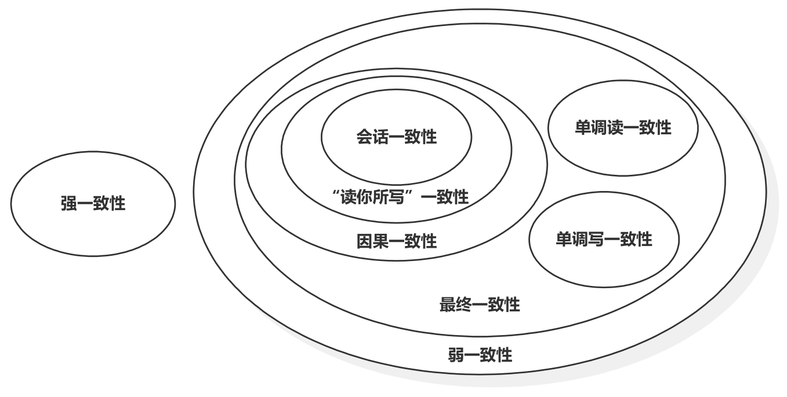
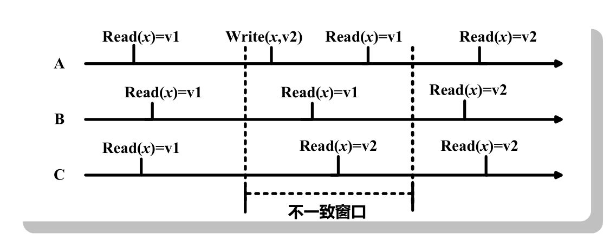
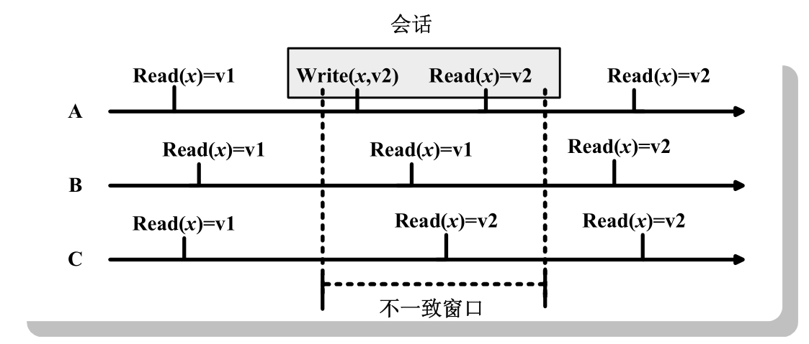
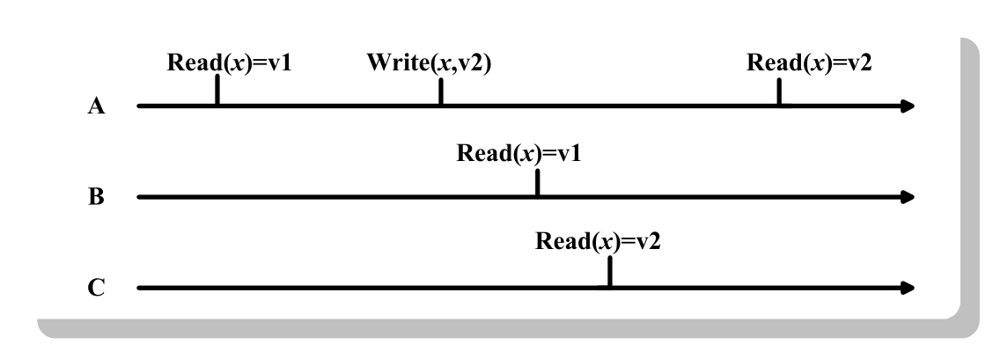

在大数据存储系统中，为了增加系统高可用性，往往会将同一数据存储多份副本，工业界的常规做法是三备份。将数据复制成多份除了增加存储系统高可用性外还可以增数据复制成多份除了增加存储系统高可用性外还可以增加读操作的并发性，但是这样也会引入数据一致性问题：因为同一数据存在多个副本，在并发的众多客户端读／写请求下，如何维护数据一致视图非常重要，即在存储系统外部使用者看起来即使是多副本数据，其表现也和单份数据一样。

从严格意义上讲，理想情况下，真正的一致性模型只有强一致性(也被称为严格一致性)，但现实生活中，多数的NoSQL系统都采用了弱一致性模型。这是多机分布情况下系统追求高可用性和高扩展性必须做出的一种妥协。


<center>
    
    <div><b>一致性关系图</b></div>
</center>

可看出，最终一致性是弱一致性的一种特殊情况，而除了强一致性外，其他类型的一致性模型都属于最终一致性模型的特例或者其变体。其中，会话一致性是“读你所写”一致性的变体，而“读你所写”一致性又是因果一致性的一个特例。


首先定义以下的场景和术语

```
A, B, C：代表3个独立的进程，这些进程会对NoSQL数据库里的数据进行读／写操作。
x：NoSQL数据库中某条数据。
v1, v2, v3：数据x的不同取值。

Write(Item，Value)：代表某进程的一次写操作，即将Item的值更新为Value。
Read(Item)=Value：代表某进程的一次读操作，即读出Item的值为Value。
Notify(p1, p2, Item, Value)：代表进程p1通知进程p2 Item的值为Value。
```

## 强一致性

## 最终一致性

最终一致性是一种弱一致性。它无法保证某个数值x做出更新后，所有后续针对x的操作能够立即看到新数值，而是需要一个时间片段，在这个时间片段之后可以保证这一点，而在这个时间片段之内，数据也许是不一致的，系统无法保证强一致性的这个时间片段被称为“不一致窗口(Inconsistency Window)。

<center>
    
    <div>最终一致性</div>
</center>


出现上述情况，往往是由于在分布式环境中，为了达到高可用，同一份数据往往会被存储在多个机器几点，不同的进程可能操作数据的不同备份，当某个进程对数据做了更新，需要一段时间来将这个新数值传递到其他的备份中，这个时间区间就是上述不一致窗口。窗口的时间长短取决于很多因素，比如备份数据的个数，网络传输延迟速度，系统负载大小等。

## 因果一致


## 读你所写一致性


## 会话一致性

“读你所写”一致性的一种现实版本变体即“会话一致性”。当进程A通过会话与数据库系统连接，在同一个会话内，可以保证其“读你所写”一致性。而在不一致窗口内，如果因为系统故障等原因导致会话终止，那么进程A仍旧可能读出x的旧值v1。

<center>
    
    <div>会话一致性</div>
</center>


## 单调读一致性

单调读一致性是最终一致性的另外一种变体。它保证如果某个进程读取到数据x
的某个版本数据v2，那么系统所有后续的读取操作都不能看到比v2更老版本的数值，比如v1。

<center>
    
    <div>单调读一致性</div>
</center>


## 单调写一致性

单调写一致性是最终一致性的一种变体。对于某个进程来说，单调写一致性可以保证其多次写操作的序列化。