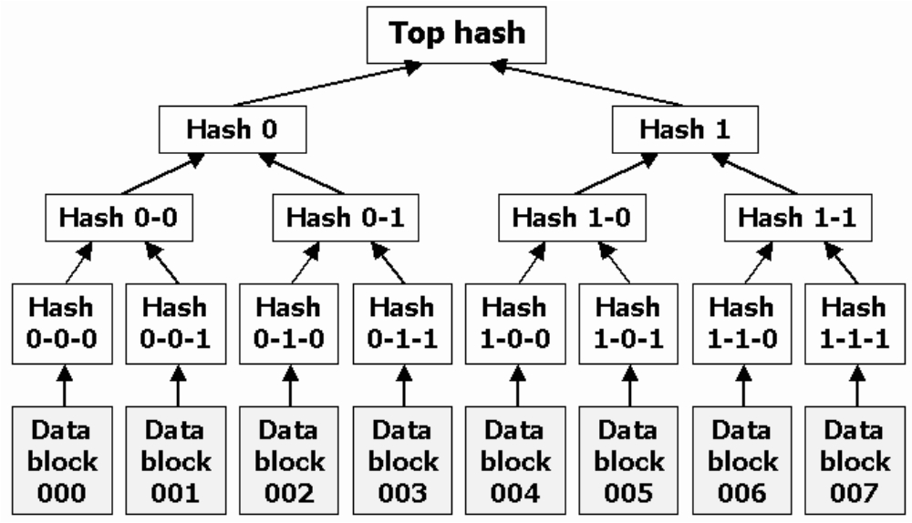

Merkle哈希树由Ralph Merkle于1979年发明，因故得此名，一般还将其称为Merkle树或者哈希树(Hash Tree)。Merkle树最初用于高效Lamport签名验证，后来被广泛应用在分布式领域，**主要用来在海量数据下快速定位少量变化的数据内容(变化原因可能是损毁、篡改或者正常变化等)**。比如在P2P下载系统BitTorrent、Git版本管理工具、比特币以及Dynamo、Riak、Cassandra等NoSQL系统中都得到了应用。

# 基本原理

    
    
Merkle树示例

子节点是每个数据项或者一批数据项（数据块）对应的哈希值，中间节点则保存对其所有子节点哈希值再次进行哈希运算后的值，依次由下往上类推，直到根节点，其保存的Top Hash代表整棵树的哈希值，也就是所有数据的整体哈希值。具体使用的时候，既可以像例子中一样是一个二叉树，也可以是多叉树。

<b>Merkle树常用于快速侦测部分数据正常或者异常的变动。当某个底层数据发生变化时，其对应Merkle树的子节点哈希值会跟着变化，子节点的父节点哈希值也随之变化，依此类推，直到根节点，其间经过的节点哈希值都发生变化，但是其他无关树节点哈希值并不发生改变。通过Merkle树，可以在$Olog(N)$时间内快速定位变化的数据内容。</b>

