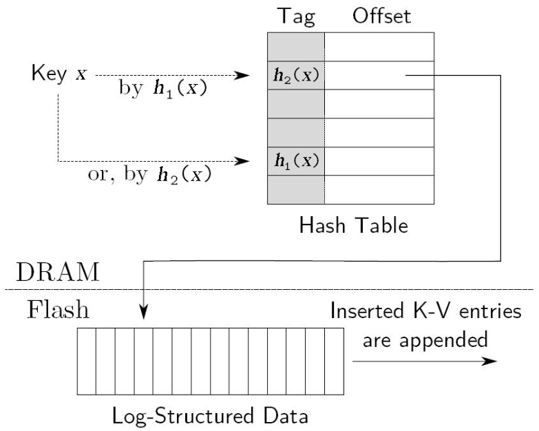

Cuckoo哈希由Rasmus Pagh和Flemming Friche Rodler于2001年提出，使用它可以有效解决哈希冲突(Hash Collisions)问题，与传统的哈希方式相比较，Cuckoo哈希省去了哈希冲突时冲突解决的过程，所以**查找效率非常高**。Cuckoo哈希具有很多优良特性，比如可以在`O(1)`时间复杂度查找和删除数据，可以在常数时间内插入数据等。其有大约50%的哈希空间利用率。

# 基本原理

传统哈希方法只使用一个哈希函数，为了较好地解决哈希冲突问题，Cuckoo哈希同时使用两个不同的哈希函数$H_1
(x)$和$H_2(x)$。当插入数据x时，同时计算$H_1
(x)$, $H_2(x)$，如果对应的哈希空间中任意一个桶(Bucket)为空，则可以将x插入相应位置；如果两者都不空，则选择一个桶，将已经占据这个位置的值y踢出去，由x来占据这个位置。对于y来说，重复上述过程，即重新计算其对应的两个哈希函数$H_1
(x)$, $H_2(x)$空桶，则将y插入新的位置，如果没有空桶，则踢出已经占据位置的z，之后反复这个过程，直到所有数值都找到空桶安置。

对于Cuckoo哈希来说，上述过程可能导致无限循环，一般做法是设定最大替换次数，当达到最大替换次数时，要么增加哈希空间中桶的数量，要么重新选择合适的哈希函数来替换之前的哈希函数。

T1和T2分别表示H1和H2存放Hash值的数组，Cuckoo哈希算法的伪码：

```C++
insert(x)
    if lookup(x) then
        return 
    i = 0;
	while i < MaxLoop do
        if T1[H1(x)] := NIL then
			T1[H1(x)] = x;
			return;
		x <-> T1[H1(x)]; // 交换值
		if T2[H2(x)] := NIL then
			T2[H2(x)] = x;
			return;
		x <-> T2[H2(x)]; // 交换值
		i = i + 1;
		end
         rehash();
	insert(x)
```

对于查找操作来说，只需要查找两个哈希函数映射到的哈希空间对应位置，要么存在要么不存在，是唯一确定的，所以可以在`O(1)`时间内完成。

Cuckoo哈希有两种常见的变体：增加哈希函数个数或者每个桶可以存储多个数值，这两种变体都是为了提高哈希空间的桶利用率。上述基础Cuckoo哈希的桶利用率为50%，当使用3个哈希函数的时候，桶利用率可以达到91%，而当每个桶可以存放两个数值的时候，桶利用率可以达到80%。


# 应用:SILT存储系统

SILT存储系统使用Cuckoo哈希的变体来作为外存数据的索引。SILT的全称是小索引大表(Small Index Large Table)，这是CMU(美国卡内基·梅隆大学)设计的高效利用内存的高性能基于Flash的KV存储系统，其在Flash存储KV数据，在内存建立数据索引，其存储效率极高，单机可以存储十亿量级的数据并提供很高的读写性能。

SILT将KV数据顺序追加到存放在Flash的Log文件末尾，为了能够定位KV数据在Log文件的位置，在内存建立哈希表来记录KV数据在Log文件的索引。在内存索引部分SILT使用了Cuckoo哈希的变体，被称为部分主键Cuckoo哈希(Partial Key Cuckoo Hashing)，为了便于描述，我们简称之为SILT哈希。

SILT哈希大体和Cuckoo哈希相同，但是有两个优化点：

1. 哈希空间的桶里不是存放KV数据的主键（Key），因为主键太长，所以SILT使用了较短的主键“标签”（Tag）来代替主键，这样可以大大减少内存空间占用量，这也是为何SILT能够单机存储十亿级别数据的关键之一。

2. 对于某个主键x来说，假设其h1(x)对应的哈希空间位置是a，h2(x)对应的哈希空间位置为b，SILT哈希在h2(x)对应位置写入b，h1(x)对应位置写入a，也就是说两个哈希函数相互将对方的哈希空间位置作为自己的标签，这是与Cuckoo哈希的第2个主要区别。

    <center>
        
    </center>

    为什么要这么做呢？这与第1个优化有关，因为第1个优化进行以后，存储的不是记录的主键而是标签，如果此时Cuckoo哈希需要替换掉某个主键y的时候，需要根据主键y重新计算哈希函数值寻找空桶，但是因为没有存储主键y而是存储的y的标签t，所以此时需要先从Flash里读出标签t对应的主键y，才能进行后续的操作，这明显效率是很低的。为了避免在Cuckoo哈希替换数据的时候读Flash操作，SILT采取上述第2个优化操作，其核心思想是：如果某个位置要被替换，可以直接从位置存储的内容获得下一个应该存储的位置，这样就省去了读Flash的过程。举例来说，如果此时h1(x)位置需要被替换掉，此时读出h1(x)位置存储的值b，位置b即为应该安排的新位置，所以读出h1(x)的内容并用其值替换掉哈希空间位置b的内容，即用内容b替换掉位置b原先的内容a。

在SILT哈希中查找某个主键x的时候，根据h1(x)对应的标签判断其值是否与h2(x)内容相等，或者根据h2(x)对应的标签判断其值是否和h1(x)位置存储内容相等，如果相等，则说明找到了对应的内容，则可以到Flash对应位置读出其Value即可。通过以上措施，SILT哈希可以高效利用内存，同时也能保证极高的读／写效率。

# 参考资料

1. 大数据日知录