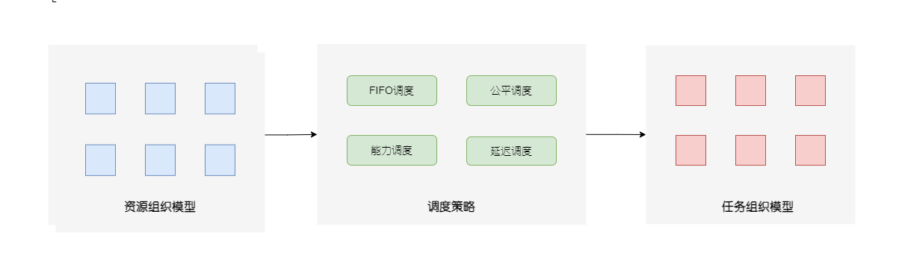
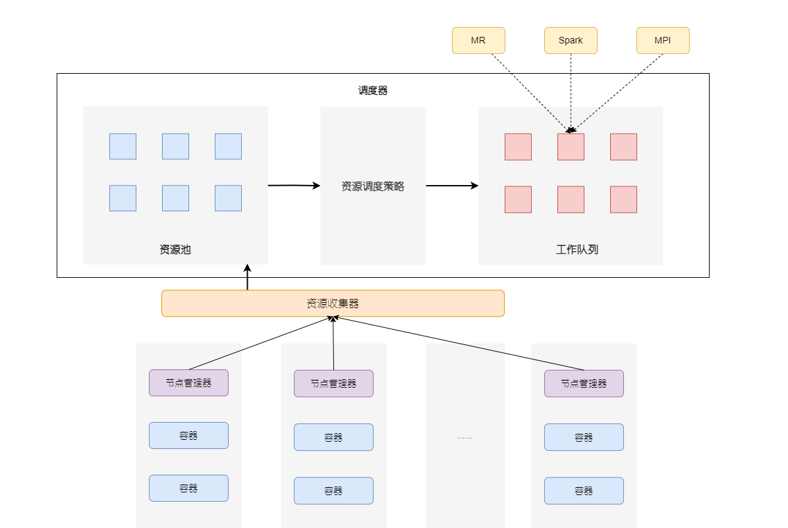
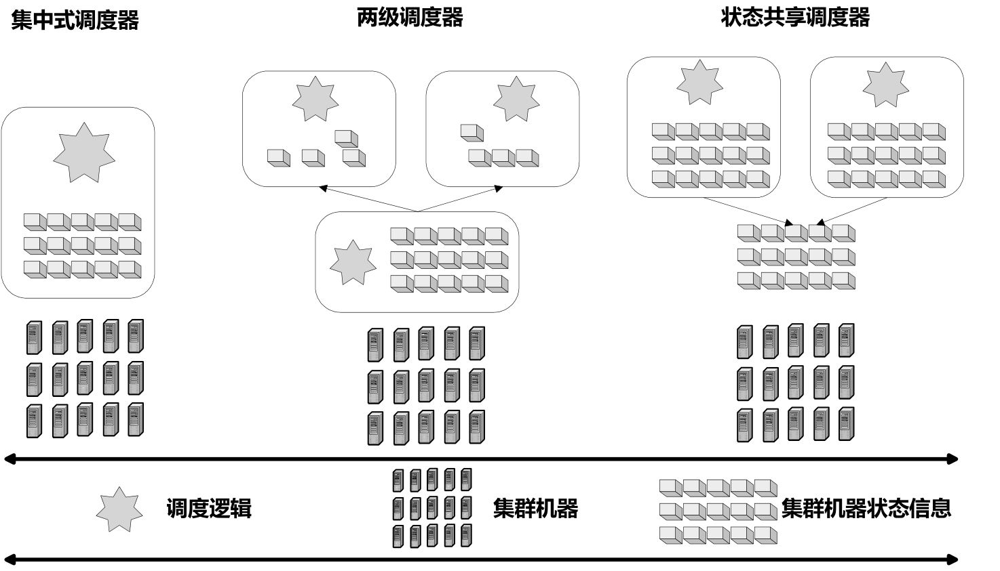

# 资源管理抽象模型

从现有的各种资源管理与调度系统中(YARN、Mesos、Corona、Quincy等)抽象出两个模型：资源管理的概念模型和通用架构。大部分资源管理系统都符合这两个抽象模型，在具体实现细节上会有所不同。


## 概念模型

从概念上讲，资源管理与调度系统的主要目的是将集群中的各种资源通过一定策略分配给用户提交到系统里的各种任务，常见的资源主要包括内存、CUP、网络资源与磁盘I/O资源4类。而这个概念模型主要强调三要素：资源组织模型、调度策略和任务组织模型。

<center>
    
    <div>抽象的资源管理调度概念模型</div>
</center>

资源组织模型的主要目标是将集群中当前可用的各种资源采用一定的方式组织起来，以方便后续的资源分配过程。一个常见的资源组织方式是将资源组织成多层级队列的方式。

调度策略负责以一定方式将资源分配给提交给系统任务，常见调度策略包括FIFO、公平调度、能力调度、延迟调度等。

任务组织模型的主要目标是将多用户提交的多任务通过一定方式组织起来，以方便后续资源分配。


## 通用架构

集群中每台机器上会配置节点管理器，其主要职责是不断地向资源收集器汇报目前本机资源使用状况，并负责容器的管理工作。当某个任务被分配到本节点执行时，节点管理器负责将其纳入某个容器执行并对该容器进行资源隔离，以避免不同容器内任务的相互干扰。

通用调度器由资源收集器和资源调度策略构成，同时管理资源池和工作队列数据结构。资源收集器不断地从集群内各个节点收集和更新资源状态信息，并将其最新状况反映到资源池中，资源池列出目前可用的系统资源。资源调度策略是具体决定如何将资源池中的可用资源分配给工作队列的方法，常见的策略包括FIFO、公平调度策略和能力调度策略等。资源调度策略模块往往是可插拔的，实际系统应用者可以根据情况设定符合业务状况的调度策略。当用户新提交作业时，其进入工作队列等候分配使其可启动的资源。

<center>
    
    <div>抽象的通用资源管理框架</div>
</center>
# 调度系统设计的基本问题

设计一个合理的资源管理与调度系统需要权衡和选择的相关因素。


## 资源异质性和工作负载异质性

异质性往往指的是组成元素构成的多元性和相互之间较大的差异性。在资源管理与调度场景下，往往有两类异质性需要考虑：资源异质性和工作负载（Workload）异质性。

资源异质性是从系统所拥有的资源角度来看，这对于大型数据中心来说很常见。比如数据中心的机器很难保证采用完全相同的配置，总会有些机器高配置，拥有大量的内存和计算以及存储资源，也会有很多低配硬件。在做资源分配的时候，必须要考虑这种硬件的资源差异性，<b>一般通过将资源分配单位细粒度划分为较小单元来解决</b>。

从任务角度来看，需要考虑工作负载异质性，这对于大型互联网公司来说很常见，因为各种服务和功能特性各异，对资源的需求差异也很大。比如对外服务强调高可用性以及资源的充分优先保障，而后台运行的批处理作业往往是由很多短任务构成的，所以需要调度决策过程要尽可能快，等等。一个好的资源管理与调度系统要充分考虑实际应用场景，这样才能在满足业务需求的前提下，充分实现集群的高资源利用率。


## 数据局部性(Data Locality)

大数据场景下的一个基本设计原则是：将计算任务推送到数据所在地进行。移动计算代码到数据所在地而非移动数据到计算任务所在地，这种设计哲学在大数据场景下非常常见的，这一般被称为“数据局部性”。

在资源管理与调度语境下，有3种类型的数据局部性：节点局部性(Node Locality)、机架局部性(Rack Locality)和全局局部性(Global Locality)。所谓节点局部性，是指可以将计算任务分配到数据所在的机器节点，这是数据局部性最优的一种情形，因为完成计算无须任何数据传输。机架局部性指的是虽然计算任务和所需数据分属两个不同的计算节点，但是这两个节点在同一个机架中，这也是效率较高的一种数据局部性，因为机架内机器节点间网络传输速度要明显高于机架间网络传输速度。其他的情况则属于全局局部性，此时需要跨机架进行网络传输，会产生较大的网络传输开销。

对于一个好的资源调度策略来说，应该尽可能保证节点局部性，即使不能保证这点也应尽可能追求机架局部性，这样才能压缩计算成本，尽快完成计算任务。当然，在以上两者都无法满足的情况下，资源调度系统也会通过网络传输将数据迁移来完成计算任务，虽然相对低效，但也远胜于资源空置。


## 抢占式和非抢占式调度

<b>在面临多用户多任务调度场景下，面对已分配资源，资源管理调度系统可以有两种不同类型的调度方式：抢占式调度与非抢占式调度。</b>

抢占式调度是指对于某个计算任务来说，如果空闲资源不足或者出现不同任务共同竞争同一资源，调度系统可以从比当前计算任务优先级低的其他任务中获取已分配资源，而被抢占资源的计算任务则需出让资源停止计算，在后续步骤中继续重新申请新资源来完成后续计算，有时甚至需要废弃已经完成的计算任务重新执行。Omega调度系统采用了抢占式调度方式。

非抢占式调度则只允许从空闲资源中进行分配，如果当前空闲资源不足，则须等待其他任务释放资源后才能继续向前推进。Mesos采用了非抢占式调度。

一般而言，对于强调高优先级任务执行效率的调度策略来说，往往会采纳抢占式调度方式，以此来保证这些任务即使在资源不足的情况下也能快速完成。而对于更强调资源分配公平性的调度策略来说，往往会采纳非抢占式调度方式。


## 资源分配的粒度

大数据场景下的计算任务往往由两层结构构成：作业级(Job)和任务级(Task)。一个作业由多个并发的任务构成，任务之间的依赖关系往往形成有向无环图(DAG)。<b><font color=orange>资源调度系统面临资源分配粒度问题。</font></b>

一种极端的情况是需要将作业的所有所需资源一次性分配完成，常被称为<b>群体分配(Gang Scheduler)或者全分或不分(All-or-Nothing)策略</b>。MPI任务就是一种典型的需要采纳群体分配策略的任务类型。

另外一种分配粒度是采取<b>增量满足式分配策略</b>b>，即对于某个作业来说，只要分配部分资源就能启动一些任务开始运行，随着空闲资源的不断出现，可以逐步增量式分配给作业其他任务以维持作业不断地向后推进，以MapReduce为代表的批处理任务一般采用增量满足式分配策略。

有一种特殊的增量满足式分配策略被称作<b>资源储备(Resource Hoarding)策略</b>。只有分配到一定量的资源作业才能启动，但是在未获得足够资源的时候，作业可以先持有目前已分配的资源，并等待其他作业释放资源,，这样从调度系统不断获取新资源并进行储备和累积，直到分配到的资源量达到最低标准后开始运行。采取“资源储备”策略的调度，在作业启动前，已分配给该作业的资源一直处于闲置状态。


## 饿死和死锁问题

如果资源管理与调度策略设计不当，会出现计算任务“饿死”以及整个资源调度系统死锁问题，一个合理的资源调度系统应该尽量避免出现这个问题。

所谓计算任务“饿死”现象，指的是这个计算任务持续长时间无法获得开始执行所需的最少资源量，导致一直处于等待执行的状态。比如，在资源紧张的情形下，有些低优先级的任务始终无法获得资源分配机会，如果不断出现新提交的高优先级任务，这些低优先级任务饿死。

死锁问题则是由于资源调度不当导致整个调度系统无法继续正常执行。比如，资源储备策略就有可能导致调度系统进入死锁状态。假设系统有两个作业A和B，且两者都采用“资源储备”策略，最小启动作业所需资源为所有资源的2/3，如果某时某刻两个作业各自被分配了所有资源的1/2，那么整个调度系统进入死锁状态。

由上述内容可见，调度系统出现死锁必然表现为某些作业处于“饿死”状态，但是有计算任务处于“饿死”情形并不一定意味着调度系统处于死锁状态。


## 资源隔离方法

相比Hadoop 1.0的Map和Reduce槽(Slot)的粗粒度资源分配方式，无论是YARN还是Mesos都采取了将各种资源（CPU、内存、网络带宽和I/O带宽）封装在容器中的细粒度资源分配方法，整个分布式资源管理系统封装了为数众多的资源容器，为了避免不同任务之间互相干扰，需要提供容器间的资源隔离方法。

目前对于资源隔离最常用的手段是Linux容器(Linux Container，LXC)，YARN和Mesos都采用了这种方式来实现资源隔离。LXC在资源管理方面依赖于Linux内核的cgroups子系统，cgroups子系统是Linux内核提供的一个基于进程组的资源管理的框架，可以为特定的进程组限定可以使用的资源。


# 资源管理和调度系统范型

目前有多种实现资源管理与调度功能的实际系统，根据其宏观运行机制，可以归纳出3种资源管理与调度系统范型：集中式调度器、两级调度器与状态共享调度器。

<center>
    
    <div>3种资源管理与调度系统范型</div>
</center>
# 集中式调度器

集中式调度器(Monolithic Scheduler)在整个系统中只运行一个全局的中央调度器实例，所有之上的框架或者计算任务的资源请求全部经由中央调度器来满足，因此，整个调度系统缺乏并发性且所有调度逻辑全部由中央调度器来实现。集中式调度器又可以细分为两种类型，一种被称为<b>单路径调度器(Single Path)</b>，另外一种被称为<b>多路径调度器(Multi Path)</b>。

<b>单路径调度器，是指不论计算任务是何种类型，都采取统一的调度策略来进行资源管理与调度</b>，单路径调度器在高性能计算系统中很常见，例如如Maui以及Moab等。这种方式的基本调度逻辑都是采用融合多种考虑因素来综合计算每个任务的优先级，然后按照任务的优先级来进行后续调度与资源分配。由此可见，<b>单路径调度器完全按顺序调度任务而无并发性。</b>

多路径调度器对单路径调度器做出了改进，可以支持多种调度策略，比如针对批处理类任务采取某种调度策略，对于在线服务类任务采取另外一种调度策略等。尽管这些调度策略都是由中央调度器来实现的，但是在具体实现时可以根据任务类型来进行不同策略的分支选择(类似于Switch-Case分支路径判断)，所以称为多路径调度器。Google在开发使用Borg调度系统之前即采用多路径调度器来进行资源的统一管理，这种调度器可以通过多线程等方式实现一定程度的并发性。


总体而言，集中式调度器由于将所有调度逻辑全部融入中央调度器，所以实现逻辑复杂，系统可扩展性差，支持不同类型的调度策略缺乏灵活性。另外，这种方式的并发性能较差，比较适合较小规模的集群系统。对于大规模集群来说整体调度性能会成为整个系统运行的瓶颈。


## 两级调度器

两级调度器(Two-Level Scheduler)将整个系统的调度工作划分为两个级别：<b>中央调度器和框架调度器</b>。<b>中央调度器可以看到集群中所有机器的可用资源并管理其状态，它可以按照一定策略将集群中的所有资源分配给各个计算框架</b>，中央调度器级别的资源调度是一种粗粒度的资源调度方式，<b>各个计算框架在接收到所需资源后，可以根据自身计算任务的特性，使用自身的调度策略来进一步细粒度地分配从中央调度器获得的各种资源</b>。在这种两级架构中，只有中央调度器能够观察到所有集群资源的状态，而每个框架并无全局资源概念，只能看到由中央调度器分配给自己的资源。Mesos、YARN和Hadoop On Demand系统是3个典型的两级调度器系统。

与集中式调度器相比，两级调度器在计算框架层面存在第二级资源调度，可以提供一种比较天然的并发性，所以整体调度性能较好，也适合大规模集群下的多任务高负载计算情形，具有较好的可扩展性，但存在中央调度器，使得这种并发是一种<b>悲观并发控制，即中央调度器在做出将某些资源分配给哪个框架的决策过程中，必须依次顺序进行，并需要对目前待决策的资源加锁以避免不同框架的资源申请冲突</b>，这种悲观并发性会影响系统的整个并发性能。


## 状态共享调度器

状态共享调度器(Shared-State Scheduler)是Google的Omega调度系统提出的一种资源管理与调度范型。在这种调度范型中，<b>每个计算框架可以看到整个集群中的所有资源，并采用相互竞争的方式去获取自己所需的资源，根据自身特性采取不同的具体资源调度策略</b>，同时系统采用<b>乐观并发控制</b>手段解决不同框架在资源竞争过程中出现的需求冲突。

状态共享调度器在以下两方面对两级调度器做出了改进，一方面乐观并发控制增加了系统的并发性能，另外一方面每个计算框架可以获得全局的资源使用状况信息。这种自由竞争资源的方式也有其相应的代价：如果系统中存在大量资源竞争冲突(即多个框架申请相同的资源)，这种乐观并发控制在做出仲裁后，竞争失败者很可能需要重新执行任务，而这会造成大量的资源浪费。


与两级调度器对照可以看出，两者的根本区别在于中央调度器功能强弱不同。两级调度器依赖中央调度器来进行第一次资源分配，而Omega则严重弱化中央调度器的功能，只是维护一份可恢复的集群资源状态信息主副本，这份数据被称作“单元状态(Cell State)。每个框架在自身内部会维护单元状态的一份私有并不断更新的副本信息，而框架对资源的需求则直接在这份副本信息上进行；只要框架具有特定的优先级，就可以在这份副本信息上申请相应的闲置资源，也可以抢夺已经分配给其他比自身优先级低的计算任务的资源；一旦框架做出资源决策，则可以改变私有“单元状态”信息并将其同步到全局的“单元状态”信息中去，这样就完成了资源申请并使得这种变化让其他框架可见。上述资源竞争过程是通过事务进行，可以保证操作的原子性。

Google的Omega采取这种类似丛林法则的自由竞争策略，是考虑到其工作环境下的工作负载异质性：Omega希望对于在线服务类应用能够优先提供各种资源保障，相对而言，后台批处理任务在资源方面即使优先级较低问题也不大。


---

由集中式调度器到两级调度器再到状态共享调度器的发展过程，是一个逐步弱化中央调度器功能，而逐渐增强框架调度器自由度的过程。虽说在系统并发性方面有逐步并显著的改善，我们应该以不同范型适合不同应用场景角度来看待三者之间的差异。<b><font color=FF4F33>集中式调度器比较适合小规模集群下的资源调度与管理，两级调度器比较适合负载同质的大规模集群应用场景，而状态共享调度器则更适合负载异质性较强且资源冲突不多的大规模集群应用场景。</font></b>

从上述不同范型调度器发展过程可以得出如下结论：大规模数据处理系统的一个趋势是在硬件层之上的统一资源管理与调度系统，这是提高集群资源利用率的根本解决之道。而这个独立的资源管理与调度系统则应该是一个中央调度器提供弱服务，而框架调度器具有较大资源分配自由度的模式，这主要是由于随着集群规模的扩大，只有这种方式才能避免中央调度器成为调度瓶颈，以增强系统整体效率和扩展性，并由框架调度器提供各自所需的调度灵活性。所以这种模式必然会成为将来新调度系统的统一设计目标。

---

# 资源调度策略

<b><font color=FF8633>在多用户多作业的环境下，如何将集群资源在它们之间进行分配需要特定的策略。</font></b>下面了解一些常见的资源调度策略。


 ## FIFO调度策略

FIFO策略是最简单的资源调度策略，提交的作业按照提交时间先后顺序或者根据优先级次序将其放入线性队列相应位置，在资源调度时按照队列先后顺序，先进先出地进行调度与资源分配。FIFO是Hadoop默认的调度策略，这种策略过于简单，在多用户场景下，新加入的作业很容易出现长时间等待调度的现象。


## 公平调度策略

公平调度策略(Fair Scheduler)是Facebook为Hadoop开发的多用户多作业调度器。将用户任务分配到多个资源池(Pool)，每个资源池设定资源分配最低保障和最高上限，管理员也可以指定资源池的优先级，优先级高的资源池会被分配更多的资源，当一个资源池资源有剩余时，可以临时将剩余资源共享给其他资源池。调度过程如下：

1. 根据每个资源池的最小资源保障量，将系统中的部分资源分配给各个资源池。
2. 根据资源池的指定优先级将剩余资源按照比例分配给各个资源池。
3. 在各个资源池中，按照作业优先级或者根据公平策略将资源分配给各个作业。

公平调度器和能力调度器都是Hadoop常用的调度策略，与能力调度器相比，公平调度器有两个明显的区别。

1. 公平调度器支持抢占式调度，即如果某个资源池长时间未能被分配到公平共享量的资源，则调度器可以杀死过多分配资源的资源池中的任务，以空出资源供这个资源池使用。
2. 公平调度器更强调作业间的公平性。在每个资源池中，公平调度器默认使用公平策略来实现资源分配，这种公平策略是最大最小公平算法(Max-min fairness)的一种具体实现（参考DRF策略），可以尽可能保证作业间资源分配公平性。


## 能力调度策略

能力调度器(Capacity Scheduler)是Yahoo为Hadoop开发的多用户调度器，适合用户量众多的应用场景，与公平调度器相比，其更<b>强调资源在用户之间而非作业之间的公平性</b>。它将用户和任务组织成多个队列，每个队列可以设定资源最低保障和使用上限，当一个队列的资源有剩余时，可以将剩余资源暂时分享给其他队列。调度器在调度时，优先将资源分配给资源使用率最低的队列(即队列已使用资源量占分配给队列的资源量比例最小的队列)；在队列内部，则按照作业优先级的先后顺序遵循FIFO策略进行调度。

<b><font color=FF8633>用户和资源队列之间的对应关系是什么？为什么将资源优先分配给使用率低的队列</font></b>


## 延迟调度策略

准确地说，延迟调度策略(Delay Scheduler)不是一个独立的调度方式，往往会作为其他调度策略的辅助措施来增加调度的数据局部性，以此来增加任务执行效率。延迟调度策略本身逻辑非常简单，但是对于增加数据局部性很有效，所以使用很广泛，在Hadoop的公平调度器和能力调度器及Mesos中都有采用。其基本调度思想如下：

对于当前被调度到要被分配资源的任务`i`，如果当前资源不满足数据局部性，那么可以暂时放弃分配公平性，任务`i`不接受当前资源，而是等待后续的资源分配；当前资源可以跳过任务i分配给其他待调度任务`j`，如果任务i在被跳过`k`次后仍然等不到满足局部性的资源，则放弃数据局部性，被迫接受当前资源来启动任务执行。


## 主资源调度策略

主资源调度策略(Dominant Resource Fair Scheduling)，简称DRF，是Mesos中央调度器采用的公平调度策略，也是最大最小公平算法的具体体现。最大最小公平算法的基本思想是：最大化目前分配到最少资源量的用户或者任务的资源量，常常用来对单个资源进行公平分配，而DRF则将其扩展到了多个资源的公平分配场景下。

对于每个用户，DRF计算分配给这个用户的所有资源的各自分享量(Share)，而一个用户的各个资源分享量中的最大值被称作主分享量(Dominant Share)，主分享量对应的资源被称为这个用户的“主资源(Dominant Resource)。不同用户可能拥有不同的主资源，比如一个用户是运行计算密集型任务，那么他的主资源是CPU；而另外一个用户运行I/O密集型计算，则其主资源为磁盘带宽。DRF旨在使得不同用户的各自主分享量最大化地保持公平。

DRF策略伪码:

```C++
// 总资源量,m是资源种类数量
R = <r1, ..., rm>
// 已消耗资源量,初始为0
C= <c1, ..., cm>
// 用户i的主分享量,n为用户个数,初始为0
si(i=1, ..., n)
// 分配给用户i的资源数量,初始为0
Ui = <ui,1, ..., ui,m> (i=1, ..., n)
    
选择最小主分享量的用户i
Di <- 用户i下一任务资源需求量
If C + Di <= R then					    // 如果资源充足
    C = C + Di						   // 更新已消费资源量
    Ui = Ui + Di					   // 更新用户i的已分配资源量
    si = max(1 ... m){uij / rj}			// 更新用户i的主分享量
Else
    Return							  // 资源不足
End if 
```


假设系统共有9个CUP和18 GB内存资源，有两个用户进行资源请求，用户A的每个任务的资源需求量为＜1CPU，4 GB>，用户B的每个任务的资源需求量为＜3CPU，1 GB>。在这个场景下，用户A的每个任务消费了1/9的总CPU量以及4/18的总内存量，而用户B的每个任务消费了3/9的总CPU量和1/18的总内存量，所以用户A的“主资源”是内存而用户B的“主资源”是CPU。经过DRF算法，可以保证“主资源”在两个用户之间的分配平衡，最终使得用户A启动3个任务而用户B启动2个任务，这样每个用户获得同样的“主分享量”，即用户A占用2/3的内存而用户B占用2/3的CPU。

用x和y分别代表DRF启动用户A和用户B的任务数量，这样用户A获得的资源总量为`＜x CPU，4x GB>`，用户B获得的资源总量为`<3y CPU，y GB>`，分配出去的CPU总数为`(x + 3y)CPU`和`4x+y) GB`内存，另外用户A和用户B的“主分享量分别为`4x/18`和`3y/9`。所以，DRF可以将资源分配问题转换为如下约束条件下的优化问题。
$$
\begin{array}{l}
max(x, y)		&&		(最大化资源分配)
\\
\\
约束条件: \\
(x + 3y) <= 9  	&&			(约束条件1：CPU约束) \\
(4x + y) <= 18  && (约束条件2：内存约束) \\
\frac{4x}{18} = \frac{3y}{9} && (约束条件3: 主分享量约束) \\
\\
求解，可得x=3和y=2
\end{array}
$$


还有若干种针对Hadoop的改进资源调度策略，包括资源感知调度策略(Resource Aware Scheduling)、动态优先级调度策略(Dynamic Priority Scheduling)、最长时间预估调度策略(Longest Approximate Time to End)以及约定截止时间调度策略(Deadline ConstrainScheduling)等。

# 参考资料

1. 大数据日知录