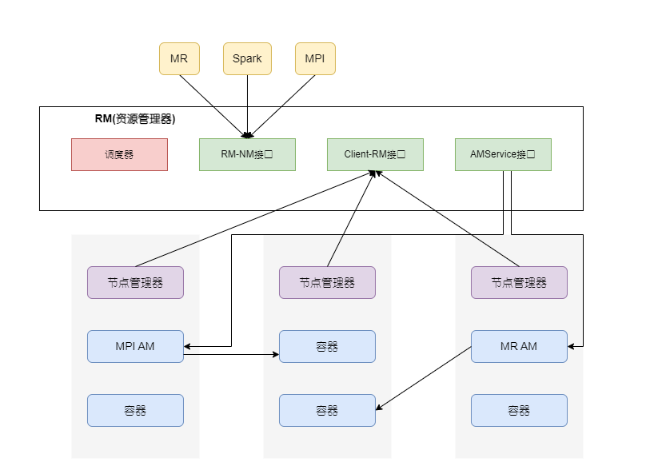
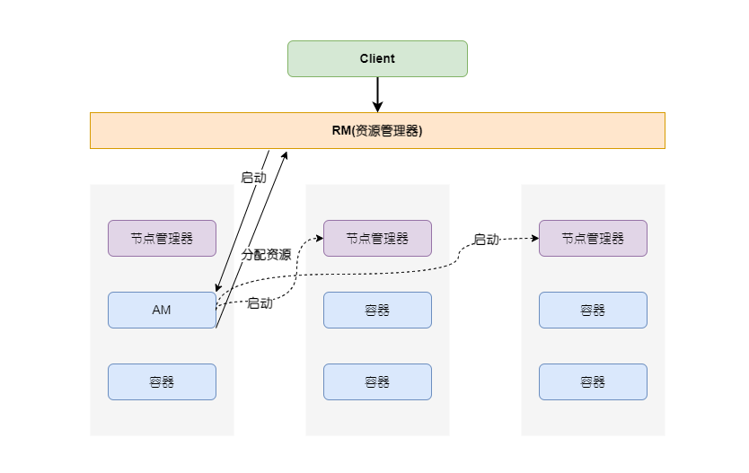

ARN是Hadoop 2.0的重要组成部分，也被称作MRV2，其全称是另一个资源协调器(Yet AnotherResource Negotiator)，是一个独立的资源管理系统。MRV2与MRV1相比，最大的改变就是抽象出YARN独立资源调度系统。

从资源管理系统范型来说，YARN同Mesos一样，是个典型的两级调度器，最主要的构件包括：唯一的资源管理器(RM)、每个作业一个的应用服务器(AM)以及每个机器一个的节点管理器(Node Manager，NM)。

    
    
Yarn整体架构

- RM，充当中央调度器功能，负责全局的资源管理工作，其内部主要功能部件包括：调度器、AM服务器(AMService/ApplicationMasters，AMS)、Client-RM接口以及RM-NM接口。
    - 调度器主要提供各种公平或者能力调度策略，支持可插拔方式，系统管理者可以制定全局的资源分配策略。YARN的中央调度器支持“抢占式调度”以及AM可以在向RM申请资源时提出明确的数据局部性条件等。
    - AMS负责系统内所有AM的最初启动，申请资源，运行状态管理。
    - Client-RM接口负责按照一定协议管理客户提交的作业
    - RM-NM接口主要和各个机器的NM通过心跳方式进行通信，以此来获知各个机器可用的容器资源以及机器是否产生故障等信息

- 每个任务的AM类似于Mesos中的二级调度器，负责向RM申请作业所需资源，也负责任务间资源分配时的数据局部性等优化调度策略，并在作业的众多任务中进行资源分配与协调。
- NM是YARN中在每台机器上都部署的节点管理器，主要负责机器内容器资源的管理，比如容器间的依赖关系、监控容器执行以及为容器提供资源隔离等各种服务等。在NM启动后向RM进行注册，之后通过心跳方式向RM汇报节点状态并执行RM发送来的命令。同时，NM也接收AM发来的命令，比如启动或者杀死某个容器内运行的任务等。

与Mesos不同，YARN的RM支持抢占式调度，当集群资源稀缺时，RM可以通过协议命令AM释放指定的资源。AM在资源请求信息内也可以明确指明数据局部性偏好，一个典型的资源请求包括如下信息：

1. 所需容器的个数，比如需要200个容器
2. 每个容器所含资源数量，比如指明`<2GB RAM，1 CPU>`。
3. 数据局部性偏好。
4. 应用内部任务的优先级信息。

Yarn任务执行流程

    

1. 用户通过客户端向YARN提交作业。
2. RM通过调度器申请资源，用于启动运行作业的AM；如果申请到，则AMS负责通知节点管理器在相应容器内启动执行AM。
3. AM负责将作业划分为若干任务，并向RM请求启动任务所需的资源；RM接收到请求后，通过调度器分配资源，找到合适的容器后，将这些资源信息返回给AM。
4. AM根据资源信息，在任务间优化资源分配策略，确定后直接与资源所在的节点管理器联系，在对应的容器中启动任务，节点管理器负责容器的资源隔离。
5. AM在部分任务执行完成后逐步向RM释放所占资源。