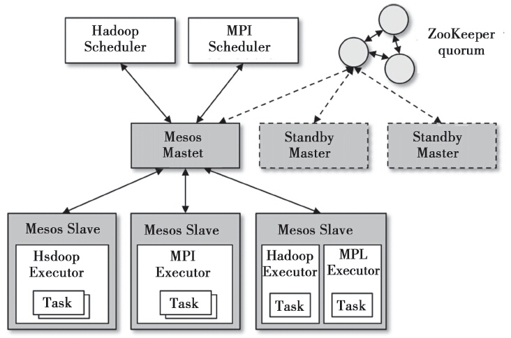

[Apache Mesos](http://mesos.apache.org)采用了Master/Slave的架构，主要由四部分组成：Mesos Master、Mesos Slave、Framework(也称为MesosApplication)和Executor，通过ZooKeeper实现了Master的高可用性。

    
    
Mesos整体架构

 
Mesos Master是整个系统的核心, 通过frameworks_manager管理接入的各个framework，通过slaves_manager管理所有的Slave，并将Slave上的资源按照某种分配策略分配给framework。

Mesos Slave需要将自己的资源情况汇报给Master(当前主要的资源主要有CPU和Memory两种)，负责接收并执行来自Mesos Master的命令，并且为运行在本节点的Task分配资源并且管理这些Task。当前Mesos也支持很多容器技术，可以很方便地做到各个计算任务的资源隔离。

Framework指的是外部的计算框架，这些计算框架通过注册接入Mesos后，由Master进行统一管理和资源分配。要接入的外部框架必须实现一个调度模块，该调度模块负责框架内部的任务调度，即外部框架在从Mesos获得了资源后，需要由这个调度模块分配给本框架中的计算任务。换句话说，Mesos系统采用了双层调度框架：
1）由Mesos将资源分配给外部框架。
2）外部框架的调度模块将资源分配给外部框架的内部计算任务。
Executor主要用于启动外部框架内部的计算任务。由于不同的框架中启动任务的接口或者方式都不相同，因此Mesos规定外部框架需要实现自己的Executor。这样Mesos就知道如何去启动不同框架下的计算任务。
Mesos的资源调度可以分为两类，即粗粒度调度和细粒度调度。
粗粒度的调度方式是每个Executor获得资源后就长期持有，直到应用程序退出才会释放资源。这种调度方式的优点就是减少了资源调度的时间开销，缺点是由于其分配的资源被长期占有，在应用程序大部分的计算任务都已经完成的情况下，会造成资源的浪费。尤其是有些计算任务出现长尾时，这个资源浪费的情况可能会变得不可接受。
而细粒度的资源调度是根据任务的实际需要动态申请的，任务完成后就会将资源还给系统，所以避免了粗粒度调度的资源浪费问题。但是由于每次任务的调度都要从系统动态申请资源，调度的时间开销较大。特别是对于那些运行时间很短但是计算任务数量又很多的应用程序来说，性能会受到较大影响。

