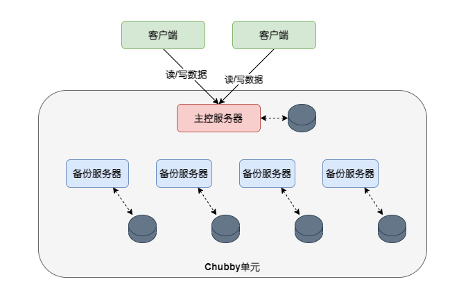

Chubby是Google公司研发的针对分布式系统协调管理的粗粒度锁服务(通过对数据加锁的方式来实现各种分布式环境下的资源协调问题)，一个Chubby实例大约可以负责1万台4核CPU机器相互之间对资源的协同管理，主要功能是让众多客户端程序进行相互之间的同步，并对系统环境或者资源达成一致认知。

Chubby是一种粗粒度锁，所谓粗粒度指的是锁的持有时间比较长，反之如果锁的持有时间较短（秒级别）则被称为细粒度锁。比如领导者选举，Chubby可能允许领导者在几小时甚至数天的时间段内一直充当该角色。粗粒度锁的好处是因为锁持有时间长，所以对锁服务器请求的负载较低，可以支持更高的并发度。

Chubby的设计哲学是强调协调系统的可靠性与高可用性及语义易于理解，而不追求处理读／写请求的高吞吐量及在协调系统内存储大量数据。Chubby的理论基础是Paxos一致性协议，并进行了一些改造，Paxos没有中心管理节点，Chubby出于系统效率考虑，增加了一些中心管理策略，在达到同一目标的情况下改善了系统效率。

# 系统架构
Chubby服务由客户端链接的库程序和多个Chubby单元构成，一般一个数据中心部署一套Chubby单元。每个Chubby单元通常包含5台服务器，通过Paxos协议选举的方式推举其中一台作为“主控服务器”，所有读／写操作都由主控服务器完成，其他4台作为备份服务器，在内存中维护和主控服务器完全一致的树形结构（即加锁对象或者数据存储对象）。

主控服务器由所有服务器选举推出，有任期,即主控服务器租约(Master Lease)，一般长达几秒；在约定的租约期限内由选举出的服务器充当主控服务器；当主控服务器任期期满后，系统会再次投票选举出新的主控服务器，如果无故障等异常情况发生，一般情况下系统还是尽量将租约交给原先的主控服务器；否则可以通过重新选举得到一个新的全局管理服务器，这样就实现了主控服务器的故障自动切换。

如果备份服务器长时间发生故障，则Chubby会自动将另外一台机器加入系统并运行相关程序，由其来接任发生故障机器所应承担的角色，同时更新系统的DNS信息，将新机器的地址替换故障机地址；主控服务器会周期性地查询DNS信息，这样很快会发现某个备份服务器发生了变化，其会通过一致性协议将这一变化通知其他备份服务器。新加入的备份服务器可以根据保存在外存及其他备份服务器的信息获取自己需要维护的内存数据。

客户端通过嵌入的库程序，利用RPC通信来和服务器进行交互，对Chubby的读／写请求都由主控服务器来负责。主控服务器接受到数据更新请求后，会更改在内存中维护的管理数据，通过改造的Paxos协议通知其他备份服务器对相应的数据进行更新操作并保证在多副本环境下的数据一致性。当多数备份服务器确认更新完成后，主控服务器可以认为本次更新操作正确完成。其他所有备份服务器只是同步管理数据到本地，保持数据和主控服务器完全一致。

当备份机器接收到读／写请求时，会通过告知客户端主控服务器地址的方式将请求转发给主控服务器。

# 数据模型
从客户端程序来看，Chubby类似于文件系统的目录和文件管理系统，并在此基础上提供针对目录和文件的锁服务。Chubby的文件主要存储一些管理信息或者基础数据，为了抑制客户端大量写入数据，Chubby要求对文件内容一次性地全部读完或者写入，因为Chubby的目的不是数据存储，而是对资源的同步管理，所以不推荐在文件中保存大量数据。同时，Chubby还提供了文件内容或者目录更改后的通知机制，客户端可以订阅某个文件或目录，当文件内容和子目录发生变化或者一些系统环境发生变化时，Chubby会主动通知这些订阅该文件或目录的客户端，以使得这种信息变化得以及时传播。

# 会话与KeepAlive机制

会话(Session)指客户端和主控服务器之间建立的联系通道，而会话的维持是由周期性进行握手的KeepAlive机制保证的，即通过两者之间不断的KeepAlive通信来延续会话。客户端初次和服务器建立联系时形成会话，当客户端主动关闭或者因为故障被动放弃时会话结束。每次会话也有相应的租约，在租约时间段内服务器保证不会单方面将会话终止。

Chubby的会话机制工作如下：客户端向主控服务器发出KeepAlive消息(一个RPC调用)，服务器在接收到KeepAlive消息后，阻塞这个RPC调用，直到客户端原先的租约接近过期为止。此时，服务器解除RPC阻塞，KeepAlive调用返回，同时服务器通知客户端说你拥有一个新的租约；客户端在接收到返回信息后立即再次向服务器发出KeepAlive消息，如此循环往复，就形成了靠KeepAlive消息，客户端不断拥有新租约来延续两者之间会话的机制。

# 客户端缓存

为了减少客户端和服务器之间的通信量，Chubby允许客户端在本地缓存部分服务器数据，而由Chubby来保证缓存数据和服务器端数据完全一致。大多数情况下，客户端所需数据从本地缓存即可读出，这样大大减轻了客户端对服务器的通信压力。

为了保持数据一致性，主控服务器维护一个缓存表，记录了哪个客户端缓存了什么数据信息；当主控服务器接收到某项数据的修改请求时，首先阻塞这个修改数据请求，并查询该缓存表，通知所有缓存该数据的客户端该数据从此无效；客户端在接收到通知后向服务器确认收到该通知，当主控服务器接收到所有相关客户端的确认信息后继续执行数据修改请求操作。