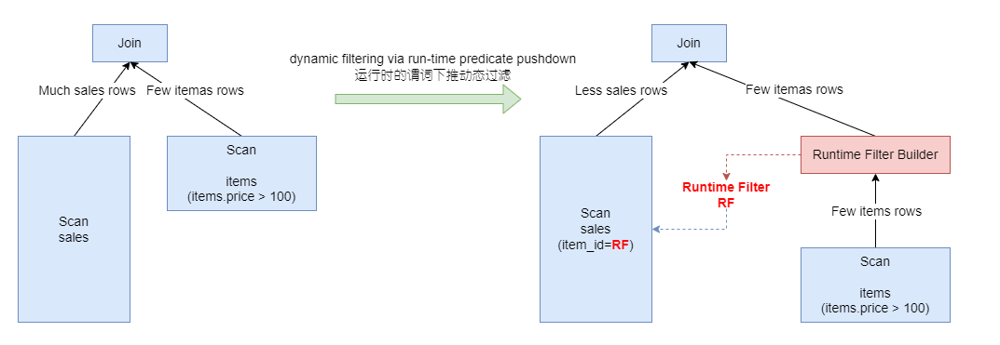

Runtime Filter是一种在数据库中广泛使用的一种优化技术，其基本原理是通过在join的probe端提前过滤掉不会命中join的输入数据来大幅减少join中的数据传输和计算，从而减少整体的执行时间。例如下面的SQL语句，其中`sales`是一个事实表，` items`是一个纬度表

```sql
SELECT *
	FROM sales JOIN items 
	ON sales.item_id = items.id
	WHERE items.price > 100
```

<center>
    
</center>


# TrinoDB的RF实现

Tirino采用运行时谓词下推的动态过滤，可以很明显地优化高选择率的Inner Join

# PolarDB的RF实现

# 参考资料

- [TrinoDB Blog:Dynamic filtering for highly-selective join optimization](https://trino.io/blog/2019/06/30/dynamic-filtering.html)
- [知乎PolarDB_X实现原理:查询性能优化之 Runtime Filter](https://zhuanlan.zhihu.com/p/354754979)

