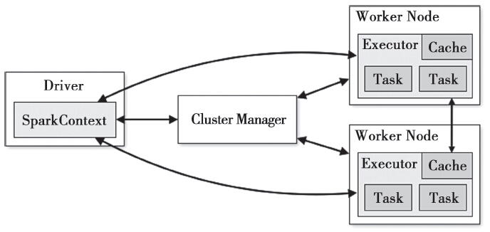

    
    
Spark整体架构图

Driver是用户编写的数据处理逻辑，这个逻辑中包含用户创建的SparkContext。SparkContext是用户逻辑与Spark集群主要的交互接口，它会和Cluster Manager交互，包括向它申请计算资源等。Cluster Manager负责集群的资源管理和调度，现在支持Standalone、Apache Mesos和Hadoop的YARN。Worker Node是集群中可以执行计算任务的节点,负责启动Executor。Executor是在一个Worker Node上为应用程序启动的进程，该进程负责运行任务，并将数据存在内存或者磁盘上。Task是被送到某个Executor上的计算单元。每个应用都有各自独立的Executor，计算最终在计算节点的Executor中执行。

# 术语

Executor是在Worker节点上为应用程序启动的进程，负责运行任务。每个Executor都在其自己的Java进程中运行Executor在应用程序的整个生命周期内都存在，它们可以并行处理多个任务。

Worker是Spark集群中的节点，它们负责启动Executor。Worker节点可以有一个或多个Executor

Task是Spark作业执行的最小单位。每个Executor都有多个Task，一个Task是一个线程，对应了一个任务。在基于RDD计算时，Task的数量其实就是RDD的分区数，RDD的分区数目决定了总的Task数量。每个Task执行的结果就是生成了目标RDD的一个partition。

Cores(Slots)：在Spark中，Cores(或Slots)是每个Executor(也可能是Spark守护进程)可用的线程数。Slots表示可用于为Spark执行并行工作的线程[。Spark文档经常将这些线程称为Cores，实际上Cores和机器上的物理核心没有关系。在[stackoverflow:Spark local mode: How to query the number of executor slots?](https://stackoverflow.com/questions/49324721/spark-local-mode-how-to-query-the-number-of-executor-slots)中给出了这两个术语的渊源：

> "Slots" is a term Databricks uses (or used?) for the **threads available** to do parallel work for Spark. The Spark documentation and Spark UI **calls the same concept "cores"**, even though they are unrelated to physical CPU cores.
>
> 
>
> 翻译一下的意思是说：
>
> Slots是Databricks使用(或曾用)的术语，用来表示在Spark上并行运行可用的线程数。Spark文档和UI将这个该概念称为Cores，实际上它和机器的物理CPU核心无关。

# 参考资料

1. [Datacadamia:Spark-Core(Slot)](https://datacadamia.com/db/spark/cluster/core)

