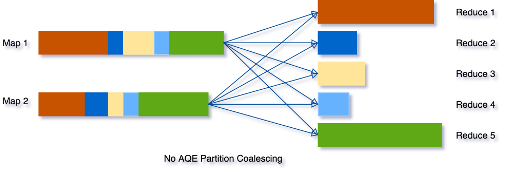
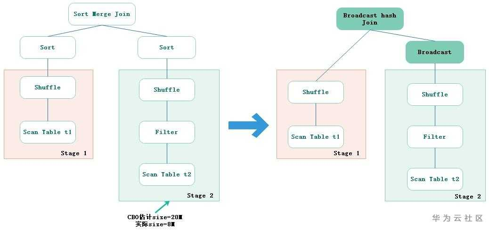
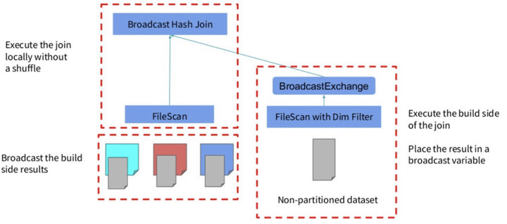

# 动态合并Shuffle分区

<table><tr>
<td bgcolor=white>
</td>
</tr></table>

<table><tr>
<td bgcolor=white>
</td>
</tr></table>

# 动态切换Join策略

    

# 动态优化join数据倾斜

<table><tr>
<td bgcolor=white>

</td>
</tr></table>

要启用上面的功能需要用到下面三个参数：

- `spark.sql.adaptive.skewJoin.enabled`：是否启用倾斜 Join 处理
- `spark.sql.adaptive.skewJoin.skewedPartitionFactor`：如果一个分区的大小大于这个数乘以分区大小的中值（median partition size），并且也大于`spark.sql.adaptive.skewedPartitionThresholdInBytes`这个属性值，那么就认为这个分区是倾斜的。
- `spark.sql.adaptive.skewedPartitionThresholdInBytes`：判断分区是否倾斜的阈值，默认为 256MB，这个参数的值应该要设置的比`spark.sql.adaptive.advisoryPartitionSizeInBytes`大。

# 动态分区裁剪
动态分区裁剪(Dynamic Partition Pruning)简称DPP，

    

# 参考资料
1. [知乎-Apache Spark 3.0 是如何提高 SQL 工作负载的性能](https://zhuanlan.zhihu.com/p/520023073)
2. [Spark3.0主要特性（1）—— Adaptive Query Execution](https://bbs.huaweicloud.com/blogs/195395)
3. [Adaptive Query Execution: Speeding Up Spark SQL at Runtime](https://www.databricks.com/blog/2020/05/29/adaptive-query-execution-speeding-up-spark-sql-at-runtime.html)