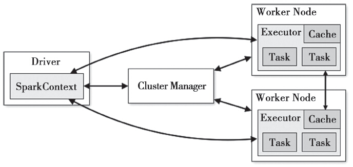

大多数现有的集群计算系统都是基于非循环的数据流模型。即从稳定的物理存储(如分布式文件系统)中加载记录，记录被传入由一组确定性操作构成的DAG(Directed Acyclic Graph，有向无环图)，然后写回稳定存储。DAG数据流图能够在运行时自动实现任务调度和故障恢复。非循环数据流是一种很强大的抽象方法，但仍然有些应用无法使用这种方式描述。这类应用包括：机器学习和图应用中常用的迭代算法(每一步对数据执行相似的函数)；交互式数据挖掘工具(用户反复查询一个数据子集)。基于数据流的框架并不明确支持工作集，所以需要将数据输出到磁盘，然后在每次查询时重新加载，这会带来较大的开销。

针对上述问题，Spark实现了一种分布式的内存抽象，称为弹性分布式数据集
(ResilientDistributed Dataset，RDD)。它支持基于工作集的应用，同时具有数据流模型的特点：自动容错、位置感知性调度和可伸缩性。RDD允许用户在执行多个查询时显式地将工作集缓存在内存中，后续的查询能够重用工作集，这极大地提升了查询速度。

# 架构

    
    
Spark整体架构图

Driver是用户编写的数据处理逻辑，这个逻辑中包含用户创建的SparkContext。SparkContext是用户逻辑与Spark集群主要的交互接口，它会和Cluster Manager交互，包括向它申请计算资源等。Cluster Manager负责集群的资源管理和调度，现在支持Standalone、Apache Mesos和YARN。Worker是Spark集群中可以执行计算任务的节点，负责启动Executor，Worker节点可以有一个或多个Executor。Executor是在Worker节点上为某应用启动的进程，负责运行任务，并将数据存在内存或者磁盘上。Task是Spark作业执行的最小单位。每个Executor都有多个Task，一个Task是一个线程，对应了一个任务。在基于RDD计算时，Task的数量其实就是RDD的分区数，RDD的分区数目决定了总的Task数量。每个Task执行的结果就是生成了目标RDD的一个partition。

  
用户程序从最开始的提交到最终的计算执行，需要经历以下几个阶段：

1. 用户程序创建SparkContext时，新创建的SparkContext实例会连接到Cluster Manager。Cluster Manager会根据用户提交时设置的CPU和内存等信息为本次提交分配计算资源，启动Executor。
2. Driver会将用户程序划分为不同的执行阶段，每个执行阶段由一组完全相同的Task组成，这些Task分别作用于待处理数据的不同分区。在阶段划分完成和Task创建后，Driver会向Executor发送Task。
3. Executor在接收到Task后，会下载Task的运行时依赖，在准备好Task的执行环境后，会开始执行Task，并且将Task的运行状态汇报给Driver。
4. Driver会根据收到的Task的运行状态来处理不同的状态更新。Task分为两种：一种是Shuffle Map Task，它实现数据的重新洗牌，洗牌的结果保存到Executor所在节点的文件系统中；另外一种是Result Task，它负责生成结果数据。
5. Driver会不断地调用Task，将Task发送到Executor执行，在所有的Task都正确执行或者超过执行次数的限制仍然没有执行成功时停止。

# 参考资料
1. 《Spark技术内幕：深入解析Spark内核架构设计与实现原理》