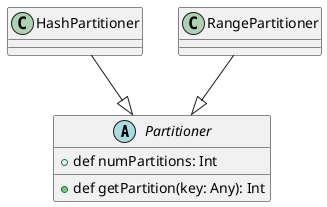
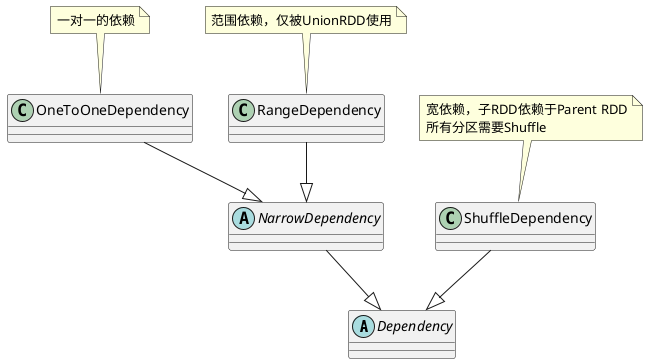
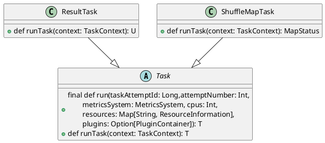
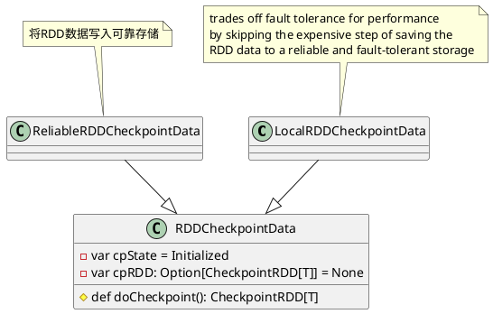
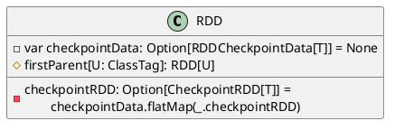
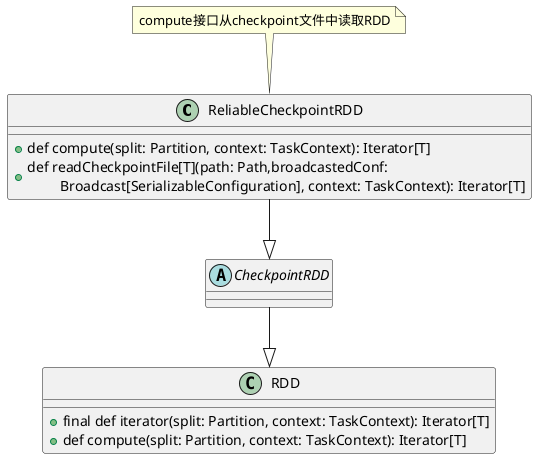

```scala
abstract class RDD[T: ClassTag](
    @transient private var _sc: SparkContext,
    @transient private var deps: Seq[Dependency[_]]
  ) extends Serializable with Logging {
    // 计算分区的函数
    def compute(split: Partition, context: TaskContext) : Iterator[T]
    // 一组分片
    protected def getPartitions: Array[Partition]
    // RDD间依赖关系
    protected def getDependencies: Seq[Dependency[_]] = deps
    // 每个分区的优先位置
    protected def getPreferredLocations(split: Partition): Seq[String] = Nil
    // RDD分片函数
    @transient val partitioner: Option[Partitioner] = None

    // 标记一个要被持久化的RDD, 一旦首次被触发
    // 该RDD将会被保留在计算节点的内存中并重用
    // cache()是使用persist()的快捷方法
    def persist(): this.type = persist(StorageLevel.MEMORY_ONLY)
    def cache(): this.type = persist()

    // 标记RDD不需要持久化,将其从内存或磁盘中移除
    def unpersist(blocking: Boolean = false)
  
    // 指定RDD需要检查点机制
    def checkpoint()
}
```
# 属性表示

## 分片函数(Partitioner)
`org.apache.spark.Partitioner`表示RDD的分片函数，在其之上派生出`HashPartitioner`和`RangePartitioner`。只有对于key-value的RDD，才会有Partitioner，非key-value的RDD的`Parititioner`是`None`。

```scala
abstract class Partitioner extends Serializable {
  def numPartitions: Int
  // key is from 0 to numPartitions - 1
  def getPartition(key: Any): Int
}
```

类图：

## 分片
RDD由一组分片(Partition)组成，即数据集的基本组成单位。Spark中RDD的计算是以分片为单位的，每个RDD都会实现`compute`函数以达到计算每个分片的目的。
```scala
trait Partition extends Serializable {
  def index: Int
  override def hashCode(): Int = index
  override def equals(other: Any): Boolean = super.equals(other)
}
```

## 依赖(Depencency)

RDD和它依赖的parent RDD(s)的关系有两种不同的类型，即窄依赖(narrow dependency)和宽依赖(wide dependency)。
1. 窄依赖指的是每一个parent RDD的Partition最多被子RDD的一个Partition使用
2. 宽依赖指的是多个子RDD的Partition会依赖同一个parent RDD的Partition



`Dependency`是依赖表达的基类，在其上派生出`NarrowDependency`表达窄依赖和`ShuffleDependency`表示宽依赖。
```scala
abstract class Dependency[T] extends Serializable {
  // 依赖的Parent的RDD
  def rdd: RDD[T]
}
```

```scala
// 窄依赖
abstract class NarrowDependency[T](_rdd: RDD[T]) extends Dependency[T] {
  def getParents(partitionId: Int): Seq[Int]

  override def rdd: RDD[T] = _rdd
}
```

有两种窄依赖的具体实现，一种是一对一的依赖，即`OneToOneDependency`和范围的依赖，即`RangeDependency`，它仅仅被`org.apache.spark.rdd.UnionRDD`使用。UnionRDD是把多个RDD合成一个RDD，这些RDD是被拼接而成，即每个parent RDD的Partition的相对顺序不会变，只不过每个parent RDD在UnionRDD中的Partition的起始位置不同.

```scala
class OneToOneDependency[T](rdd: RDD[T]) extends NarrowDependency[T](rdd) {
  override def getParents(partitionId: Int): List[Int] = List(partitionId)
}

class RangeDependency[T](rdd: RDD[T], inStart: Int, outStart: Int, length: Int)
  extends NarrowDependency[T](rdd) {
  override def getParents(partitionId: Int): List[Int] = {
    if (partitionId >= outStart && partitionId < outStart + length) {
      List(partitionId - outStart + inStart)
    } else {
      Nil
    }
  }
}
```

宽依赖的实现只有一种：ShuffleDependency。子RDD依赖于parent RDD的所有Partition，需要Shuffle过程
```scala
class ShuffleDependency[K: ClassTag, V: ClassTag, C: ClassTag](
    @transient private val _rdd: RDD[_ <: Product2[K, V]],
    val partitioner: Partitioner,
    val serializer: Serializer = SparkEnv.get.serializer,
    val keyOrdering: Option[Ordering[K]] = None,
    val aggregator: Option[Aggregator[K, V, C]] = None,
    val mapSideCombine: Boolean = false,
    val shuffleWriterProcessor: ShuffleWriteProcessor = new ShuffleWriteProcessor)
  extends Dependency[Product2[K, V]] with Logging {
            ......
  // 获取新的shuffle id
  val shuffleId: Int = _rdd.context.newShuffleId()

  // 向ShuffleManager注册Shuffle的信息
  val shuffleHandle: ShuffleHandle =
    _rdd.context.env.shuffleManager.registerShuffle(shuffleId, this)
    
        ......
}
```
宽依赖支持两种Shuffle Manager，即`org.apache.spark.shuffle.hash.HashShuffleManager`(基于Hash的Shuffle机制)和`org.apache.spark.shuffle.sort.SortShuffleManager`(基于排序的Shuffle机制）

# RDD计算
原始的RDD经过一系列转换后，会在最后一个RDD上触发一个动作，这个动作会生成一个Job。在Job被划分为一批计算任务(Task)后，这批Task会被提交到集群上的计算节点去计算。计算节点执行计算逻辑的部分称为Executor。Executor在准备好Task的运行时环境后，会通过调用`org.apache.spark.scheduler.Task#run`来执行计算。Spark的Task分为两种：
1. `org.apache.spark.scheduler.ShuffleMapTask`
2. `org.apache.spark.scheduler.ResultTask`



```scala
private[spark] class ResultTask[T, U](......)
  extends Task[U](......) with Serializable {

  override def runTask(context: TaskContext): U = {
            .....
    func(context, rdd.iterator(partition, context))
  }
```

```scala
private[spark] class ShuffleMapTask(......)
  extends Task[MapStatus](......) with Logging {

  override def runTask(context: TaskContext): MapStatus = {
      .....
    dep.shuffleWriterProcessor.write(
        rdd.iterator(partition, context),
        dep, mapId, partitionId,context)
  }
```

简单来说，DAG的最后一个阶段会为每个结果的Partition生成一个ResultTask，其余所有的阶段都会生成ShuffleMapTask。生成的Task会被发送到已经启动的Executor上，由Executor来完成计算任务的执行，执行过程的实现在`org.apache.spark.executor.Executor.TaskRunner#run`。

RDD的`iterator`
```scala
  final def iterator(split: Partition, context: TaskContext): Iterator[T] = {
    if (storageLevel != StorageLevel.NONE) {
      getOrCompute(split, context)
    } else {
      computeOrReadCheckpoint(split, context)
    }
  }
```

org.apache.spark.scheduler.Task#run会调用ShuffleMapTask或者ResultTask的runTask；runTask会调用RDD的org.apache.spark.rdd.RDD#iterator。

```scala
private[spark] abstract class Task[T](......)
    extends Serializable {
  final def run(......) {
          .....
    context = if (isBarrier) {
      new BarrierTaskContext(taskContext)
    } else {
      taskContext
    }
  
    // 该过程中调用ResultTask或ShuffleMapTask的runTask
    context.runTaskWithListeners(this)
            ......
  }
```

## 缓存处理
如果存储级别不是NONE，那么先检查是否有缓存；没有缓存则要进行计算。什么是存储级别？从用户的角度来看就是缓存保存到不同的存储位置，比如内存、硬盘、Tachyon；还有缓存的数据是否需要序列化等。

cacheManager对Storage模块进行了封装，使得RDD可以更加简单地从Storage模块读取或者写入数据。RDD的每个Partition对应Storage模块的一个Block，只不过Block是Partition经过处理后的数据。在系统实现的层面上，可以认为Partition和Block是一一对应的。cacheManager会通过getOrCompute来判断当前的RDD是否需要进行计算。
```scala
private[spark] def getOrCompute(partition: Partition, context: TaskContext): Iterator[T] = {
  // 获取RDD的BlockId
  val blockId = RDDBlockId(id, partition.index)
  var readCachedBlock = true
  SparkEnv.get.blockManager.getOrElseUpdateRDDBlock(
    context.taskAttemptId(), blockId, storageLevel, elementClassTag, () => {
      readCachedBlock = false
      // 如果有checkpoint, 那么读取checkpoint的数据
      // 否则调用rdd的compute()计算
      computeOrReadCheckpoint(partition, context)
    }
  ) match {
    // Block hit
    case Left(blockResult) =>
      if (readCachedBlock) {
        // 更新统计信息，将缓存作为结果返回
        val existingMetrics = context.taskMetrics().inputMetrics
        existingMetrics.incBytesRead(blockResult.bytes)
        new InterruptibleIterator[T](context, blockResult.data.asInstanceOf[Iterator[T]]) {
          override def next(): T = {
            existingMetrics.incRecordsRead(1)
            delegate.next()
          }
        }
      } else {
        new InterruptibleIterator(context, blockResult.data.asInstanceOf[Iterator[T]])
      }
    // Need to compute the block
    case Right(iter) =>
      new InterruptibleIterator(context, iter)
  }
}
```
`BlockManager`的`getOrElseUpdateRDDBlock`的实现：
```scala
  // BlockManager
  def getOrElseUpdateRDDBlock[T](taskId: Long, blockId: RDDBlockId,
      level: StorageLevel, classTag: ClassTag[T],
      makeIterator: () => Iterator[T]): Either[BlockResult, Iterator[T]] = {
    val isCacheVisible = isRDDBlockVisible(blockId)
    val res = getOrElseUpdate(blockId, level, classTag, makeIterator, isCacheVisible)
    if (res.isLeft && !isCacheVisible) {
      // Block exists but not visible, report taskId -> blockId info to master.
      master.updateRDDBlockTaskInfo(blockId, taskId)
    }
    res
  }

  private def getOrElseUpdate[T](
      blockId: BlockId,
      level: StorageLevel,
      classTag: ClassTag[T],
      makeIterator: () => Iterator[T],
      isCacheVisible: Boolean): Either[BlockResult, Iterator[T]] = {
    var computed: Boolean = false
    val iterator = () => {
      computed = true
      makeIterator()
    }
    if (isCacheVisible) {
      // Attempt to read the block from local or remote storage.
      get[T](blockId)(classTag) match {
        case Some(block) =>
          return Left(block)
        case _ =>
          // Need to compute the block.
      }
    }

  doPutIterator(blockId, iterator, level, classTag, keepReadLock = true) match {
    case None =>
      if (!isCacheVisible && !computed) {
        Utils.getIteratorSize(makeIterator())
      }
      val blockResult = getLocalValues(blockId).getOrElse {
        releaseLock(blockId)
        throw SparkCoreErrors.failToGetBlockWithLockError(blockId)
      }
      releaseLock(blockId)
      Left(blockResult)
    case Some(iter) =>
      Right(iter)
  }
}

```

## checkpoint处理
在缓存没有命中的情况下，首先会判断是否保存了RDD的checkpoint，如果有，则读取checkpoint。

为了理解checkpoint的RDD是如何读取计算结果的，需要先看一下checkpoint的数据是如何写入的。
在Job结束后，会判断是否需要checkpoint。如果需要，就调用`org.apache.spark.rdd.RDDCheckpointData#doCheckpoint`。那么了解一下`RDDCheckpointData::checkpoint`的接口实现：


```scala
// Materialize this RDD and persist its content.
final def checkpoint(): Unit = {
  RDDCheckpointData.synchronized {
    if (cpState == Initialized) {
      cpState = CheckpointingInProgress
    } else {
      return
    }
  }

  // 执行checkpoint
  val newRDD = doCheckpoint()

  // 保存结果, 清除原始RDD的依赖,Partition信息等
  RDDCheckpointData.synchronized {
    cpRDD = Some(newRDD)    // RDDCheckpointData对应的CheckpointRDD
    cpState = Checkpointed  // 标记checkpoint的状态为完成
    rdd.markCheckpointed()  // 清除原始RDD的依赖,Partition
  }
}
```

```scala
// ReliableRDDCheckpointData将checkpoint数据写入对应路径
protected override def doCheckpoint(): CheckpointRDD[T] = {
  val newRDD = ReliableCheckpointRDD.writeRDDToCheckpointDirectory(rdd, cpDir)
  newRDD
}
```
接下来，看下`ReliableCheckpointRDD::writeRDDToCheckpointDirectory`将RDD数据写入对应路径的实现(忽略一些异常处理)：
```scala
// ReliableCheckpointRDD
def writeRDDToCheckpointDirectory[T: ClassTag](
    originalRDD: RDD[T], checkpointDir: String,
    blockSize: Int = -1): ReliableCheckpointRDD[T] = {
  val sc = originalRDD.sparkContext

  // 创建保存checkpoint数据的路径
  val checkpointDirPath = new Path(checkpointDir)
  val fs = checkpointDirPath.getFileSystem(sc.hadoopConfiguration)
              ......

  // 创建广播变量
  val broadcastedConf = sc.broadcast(
    new SerializableConfiguration(sc.hadoopConfiguration))

  // 开始一个新的Job进行计算，计算结果存入路径path中
  sc.runJob(originalRDD,writePartitionToCheckpointFile[T](
    checkpointDirPath.toString, broadcastedConf) _)

  if (originalRDD.partitioner.nonEmpty) {
    writePartitionerToCheckpointDir(sc,
        soriginalRDD.partitioner.get, checkpointDirPath)
  }

  // 根据结果的路径path来创建CheckpointRDD
  val newRDD = new ReliableCheckpointRDD[T](
    sc, checkpointDirPath.toString, originalRDD.partitioner)
          ......
  newRDD
}
```
至此，RDD的checkpoint完成，其中checkpoint的数据可以通过checkpointRDD的readFromFile读取。上述逻辑在清除了RDD的依赖后，并没有和checkpointRDD建立联系，那么Spark是如何确定一个RDD是否被checkpoint了，而且正确读取checkpoint的数据呢？`org.apache.spark.rdd.RDD#dependencies`会首先判断当前的RDD是否已经Checkpoint过，如果有，那么RDD的依赖就变成了对应的CheckpointRDD：


```scala
// RDD的dependencies实现
final def dependencies: Seq[Dependency[_]] = {
  checkpointRDD.map(r => List(new OneToOneDependency(r))).getOrElse {
    if (dependencies_ == null) {
      stateLock.synchronized {
        if (dependencies_ == null) { // 没有checkpoint
          dependencies_ = getDependencies
        }
      }
    }
    dependencies_
  }
}
```

`RDD::computeOrReadCheckpoint的`一共在两个地方被调用，`org.apache.spark.rdd.RDD#iterator`和`org.apache.spark.CacheManager#getOrCompute`。它会首先检查当前RDD是否被Checkpoint过，如果有，读取Checkpoint的数据；否则开始计算


```scala
// RDD
private[spark] def computeOrReadCheckpoint(split: Partition,
    context: TaskContext): Iterator[T] = {
  if (isCheckpointedAndMaterialized) {
    // 调用对应CheckpointRDD的iterator
    firstParent[T].iterator(split, context)
  } else {
    compute(split, context)
  }
}

final def iterator(split: Partition, context: TaskContext): Iterator[T] = {
  if (storageLevel != StorageLevel.NONE) {
    getOrCompute(split, context)
  } else {
    computeOrReadCheckpoint(split, context)
  }
}
```

```scala
// ReliableCheckpointRDD
override def compute(split: Partition, context: TaskContext): Iterator[T] = {
  val file = new Path(checkpointPath,
      ReliableCheckpointRDD.checkpointFileName(split.index))
  ReliableCheckpointRDD.readCheckpointFile(file, broadcastedConf, context)
}
```

## 计算逻辑
RDD的计算逻辑在`org.apache.spark.rdd.RDD#compute`中实现。每个特定的RDD都会实现compute。比如前面提到的`CheckpointRDD`的`compute`就是直接读取checkpoint数据。HadoopRDD就是读取指定Partition的数据。MapPartitionsRDD就是将用户的转换逻辑作用到指定的Partition上。

## 容错机制
RDD实现了基于Lineage的容错机制。RDD的转换关系，构成了computechain，可以把这个compute chain认为是RDD之间演化的Lineage。在部分计算结果丢失时，只需要根据这个Lineage重算即可。内部实现上，DAG被Spark划分为不同的Stage，Stage之间的依赖关系可以认为就是Lineage。

提到Lineage的容错机制，不得不提Tachyon。Tachyon包含两个维度的容错，一个是Tachyon集群的元数据的容错，它采用了类似于HDFS的Name Node的元数据容错机制，即将元数据保存到一个Image文件，并且保存了元数据变化的编辑日志(EditLog)。另外一个是Tachyon保存的数据的容错机制，这个机制类似于RDD的Lineage，Tachyon会保留生成文件数据的Lineage，在数据丢失时会通过这个Lineage来恢复数据。如果是Spark的数据，那么在数据丢失时Tachyon会启动Spark的Job来重算这部分内容。如果是Hadoop产生的数据，那么重新启动相应的Map Reduce Job就可以。

# 参考资料
1. Spark技术内幕：深入解析Spark内核架构设计与实现原理
