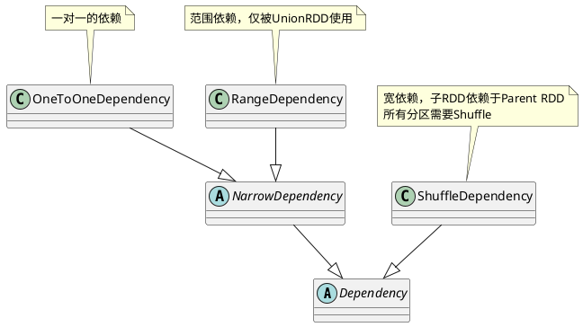
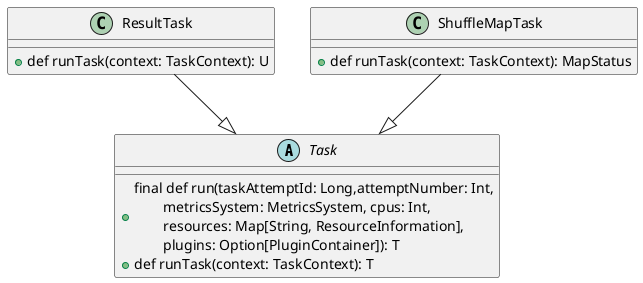

```scala
abstract class RDD[T: ClassTag](
    @transient private var _sc: SparkContext,
    @transient private var deps: Seq[Dependency[_]]
  ) extends Serializable with Logging {
    // 计算分区的函数
    def compute(split: Partition, context: TaskContext) : Iterator[T]
    // 一组分片
    protected def getPartitions: Array[Partition]
    // RDD间依赖关系
    protected def getDependencies: Seq[Dependency[_]] = deps
    // 每个分区的优先位置
    protected def getPreferredLocations(split: Partition): Seq[String] = Nil
    // RDD分片函数
    @transient val partitioner: Option[Partitioner] = None

    // 标记一个要被持久化的RDD, 一旦首次被触发
    // 该RDD将会被保留在计算节点的内存中并重用
    // cache()是使用persist()的快捷方法
    def persist(): this.type = persist(StorageLevel.MEMORY_ONLY)
    def cache(): this.type = persist()

    // 标记RDD不需要持久化,将其从内存或磁盘中移除
    def unpersist(blocking: Boolean = false)
  
    // 指定RDD需要检查点机制
    def checkpoint()
}
```

# 依赖(Depencency)

RDD和它依赖的parent RDD(s)的关系有两种不同的类型，即窄依赖(narrow dependency)和宽依赖(wide dependency)。
1. 窄依赖指的是每一个parent RDD的Partition最多被子RDD的一个Partition使用
2. 宽依赖指的是多个子RDD的Partition会依赖同一个parent RDD的Partition



`Dependency`是依赖表达的基类，在其上派生出`NarrowDependency`表达窄依赖和`ShuffleDependency`表示宽依赖。
```scala
abstract class Dependency[T] extends Serializable {
  // 依赖的Parent的RDD
  def rdd: RDD[T]
}
```

```scala
// 窄依赖
abstract class NarrowDependency[T](_rdd: RDD[T]) extends Dependency[T] {
  def getParents(partitionId: Int): Seq[Int]

  override def rdd: RDD[T] = _rdd
}
```

有两种窄依赖的具体实现，一种是一对一的依赖，即`OneToOneDependency`和范围的依赖，即`RangeDependency`，它仅仅被`org.apache.spark.rdd.UnionRDD`使用。UnionRDD是把多个RDD合成一个RDD，这些RDD是被拼接而成，即每个parent RDD的Partition的相对顺序不会变，只不过每个parent RDD在UnionRDD中的Partition的起始位置不同.

```scala
class OneToOneDependency[T](rdd: RDD[T]) extends NarrowDependency[T](rdd) {
  override def getParents(partitionId: Int): List[Int] = List(partitionId)
}

class RangeDependency[T](rdd: RDD[T], inStart: Int, outStart: Int, length: Int)
  extends NarrowDependency[T](rdd) {
  override def getParents(partitionId: Int): List[Int] = {
    if (partitionId >= outStart && partitionId < outStart + length) {
      List(partitionId - outStart + inStart)
    } else {
      Nil
    }
  }
}
```

宽依赖的实现只有一种：ShuffleDependency。子RDD依赖于parent RDD的所有Partition，需要Shuffle过程
```scala
class ShuffleDependency[K: ClassTag, V: ClassTag, C: ClassTag](
    @transient private val _rdd: RDD[_ <: Product2[K, V]],
    val partitioner: Partitioner,
    val serializer: Serializer = SparkEnv.get.serializer,
    val keyOrdering: Option[Ordering[K]] = None,
    val aggregator: Option[Aggregator[K, V, C]] = None,
    val mapSideCombine: Boolean = false,
    val shuffleWriterProcessor: ShuffleWriteProcessor = 
        new ShuffleWriteProcessor)
  extends Dependency[Product2[K, V]] with Logging {
            ......
  // 获取新的shuffle id
  val shuffleId: Int = _rdd.context.newShuffleId()

  // 向ShuffleManager注册Shuffle的信息
  val shuffleHandle: ShuffleHandle =
    _rdd.context.env.shuffleManager.registerShuffle(
        shuffleId, this)
    
        ......
}
```

宽依赖支持两种Shuffle Manager，即`org.apache.spark.shuffle.hash.HashShuffleManager`(基于Hash的Shuffle机制)和`org.apache.spark.shuffle.sort.SortShuffleManager`(基于排序的Shuffle机制）

## RDD计算
原始的RDD经过一系列转换后，会在最后一个RDD上触发一个动作，这个动作会生成一个Job。在Job被划分为一批计算任务(Task)后，这批Task会被提交到集群上的计算节点去计算。计算节点执行计算逻辑的部分称为Executor。Executor在准备好Task的运行时环境后，会通过调用`org.apache.spark.scheduler.Task#run`来执行计算。Spark的Task分为两种：
1. org.apache.spark.scheduler.ShuffleMapTask
2. org.apache.spark.scheduler.ResultTask

简单来说，DAG的最后一个阶段会为每个结果的Partition生成一个ResultTask，其余所有的阶段都会生成ShuffleMapTask。生成的Task会被发送到已经启动的Executor上，由Executor来完成计算任务的执行，执行过程的实现在`org.apache.spark.executor.Executor.TaskRunner#run`

```scala
private[spark] class ResultTask[T, U](......)
  extends Task[U](......) with Serializable {

  override def runTask(context: TaskContext): U = {
            .....
    func(context, rdd.iterator(partition, context))
  }
```

```scala
private[spark] class ShuffleMapTask(......)
  extends Task[MapStatus](......) with Logging {

  override def runTask(context: TaskContext): MapStatus = {
      .....
    dep.shuffleWriterProcessor.write(
        rdd.iterator(partition, context),
        dep, mapId, partitionId,context)
  }
```


org.apache.spark.scheduler.Task#run会调用ShuffleMapTask或者ResultTask的runTask；runTask会调用RDD的org.apache.spark.rdd.RDD#iterator。

```scala
private[spark] abstract class Task[T](......)
    extends Serializable {
  final def run(......) {
          .....
    context = if (isBarrier) {
      new BarrierTaskContext(taskContext)
    } else {
      taskContext
    }
  
    // 调用ResultTask或ShuffleMapTask的runTask
    context.runTaskWithListeners(this)
            ......
  }
```