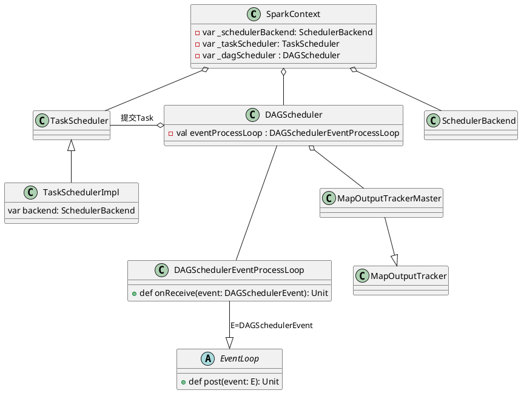
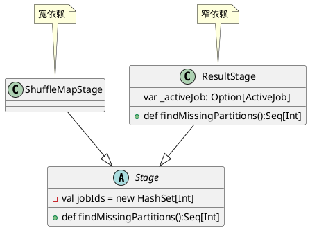
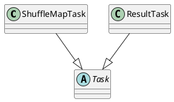
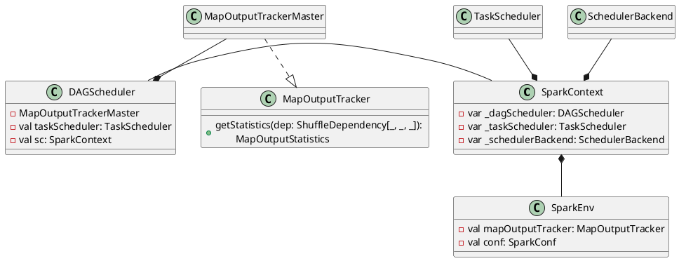
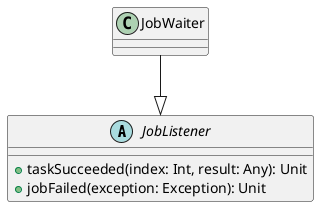

任务调度模块主要包含两大部分，即DAGScheduler和TaskScheduler，它们负责将用户提交的计算任务按照DAG划分为不同的Stage并且将不同Stage的计算任务提交到集群进行最终的计算。

- DAGScheduler主要负责分析用户提交的应用，并根据计算任务的依赖关系建立DAG，然后将DAG划分为不同的Stage(阶段)，其中每个Stage由可以并发执行的一组Task构成，这些Task的执行逻辑完全相同，只是作用于不同的数据，DAG在不同的资源管理框架(即部署方式，包括Standalone、Mesos、YARN、Local、EC2等)下的实现相同。
- 在DAGScheduler将这组Task划分完成后，会将这组Task提交到TaskScheduler。TaskScheduler通过Cluster Manager在集群中的某个Worker的Executor上启动任务。

# DAGScheduler实现
## DAGScheduler创建

## Job提交
Job提交的调用流程
```scala
org.apache.spark.SparkContext#runJob
  org.apache.spark.scheduler.DAGScheduler#runJob
    org.apache.spark.scheduler.DAGScheduler#submitJob (生成并返回JobWaiter Object)
      eventProcessLoop#post(JobSubmitted(...)) // 提交JobSubmitted Event

org.apache.spark.scheduler.DAGSchedulerEventProcessLoop#onReceive(JobSubmitted)
  org.apache.spark.scheduler.DAGScheduler#handleJobSubmitted
```

```plantuml
class DAGScheduler {
  - val eventProcessLoop : DAGSchedulerEventProcessLoop
}

class DAGSchedulerEventProcessLoop {
  + def onReceive(event: DAGSchedulerEvent): Unit
}

abstract class EventLoop {
  - val eventQueue: BlockingQueue[E]
  - val eventThread = new Thread(name)
  + def post(event: E): Unit
  + def start(): Unit
  + def stop(): Unit
  # def onReceive(event: E): Unit
  # def onError(e: Throwable): Unit
  # def onStop(): Unit
  # def onStart(): Unit
}

DAGSchedulerEventProcessLoop -up-- DAGScheduler : 提交(post)JobSubmitted事件
DAGSchedulerEventProcessLoop -right-|> EventLoop : E=DAGSchedulerEvent
```

Job提交会为这个Job生成一个JobID，并生成一个JobWaiter实例例来监听Job执行状态
```scala
def runJob[T, U](rdd: RDD[T], func: (TaskContext, Iterator[T]) => U,
    partitions: Seq[Int], callSite: CallSite,
    resultHandler: (Int, U) => Unit, properties: Properties): Unit = {

  // submitJob内部会为Job生成一个JobID，创建并返回一个JobWaiter实例
  val waiter = submitJob(rdd, func, partitions, callSite, resultHandler, properties)
        ......
}


def submitJob[T, U](rdd: RDD[T], func: (TaskContext, Iterator[T]) => U,
    partitions: Seq[Int], callSite: CallSite,
    resultHandler: (Int, U) => Unit, properties: Properties): JobWaiter[U] = {

  // 1. 创建Job ID
  val jobId = nextJobId.getAndIncrement()
  
  // 2. 创建JobWaiter实例来监听Job执行状态
  if (partitions.isEmpty) {
    // 2.1 创建共有0个task的JobWaiter，
            ......
    listenerBus.post(SparkListenerJobStart(jobId, time, Seq.empty, clonedProperties))
    listenerBus.post(SparkListenerJobEnd(jobId, time, JobSucceeded))
    return new JobWaiter[U](this, jobId, 0, resultHandler)
  }

  // 2.2 创建JobWaiter并提交JobSubmitted事件
  val func2 = func.asInstanceOf[(TaskContext, Iterator[_]) => _]
  val waiter = new JobWaiter[U](this, jobId, partitions.size, resultHandler)
  eventProcessLoop.post(JobSubmitted(....))
  waiter
}
```

Job通过`DAGSchedulerEventProcessLoop::post(JobSubmitted))`提交JobSubmitted事件，`DAGSchedulerEventProcessLoop::doOnReceive`对接收到的JobSubmitted Event处理，调用`dagScheduler.handleJobSubmitted`,忽略一些异常处理来了解其主执行流程
```scala
private[scheduler] class DAGSchedulerEventProcessLoop(dagScheduler: DAGScheduler)
  extends EventLoop[DAGSchedulerEvent]("dag-scheduler-event-loop") with Logging {

  // The main event loop of the DAG scheduler.
  override def onReceive(event: DAGSchedulerEvent): Unit = {
    doOnReceive(event)
  }

  private def doOnReceive(event: DAGSchedulerEvent): Unit = event match {
    // 通过createResultStage创建ResultStage
    case JobSubmitted(jobId, rdd, func, partitions, callSite, listener, artifacts, properties) =>
      dagScheduler.handleJobSubmitted(jobId, rdd, func, partitions, callSite, listener, artifacts,
        properties)

    // 通过getOrCreateShuffleMapStage创建ShuffleMapStage
    case MapStageSubmitted(jobId, dependency, callSite, listener, artifacts, properties) =>
      dagScheduler.handleMapStageSubmitted(jobId, dependency, callSite, listener, artifacts,
        properties)
      				......
  }
```
可见，JobSubmitted的事件，会触发调用`dagScheduler.handleJobSubmitted`，接下来了解一下它的实现。
```scala
private[scheduler] def handleJobSubmitted(jobId: Int,
    finalRDD: RDD[_], func: (TaskContext, Iterator[_]) => _,
    partitions: Array[Int], callSite: CallSite, listener: JobListener,
    artifacts: JobArtifactSet, properties: Properties): Unit = {
  var finalStage: ResultStage = null
  // 1. 创建finalStage,这个接口会获取宽依赖创建ShuffleMapStage
  finalStage = createResultStage(finalRDD, func, partitions, jobId, callSite)
  
  // Job submitted, clear internal data.
  barrierJobIdToNumTasksCheckFailures.remove(jobId)

  // 2. 创建ActiveJob
  val job = new ActiveJob(jobId, finalStage, callSite, listener, artifacts, properties)
  clearCacheLocs()

  val jobSubmissionTime = clock.getTimeMillis()
  jobIdToActiveJob(jobId) = job
  activeJobs += job

  // 3. 为finalStage设置ActiveJob
  finalStage.setActiveJob(job)
  val stageIds = jobIdToStageIds(jobId).toArray
  val stageInfos = stageIds.flatMap(id => stageIdToStage.get(id).map(_.latestInfo))
  listenerBus.post(SparkListenerJobStart(job.jobId, jobSubmissionTime, stageInfos,
      Utils.cloneProperties(properties)))

  // 4. Stage提交
  submitStage(finalStage)
}
```

```scala
org.apache.spark.scheduler.DAGScheduler#handleJobSubmitted
  getShuffleDependenciesAndResourceProfiles // 获取到 shuffleDeps
  // 如果存在shuffle，创建ShuffleMapStage
    
  org.apache.spark.scheduler.DAGScheduler#getOrCreateParentStages
    org.apache.spark.scheduler.DAGScheduler#getOrCreateShuffleMapStage
      org.apache.spark.scheduler.DAGScheduler#createShuffleMapStage
  org.apache.spark.scheduler.DAGScheduler#getOrCreateParentStages()
  org.apache.spark.scheduler.DAGScheduler#createResultStage
```


```scala
private[scheduler] sealed trait DAGSchedulerEvent

private[scheduler] case class JobSubmitted(...)
  extends DAGSchedulerEvent

private[scheduler] case class MapStageSubmitted(...)
  extends DAGSchedulerEvent
    ....
```


## Stage划分
Job提交后，DAGSchedulerEventProcessLoop对接收到的`JobSubmitted`事件处理，调用`DAGScheduler::handleJobSubmitted`将DAG划分为不同的Stage(阶段)，其中每个Stage可以由一组并发的Task组成，这些Task的执行逻辑相同，只是作用于完全不同的数据。

Spark用`class Stage`进行Stage的进行抽象表达，根据RDD和它依赖的父RDD(s)的关系分为两种类型，即窄依赖(narrow dependency)用`ResultStage`结构表达和宽依赖(wide dependency)用`ShuffleMapStage`数据结构表达。



```
org.apache.spark.scheduler.DAGScheduler#handleJobSubmitted
  org.apache.spark.scheduler.DAGScheduler#createResultStage(创建finalStage)
```

```scala
/** Submits stage, but first recursively submits any missing parents. */
private def submitStage(stage: Stage): Unit = {
  val jobId = activeJobForStage(stage)
  if (jobId.isDefined) {
    /** 
      DAGScheduler维护了三个HashSet
        1. waitingStages(父Stage未完成)
        2. runningStages(正在执行中)
        3. failedStages(失败后重新提交的Stage) 
    */
    if (!waitingStages(stage) && !runningStages(stage) && !failedStages(stage)) {
      if (stage.getNextAttemptId >= maxStageAttempts) {
        // Job重新提交超过尝试上限，停止该Stage
        val reason = s"$stage (name=${stage.name}) has been resubmitted for the maximum " +
            s"allowable number of times: ${maxStageAttempts}, which is the max value of " +
            s"config `spark.stage.maxAttempts` and `spark.stage.maxConsecutiveAttempts`."
        abortStage(stage, reason, None)
      } else {
        val missing = getMissingParentStages(stage).sortBy(_.id)
        if (missing.isEmpty) {
          // 所有parent stage都已完成，提交该stage所包含的task
          submitMissingTasks(stage, jobId.get)
        } else {
          for (parent <- missing) {
            // 存在parent stage未提交，递归地提交
            submitStage(parent)
          }
          waitingStages += stage
        }
      }
    }
  } else {
    // 无效的Stage，直接停止
    abortStage(stage, "No active job for stage " + stage.id, None)
  }
}
```

## Task生成
org.apache.spark.scheduler.DAGScheduler#handleJobSubmitted，生成finalStage后就会为该Job生成一个org.apache.spark.scheduler.ActiveJob，并准备计算这个finalStage
```scala
private[scheduler] def handleJobSubmitted(...): Unit = {
  var finalStage: ResultStage = null
  finalStage = createResultStage(finalRDD, func, partitions, jobId, callSite)

          ......
  val job = new ActiveJob(jobId, finalStage, callSite, listener, artifacts, properties)
          ......
  
  finalStage.setActiveJob(job)
  
  // 调用submitMissingTasks提交Stage包含的Task
  submitStage(finalStage)
        ......
}
```
### 创建TaskScheduler和SchedulerBackend
```plantuml
abstract class YarnSchedulerBackend {}

SchedulerBackend -up-o SparkContext : 创建scheduler backend
TaskScheduler -up-o SparkContext : 创建task scheduler

TaskSchedulerImpl -up-|> TaskScheduler : 实现

SchedulerBackend -right-|> ExecutorBackend
LocalSchedulerBackend -up-|> SchedulerBackend

StandaloneSchedulerBackend -up-|>  CoarseGrainedSchedulerBackend
CoarseGrainedSchedulerBackend -up-|> SchedulerBackend : 混入


YarnSchedulerBackend -up-|> SchedulerBackend
YarnClusterSchedulerBackend -up-|> YarnSchedulerBackend
```
```scala
org.apache.spark.SparkContext#createTaskScheduler
```
### Task提交
```
org.apache.spark.scheduler.DAGScheduler#submitStage
  org.apache.spark.scheduler.DAGScheduler#submitMissingTasks
    org.apache.spark.scheduler.TaskSchedulerImpl#submitTasks
      org.apache.spark.scheduler.TaskSchedulerImpl#createTaskSetManager
      org.apache.spark.scheduler.SchedulableBuilder#addTaskSetManager
      org.apache.spark.scheduler.CoarseGrainedSchedulerBackend#reviveOffers
        makeOffers
          buildWorkerOffer
          org.apache.spark.scheduler.TaskSchedulerImpl#resourceOffers
          launchTasks

org.apache.spark.executor.Executor#launchTask     
```

```plantuml
Interface SchedulableBuilder {
  + def rootPool: Pool
  + def buildPools(): Unit
  + def addTaskSetManager(manager: Schedulable, properties: Properties): Unit
}

FIFOSchedulableBuilder -down-|> SchedulableBuilder
FairSchedulableBuilder -down-|> SchedulableBuilder
```


```plantuml
class TaskSchedulerImpl {
  var backend: SchedulerBackend
}

abstract class SchedulerBackend {
  + def start(): Unit
  + def stop(): Unit
  + def stop(exitCode: Int): Unit
  + def reviveOffers(): Unit
}

TaskSchedulerImpl -right-|> TaskScheduler
SchedulerBackend -up-o TaskSchedulerImpl
```




```scala
class DAGScheduler
trait TaskScheduler {}
```


任务调度模块涉及的最重要的三个类是：

1. `org.apache.spark.scheduler.DAGScheduler`，主要负责分析用户提交的应用，并根据计算任务的依赖关系建立DAG，然后将DAG划分为不同的Stage(阶段)。
2. `org.apache.spark.scheduler.SchedulerBackend`，这是一个trait，作用是分配当前可用的资源，具体就是向当前等待分配计算资源的Task分配计算资源(即Executor)，并且在分配的Executor上启动Task，完成计算的调度过程。
3. `org.apache.spark.scheduler.TaskScheduler`，这也是一个trait，作用是为创建它的SparkContext调度任务，即从DAGScheduler接收不同Stage的任务，并向集群提交任务，并为执行特别慢的任务启动备份任务。TaskScheduler是以后实现多种任务调度器的基础，目前`org.apache.spark.scheduler.TaskSchedulerImpl`是唯一实现。


#  DAGScheduler

DAGScheduler主要负责分析用户提交的应用，并根据计算任务的依赖关系建立DAG，然后将DAG划分为不同的Stage(阶段)，其中每个Stage由可以并发执行的一组Task构成，这些Task的执行逻辑完全相同，只是作用于不同的数据，DAG在不同的资源管理框架下实现相同。


```scala
private[spark] class DAGScheduler(
    private[scheduler] val sc: SparkContext,
    private[scheduler] val taskScheduler: TaskScheduler,
    listenerBus: LiveListenerBus,
    mapOutputTracker: MapOutputTrackerMaster,
    blockManagerMaster: BlockManagerMaster,
    env: SparkEnv,
    clock: Clock = new SystemClock())
  extends Logging {}
```



JobListener是一种特质，
```scala
// org.apache.spark.scheduler

private[spark] trait JobListener {
  def taskSucceeded(index: Int, result: Any): Unit
  def jobFailed(exception: Exception): Unit
}
```
```scala
private[spark] class JobWaiter[T](
    dagScheduler: DAGScheduler,
    val jobId: Int,
    totalTasks: Int,
    resultHandler: (Int, T) => Unit)
  extends JobListener with Logging {

  }
```


## 创建Stage
```scala
private[scheduler] class DAGSchedulerEventProcessLoop(dagScheduler: DAGScheduler)
  extends EventLoop[DAGSchedulerEvent]("dag-scheduler-event-loop") with Logging {

  // The main event loop of the DAG scheduler.
  override def onReceive(event: DAGSchedulerEvent): Unit = {
    doOnReceive(event)
  }

  private def doOnReceive(event: DAGSchedulerEvent): Unit = event match {
    // 通过createResultStage创建ResultStage
    case JobSubmitted(jobId, rdd, func, partitions, callSite, listener, artifacts, properties) =>
      dagScheduler.handleJobSubmitted(jobId, rdd, func, partitions, callSite, listener, artifacts,
        properties)

    // 通过getOrCreateShuffleMapStage创建ShuffleMapStage
    case MapStageSubmitted(jobId, dependency, callSite, listener, artifacts, properties) =>
      dagScheduler.handleMapStageSubmitted(jobId, dependency, callSite, listener, artifacts,
        properties)
      				......
  }
```


```scala
  private def getOrCreateParentStages(shuffleDeps: HashSet[ShuffleDependency[_, _, _]],
      firstJobId: Int): List[Stage] = {
    shuffleDeps.map { shuffleDep =>
      getOrCreateShuffleMapStage(shuffleDep, firstJobId)
    }.toList
  }
```

```scala
  private[scheduler] def getShuffleDependenciesAndResourceProfiles(
      rdd: RDD[_]): (HashSet[ShuffleDependency[_, _, _]], HashSet[ResourceProfile]) = {
    val parents = new HashSet[ShuffleDependency[_, _, _]]
    val resourceProfiles = new HashSet[ResourceProfile]
    val visited = new HashSet[RDD[_]]
    val waitingForVisit = new ListBuffer[RDD[_]]
    waitingForVisit += rdd
    while (waitingForVisit.nonEmpty) {
      val toVisit = waitingForVisit.remove(0)
      if (!visited(toVisit)) {
        visited += toVisit
        Option(toVisit.getResourceProfile).foreach(resourceProfiles += _)
        toVisit.dependencies.foreach {
          case shuffleDep: ShuffleDependency[_, _, _] =>
            parents += shuffleDep
          case dependency =>
            waitingForVisit.prepend(dependency.rdd)
        }
      }
    }
    (parents, resourceProfiles)
  }
```

## 提交Stage
```
org.apache.spark.SparkContext#submitMapStage
org.apache.spark.scheduler.DAGScheduler#submitMapStage


```

```scala
class SimpleFutureAction[T] private[spark](jobWaiter: JobWaiter[_], resultFunc: => T)
  extends FutureAction[T] {}
trait FutureAction[T] extends Future[T] 
```

```scala
private[spark] class MapOutputStatistics(val shuffleId: Int, val bytesByPartitionId: Array[Long])
```

```scala
private[spark] class MapOutputTrackerMaster(
    conf: SparkConf,
    private[spark] val broadcastManager: BroadcastManager,
    private[spark] val isLocal: Boolean)
  extends MapOutputTracker(conf) {

  // Return statistics about all of the outputs for a given shuffle.
  def getStatistics(dep: ShuffleDependency[_, _, _]): MapOutputStatistics = {
  }
```