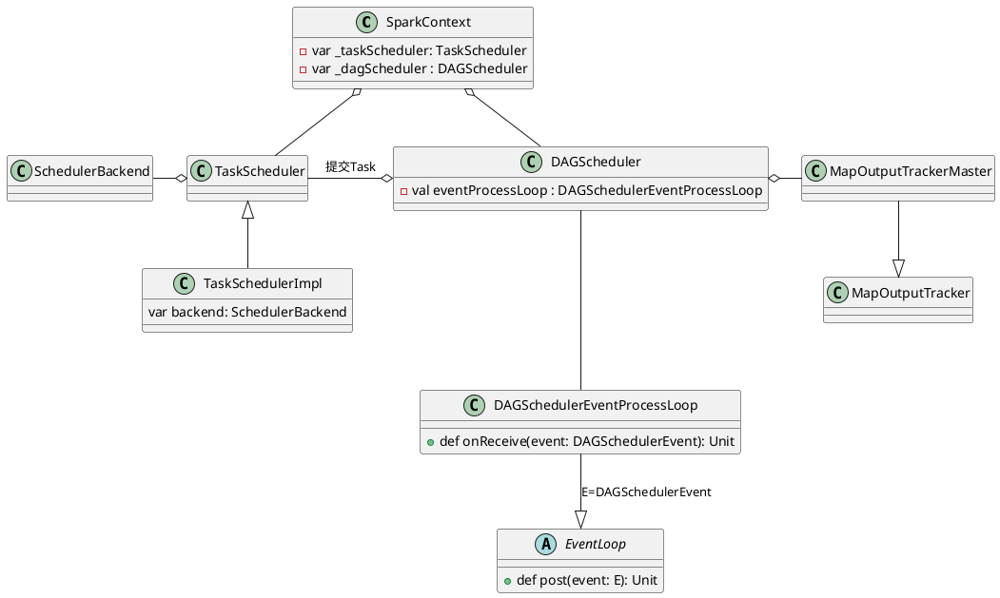
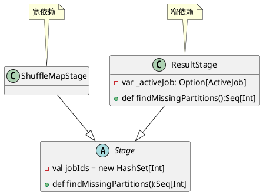
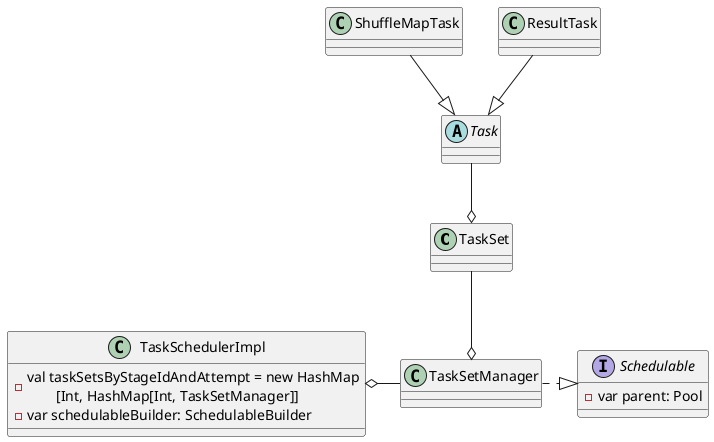
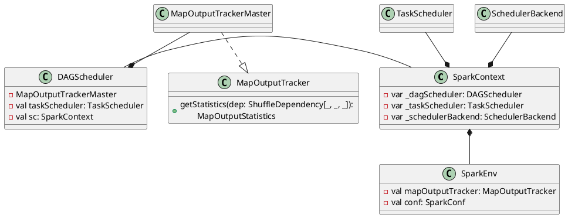
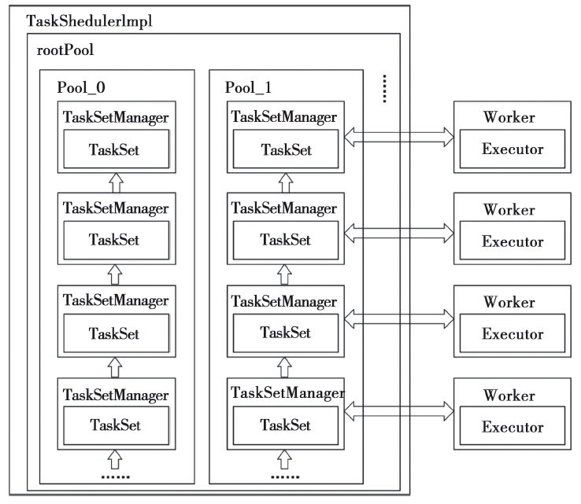
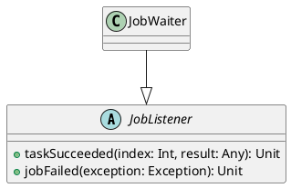

任务调度模块主要包含两大部分，即DAGScheduler和TaskScheduler，它们负责将用户提交的计算任务按照DAG划分为不同的Stage并且将不同Stage的计算任务提交到集群进行最终的计算。

- DAGScheduler主要负责分析用户提交的应用，并根据计算任务的依赖关系建立DAG，然后将DAG划分为不同的Stage(阶段)，其中每个Stage由可以并发执行的一组Task构成，这些Task的执行逻辑完全相同，只是作用于不同的数据，DAG在不同的资源管理框架(即部署方式，包括Standalone、Mesos、YARN、Local、EC2等)下的实现相同。
- 在DAGScheduler将这组Task划分完成后，会将这组Task提交到TaskScheduler。TaskScheduler通过Cluster Manager在集群中的某个Worker的Executor上启动任务。

# DAGScheduler实现
## DAGScheduler创建
DAGScheduler在SparkContext创建的时候创建的，由于DAGScheduler引用了TaskScheduler，因此需要先创建TaskScheduler，
```scala
  // 创建TaskScheduler
  val (sched, ts) = SparkContext.createTaskScheduler(this, master)
  _schedulerBackend = sched
  _taskScheduler = ts
  // 创建DAGScheduler
  _dagScheduler = new DAGScheduler(this)
```
在DAGSchedule入参`SparkContext`的构造函数如下:
```scala
def this(sc: SparkContext) = this(sc, sc.taskScheduler)
```

`this(sc, sc.taskScheduler)`的实现
```scala
  def this(sc: SparkContext, taskScheduler: TaskScheduler) = {
    this(sc, taskScheduler, sc.listenerBus,
      sc.env.mapOutputTracker.asInstanceOf[MapOutputTrackerMaster],
      sc.env.blockManager.master, sc.env)
  }
```
之后调用`DAGScheduler`的构造函数
```scala
private[spark] class DAGScheduler(
    private[scheduler] val sc: SparkContext,
    private[scheduler] val taskScheduler: TaskScheduler,
    listenerBus: LiveListenerBus,
    mapOutputTracker: MapOutputTrackerMaster,
    blockManagerMaster: BlockManagerMaster,
    env: SparkEnv,
    clock: Clock = new SystemClock()) extends Logging { }
```


1. `org.apache.spark.scheduler.TaskScheduler`是一个trait，作用是为创建它的SparkContext调度任务，即从DAGScheduler接收不同Stage的任务，并向集群提交任务，并为执行特别慢的任务启动备份任务。TaskScheduler是以后实现多种任务调度器的基础，目前`org.apache.spark.scheduler.TaskSchedulerImpl`是它的实现。
2. `org.apache.spark.scheduler.SchedulerBackend`是一个trait，作用是分配当前可用的资源，具体就是向当前等待分配计算资源的Task分配计算资源(即Executor)，并且在分配的Executor上启动Task，完成计算的调度过程。
3. `MapOutputTrackerMaster`是运行在Driver端管理Shuffle Map Task的输出的，下游的Task可以通过`MapOutputTrackerMaster`来获取Shuffle输出的位置信息。
4. `DAGScheduler`将调度抽象为一系列的Event(时间)，例如Job提交对应于`JobSubmitted`，MapStageSubmitted对应于Map Stage提交等(更多定义参看`core/src/main/scala/org/apache/spark/scheduler\DAGSchedulerEvent.scala`实现)，`DAGSchedulerEventProcessLoop`实现事件调度逻辑,例如
```scala
private[scheduler] sealed trait DAGSchedulerEvent

private[scheduler] case class JobSubmitted(...)
  extends DAGSchedulerEvent

private[scheduler] case class MapStageSubmitted(...)
  extends DAGSchedulerEvent
    ....
```


## Job提交
Job提交的调用流程
```scala
org.apache.spark.SparkContext#runJob
  org.apache.spark.scheduler.DAGScheduler#runJob
    org.apache.spark.scheduler.DAGScheduler#submitJob (生成并返回JobWaiter Object)
      eventProcessLoop#post(JobSubmitted(...)) // 提交JobSubmitted Event

org.apache.spark.scheduler.DAGSchedulerEventProcessLoop#onReceive(JobSubmitted)
  org.apache.spark.scheduler.DAGScheduler#handleJobSubmitted
```

```plantuml
class DAGScheduler {
  - val eventProcessLoop : DAGSchedulerEventProcessLoop
}

class DAGSchedulerEventProcessLoop {
  + def onReceive(event: DAGSchedulerEvent): Unit
}

abstract class EventLoop {
  - val eventQueue: BlockingQueue[E]
  - val eventThread = new Thread(name)
  + def post(event: E): Unit
  + def start(): Unit
  + def stop(): Unit
  # def onReceive(event: E): Unit
  # def onError(e: Throwable): Unit
  # def onStop(): Unit
  # def onStart(): Unit
}

DAGSchedulerEventProcessLoop -up-- DAGScheduler : 提交(post)JobSubmitted事件
DAGSchedulerEventProcessLoop -right-|> EventLoop : E=DAGSchedulerEvent
```

Job提交会为这个Job生成一个JobID，并生成一个JobWaiter实例例来监听Job执行状态，JobWaiter会监听Job的执行状态，而Job是由多个Task组成的，只有Job的所有Task都成功完成，Job才标记为成功；任意一个Task失败都会标记该Job失败。

```scala
def runJob[T, U](rdd: RDD[T], func: (TaskContext, Iterator[T]) => U,
    partitions: Seq[Int], callSite: CallSite,
    resultHandler: (Int, U) => Unit, properties: Properties): Unit = {

  // submitJob内部会为Job生成一个JobID，创建并返回一个JobWaiter实例
  val waiter = submitJob(rdd, func, partitions, callSite, resultHandler, properties)
        ......
}

def submitJob[T, U](rdd: RDD[T], func: (TaskContext, Iterator[T]) => U,
    partitions: Seq[Int], callSite: CallSite,
    resultHandler: (Int, U) => Unit, properties: Properties): JobWaiter[U] = {

  // 1. 创建Job ID
  val jobId = nextJobId.getAndIncrement()
  
  // 2. 创建JobListener(JobWaiter)实例来监听Job执行状态
  if (partitions.isEmpty) {
    // 2.1 创建共有0个task的JobWaiter，
            ......
    listenerBus.post(SparkListenerJobStart(jobId, time, Seq.empty, clonedProperties))
    listenerBus.post(SparkListenerJobEnd(jobId, time, JobSucceeded))
    return new JobWaiter[U](this, jobId, 0, resultHandler)
  }

  // 2.2 创建JobWaiter并提交JobSubmitted事件
  val func2 = func.asInstanceOf[(TaskContext, Iterator[_]) => _]
  val waiter = new JobWaiter[U](this, jobId, partitions.size, resultHandler)
  eventProcessLoop.post(JobSubmitted(....))
  waiter
}
```

对于近似估计的Job，DAGScheduler会调用`runApproximateJob`，其逻辑类似，JobWaiter换成了`org.apache.spark.partial.ApproximateActionListener`
```scala
def runApproximateJob[T, U, R](rdd: RDD[T],
    func: (TaskContext, Iterator[T]) => U,
    evaluator: ApproximateEvaluator[U, R],
    callSite: CallSite, timeout: Long,
    properties: Properties): PartialResult[R] = {
    // 1. 创建Job ID
  val jobId = nextJobId.getAndIncrement()

  // 2. 创建JobListener(ApproximateActionListener)实例来监听Job执行状态
  if (rdd.partitions.isEmpty) {
    // 2.1 直接返回
            ......
    listenerBus.post(SparkListenerJobStart(jobId, time, Seq[StageInfo](), clonedProperties))
    listenerBus.post(SparkListenerJobEnd(jobId, time, JobSucceeded))
    return new PartialResult(evaluator.currentResult(), true)
  }


  // 2.2 创建ApproximateActionListener并提交JobSubmitted事件
  val listener = new ApproximateActionListener(rdd, func, evaluator, timeout)
  val func2 = func.asInstanceOf[(TaskContext, Iterator[_]) => _]
  eventProcessLoop.post(JobSubmitted(
    jobId, rdd, func2, rdd.partitions.indices.toArray, callSite, listener,
    JobArtifactSet.getActiveOrDefault(sc), clonedProperties))
  
  // 3. 异步等待结果，timeout毫秒超时
  listener.awaitResult()
}
```

Job通过`DAGSchedulerEventProcessLoop::post(JobSubmitted))`提交JobSubmitted事件，`DAGSchedulerEventProcessLoop::doOnReceive`对接收到的JobSubmitted Event处理，调用`dagScheduler.handleJobSubmitted`,忽略一些异常处理来了解其主执行流程
```scala
private[scheduler] class DAGSchedulerEventProcessLoop(dagScheduler: DAGScheduler)
  extends EventLoop[DAGSchedulerEvent]("dag-scheduler-event-loop") with Logging {

  // The main event loop of the DAG scheduler.
  override def onReceive(event: DAGSchedulerEvent): Unit = {
    doOnReceive(event)
  }

  private def doOnReceive(event: DAGSchedulerEvent): Unit = event match {
    // 通过createResultStage创建ResultStage
    case JobSubmitted(jobId, rdd, func, partitions, callSite, listener, artifacts, properties) =>
      dagScheduler.handleJobSubmitted(jobId, rdd, func, partitions, callSite, listener, artifacts,
        properties)

    // 通过getOrCreateShuffleMapStage创建ShuffleMapStage
    case MapStageSubmitted(jobId, dependency, callSite, listener, artifacts, properties) =>
      dagScheduler.handleMapStageSubmitted(jobId, dependency, callSite, listener, artifacts,
        properties)
      				......
  }
```
可见，JobSubmitted的事件，会触发调用`dagScheduler.handleJobSubmitted`，接下来了解一下它的实现。
```scala
private[scheduler] def handleJobSubmitted(jobId: Int,
    finalRDD: RDD[_], func: (TaskContext, Iterator[_]) => _,
    partitions: Array[Int], callSite: CallSite, listener: JobListener,
    artifacts: JobArtifactSet, properties: Properties): Unit = {
  var finalStage: ResultStage = null
  // 1. 创建finalStage,这个接口会获取宽依赖创建ShuffleMapStage
  finalStage = createResultStage(finalRDD, func, partitions, jobId, callSite)
  
  // Job submitted, clear internal data.
  barrierJobIdToNumTasksCheckFailures.remove(jobId)

  // 2. 创建ActiveJob
  val job = new ActiveJob(jobId, finalStage, callSite, listener, artifacts, properties)
  clearCacheLocs()

  val jobSubmissionTime = clock.getTimeMillis()
  jobIdToActiveJob(jobId) = job
  activeJobs += job

  // 3. 为finalStage设置ActiveJob
  finalStage.setActiveJob(job)
  val stageIds = jobIdToStageIds(jobId).toArray
  val stageInfos = stageIds.flatMap(id => stageIdToStage.get(id).map(_.latestInfo))
  listenerBus.post(SparkListenerJobStart(job.jobId, jobSubmissionTime, stageInfos,
      Utils.cloneProperties(properties)))

  // 4. Stage提交,这里会向TaskScheduler提交Task
  submitStage(finalStage)
}
```

## Job监听
`JobListener`是一种特质，在其上派生出`JobWaiter`会监听Job的执行状态

```plantuml
class ApproximateActionListener {
  + def awaitResult(): PartialResult[R]
}
note top : 近似估计Job监听

class JobWaiter {}

interface JobListener {
  + def taskSucceeded(index: Int, result: Any): Unit
  + def jobFailed(exception: Exception): Unit
}
JobWaiter -down-|> JobListener
ApproximateActionListener -down-|> JobListener

```

```scala
org.apache.spark.scheduler.DAGScheduler#handleJobSubmitted
  getShuffleDependenciesAndResourceProfiles // 获取到 shuffleDeps
  // 如果存在shuffle，创建ShuffleMapStage
    
  org.apache.spark.scheduler.DAGScheduler#getOrCreateParentStages
    org.apache.spark.scheduler.DAGScheduler#getOrCreateShuffleMapStage
      org.apache.spark.scheduler.DAGScheduler#createShuffleMapStage
  org.apache.spark.scheduler.DAGScheduler#getOrCreateParentStages()
  org.apache.spark.scheduler.DAGScheduler#createResultStage
```


## Stage划分
Job提交后，DAGSchedulerEventProcessLoop对接收到的`JobSubmitted`事件处理，调用`DAGScheduler::handleJobSubmitted`将DAG划分为不同的Stage(阶段)，其中每个Stage可以由一组并发的Task组成，这些Task的执行逻辑相同，只是作用于完全不同的数据。

Spark用`class Stage`进行Stage的进行抽象表达，根据RDD和它依赖的父RDD(s)的关系分为两种类型，即窄依赖(narrow dependency)用`ResultStage`结构表达和宽依赖(wide dependency)用`ShuffleMapStage`数据结构表达。



```
org.apache.spark.scheduler.DAGScheduler#handleJobSubmitted
  org.apache.spark.scheduler.DAGScheduler#createResultStage(创建finalStage)
```

```scala
/** Submits stage, but first recursively submits any missing parents. */
private def submitStage(stage: Stage): Unit = {
  val jobId = activeJobForStage(stage)
  if (jobId.isDefined) {
    /** 
      DAGScheduler维护了三个HashSet
        1. waitingStages(父Stage未完成)
        2. runningStages(正在执行中)
        3. failedStages(失败后重新提交的Stage) 
    */
    if (!waitingStages(stage) && !runningStages(stage) && !failedStages(stage)) {
      if (stage.getNextAttemptId >= maxStageAttempts) {
        // Job重新提交超过尝试上限，停止该Stage
        val reason = s"$stage (name=${stage.name}) has been resubmitted for the maximum " +
            s"allowable number of times: ${maxStageAttempts}, which is the max value of " +
            s"config `spark.stage.maxAttempts` and `spark.stage.maxConsecutiveAttempts`."
        abortStage(stage, reason, None)
      } else {
        val missing = getMissingParentStages(stage).sortBy(_.id)
        if (missing.isEmpty) {
          // 所有parent stage都已完成，提交该stage所包含的task
          submitMissingTasks(stage, jobId.get)
        } else {
          for (parent <- missing) {
            // 存在parent stage未提交，递归地提交
            submitStage(parent)
          }
          waitingStages += stage
        }
      }
    }
  } else {
    // 无效的Stage，直接停止
    abortStage(stage, "No active job for stage " + stage.id, None)
  }
}
```


# 任务调度实现

每个TaskScheduler都对应一个SchedulerBackend。其中，TaskScheduler负责Application的不同Job之间的调度，在Task执行失败时启动重试机制，并且为执行速度慢的Task启动备份的任务。而SchedulerBackend负责与Cluster Manager交互，取得该Application分配到的资源，并且将这些资源传给TaskScheduler，由TaskScheduler为Task最终分配计算资源。


## Task生成

org.apache.spark.scheduler.DAGScheduler#handleJobSubmitted，生成finalStage后就会为该Job生成一个org.apache.spark.scheduler.ActiveJob，并准备计算这个finalStage

```scala
private[scheduler] def handleJobSubmitted(...): Unit = {
  var finalStage: ResultStage = null
  finalStage = createResultStage(finalRDD, func, partitions, jobId, callSite)

          ......
  val job = new ActiveJob(jobId, finalStage, callSite, listener, artifacts, properties)
          ......
  
  finalStage.setActiveJob(job)
  
  // 调用submitMissingTasks提交Stage包含的Task
  submitStage(finalStage)
        ......
}
```


## 创建TaskScheduler和SchedulerBackend
```plantuml
abstract class YarnSchedulerBackend {}

SchedulerBackend -up-o SparkContext : 创建scheduler backend
TaskScheduler -up-o SparkContext : 创建task scheduler

TaskSchedulerImpl -up-|> TaskScheduler : 实现

SchedulerBackend -right-|> ExecutorBackend
LocalSchedulerBackend -up-|> SchedulerBackend

StandaloneSchedulerBackend -up-|>  CoarseGrainedSchedulerBackend
CoarseGrainedSchedulerBackend -up-|> SchedulerBackend : 混入


YarnSchedulerBackend -up-|> SchedulerBackend
YarnClusterSchedulerBackend -up-|> YarnSchedulerBackend
```
```scala
org.apache.spark.SparkContext#createTaskScheduler
```
## Task提交

```scala
// 在Driver端执行
org.apache.spark.scheduler.TaskSchedulerImpl#submitTasks
  org.apache.spark.scheduler.TaskSchedulerImpl#createTaskSetManager
  org.apache.spark.scheduler.SchedulableBuilder#addTaskSetManager
  org.apache.spark.scheduler.CoarseGrainedSchedulerBackend#reviveOffers
  org.apache.spark.scheduler.CoarseGrainedSchedulerBackend.DriverEndpoint#makeOffers
  	org.apache.spark.scheduler.CoarseGrainedSchedulerBackend.DriverEndpoint#buildWorkerOffer
  	org.apache.spark.scheduler.TaskSchedulerImpl#resourceOffers
	org.apache.spark.scheduler.CoarseGrainedSchedulerBackend.DriverEndpoint#launchTasks
	// 这里executorEndpoint.send(LaunchTask(......)

// 在Executor上执行
org.apache.spark.executor.CoarseGrainedExecutorBackend.receiveWithLogging#launchTask
org.apache.spark.executor.Executor#launchTask     
```
`TaskSchedulerImpl::submitTasks`


`TaskSchedulerImpl::resourceOffers`响应CoarseGrainedSchedulerBackend的资源调度请求，为每个Task具体分配资源。


- `spark.task.cpus`配置参数，默认值为1，用于设置每个Task所需要的cores(线程数)。

- `spark.scheduler.mode`设置的调度策略。默认为FIFO，


`TaskSchedulerImpl::resourceOffers`响应资源调度请求，为每个Task分配资源，该函数的输入是Executor列表，输出是`TaskDescription`二维数组，`TaskDescription`包含了Task ID，Executor ID和Task执行环境的依赖信息等。

```scala
  def resourceOffers(offers: IndexedSeq[WorkerOffer],
      isAllFreeResources: Boolean = true): Seq[Seq[TaskDescription]] = synchronized {
    var newExecAvail = false
    for (o <- offers) {
      if (!hostToExecutors.contains(o.host)) {
        hostToExecutors(o.host) = new HashSet[String]()
      }
      if (!executorIdToRunningTaskIds.contains(o.executorId)) {
        // 有新的executor加入
        hostToExecutors(o.host) += o.executorId
        executorAdded(o.executorId, o.host)
        executorIdToHost(o.executorId) = o.host
        executorIdToRunningTaskIds(o.executorId) = HashSet[Long]()
        newExecAvail = true
      }
    }
    val hosts = offers.map(_.host).distinct
    for ((host, Some(rack)) <- hosts.zip(getRacksForHosts(hosts))) {
      hostsByRack.getOrElseUpdate(rack, new HashSet[String]()) += host
    }

    // 1. 如果开启spark.excludeOnFailure.enabled为true
    //    如果某节点的任务多次失败，Spark会将这个节点排除在集群之外
    //	  这意味着不会用于之后的任务调度
    //    过滤掉排除在外的执行器节点,避免单独创建线程和同步开销
    healthTrackerOpt.foreach(_.applyExcludeOnFailureTimeout())
    val filteredOffers = healthTrackerOpt.map { healthTracker =>
      offers.filter { offer =>
        !healthTracker.isNodeExcluded(offer.host) &&
          !healthTracker.isExecutorExcluded(offer.executorId)
      }
    }.getOrElse(offers)

    // 2. 随机打散,避免将Task集中分配给某些机器
    val shuffledOffers = shuffleOffers(filteredOffers)

    // 3. 构建分配给每个worker的tasks
    // 	  offer代表Executor列表,Spark cores概念表示并行执行的线程数
    //    根据spark.task.cpus配置参数(每个Task所需要的cores(线程数)
    //    因此, 需要的Task数量 = cores / CPUS_PER_TASK
    val tasks = shuffledOffers.map(o => new ArrayBuffer[TaskDescription](o.cores / CPUS_PER_TASK))
    val availableResources = shuffledOffers.map(_.resources).toArray
    val availableCpus = shuffledOffers.map(o => o.cores).toArray
    val resourceProfileIds = shuffledOffers.map(o => o.resourceProfileId).toArray
    // 根据用户spark.scheduler.mode设置的调度策略
    //   1. FIFO: FIFOSchedulingAlgorithm::comparator规则
    //   2. Fair: FairSchedulingAlgorithm::comparator规则
    // 对TaskSetManager进行排序
    val sortedTaskSets = rootPool.getSortedTaskSetQueue
    for (taskSet <- sortedTaskSets) {
      if (newExecAvail) {
        // 重新计算该TaskSetManager的就近原则
        taskSet.executorAdded()
      }
    }

    // 为根据调度策略排序好的的TaskSetManager列表分配资源
    // 按照就近原则进行分配,其中优先分配顺序:
    // PROCESS_LOCAL, NODE_LOCAL, NO_PREF, RACK_LOCAL, ANY
    for (taskSet <- sortedTaskSets) {
      // Barrier Task -- todo
      // 如果采用Barrier执行模式，计算可用的Barrier Slot数, 否则为-1
      val numBarrierSlotsAvailable = if (taskSet.isBarrier) {
        val rpId = taskSet.taskSet.resourceProfileId
        val availableResourcesAmount = availableResources.map { resourceMap =>
          // available addresses already takes into account if there are fractional
          // task resource requests
          resourceMap.map { case (name, addresses) => (name, addresses.length) }
        }
        calculateAvailableSlots(this, conf, rpId, resourceProfileIds, availableCpus,
          availableResourcesAmount)
      } else {
        -1
      }

      // Skip the barrier taskSet if the available slots are less than the number of pending tasks.
      if (taskSet.isBarrier && numBarrierSlotsAvailable < taskSet.numTasks) {
        // Skip the launch process.
        logInfo(s"Skip current round of resource offers for barrier stage ${taskSet.stageId} " +
          s"because the barrier taskSet requires ${taskSet.numTasks} slots, while the total " +
          s"number of available slots is $numBarrierSlotsAvailable.")
      } else {
        var launchedAnyTask = false
        var noDelaySchedulingRejects = true
        var globalMinLocality: Option[TaskLocality] = None
        for (currentMaxLocality <- taskSet.myLocalityLevels) {
          var launchedTaskAtCurrentMaxLocality = false
          do {
            val (noDelayScheduleReject, minLocality) = resourceOfferSingleTaskSet(
              taskSet, currentMaxLocality, shuffledOffers, availableCpus,
              availableResources, tasks)
            launchedTaskAtCurrentMaxLocality = minLocality.isDefined
            launchedAnyTask |= launchedTaskAtCurrentMaxLocality
            noDelaySchedulingRejects &= noDelayScheduleReject
            globalMinLocality = minTaskLocality(globalMinLocality, minLocality)
          } while (launchedTaskAtCurrentMaxLocality)
        }

        if (!legacyLocalityWaitReset) {
          if (noDelaySchedulingRejects) {
            if (launchedAnyTask &&
              (isAllFreeResources || noRejectsSinceLastReset.getOrElse(taskSet.taskSet, true))) {
              taskSet.resetDelayScheduleTimer(globalMinLocality)
              noRejectsSinceLastReset.update(taskSet.taskSet, true)
            }
          } else {
            noRejectsSinceLastReset.update(taskSet.taskSet, false)
          }
        }

        if (!launchedAnyTask) {
          taskSet.getCompletelyExcludedTaskIfAny(hostToExecutors).foreach { taskIndex =>
              // If the taskSet is unschedulable we try to find an existing idle excluded
              // executor and kill the idle executor and kick off an abortTimer which if it doesn't
              // schedule a task within the timeout will abort the taskSet if we were unable to
              // schedule any task from the taskSet.
              // Note 1: We keep track of schedulability on a per taskSet basis rather than on a per
              // task basis.
              // Note 2: The taskSet can still be aborted when there are more than one idle
              // excluded executors and dynamic allocation is on. This can happen when a killed
              // idle executor isn't replaced in time by ExecutorAllocationManager as it relies on
              // pending tasks and doesn't kill executors on idle timeouts, resulting in the abort
              // timer to expire and abort the taskSet.
              //
              // If there are no idle executors and dynamic allocation is enabled, then we would
              // notify ExecutorAllocationManager to allocate more executors to schedule the
              // unschedulable tasks else we will abort immediately.
              executorIdToRunningTaskIds.find(x => !isExecutorBusy(x._1)) match {
                case Some ((executorId, _)) =>
                  if (!unschedulableTaskSetToExpiryTime.contains(taskSet)) {
                    healthTrackerOpt.foreach(blt => blt.killExcludedIdleExecutor(executorId))
                    updateUnschedulableTaskSetTimeoutAndStartAbortTimer(taskSet, taskIndex)
                  }
                case None =>
                  //  Notify ExecutorAllocationManager about the unschedulable task set,
                  // in order to provision more executors to make them schedulable
                  if (Utils.isDynamicAllocationEnabled(conf)) {
                    if (!unschedulableTaskSetToExpiryTime.contains(taskSet)) {
                      logInfo("Notifying ExecutorAllocationManager to allocate more executors to" +
                        " schedule the unschedulable task before aborting" +
                        s" stage ${taskSet.stageId}.")
                      dagScheduler.unschedulableTaskSetAdded(taskSet.taskSet.stageId,
                        taskSet.taskSet.stageAttemptId)
                      updateUnschedulableTaskSetTimeoutAndStartAbortTimer(taskSet, taskIndex)
                    }
                  } else {
                    // Abort Immediately
                    logInfo("Cannot schedule any task because all executors excluded from " +
                      "failures. No idle executors can be found to kill. Aborting stage " +
                      s"${taskSet.stageId}.")
                    taskSet.abortSinceCompletelyExcludedOnFailure(taskIndex)
                  }
              }
          }
        } else {
          // We want to defer killing any taskSets as long as we have a non excluded executor
          // which can be used to schedule a task from any active taskSets. This ensures that the
          // job can make progress.
          // Note: It is theoretically possible that a taskSet never gets scheduled on a
          // non-excluded executor and the abort timer doesn't kick in because of a constant
          // submission of new TaskSets. See the PR for more details.
          if (unschedulableTaskSetToExpiryTime.nonEmpty) {
            logInfo("Clearing the expiry times for all unschedulable taskSets as a task was " +
              "recently scheduled.")
            // Notify ExecutorAllocationManager as well as other subscribers that a task now
            // recently becomes schedulable
            dagScheduler.unschedulableTaskSetRemoved(taskSet.taskSet.stageId,
              taskSet.taskSet.stageAttemptId)
            unschedulableTaskSetToExpiryTime.clear()
          }
        }

        if (launchedAnyTask && taskSet.isBarrier) {
          val barrierPendingLaunchTasks = taskSet.barrierPendingLaunchTasks.values.toArray
          // Check whether the barrier tasks are partially launched.
          if (barrierPendingLaunchTasks.length != taskSet.numTasks) {
            if (legacyLocalityWaitReset) {
              // Legacy delay scheduling always reset the timer when there's a task that is able
              // to be scheduled. Thus, whenever there's a timer reset could happen during a single
              // round resourceOffer, tasks that don't get or have the preferred locations would
              // always reject the offered resources. As a result, the barrier taskset can't get
              // launched. And if we retry the resourceOffer, we'd go through the same path again
              // and get into the endless loop in the end.
              val errorMsg = s"Fail resource offers for barrier stage ${taskSet.stageId} " +
                s"because only ${barrierPendingLaunchTasks.length} out of a total number " +
                s"of ${taskSet.numTasks} tasks got resource offers. We highly recommend " +
                "you to use the non-legacy delay scheduling by setting " +
                s"${LEGACY_LOCALITY_WAIT_RESET.key} to false to get rid of this error."
              logWarning(errorMsg)
              taskSet.abort(errorMsg)
              throw SparkCoreErrors.sparkError(errorMsg)
            } else {
              val curTime = clock.getTimeMillis()
              if (curTime - taskSet.lastResourceOfferFailLogTime >
                TaskSetManager.BARRIER_LOGGING_INTERVAL) {
                logInfo("Releasing the assigned resource offers since only partial tasks can " +
                  "be launched. Waiting for later round resource offers.")
                taskSet.lastResourceOfferFailLogTime = curTime
              }
              barrierPendingLaunchTasks.foreach { task =>
                // revert all assigned resources
                availableCpus(task.assignedOfferIndex) += task.assignedCores
                task.assignedResources.foreach { case (rName, rInfo) =>
                  availableResources(task.assignedOfferIndex)(rName).appendAll(rInfo.addresses)
                }
                // re-add the task to the schedule pending list
                taskSet.addPendingTask(task.index)
              }
            }
          } else {
            // All tasks are able to launch in this barrier task set. Let's do
            // some preparation work before launching them.
            val launchTime = clock.getTimeMillis()
            val addressesWithDescs = barrierPendingLaunchTasks.map { task =>
              val taskDesc = taskSet.prepareLaunchingTask(
                task.execId,
                task.host,
                task.index,
                task.taskLocality,
                false,
                task.assignedCores,
                task.assignedResources,
                launchTime)
              addRunningTask(taskDesc.taskId, taskDesc.executorId, taskSet)
              tasks(task.assignedOfferIndex) += taskDesc
              shuffledOffers(task.assignedOfferIndex).address.get -> taskDesc
            }

            // materialize the barrier coordinator.
            maybeInitBarrierCoordinator()

            // Update the taskInfos into all the barrier task properties.
            val addressesStr = addressesWithDescs
              // Addresses ordered by partitionId
              .sortBy(_._2.partitionId)
              .map(_._1)
              .mkString(",")
            addressesWithDescs.foreach(_._2.properties.setProperty("addresses", addressesStr))

            logInfo(s"Successfully scheduled all the ${addressesWithDescs.size} tasks for " +
              s"barrier stage ${taskSet.stageId}.")
          }
          taskSet.barrierPendingLaunchTasks.clear()
        }
      }
    }

    if (tasks.nonEmpty) {
      hasLaunchedTask = true
    }
    return tasks.map(_.toSeq)
  }
```


忽略异常处理了解offer resource的实现
```scala
private def resourceOfferSingleTaskSet(taskSet: TaskSetManager,
    maxLocality: TaskLocality, shuffledOffers: Seq[WorkerOffer],
    availableCpus: Array[Int],
    availableResources: Array[Map[String, Buffer[String]]],
    tasks: IndexedSeq[ArrayBuffer[TaskDescription]])
  : (Boolean, Option[TaskLocality]) = {
  var noDelayScheduleRejects = true
  var minLaunchedLocality: Option[TaskLocality] = None

  // 顺序遍历当前的Executor
  for (i <- shuffledOffers.indices) {
    // 获取当前Executor的Executor ID和host name
    val execId = shuffledOffers(i).executorId
    val host = shuffledOffers(i).host
    val taskSetRpID = taskSet.taskSet.resourceProfileId

    // 根据ResourceProfile检查该Executor是否可以分配Task
    if (sc.resourceProfileManager.canBeScheduled(
          taskSetRpID, shuffledOffers(i).resourceProfileId)) {
      // 检查WorkOffer提供的Resource是否足够运行至少一个Task
      // 如果不满足，返回None,否则返回一组分配task resource
      val taskResAssignmentsOpt = resourcesMeetTaskRequirements(
          	taskSet, availableCpus(i), availableResources(i))
      // taskResAssignmentsOpt不为None,该Executor可以分配任务
      taskResAssignmentsOpt.foreach { taskResAssignments =>
        val prof = sc.resourceProfileManager.resourceProfileFromId(taskSetRpID)
        val taskCpus = ResourceProfile.getTaskCpusOrDefaultForProfile(prof, conf)
        // 调用TaskSetManager为Executor分配Task
        val (taskDescOption, didReject, index) =
          taskSet.resourceOffer(execId, host, maxLocality, taskCpus, taskResAssignments)
        noDelayScheduleRejects &= !didReject
        for (task <- taskDescOption) {
          val (locality, resources) = if (task != null) {
            tasks(i) += task
            addRunningTask(task.taskId, execId, taskSet)
            (taskSet.taskInfos(task.taskId).taskLocality, task.resources)
          } else {
            assert(taskSet.isBarrier, "TaskDescription can only be null for barrier task")
            val barrierTask = taskSet.barrierPendingLaunchTasks(index)
            barrierTask.assignedOfferIndex = i
            barrierTask.assignedCores = taskCpus
            (barrierTask.taskLocality, barrierTask.assignedResources)
          }

          minLaunchedLocality = minTaskLocality(minLaunchedLocality, Some(locality))
          availableCpus(i) -= taskCpus
          assert(availableCpus(i) >= 0)
          resources.foreach { case (rName, rInfo) =>
            // Remove the first n elements from availableResources addresses, these removed
            // addresses are the same as that we allocated in taskResourceAssignments since it's
            // synchronized. We don't remove the exact addresses allocated because the current
            // approach produces the identical result with less time complexity.
            availableResources(i)(rName).remove(0, rInfo.addresses.size)
          }
        }
      }
    }
  }
  (noDelayScheduleRejects, minLaunchedLocality)
}
```

```plantuml
Interface SchedulableBuilder {
  + def rootPool: Pool
  + def buildPools(): Unit
  + def addTaskSetManager(manager: Schedulable, properties: Properties): Unit
}

FIFOSchedulableBuilder -down-|> SchedulableBuilder
FairSchedulableBuilder -down-|> SchedulableBuilder
```


```plantuml
class TaskSchedulerImpl {
  var backend: SchedulerBackend
}

abstract class SchedulerBackend {
  + def start(): Unit
  + def stop(): Unit
  + def stop(exitCode: Int): Unit
  + def reviveOffers(): Unit
}

TaskSchedulerImpl -right-|> TaskScheduler
SchedulerBackend -up-o TaskSchedulerImpl
```



## Task调度
在org.apache.spark.scheduler.TaskSchedulerImpl#submitTasks关键性的调用是``
```scala
override def submitTasks(taskSet: TaskSet): Unit = {
    val tasks = taskSet.tasks
    this.synchronized {
      // 创建TaskSetManager
      val manager = createTaskSetManager(taskSet, maxTaskFailures)
              ......
      
      schedulableBuilder.addTaskSetManager(manager, manager.taskSet.properties)
              ......
    }
    backend.reviveOffers()
  }
```
Spark支持FIFO和FAIR两种调度策略，通过`spark.scheduler.mode`配置参数设置的调度策略，默认为FIFO。`schedulableBuilder`在创建在`在org.apache.spark.scheduler.TaskSchedulerImpl#initialize`,相关实现如下：
```scala
val rootPool: Pool = new Pool("", schedulingMode, 0, 0)
            ......
def initialize(backend: SchedulerBackend): Unit = {
  this.backend = backend
  schedulableBuilder = {
    // schedulingMode取决于spark.scheduler.mode配置
    schedulingMode match {
      // FIFO对应的FIFOSchedulableBuilder
      case SchedulingMode.FIFO =>
        new FIFOSchedulableBuilder(rootPool)
      // FAIR对应的是FairSchedulableBuilder
      case SchedulingMode.FAIR =>
        new FairSchedulableBuilder(rootPool, sc)
    }
  }

  // 对于FIFO调度, buildPools是空
  // FAIR调度，根据配置文件创建调度树
  // 值得注意的是Pool也是一种Schedulable
  schedulableBuilder.buildPools()
}
```

```plantuml
Interface SchedulableBuilder {
  + def rootPool: Pool
  + def buildPools(): Unit
  + def addTaskSetManager(manager: Schedulable, properties: Properties): Unit
}

class Pool {
  - val schedulableQueue = new ConcurrentLinkedQueue[Schedulable]
  - val taskSetSchedulingAlgorithm: SchedulingAlgorithm
  + def getSortedTaskSetQueue(): ArrayBuffer[TaskSetManager]
}


Interface SchedulingAlgorithm {
  + def comparator(s1: Schedulable, s2: Schedulable): Boolean
}
FIFOSchedulableBuilder -down.|> SchedulableBuilder
FairSchedulableBuilder -down.|> SchedulableBuilder

Pool -|> Schedulable : 继承
Pool -up-* SchedulableBuilder
SchedulingAlgorithm -up-* Pool
FIFOSchedulingAlgorithm -up.|> SchedulingAlgorithm
FairSchedulingAlgorithm -up.|> SchedulingAlgorithm

TaskSetManager -left-o Pool : 包含
TaskSetManager -down-|> Schedulable : 继承
```

`Pool::getSortedTaskSetQueue`用SchedulingAlgorithm对TaskSetManager排序，进而实现控制Task的调度顺序。
```scala
// org.apache.spark.scheduler.Pool

private[spark] class Pool(val poolName: String,
  val schedulingMode: SchedulingMode, initMinShare: Int,
  initWeight: Int) extends Schedulable with Logging {
  
  private val taskSetSchedulingAlgorithm: SchedulingAlgorithm = {
    schedulingMode match {
      case SchedulingMode.FAIR =>
        new FairSchedulingAlgorithm()
      case SchedulingMode.FIFO =>
        new FIFOSchedulingAlgorithm()
    }
  }
      ......
}
```

### FIFO调度
采用FIFO任务调度，首先要保证Job ID较小的先被调度，如果是同一个Job，那么Stage ID小的先被调度。
```scala
private[spark] class FIFOSchedulingAlgorithm extends SchedulingAlgorithm {
  override def comparator(s1: Schedulable, s2: Schedulable): Boolean = {
    // 实际上就是Job ID
    val priority1 = s1.priority
    val priority2 = s2.priority
    var res = math.signum(priority1 - priority2)
    if (res == 0) {
      // Job ID相同，比较Stage ID
      val stageId1 = s1.stageId
      val stageId2 = s2.stageId
      res = math.signum(stageId1 - stageId2)
    }
    res < 0
  }
}
```

### FAIR调度
对于FAIR来说，rootPool包含了一组Pool，这些Pool构成了一棵调度树，其中这棵树的叶子节点就是TaskSetManager。FAIR调度需要在rootPool的基础上根据配置文件(参见`spark.scheduler.allocation.file`配置参数)来构建这课调度树，默认采用`fairscheduler.xml`，一个合法的配置文件格式如下：
```
<allocations>
  <pool name="production">
    <schedulingMode>FAIR</schedulingMode>
    <weight>1</weight>
    <minShare>2</minShare>
  </pool>
  <pool name="test">
    <schedulingMode>FIFO</schedulingMode>
    <weight>2</weight>
    <minShare>3</minShare>
  </pool>
</allocations>
```
对于一个POOL可以指定一些系列的属性：weight表示重要性的概念，minShare(定义最小保留容量)和schedulingMode(指定给定POOL中作业是以FIFO还是FAIR方式调度)。

忽略异常处理了解调度树的构建
```scala
private[spark] class FairSchedulableBuilder(val rootPool: Pool, sc: SparkContext)
  extends SchedulableBuilder with Logging {

  val schedulerAllocFile = sc.conf.get(SCHEDULER_ALLOCATION_FILE)
  val DEFAULT_SCHEDULER_FILE = "fairscheduler.xml"

  override def buildPools(): Unit = {
    var fileData: Option[(InputStream, String)] = None

    fileData = schedulerAllocFile.map { f =>
      // 根据spark.scheduler.allocation.file配置创建InputStream
      val filePath = new Path(f)
      val fis = filePath.getFileSystem(sc.hadoopConfiguration).open(filePath)
      Some((fis, f))
    }.getOrElse {
      // spark.scheduler.allocation.file没设置
      // 以fairscheduler.xml创建InputStream
      val is = Utils.getSparkClassLoader.getResourceAsStream(DEFAULT_SCHEDULER_FILE)
      if (is != null) {
        Some((is, DEFAULT_SCHEDULER_FILE))
      } else {
        // 不存在fairscheduler.xml文件，根据默认参数创建POOL
        val schedulingMode = SchedulingMode.withName(sc.conf.get(SCHEDULER_MODE))
        rootPool.addSchedulable(new Pool(
          DEFAULT_POOL_NAME, schedulingMode, DEFAULT_MINIMUM_SHARE, DEFAULT_WEIGHT))
        None
      }
    }

    // 以is InputStream来构建FAIR POOL
    fileData.foreach { case (is, fileName) => buildFairSchedulerPool(is, fileName) }
    
    fileData.foreach { case (is, fileName) => is.close() }

    // 创建default pool
    buildDefaultPool()
  }

  private def buildDefaultPool(): Unit = {
    if (rootPool.getSchedulableByName(DEFAULT_POOL_NAME) == null) {
      // 创建Pool，作为一个Schedulable添加到pool中
      val pool = new Pool(DEFAULT_POOL_NAME, DEFAULT_SCHEDULING_MODE,
        DEFAULT_MINIMUM_SHARE, DEFAULT_WEIGHT)
      rootPool.addSchedulable(pool)
    }
  }

  private def buildFairSchedulerPool(is: InputStream, fileName: String): Unit = {
    val xml = XML.load(is)
    for (poolNode <- (xml \\ POOLS_PROPERTY)) {
      val poolName = (poolNode \ POOL_NAME_PROPERTY).text
      val schedulingMode = getSchedulingModeValue(poolNode, poolName,
        DEFAULT_SCHEDULING_MODE, fileName)
      val minShare = getIntValue(poolNode, poolName, MINIMUM_SHARES_PROPERTY,
        DEFAULT_MINIMUM_SHARE, fileName)
      val weight = getIntValue(poolNode, poolName, WEIGHT_PROPERTY,
        DEFAULT_WEIGHT, fileName)

      // POOL中通过schedulingMode指定调度方式
      // 实现内部采用一种调度算法来确定TaskSetManager的调度顺序
      rootPool.addSchedulable(new Pool(poolName, schedulingMode, minShare, weight))
    }
  }
}
```
<center>
  
  <div> FAIR调度逻辑图<div>
</center>

对于FAIR，首先是挂到rootPool下面的pool先确定调度顺序，然后在每个pool内部使用相同的算法来确定TaskSetManager的调度顺序,其调度算法实现如下：
```scala
private[spark] class FairSchedulingAlgorithm extends SchedulingAlgorithm {
  override def comparator(s1: Schedulable, s2: Schedulable): Boolean = {
    val minShare1 = s1.minShare
    val minShare2 = s2.minShare
    val runningTasks1 = s1.runningTasks
    val runningTasks2 = s2.runningTasks
    val s1Needy = runningTasks1 < minShare1
    val s2Needy = runningTasks2 < minShare2
    val minShareRatio1 = runningTasks1.toDouble / math.max(minShare1, 1.0)
    val minShareRatio2 = runningTasks2.toDouble / math.max(minShare2, 1.0)
    val taskToWeightRatio1 = runningTasks1.toDouble / s1.weight.toDouble
    val taskToWeightRatio2 = runningTasks2.toDouble / s2.weight.toDouble

    var compare = 0
    if (s1Needy && !s2Needy) {
      // 1. 如果s1满足最小保留容量,s2不满足，s1先调度
      return true
    } else if (!s1Needy && s2Needy) {
      // 2. s1不满足最小保留容量，s2满足，s2先调度
      return false
    } else if (s1Needy && s2Needy) {
      // 3. s1和s2同时满足最小保留容量，需要最小保留量分数小的先调度
      compare = minShareRatio1.compareTo(minShareRatio2)
    } else {
      // 4. s1和s2都不满足最小保留容量，权重大的小调度
      compare = taskToWeightRatio1.compareTo(taskToWeightRatio2)
    }
    if (compare < 0) {
      true
    } else if (compare > 0) {
      false
    } else {
      s1.name < s2.name
    }
  }
}
```


## Task运算结果处理

Task在Executor执行完成时，会通过向Driver发送StatusUpdate的消息来通知Driver任务的状态更新为TaskState.FINISHED。Driver首先会将任务的状态更新通知TaskScheduler，然后会在这个Executor上重新分配新的计算任务。

`org.apache.spark.scheduler.Task-SchedulerImpl#statusUpdate`忽略异常，了解主执行逻辑

```scala
def statusUpdate(tid: Long, state: TaskState, serializedData: ByteBuffer): Unit = {
  var failedExecutor: Option[String] = None
  var reason: Option[ExecutorLossReason] = None
  synchronized {
    try {
      Option(taskIdToTaskSetManager.get(tid)) match {
        case Some(taskSet) =>
          if (state == TaskState.LOST) {
            val execId = taskIdToExecutorId.getOrElse(tid, {
              val errorMsg = "taskIdToTaskSetManager.contains(tid) <=> taskIdToExecutorId.contains(tid)"
              taskSet.abort(errorMsg)
              throw new SparkException(errorMsg)
            })
            if (executorIdToRunningTaskIds.contains(execId)) {
              reason = Some(ExecutorProcessLost(
                  s"Task $tid was lost, so marking the executor as lost as well."))
              removeExecutor(execId, reason.get)
              failedExecutor = Some(execId)
            }
          }
          if (TaskState.isFinished(state)) {
            // Task状态是FINISHED, FAILED, KILLED, LOST
            // 认为Task结束,清理本地数据结构
            cleanupTaskState(tid)
            // TaskSetManager标记Task结束
            taskSet.removeRunningTask(tid)
            if (state == TaskState.FINISHED) {
              // Task成功完成,处理计算结果
              taskResultGetter.enqueueSuccessfulTask(taskSet, tid, serializedData)
            } else if (Set(TaskState.FAILED, TaskState.KILLED, TaskState.LOST).contains(state)) {
              // Task失败,处理任务失败情况
              taskResultGetter.enqueueFailedTask(taskSet, tid, state, serializedData)
            }
          }
          if (state == TaskState.RUNNING) {
            taskSet.taskInfos(tid).launchSucceeded()
          }
        case None =>
          logError(......)
      }
    } catch {
      case e: Exception => logError("Exception in statusUpdate", e)
    }
  }

  // 有Executor失败，通知DAGScheduler
  if (failedExecutor.isDefined) {
    dagScheduler.executorLost(failedExecutor.get, reason.get)
    backend.reviveOffers()
  }
}
```


#  DAGScheduler

DAGScheduler主要负责分析用户提交的应用，并根据计算任务的依赖关系建立DAG，然后将DAG划分为不同的Stage(阶段)，其中每个Stage由可以并发执行的一组Task构成，这些Task的执行逻辑完全相同，只是作用于不同的数据，DAG在不同的资源管理框架下实现相同。





```scala
// org.apache.spark.scheduler

private[spark] trait JobListener {
  def taskSucceeded(index: Int, result: Any): Unit
  def jobFailed(exception: Exception): Unit
}
```
```scala
private[spark] class JobWaiter[T](
    dagScheduler: DAGScheduler,
    val jobId: Int,
    totalTasks: Int,
    resultHandler: (Int, T) => Unit)
  extends JobListener with Logging {

  }
```


## 创建Stage
```scala
private[scheduler] class DAGSchedulerEventProcessLoop(dagScheduler: DAGScheduler)
  extends EventLoop[DAGSchedulerEvent]("dag-scheduler-event-loop") with Logging {

  // The main event loop of the DAG scheduler.
  override def onReceive(event: DAGSchedulerEvent): Unit = {
    doOnReceive(event)
  }

  private def doOnReceive(event: DAGSchedulerEvent): Unit = event match {
    // 通过createResultStage创建ResultStage
    case JobSubmitted(jobId, rdd, func, partitions, callSite, listener, artifacts, properties) =>
      dagScheduler.handleJobSubmitted(jobId, rdd, func, partitions, callSite, listener, artifacts,
        properties)

    // 通过getOrCreateShuffleMapStage创建ShuffleMapStage
    case MapStageSubmitted(jobId, dependency, callSite, listener, artifacts, properties) =>
      dagScheduler.handleMapStageSubmitted(jobId, dependency, callSite, listener, artifacts,
        properties)
      				......
  }
```


```scala
  private def getOrCreateParentStages(shuffleDeps: HashSet[ShuffleDependency[_, _, _]],
      firstJobId: Int): List[Stage] = {
    shuffleDeps.map { shuffleDep =>
      getOrCreateShuffleMapStage(shuffleDep, firstJobId)
    }.toList
  }
```

```scala
  private[scheduler] def getShuffleDependenciesAndResourceProfiles(
      rdd: RDD[_]): (HashSet[ShuffleDependency[_, _, _]], HashSet[ResourceProfile]) = {
    val parents = new HashSet[ShuffleDependency[_, _, _]]
    val resourceProfiles = new HashSet[ResourceProfile]
    val visited = new HashSet[RDD[_]]
    val waitingForVisit = new ListBuffer[RDD[_]]
    waitingForVisit += rdd
    while (waitingForVisit.nonEmpty) {
      val toVisit = waitingForVisit.remove(0)
      if (!visited(toVisit)) {
        visited += toVisit
        Option(toVisit.getResourceProfile).foreach(resourceProfiles += _)
        toVisit.dependencies.foreach {
          case shuffleDep: ShuffleDependency[_, _, _] =>
            parents += shuffleDep
          case dependency =>
            waitingForVisit.prepend(dependency.rdd)
        }
      }
    }
    (parents, resourceProfiles)
  }
```

## 提交Stage
```scala
class SimpleFutureAction[T] private[spark](jobWaiter: JobWaiter[_], resultFunc: => T)
  extends FutureAction[T] {}
trait FutureAction[T] extends Future[T] 
```

```scala
private[spark] class MapOutputStatistics(val shuffleId: Int, val bytesByPartitionId: Array[Long])
```

```scala
private[spark] class MapOutputTrackerMaster(
    conf: SparkConf,
    private[spark] val broadcastManager: BroadcastManager,
    private[spark] val isLocal: Boolean)
  extends MapOutputTracker(conf) {

  // Return statistics about all of the outputs for a given shuffle.
  def getStatistics(dep: ShuffleDependency[_, _, _]): MapOutputStatistics = {
  }
```