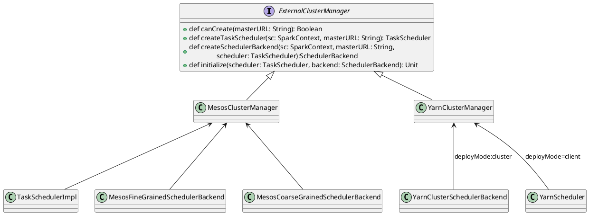

对于Mesos、YARN等资源管理框架，Spark抽象出`ExternalClusterManager`特质，在其上派生出`YarnClusterManager`、`MesosClusterManager`等，它们对外提供创建task scheduler和Scheduler banckend的接口。

```
org.apache.spark.SparkContext#createTaskScheduler
    org.apache.spark.SparkContext#getClusterManager(获取ExternalClusterManager)
        org.apache.spark.scheduler.ExternalClusterManager#canCreate
    org.apache.spark.scheduler.ExternalClusterManager#createTaskScheduler
    org.apache.spark.scheduler.ExternalClusterManager#createSchedulerBackend
    org.apache.spark.scheduler.ExternalClusterManager#initialize
```
去除一些异常处理，了解创建task scheduler的主流程
```scala
private def createTaskScheduler(sc: SparkContext, master: String)
        : (SchedulerBackend, TaskScheduler) = {
            ....
    master match {
            ......
      case masterUrl =>
        val cm = getClusterManager(masterUrl) match {
          case Some(clusterMgr) => clusterMgr
        }

        val scheduler = cm.createTaskScheduler(sc, masterUrl)
        val backend = cm.createSchedulerBackend(sc, masterUrl, scheduler)
        cm.initialize(scheduler, backend)
        (backend, scheduler)
    }
  }
```

# Yarn资源管理
```scala
private[spark] class YarnClusterManager extends ExternalClusterManager {
  override def canCreate(masterURL: String): Boolean = {
    masterURL == "yarn"
  }

  override def createTaskScheduler(sc: SparkContext, masterURL: String): TaskScheduler = {
    sc.deployMode match {
      case "cluster" => new YarnClusterScheduler(sc)
      case "client" => new YarnScheduler(sc)
      case _ => throw new SparkException(s"Unknown deploy mode '${sc.deployMode}' for Yarn")
    }
  }

  override def createSchedulerBackend(sc: SparkContext,
      masterURL: String,
      scheduler: TaskScheduler): SchedulerBackend = {
    sc.deployMode match {
      case "cluster" =>
        new YarnClusterSchedulerBackend(scheduler.asInstanceOf[TaskSchedulerImpl], sc)
      case "client" =>
        new YarnClientSchedulerBackend(scheduler.asInstanceOf[TaskSchedulerImpl], sc)
      case  _ =>
        throw new SparkException(s"Unknown deploy mode '${sc.deployMode}' for Yarn")
    }
  }

  override def initialize(scheduler: TaskScheduler, backend: SchedulerBackend): Unit = {
    scheduler.asInstanceOf[TaskSchedulerImpl].initialize(backend)
  }
}
```