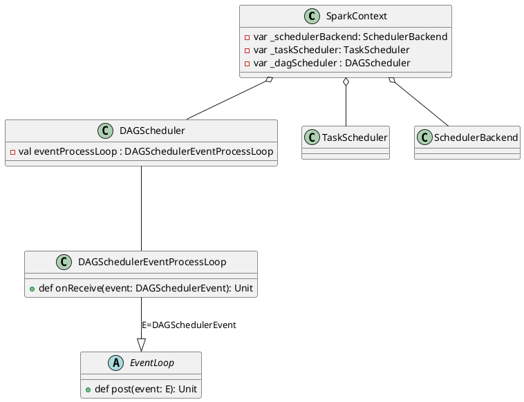
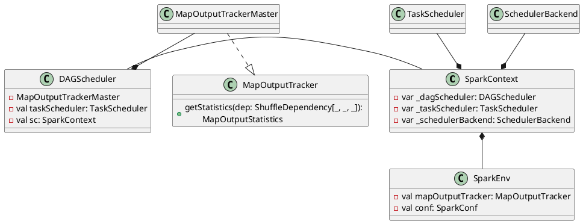
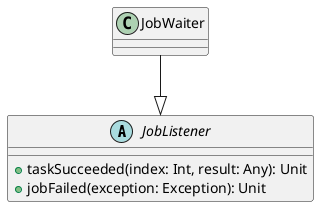
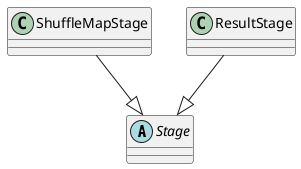

```scala
org.apache.spark.SparkContext#runJob
  org.apache.spark.scheduler.DAGScheduler#runJob
    org.apache.spark.scheduler.DAGScheduler#submitJob (返回JobWaiter Object)
      eventProcessLoop#post(JobSubmitted(...)) // 提交JobSubmitted Event
```

DAGSchedulerEventProcessLoop::doOnReceive对接收到的JobSubmitted Event处理，调用`dagScheduler.handleJobSubmitted`,忽略一些异常处理来了解其主执行流程

```scala
private[scheduler] def handleJobSubmitted(jobId: Int,
    finalRDD: RDD[_], func: (TaskContext, Iterator[_]) => _,
    partitions: Array[Int], callSite: CallSite, listener: JobListener,
    artifacts: JobArtifactSet, properties: Properties): Unit = {
  var finalStage: ResultStage = null
  // 1. create ResultStage,这个接口会获取宽依赖创建ShuffleMapStage
  finalStage = createResultStage(finalRDD, func, partitions, jobId, callSite)
  
  // Job submitted, clear internal data.
  barrierJobIdToNumTasksCheckFailures.remove(jobId)

  val job = new ActiveJob(jobId, finalStage, callSite, listener, artifacts, properties)
  clearCacheLocs()

  val jobSubmissionTime = clock.getTimeMillis()
  jobIdToActiveJob(jobId) = job
  activeJobs += job
  finalStage.setActiveJob(job)
  val stageIds = jobIdToStageIds(jobId).toArray
  val stageInfos = stageIds.flatMap(id => stageIdToStage.get(id).map(_.latestInfo))
  listenerBus.post(SparkListenerJobStart(job.jobId, jobSubmissionTime, stageInfos,
      Utils.cloneProperties(properties)))
  submitStage(finalStage)
}
```

```scala
org.apache.spark.scheduler.DAGScheduler#handleJobSubmitted
  getShuffleDependenciesAndResourceProfiles // 获取到 shuffleDeps
  // 如果存在shuffle，创建ShuffleMapStage
    
  org.apache.spark.scheduler.DAGScheduler#getOrCreateParentStages
    org.apache.spark.scheduler.DAGScheduler#getOrCreateShuffleMapStage
      org.apache.spark.scheduler.DAGScheduler#createShuffleMapStage
  org.apache.spark.scheduler.DAGScheduler#getOrCreateParentStages()
  org.apache.spark.scheduler.DAGScheduler#createResultStage
```


```scala
private[scheduler] sealed trait DAGSchedulerEvent

private[scheduler] case class JobSubmitted(...)
  extends DAGSchedulerEvent

private[scheduler] case class MapStageSubmitted(...)
  extends DAGSchedulerEvent
    ....
```

```scala
private[scheduler] class DAGSchedulerEventProcessLoop(dagScheduler: DAGScheduler)
  extends EventLoop[DAGSchedulerEvent]("dag-scheduler-event-loop") with Logging {

  // The main event loop of the DAG scheduler.
  override def onReceive(event: DAGSchedulerEvent): Unit = {
    doOnReceive(event)
  }

  private def doOnReceive(event: DAGSchedulerEvent): Unit = event match {
    // 通过createResultStage创建ResultStage
    case JobSubmitted(jobId, rdd, func, partitions, callSite, listener, artifacts, properties) =>
      dagScheduler.handleJobSubmitted(jobId, rdd, func, partitions, callSite, listener, artifacts,
        properties)

    // 通过getOrCreateShuffleMapStage创建ShuffleMapStage
    case MapStageSubmitted(jobId, dependency, callSite, listener, artifacts, properties) =>
      dagScheduler.handleMapStageSubmitted(jobId, dependency, callSite, listener, artifacts,
        properties)
      				......
  }
```

任务调度模块主要包含两大部分，即DAGScheduler和TaskScheduler，它们负责将用户提交的计算任务按照DAG划分为不同的阶段并且将不同阶段的计算任务提交到集群进行最终的计算。

- DAGScheduler主要负责分析用户提交的应用，并根据计算任务的依赖关系建立DAG，然后将DAG划分为不同的Stage(阶段)，其中每个Stage由可以并发执行的一组Task构成，这些Task的执行逻辑完全相同，只是作用于不同的数据，DAG在不同的资源管理框架(即部署方式，包括Standalone、Mesos、YARN、Local、EC2等)下的实现相同。
- 在DAGScheduler将这组Task划分完成后，会将这组Task提交到TaskScheduler。TaskScheduler通过Cluster Manager在集群中的某个Worker的Executor上启动任务。

```scala
class DAGScheduler
trait TaskScheduler {}
```

```scala
abstract class Stage
class ShuffleMapStage
class ResultStage(
```


任务调度模块涉及的最重要的三个类是：

1. `org.apache.spark.scheduler.DAGScheduler`，主要负责分析用户提交的应用，并根据计算任务的依赖关系建立DAG，然后将DAG划分为不同的Stage(阶段)。
2. `org.apache.spark.scheduler.SchedulerBackend`，这是一个trait，作用是分配当前可用的资源，具体就是向当前等待分配计算资源的Task分配计算资源(即Executor)，并且在分配的Executor上启动Task，完成计算的调度过程。
3. `org.apache.spark.scheduler.TaskScheduler`，这也是一个trait，作用是为创建它的SparkContext调度任务，即从DAGScheduler接收不同Stage的任务，并向集群提交任务，并为执行特别慢的任务启动备份任务。TaskScheduler是以后实现多种任务调度器的基础，目前`org.apache.spark.scheduler.TaskSchedulerImpl`是唯一实现。


#  DAGScheduler

DAGScheduler主要负责分析用户提交的应用，并根据计算任务的依赖关系建立DAG，然后将DAG划分为不同的Stage(阶段)，其中每个Stage由可以并发执行的一组Task构成，这些Task的执行逻辑完全相同，只是作用于不同的数据，DAG在不同的资源管理框架下实现相同。


```scala
private[spark] class DAGScheduler(
    private[scheduler] val sc: SparkContext,
    private[scheduler] val taskScheduler: TaskScheduler,
    listenerBus: LiveListenerBus,
    mapOutputTracker: MapOutputTrackerMaster,
    blockManagerMaster: BlockManagerMaster,
    env: SparkEnv,
    clock: Clock = new SystemClock())
  extends Logging {}
```



JobListener是一种特质，
```scala
// org.apache.spark.scheduler

private[spark] trait JobListener {
  def taskSucceeded(index: Int, result: Any): Unit
  def jobFailed(exception: Exception): Unit
}
```
```scala
private[spark] class JobWaiter[T](
    dagScheduler: DAGScheduler,
    val jobId: Int,
    totalTasks: Int,
    resultHandler: (Int, T) => Unit)
  extends JobListener with Logging {

  }
```

# Stage
用Stage进行Stage的表示，在其上派生出
1. ShuffleMapStage
2. ResultStage





## 创建Stage
```scala
private[scheduler] class DAGSchedulerEventProcessLoop(dagScheduler: DAGScheduler)
  extends EventLoop[DAGSchedulerEvent]("dag-scheduler-event-loop") with Logging {

  // The main event loop of the DAG scheduler.
  override def onReceive(event: DAGSchedulerEvent): Unit = {
    doOnReceive(event)
  }

  private def doOnReceive(event: DAGSchedulerEvent): Unit = event match {
    // 通过createResultStage创建ResultStage
    case JobSubmitted(jobId, rdd, func, partitions, callSite, listener, artifacts, properties) =>
      dagScheduler.handleJobSubmitted(jobId, rdd, func, partitions, callSite, listener, artifacts,
        properties)

    // 通过getOrCreateShuffleMapStage创建ShuffleMapStage
    case MapStageSubmitted(jobId, dependency, callSite, listener, artifacts, properties) =>
      dagScheduler.handleMapStageSubmitted(jobId, dependency, callSite, listener, artifacts,
        properties)
      				......
  }
```


```scala
  private def getOrCreateParentStages(shuffleDeps: HashSet[ShuffleDependency[_, _, _]],
      firstJobId: Int): List[Stage] = {
    shuffleDeps.map { shuffleDep =>
      getOrCreateShuffleMapStage(shuffleDep, firstJobId)
    }.toList
  }
```

```scala
  private[scheduler] def getShuffleDependenciesAndResourceProfiles(
      rdd: RDD[_]): (HashSet[ShuffleDependency[_, _, _]], HashSet[ResourceProfile]) = {
    val parents = new HashSet[ShuffleDependency[_, _, _]]
    val resourceProfiles = new HashSet[ResourceProfile]
    val visited = new HashSet[RDD[_]]
    val waitingForVisit = new ListBuffer[RDD[_]]
    waitingForVisit += rdd
    while (waitingForVisit.nonEmpty) {
      val toVisit = waitingForVisit.remove(0)
      if (!visited(toVisit)) {
        visited += toVisit
        Option(toVisit.getResourceProfile).foreach(resourceProfiles += _)
        toVisit.dependencies.foreach {
          case shuffleDep: ShuffleDependency[_, _, _] =>
            parents += shuffleDep
          case dependency =>
            waitingForVisit.prepend(dependency.rdd)
        }
      }
    }
    (parents, resourceProfiles)
  }
```

## 提交Stage
```
org.apache.spark.SparkContext#submitMapStage
org.apache.spark.scheduler.DAGScheduler#submitMapStage


```

```scala
class SimpleFutureAction[T] private[spark](jobWaiter: JobWaiter[_], resultFunc: => T)
  extends FutureAction[T] {}
trait FutureAction[T] extends Future[T] 
```

```scala
private[spark] class MapOutputStatistics(val shuffleId: Int, val bytesByPartitionId: Array[Long])
```

```scala
private[spark] class MapOutputTrackerMaster(
    conf: SparkConf,
    private[spark] val broadcastManager: BroadcastManager,
    private[spark] val isLocal: Boolean)
  extends MapOutputTracker(conf) {

  // Return statistics about all of the outputs for a given shuffle.
  def getStatistics(dep: ShuffleDependency[_, _, _]): MapOutputStatistics = {
  }
```