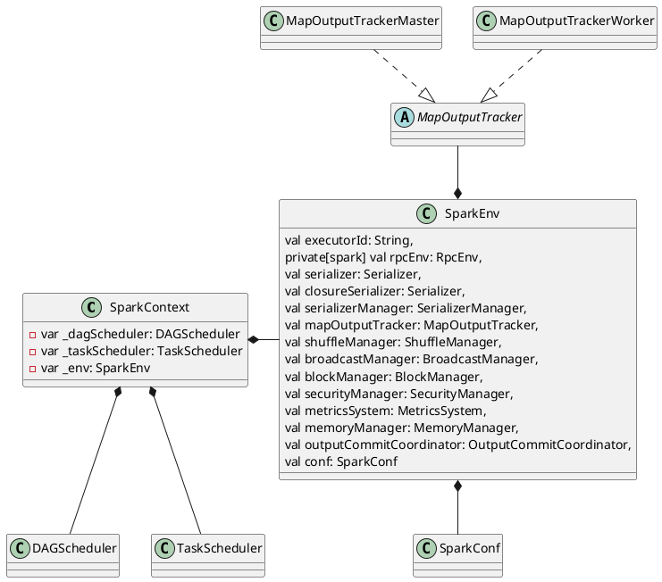

# 运行环境信息

SparkEnv中包含了一个运行时节点所需要的所有的环境信息。cacheManager是org.apache.spark.CacheManager，它负责调用BlockManager来管理RDD的缓存，如果当前RDD原来计算过并且把结果缓存起来，那么接下来的运算都可以通过BlockManager来直接读取缓存后返回。SparkEnv除了cacheManager，还包括以下重要的成员变量：
1. akka.actor.ActorSystem：运行在该节点的Actor System，其中运行在Driver上的名字是sparkDriver；运行在Executor上的是sparkExecutor。
2. org.apache.spark.serializer.Serializer：序列化和发序列化的工具。
3. org.apache.spark.MapOutputTracker；保存Shuffle Map Task输出的位置信息。其中在Driver上的Tracer是org.apache.spark.MapOutputTrackerMaster；而在Executor上的Tracker是org.apache.spark.MapOutputTrackerWorker，它会从org.apache.spark.MapOutputTrackerMaster获取信息。
4. org.apache.spark.shuffle.ShuffleManager：Shuffle的管理者，其中Driver端会注册Shuffle的信息，而Executor端会上报和获取Shuffle的信息。现阶段内置支持Hash Based Shuffle和Sort Based Shuffle
5. org.apache.spark.broadcast.BroadcastManager：广播变量的管理者。
6. org.apache.spark.network.BlockTransferService：Executor读取Shuffle数据的Client。当前支持netty和nio，可以通过spark.shuffle.blockTransferService来设置。具体详情可以参阅第7章。
7. org.apache.spark.storage.BlockManager：提供了Storage模块与其他模块的交互接口，管理Storage模块。
8. org.apache.spark.SecurityManager：Spark对于认证授权的实现。
9. org.apache.spark.HttpFileServer：可以提供HTTP服务的Server。当前主要用于Executor端下载依赖。
10. org.apache.spark.metrics.MetricsSystem：用于搜集统计信息。
11. org.apache.spark.shuffle.ShuffleMemoryManager：管理Shuffle过程中使用的内存。ExternalAppendOnlyMap和ExternalSorter都会从ShuffleMemoryManager中申请内存，在数据spill到Disk后会释放内存。当然了，当Task退出时这个内存也会被回收。为了使得每个thread都会比较公平地获取内存资源，避免一个thread申请了大量内存后造成其他的thread需要频繁地进行spill操作，它采取的内存分配策略是：对于N个thread，每个thread可以至少申请1/(2*N)的内存，但是至多申请1/N, N动态变化.
