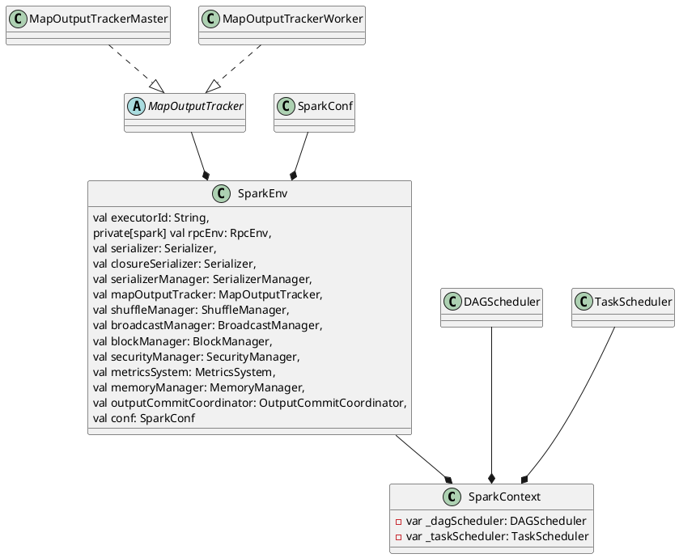

```plantuml
@startuml
class SparkContext {
 - var _dagScheduler: DAGScheduler
 - var _taskScheduler: TaskScheduler
}

class SparkEnv {
    val executorId: String,
    private[spark] val rpcEnv: RpcEnv,
    val serializer: Serializer,
    val closureSerializer: Serializer,
    val serializerManager: SerializerManager,
    val mapOutputTracker: MapOutputTracker,
    val shuffleManager: ShuffleManager,
    val broadcastManager: BroadcastManager,
    val blockManager: BlockManager,
    val securityManager: SecurityManager,
    val metricsSystem: MetricsSystem,
    val memoryManager: MemoryManager,
    val outputCommitCoordinator: OutputCommitCoordinator,
    val conf: SparkConf
}

abstract class MapOutputTracker {

}

DAGScheduler -down-* SparkContext
SparkEnv -down-* SparkContext
TaskScheduler -down-* SparkContext

MapOutputTracker -down-*SparkEnv
SparkConf -down-*SparkEnv

MapOutputTrackerMaster -down.|> MapOutputTracker
MapOutputTrackerWorker -down.|> MapOutputTracker
@enduml
```