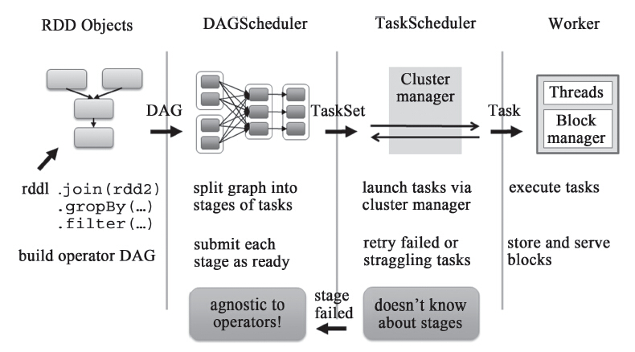
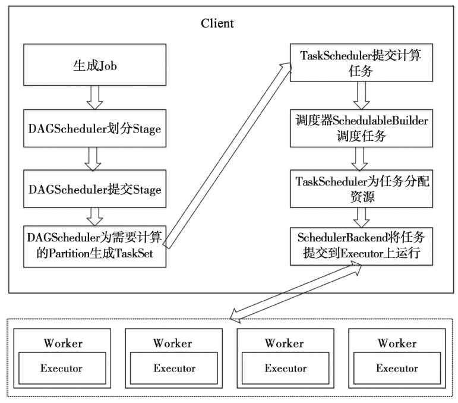
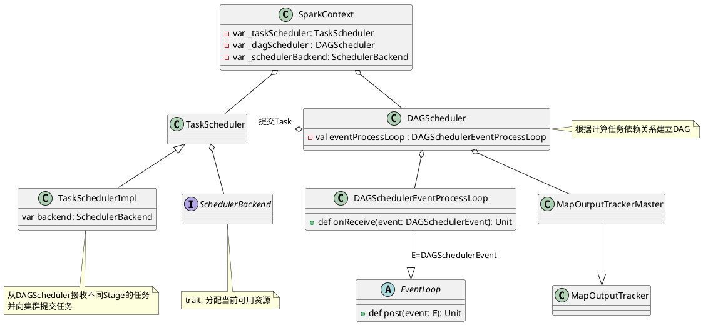
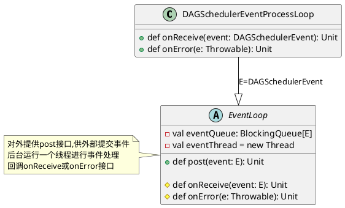
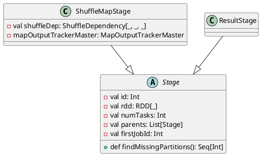
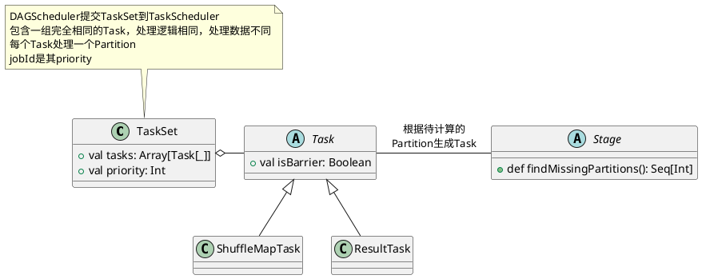
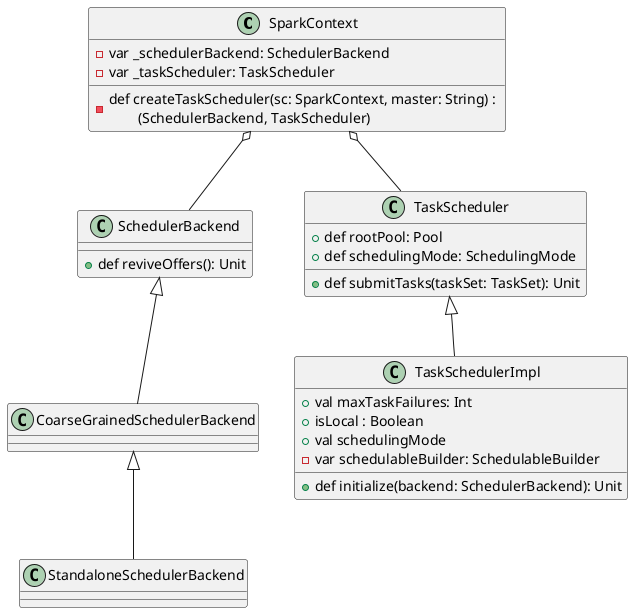
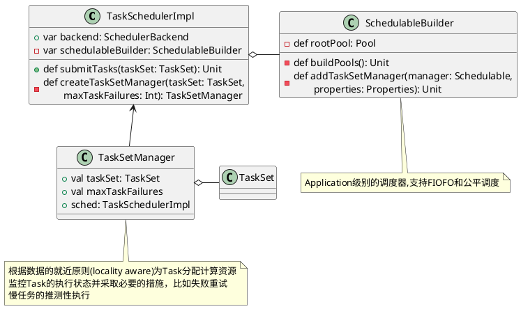
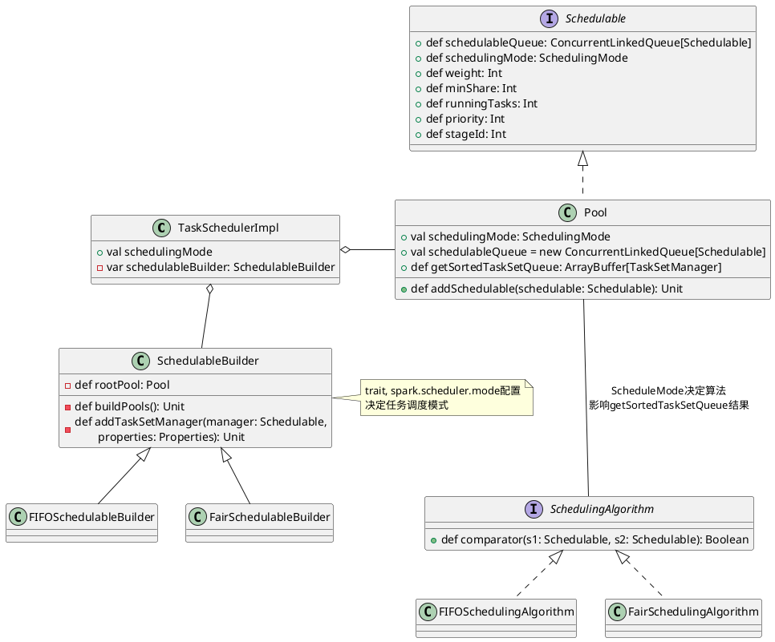
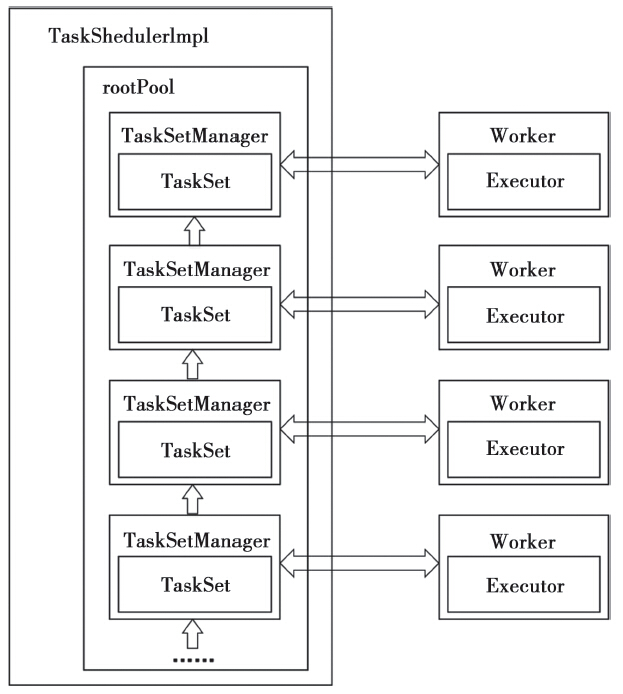

Scheduler(任务调度, 即组成应用的多个Job之间如何分配计算资源)模块作为Spark Core的核心模块之一。Spark对于DAG(Directed Acyclic Graph，有向无环图)的实现及不同执行阶段的划分和任务的提交执行，充分体现了其设计的优雅和高效。

任务调度模块主要包含两大部分，即DAGScheduler和TaskScheduler，它们负责将用户提交的计算任务按照DAG划分为不同的阶段并且将不同阶段的计算任务提交到集群进行最终的计算。
<center>
    
    <div>任务调度逻辑视图</div><br/>
</center>

- `DAGScheduler`主要负责分析用户提交的应用，并根据计算任务的依赖关系建立DAG，然后将DAG划分为不同的Stage(阶段)，其中每个Stage由可以并发执行的一组Task构成，这些Task的执行逻辑完全相同，只是作用于不同的数据。DAG在不同的资源管理框架(即部署方式，包括Standalone、Mesos、YARN、Local、EC2等)下的实现是相同的。DAGScheduler将这组Task划分完成后，会将这组Task提交到TaskScheduler。
- `TaskScheduler`通过Cluster Manager在集群中的某个Worker的Executor上启动任务。在Executor中运行的任务，如果缓存中没有计算结果，那么就需要开始计算，同时，计算的结果会回传到Driver或者保存在本地。在不同的资源管理框架下，TaskScheduler的实现方式是有差别的，最重要的实现是`org.apache.spark.scheduler.TaskSchedulerImpl`。对于Local、Standalone和Mesos来说，它们的TaskScheduler就是`TaskSchedulerImpl`；对于YARN Cluster和YARN Client的TaskScheduler的实现也是继承自`TaskSchedulerImpl`。

任务调度模块涉及的最重要的三个类是：
1. `org.apache.spark.scheduler.DAGScheduler`
2. `org.apache.spark.scheduler.SchedulerBackend`,是一个trait，作用是分配当前可用的资源，具体就是向当前等待分配计算资源的Task分配计算资源(即Executor)，并且在分配的Executor上启动Task，完成计算的调度过程。它使用reviveOffers完成上述的任务调度。`org.apache.spark.scheduler.cluster.CoarseGrainedSchedulerBackend`是SchedulerBackend的一个实现，同时YARN、Standalone和Mesos都是基于它加入了自身特有的逻辑。
3. `org.apache.spark.scheduler.TaskScheduler`也是一个trait，为创建它的SparkContext调度任务，即从DAGScheduler接收不同Stage的任务，并且向集群提交这些任务，并为执行特别慢的任务启动备份任务。TaskScheduler是以后实现多种任务调度器的基础，当前`org.apache.spark.scheduler.TaskSchedulerImpl`是唯一实现。TaskSchedulerImpl会在以下几种场景下调用org.apache.spark.scheduler.Scheduler-Backend#reviveOffers：
    1. 有新任务提交时。
    2. 有任务执行失败时。
    3. 计算节点（即Executor）不可用时。
    4. 某些任务执行过慢而需要为它重新分配资源时

任务调度逻辑图：
<center>
    
    <div>任务调度的逻辑图</div><br/>
</center>

# DAGScheduler实现
## DAGScheduler创建
DAGScheduler在SparkContext创建的时候创建的，由于DAGScheduler引用了TaskScheduler，因此需要先创建TaskScheduler
```scala
    // 创建TaskScheduler并调用TaskScheduler::initialize
    val (sched, ts) = SparkContext.createTaskScheduler(this, master)
    _schedulerBackend = sched
    _taskScheduler = ts
    // 创建DAGScheduler
    _dagScheduler = new DAGScheduler(this)
```

在`DAGSchedule`入参`SparkContext`的辅助构造器:
```scala
def this(sc: SparkContext) = this(sc, sc.taskScheduler)

// 辅助构造器
def this(sc: SparkContext, taskScheduler: TaskScheduler) = {
this(
    sc, taskScheduler, sc.listenerBus,
    sc.env.mapOutputTracker.asInstanceOf[MapOutputTrackerMaster],
    sc.env.blockManager.master, sc.env)
}
```
`this(sc, sc.taskScheduler)`调用主构造器：
```scala
// 主构造器
private[spark] class DAGScheduler(
    private[scheduler] val sc: SparkContext,
    private[scheduler] val taskScheduler: TaskScheduler,
    listenerBus: LiveListenerBus,
    // 运行在Driver端管理Shuffle Map Task的输出的
    // 下游的Task通过MapOutputTrackerMaster获取Shuffle输出的位置信息
    mapOutputTracker: MapOutputTrackerMaster,
    // 运行在Driver端的，管理整个Job的Block的信息
    blockManagerMaster: BlockManagerMaster,
    env: SparkEnv, clock: Clock = new SystemClock())
  extends Logging {
    // 将调度抽象为一系列的Event(时间)，例如Job提交对应于JobSubmitted
    // MapStageSubmitted对应于Map Stage提交等
    private[spark] var eventProcessLoop = new DAGSchedulerEventProcessLoop(this)
    ......
  }
```

`DAGScheduler`将调度抽象为一系列的Event(时间)，例如Job提交对应于`JobSubmitted`，MapStageSubmitted对应于Map Stage提交等(更多定义参看`core/src/main/scala/org/apache/spark/scheduler\DAGSchedulerEvent.scala`实现)，`DAGSchedulerEventProcessLoop`实现事件调度逻辑,例如
```scala
private[scheduler] sealed trait DAGSchedulerEvent

private[scheduler] case class JobSubmitted(...)
  extends DAGSchedulerEvent

private[scheduler] case class MapStageSubmitted(...)
  extends DAGSchedulerEvent
    ....
```




## Job提交
Job提交的调用流程
```scala
org.apache.spark.SparkContext#runJob
  org.apache.spark.scheduler.DAGScheduler#runJob
    org.apache.spark.scheduler.DAGScheduler#submitJob (生成并返回JobWaiter Object)
      // 提交JobSubmitted Event,Event放入eventQueue等待后台线程调度
      DAGSchedulerEventProcessLoop#post(JobSubmitted(...))
      

org.apache.spark.scheduler.DAGSchedulerEventProcessLoop#onReceive(JobSubmitted)
  org.apache.spark.scheduler.DAGScheduler#handleJobSubmitted
```

```plantuml
class DAGScheduler {
  - val eventProcessLoop : DAGSchedulerEventProcessLoop
  + def submitJob[T, U](rdd: RDD[T], func: (TaskContext, Iterator[T]) \n\t=> U,partitions: Seq[Int],callSite: CallSite,\n\tresultHandler: (Int, U) => Unit,properties: Properties): JobWaiter[U]
}

class DAGSchedulerEventProcessLoop {
  + def onReceive(event: DAGSchedulerEvent): Unit
  + def onError(e: Throwable): Unit
  + def onStop(): Unit
}

abstract class EventLoop {
  - val eventQueue: BlockingQueue[E]
  - val eventThread = new Thread

  + def post(event: E): Unit
  + def start(): Unit
  + def stop(): Unit
  # def onReceive(event: E): Unit
  # def onError(e: Throwable): Unit
  # def onStop(): Unit
  # def onStart(): Unit
}

DAGSchedulerEventProcessLoop -up-o DAGScheduler : 提交(post)JobSubmitted事件
DAGSchedulerEventProcessLoop -right-|> EventLoop : E=DAGSchedulerEvent
```

Job提交会为这个Job生成一个JobID，并生成一个JobWaiter实例例来监听Job执行状态，JobWaiter会监听Job的执行状态，而Job是由多个Task组成的，只有Job的所有Task都成功完成，Job才标记为成功；任意一个Task失败都会标记该Job失败。

```scala
def runJob[T, U](rdd: RDD[T], func: (TaskContext, Iterator[T]) => U,
    partitions: Seq[Int], callSite: CallSite,
    resultHandler: (Int, U) => Unit, properties: Properties): Unit = {

  // submitJob内部会为Job生成一个JobID，创建并返回一个JobWaiter实例
  val waiter = submitJob(rdd, func, partitions, callSite, resultHandler, properties)
        ......
}

def submitJob[T, U](rdd: RDD[T], func: (TaskContext, Iterator[T]) => U,
    partitions: Seq[Int], callSite: CallSite,
    resultHandler: (Int, U) => Unit, properties: Properties): JobWaiter[U] = {

  // 1. 创建Job ID
  val jobId = nextJobId.getAndIncrement()
  
  // 2. 创建JobListener(JobWaiter)实例来监听Job执行状态
  if (partitions.isEmpty) {
    // 2.1 创建共有0个task的JobWaiter，
            ......
    listenerBus.post(SparkListenerJobStart(jobId, time, Seq.empty, clonedProperties))
    listenerBus.post(SparkListenerJobEnd(jobId, time, JobSucceeded))
    return new JobWaiter[U](this, jobId, 0, resultHandler)
  }

  // 2.2 创建JobWaiter并提交JobSubmitted事件
  // DAGSchedulerEventProcessLoop::onReceive看到
  // 之后执行handleJobSubmitted
  val func2 = func.asInstanceOf[(TaskContext, Iterator[_]) => _]
  val waiter = new JobWaiter[U](this, jobId, partitions.size, resultHandler)
  eventProcessLoop.post(JobSubmitted(....))

  waiter
}
```

对于近似估计的Job，DAGScheduler会调用`runApproximateJob`，其逻辑类似，JobWaiter换成了`org.apache.spark.partial.ApproximateActionListener`
```scala
def runApproximateJob[T, U, R](rdd: RDD[T], func: (TaskContext, Iterator[T]) => U,
    evaluator: ApproximateEvaluator[U, R], callSite: CallSite,
    timeout: Long, properties: Properties): PartialResult[R] = {
  // 1. 创建Job ID
  val jobId = nextJobId.getAndIncrement()

  // 2. 创建JobListener(ApproximateActionListener)实例来监听Job执行状态
  if (rdd.partitions.isEmpty) {
    // 2.1 直接返回
            ......
    listenerBus.post(SparkListenerJobStart(jobId, time, Seq[StageInfo](), clonedProperties))
    listenerBus.post(SparkListenerJobEnd(jobId, time, JobSucceeded))
    return new PartialResult(evaluator.currentResult(), true)
  }


  // 2.2 创建ApproximateActionListener并提交JobSubmitted事件
  // 对于obSubmitted事件，执行handleJobSubmitted
  val listener = new ApproximateActionListener(rdd, func, evaluator, timeout)
  val func2 = func.asInstanceOf[(TaskContext, Iterator[_]) => _]
  eventProcessLoop.post(JobSubmitted(
    jobId, rdd, func2, rdd.partitions.indices.toArray, callSite, listener,
    JobArtifactSet.getActiveOrDefault(sc), clonedProperties))
  
  // 3. 异步等待结果，timeout毫秒超时
  listener.awaitResult()
}
```

### 调度事件处理
`DAGScheduler`将调度抽象为一系列的Event(时间)，例如Job提交对应于`JobSubmitted`，MapStageSubmitted对应于Map Stage提交等

`EventLoop`对外提供post接口,将事件添加到事件队列，后台有一个事件处理队列，取出事件进行处理，忽略异常和一些非关键信息了解主处理逻辑
```scala
private[spark] abstract class EventLoop[E](name: String) extends Logging {
  private val eventQueue: BlockingQueue[E] = new LinkedBlockingDeque[E]()
  private val stopped = new AtomicBoolean(false)

  private[spark] val eventThread = new Thread(name) {
    setDaemon(true)
    override def run(): Unit = {
      while (!stopped.get) {
        // 从队列中取出事件进行处理
        val event = eventQueue.take()
        try {
          // 子类实现onReceive，调用onReceive执行子类处理逻辑
          onReceive(event)
        } catch {
          case NonFatal(e) =>
            // 调用onError进行Error处理
            onError(e)
        }
      }
    }
  }

  // 外部接口提交事件
  def post(event: E): Unit = {
    if (!stopped.get) {
      if (eventThread.isAlive) {
        // 将事件放入事件队列
        eventQueue.put(event)
      } else {
        onError(new IllegalStateException(...))
      }
    }
  }
```
`DAGSchedulerEventProcessLoop::doOnReceive`对接收到的JobSubmitted Event处理，调用`dagScheduler.handleJobSubmitted`,忽略一些异常处理来了解其主执行流程
```scala
private[scheduler] class DAGSchedulerEventProcessLoop(dagScheduler: DAGScheduler)
  extends EventLoop[DAGSchedulerEvent]("dag-scheduler-event-loop") with Logging {

  // The main event loop of the DAG scheduler.
  override def onReceive(event: DAGSchedulerEvent): Unit = {
    doOnReceive(event)
  }

  private def doOnReceive(event: DAGSchedulerEvent): Unit = event match {
    // 通过createResultStage创建ResultStage
    // Job提交之后调用dagScheduler.handleJobSubmitted
    case JobSubmitted(jobId, rdd, func, partitions, callSite,
          listener, artifacts, properties) =>
      dagScheduler.handleJobSubmitted(jobId, rdd, func,
          partitions, callSite, listener, artifacts,properties)

    // 通过getOrCreateShuffleMapStage创建ShuffleMapStage
    case MapStageSubmitted(jobId, dependency, callSite, 
          listener, artifacts, properties) =>
      dagScheduler.handleMapStageSubmitted(jobId, dependency,
          callSite, listener, artifacts, properties)
      				......
  }
```

## Stage划分

`DAGScheduler#handleJobSubmitted`首先会根据RDD创建finalStage(也就是最后的那个stage)。然后创建ActiveJob后提交计算任务。在讨论这个过程的实现之前，先看一下究竟什么是Stage。

用户提交的计算任务是一个由RDD构成的DAG，如果RDD在转换的时候需要做Shuffle，那么这个Shuffle的过程就将这个DAG分为了不同的阶段(即Stage)。由于Shuffle的存在，不同的Stage不能并行计算，因为后面Stage的计算需要前面Stage的Shuffle的结果。而一个Stage由一组完全独立的计算任务（即Task）组成，每个Task的运算逻辑完全相同，只不过每个Task都会处理其所对应的Partition。其中，Partition的数量和Task的数量一致，即一个Partition会被该Stage的一个Task处理。

### 划分依据
那么RDD在哪种转换的时候需要Shuffle呢？这个取决于该RDD和它所依赖的RDD(s)的关系。RDD和它依赖的parent RDD(s)的关系有两种不同的类型，即窄依赖(narrow dependency)和宽依赖(wide dependency)。
- 对窄依赖，由于RDD每个Partition依赖固定数量的parent RDD的Partition，可以通过一个Task来处理这些Partition，而且这些Partition相互独立，所以这些Task可以并行执行。
- 宽依赖，由于需要Shuffle，只有所有的parent RDD的Partition Shuffle完成，新的Partition才会形成，接下来的Task才可以继续处理。宽依赖可以认为是DAG的分界线，或者说Spark根据宽依赖将Job划分为不同的阶段(Stage)。

### 划分过程


`DAGScheduler.handleJobSubmitted`忽略异常处理和非重点了解其实现主流程
```scala
private[scheduler] def handleJobSubmitted(jobId: Int,
    finalRDD: RDD[_], func: (TaskContext, Iterator[_]) => _,
    partitions: Array[Int], callSite: CallSite, listener: JobListener,
    artifacts: JobArtifactSet, properties: Properties): Unit = {
  var finalStage: ResultStage = null
  // 1. 创建finalStage,这个接口会获取宽依赖创建ShuffleMapStage
  finalStage = createResultStage(finalRDD, func, partitions, jobId, callSite)
  
  // Job submitted, clear internal data.
  barrierJobIdToNumTasksCheckFailures.remove(jobId)

  // 2. 创建ActiveJob
  val job = new ActiveJob(jobId, finalStage, callSite, listener, artifacts, properties)
  clearCacheLocs()

  val jobSubmissionTime = clock.getTimeMillis()
  jobIdToActiveJob(jobId) = job
  activeJobs += job

  // 3. 为finalStage设置ActiveJob
  finalStage.setActiveJob(job)
  val stageIds = jobIdToStageIds(jobId).toArray
  val stageInfos = stageIds.flatMap(id => stageIdToStage.get(id).map(_.latestInfo))
  listenerBus.post(SparkListenerJobStart(job.jobId, jobSubmissionTime, stageInfos,
      Utils.cloneProperties(properties)))

  // 4. Stage提交,这里会向TaskScheduler提交Task
  submitStage(finalStage)
}
```

```scala
private def createResultStage(
    rdd: RDD[_], func: (TaskContext, Iterator[_]) => _,
    partitions: Array[Int], jobId: Int,
    callSite: CallSite): ResultStage = {
  // 1. 广度优先遍历RDD依赖树获取ShuffleStage用于创建Stage
  val (shuffleDeps, resourceProfiles) = getShuffleDependenciesAndResourceProfiles(rdd)
  val resourceProfile = mergeResourceProfilesForStage(resourceProfiles)

  // 忽略barrier的处理, ......

  // 2. 将收集到的ShuffleDepency创建Stage
  val parents = getOrCreateParentStages(shuffleDeps, jobId)
  val id = nextStageId.getAndIncrement()

  // 3. 创建finalStage
  val stage = new ResultStage(id, rdd, func, partitions, parents,
      jobId, callSite, resourceProfile.id)
  stageIdToStage(id) = stage
  updateJobIdStageIdMaps(jobId, stage)
  stage
}
```

`DAGScheduler.getShuffleDependenciesAndResourceProfiles`根据RDD的依赖树获取ShuffleStage。
```scala
private[scheduler] def getShuffleDependenciesAndResourceProfiles(
    rdd: RDD[_]): (HashSet[ShuffleDependency[_, _, _]],
    HashSet[ResourceProfile]) = {
  // 存储parent dependency
  val parents = new HashSet[ShuffleDependency[_, _, _]]
  val resourceProfiles = new HashSet[ResourceProfile]
  // 存储已经访问过的RDD
  val visited = new HashSet[RDD[_]]
  val waitingForVisit = new ListBuffer[RDD[_]]
  waitingForVisit += rdd
  // 广度优先遍历RDD的依赖树
  while (waitingForVisit.nonEmpty) {
    val toVisit = waitingForVisit.remove(0)
    if (!visited(toVisit)) {
      visited += toVisit
      Option(toVisit.getResourceProfile()).foreach(resourceProfiles += _)
      // 逐个处理当前RDD依赖的parent RDD
      toVisit.dependencies.foreach {
        // 是ShuffleDependency依赖需要创建stage
        case shuffleDep: ShuffleDependency[_, _, _] =>
          parents += shuffleDep
        // 不是ShuffleDependency，那么属于同一stage
        case dependency =>
          waitingForVisit.prepend(dependency.rdd)
      }
    }
  }
  (parents, resourceProfiles)
}
```

`DAGScheduler.getOrCreateParentStages`为输入的不存在的ShufleMapStage创建Stage，并计算该ShuffleMapStage的RDD的shuffleMapDepency并创建ShuffleMapStage(即父Stage)。
```scala
private def getOrCreateParentStages(shuffleDeps: HashSet[ShuffleDependency[_, _, _]],
    firstJobId: Int): List[Stage] = {
  shuffleDeps.map { shuffleDep =>
    getOrCreateShuffleMapStage(shuffleDep, firstJobId)
  }.toList
}

private def getOrCreateShuffleMapStage(
    shuffleDep: ShuffleDependency[_, _, _],
    firstJobId: Int): ShuffleMapStage = {
  shuffleIdToMapStage.get(shuffleDep.shuffleId) match {
    // ShuffleMapStage已经存在,直接返回存储的stage
    case Some(stage) =>
      stage

    // 不存在,为ShuffleMapStage创建ShuffleMapStage
    case None =>
      // Create stages for all missing ancestor shuffle dependencies.
      getMissingAncestorShuffleDependencies(shuffleDep.rdd).foreach { dep =>
        if (!shuffleIdToMapStage.contains(dep.shuffleId)) {
          createShuffleMapStage(dep, firstJobId)
        }
      }
      createShuffleMapStage(shuffleDep, firstJobId)
  }
}

  def createShuffleMapStage[K, V, C](
      shuffleDep: ShuffleDependency[K, V, C], jobId: Int): ShuffleMapStage = {
    val rdd = shuffleDep.rdd
    val (shuffleDeps, resourceProfiles) = getShuffleDependenciesAndResourceProfiles(rdd)
    val resourceProfile = mergeResourceProfilesForStage(resourceProfiles)
  
    // 忽略Barrier操作....
  
    val numTasks = rdd.partitions.length
    val parents = getOrCreateParentStages(shuffleDeps, jobId)
    val id = nextStageId.getAndIncrement()

    // 创建ShuffleMapStage
    val stage = new ShuffleMapStage(id, rdd, numTasks, parents, jobId,
        rdd.creationSite, shuffleDep, mapOutputTracker, resourceProfile.id)
    stageIdToStage(id) = stage
    shuffleIdToMapStage(shuffleDep.shuffleId) = stage
    updateJobIdStageIdMaps(jobId, stage)

    if (!mapOutputTracker.containsShuffle(shuffleDep.shuffleId)) {
      mapOutputTracker.registerShuffle(shuffleDep.shuffleId, rdd.partitions.length,
        shuffleDep.partitioner.numPartitions)
    }
    stage
  }
```

## 任务生成
`DAGScheduler.handleJobSubmitted`生成finalStage后就会为该Job生成一个`org.apache.spark.scheduler.ActiveJob`，并准备计算这个finalStage。

### 提交Stage
`DAGScheduler`中维护了几个Hash表用于判断stage是否可以提交等
```scala
// jobId和Job的映射
private[scheduler] val jobIdToActiveJob = new HashMap[Int, ActiveJob]

// 等待parent stage未完成，等待parent stage的Stage集合
private[scheduler] val waitingStages = new HashSet[Stage]

// Task已经提交，运行中的Stage
private[scheduler] val runningStages = new HashSet[Stage]

// 由于获取到失败信息，需要重新提交的Stage
private[scheduler] val failedStages = new HashSet[Stage]

private[scheduler] val activeJobs = new HashSet[ActiveJob]
```

`DAGScheduler.submitStage`用于提交Stage，它实现将parent stage都完成的Stage，生成Task并提交。
```scala
private def submitStage(stage: Stage): Unit = {
  val jobId = activeJobForStage(stage)
  if (jobId.isDefined) {
    // 1. 有效的Stage
    if (!waitingStages(stage) && !runningStages(stage) && !failedStages(stage)) {
      // 如果当前stage不再等待parent stage的返回
      // 不是正在运行，且没有提示失败，那么尝试提交它
      if (stage.getNextAttemptId >= maxStageAttempts) {
        // 尝试了最大提交次数，直接终止
        val reason = s"....."
        abortStage(stage, reason, None)
      } else {
        val missing = getMissingParentStages(stage).sortBy(_.id)
        if (missing.isEmpty) {
          // 所有的parent stage都已经完成，向TaskScheduler提交stage所包含的task
          // 当前stage变为正在运行，加入runningStages
          submitMissingTasks(stage, jobId.get)
        } else {
          // 有parent stage未完成，递归提交
          for (parent <- missing) {
            submitStage(parent)
          }
          // 当前Stage有parent stage未提交，加入waitingStages
          waitingStages += stage
        }
      }
    }
  } else {
    // 2. 无效Stage,直接终止
    abortStage(stage, "No active job for stage " + stage.id, None)
  }
}
```

### 提交Task
`DAGScheduler.submitMissingTasks`完成DAGScheduler最后的工作，向`TaskScheduler`提交Task。
1. 先取得需要计算的Partition，对于最后的Stage，对应的Task是ResultTask，判断该Partition的`ResultTask`是否已经结束，如果结束那么就无需计算；对于其他的Stage，它们对应的Task都是`ShuffleMapTask`，只需要判断Stage是否有缓存的结果即可(结果都会缓存到`Stage#outputLocs`中)。
2. 判断出哪些Partition需要计算后，就会为每个Partition生成Task，然后这些Task会被封装到`org.apache.spark.scheduler.TaskSet`，然后提交给`TaskScheduler`。



```scala
  private def submitMissingTasks(stage: Stage, jobId: Int): Unit = {
    stage match {
      case sms: ShuffleMapStage if stage.isIndeterminate && !sms.isAvailable =>
        mapOutputTracker.unregisterAllMapAndMergeOutput(sms.shuffleDep.shuffleId)
        sms.shuffleDep.newShuffleMergeState()
      case _ =>
    }
    
    // 1. 获取需要计算的Partition
    val partitionsToCompute: Seq[Int] = stage.findMissingPartitions()

    val properties = jobIdToActiveJob(jobId).properties
    addPySparkConfigsToProperties(stage, properties)

    // 当前Stage转化为执行中，加入runningStages集合
    runningStages += stage
  
    stage match {
      case s: ShuffleMapStage =>
        outputCommitCoordinator.stageStart(stage = s.id, maxPartitionId = s.numPartitions - 1)
        // Only generate merger location for a given shuffle dependency once.
        if (s.shuffleDep.shuffleMergeAllowed) {
          if (!s.shuffleDep.isShuffleMergeFinalizedMarked) {
            prepareShuffleServicesForShuffleMapStage(s)
          } else {
            s.shuffleDep.setShuffleMergeAllowed(false)
          }
        }
      case s: ResultStage =>
        outputCommitCoordinator.stageStart(
          stage = s.id, maxPartitionId = s.rdd.partitions.length - 1)
    }

    // 计算Task Perferred Location,形成<id, TaskLocation>映射
    val taskIdToLocations: Map[Int, Seq[TaskLocation]] = try {
      stage match {
        case s: ShuffleMapStage =>
          partitionsToCompute.map { id =>
          (id, getPreferredLocs(stage.rdd, id))}.toMap
        case s: ResultStage =>
          partitionsToCompute.map { id =>
            val p = s.partitions(id)
            (id, getPreferredLocs(stage.rdd, p))
          }.toMap
      }
    } catch {
      case NonFatal(e) =>
        stage.makeNewStageAttempt(partitionsToCompute.size)
        listenerBus.post(SparkListenerStageSubmitted(stage.latestInfo,
          Utils.cloneProperties(properties)))
        abortStage(stage, s"Task creation failed: $e\n${Utils.exceptionString(e)}", Some(e))
        runningStages -= stage
        return
    }

    // 将stage中nextAttemptId自增1
    stage.makeNewStageAttempt(partitionsToCompute.size, taskIdToLocations.values.toSeq)
    if (partitionsToCompute.nonEmpty) {
      stage.latestInfo.submissionTime = Some(clock.getTimeMillis())
    }
    listenerBus.post(SparkListenerStageSubmitted(stage.latestInfo,
        Utils.cloneProperties(properties)))
  
    var taskBinary: Broadcast[Array[Byte]] = null
    var partitions: Array[Partition] = null
    // Broadcasted binary for the task, used to dispatch tasks to executors
    try {
      RDDCheckpointData.synchronized {
        taskBinaryBytes = stage match {
          case stage: ShuffleMapStage =>
            JavaUtils.bufferToArray(closureSerializer.serialize((
                stage.rdd, stage.shuffleDep): AnyRef))
          case stage: ResultStage =>
            JavaUtils.bufferToArray(closureSerializer.serialize((
                stage.rdd, stage.func): AnyRef))
        }
        partitions = stage.rdd.partitions
      }
      taskBinary = sc.broadcast(taskBinaryBytes)
    } catch {
      // 序列化失败，直接终止stage
      case e: NotSerializableException =>
        abortStage(stage, "Task not serializable: " + e.toString, Some(e))
        runningStages -= stage
        return
      case e: Throwable =>
        abortStage(stage, s"Task serialization failed: 
            $e\n${Utils.exceptionString(e)}", Some(e))
        runningStages -= stage
        return
    }

    val artifacts = jobIdToActiveJob(jobId).artifacts
    // 2. 为需要计算的Partition, 创建Task
    //    每个Partition对应一个Task
    val tasks: Seq[Task[_]] = try {
      val serializedTaskMetrics = closureSerializer.serialize(
          stage.latestInfo.taskMetrics).array()
      stage match {
        // ShuffleMapStage -> ShuffleMapTask
        case stage: ShuffleMapStage =>
          stage.pendingPartitions.clear()
          partitionsToCompute.map { id =>
            val locs = taskIdToLocations(id)
            val part = partitions(id)
            stage.pendingPartitions += id
            new ShuffleMapTask(stage.id, stage.latestInfo.attemptNumber(),
              taskBinary, part, stage.numPartitions, locs, artifacts, properties,
              serializedTaskMetrics, Option(jobId), Option(sc.applicationId),
              sc.applicationAttemptId,stage.rdd.isBarrier())
          }
        // ResultStage -> ResultTask
        case stage: ResultStage =>
          partitionsToCompute.map { id =>
            val p: Int = stage.partitions(id)
            val part = partitions(p)
            val locs = taskIdToLocations(id)
            new ResultTask(stage.id, stage.latestInfo.attemptNumber(),
              taskBinary, part, stage.numPartitions, locs, id, artifacts, properties,
              serializedTaskMetrics, Option(jobId), Option(sc.applicationId),
              sc.applicationAttemptId, stage.rdd.isBarrier())
          }
      }
    } catch {
      case NonFatal(e) =>
        abortStage(stage, s"Task creation failed: $e\n${Utils.exceptionString(e)}", Some(e))
        runningStages -= stage
        return
    }

    if (tasks.nonEmpty) {
      // 3. 待提交的Task不空，向TaskScheduler提交Task
      val shuffleId = stage match {
        case s: ShuffleMapStage => Some(s.shuffleDep.shuffleId)
        case _: ResultStage => None
      }
      taskScheduler.submitTasks(new TaskSet(
        tasks.toArray, stage.id, stage.latestInfo.attemptNumber(),
        jobId, properties, stage.resourceProfileId, shuffleId))
    } else {
      // Because we posted SparkListenerStageSubmitted earlier, we should mark
      // the stage as completed here in case there are no tasks to run
      stage match {
        case stage: ShuffleMapStage =>
          if (!stage.shuffleDep.isShuffleMergeFinalizedMarked &&
            stage.shuffleDep.getMergerLocs.nonEmpty) {
            checkAndScheduleShuffleMergeFinalize(stage)
          } else {
            processShuffleMapStageCompletion(stage)
          }
        case stage : ResultStage =>
          markStageAsFinished(stage)
          submitWaitingChildStages(stage)
      }
    }
  }
```

提交给`TaskScheduler`的是`TaskSet`，TaskSet保存了Stage包含的一组完全相同的Task，每个Task的处理逻辑完全相同，不同的是处理数据，每个Task负责处理一个Partition。对于一个Task来说，它从数据源获得逻辑，然后按照拓扑顺序，顺序执行。
```scala
private[spark] class TaskSet(
    val tasks: Array[Task[_]],
    val stageId: Int,
    val stageAttemptId: Int,
    // 对应jobId
    val priority: Int,
    val properties: Properties,
    val resourceProfileId: Int,
    val shuffleId: Option[Int]) {
  val id: String = s"$stageId.$stageAttemptId"
  override def toString: String = "TaskSet " + id
}
```

# 任务调度实现
每个TaskScheduler都对应一个SchedulerBackend。TaskScheduler负责Application的不同Job之间的调度，在Task执行失败时启动重试机制，并且为执行速度慢的Task启动备份的任务。而SchedulerBackend负责与Cluster Manager交互，取得该Application分配到的资源，并且将这些资源传给TaskScheduler，由TaskScheduler为Task最终分配计算资源。


## 配置参数

| 配置参数                       | 默认值 | 参数意义                                                     |
| ------------------------------ | ------ | ------------------------------------------------------------ |
| `spark.task.cpus`              | 1      | 每个任务配置的核心数                                         |
| `spark.scheduler.mode`         | FIFO   | 任务调度方式                                                 |
| `spark.speculation`            | false  | 是否开启任务的推测执行                                       |
| `spark.speculation.interval`   | 100ms  | Spark检测tasks推测机制的间隔时间                             |
| `spark.speculation.quantile`   | 0.9    | 当一个stage下多少百分比的tasks运行完毕后才开启推测执行机制<br/>0.9，表示90%的任务都运行完毕后开启推测执行 |
| `spark.speculation.multiplier` | 1.5    | 一个task的运行时间是所有task的运行时间中位数的几倍时<br/>会被认为该task需要重新启动 |


## TaskScheduler的创建

`TaskScheduler`由`SparkContext`主构造函数调用`createTaskScheduler`来创建，它会根据传入的Master的URL的规则判断集群的部署方式(或者说资源管理方式)，比如是Standalone、Mesos、YARN或者是Local等。根据不同的部署方式，生成不同的`TaskScheduler`和`SchedulerBackend`。`org.apache.spark.scheduler.SchedulerBackend`是一个trait，作用是分配当前可用的资源，具体就是向当前等待分配计算资源的Task分配计算资源(即Executor)，并且在分配的Executor上启动Task，完成计算的调度过程，由`reviveOffers`完成上述的任务调度, 是它最重要的实现。


```scala
private def createTaskScheduler(sc: SparkContext,
    master: String): (SchedulerBackend, TaskScheduler) = {
  import SparkMasterRegex._

  // 本地模式下执行，任务失败不重新执行
  val MAX_LOCAL_TASK_FAILURES = 1

  def checkResourcesPerTask(executorCores: Int): Unit = {
    // 配置参数(spark.task.cpus)每个任务配置的核心数
    val taskCores = sc.conf.get(CPUS_PER_TASK)
    if (!sc.conf.get(SKIP_VALIDATE_CORES_TESTING)) {
      validateTaskCpusLargeEnough(sc.conf, executorCores, taskCores)
    }
    val defaultProf = sc.resourceProfileManager.defaultResourceProfile
    ResourceUtils.warnOnWastedResources(defaultProf, sc.conf, Some(executorCores))
  }

  master match {
    // Local模式
    case "local" =>
      checkResourcesPerTask(1)
      val scheduler = new TaskSchedulerImpl(sc, MAX_LOCAL_TASK_FAILURES, isLocal = true)
      val backend = new LocalSchedulerBackend(sc.getConf, scheduler, 1)
      scheduler.initialize(backend)
      (backend, scheduler)

    case LOCAL_N_REGEX(threads) =>
      // local(*)机器可用的核心数, local(N)表示使用N个新城
      def localCpuCount: Int = Runtime.getRuntime.availableProcessors()
      val threadCount = if (threads == "*") localCpuCount else threads.toInt
      checkResourcesPerTask(threadCount)
      val scheduler = new TaskSchedulerImpl(sc, MAX_LOCAL_TASK_FAILURES, isLocal = true)
      val backend = new LocalSchedulerBackend(sc.getConf, scheduler, threadCount)
      scheduler.initialize(backend)
      (backend, scheduler)

    case LOCAL_N_FAILURES_REGEX(threads, maxFailures) =>
      def localCpuCount: Int = Runtime.getRuntime.availableProcessors()
      // local[*, M] means the number of cores on the computer with M failures
      // local[N, M] means exactly N threads with M failures
      val threadCount = if (threads == "*") localCpuCount else threads.toInt
      checkResourcesPerTask(threadCount)
      val scheduler = new TaskSchedulerImpl(sc, maxFailures.toInt, isLocal = true)
      val backend = new LocalSchedulerBackend(sc.getConf, scheduler, threadCount)
      scheduler.initialize(backend)
      (backend, scheduler)

    // stanalone模式
    case SPARK_REGEX(sparkUrl) =>
      val scheduler = new TaskSchedulerImpl(sc)
      val masterUrls = sparkUrl.split(",").map("spark://" + _)
      val backend = new StandaloneSchedulerBackend(scheduler, sc, masterUrls)
      scheduler.initialize(backend)
      (backend, scheduler)

    case LOCAL_CLUSTER_REGEX(numWorkers, coresPerWorker, memoryPerWorker) =>
      checkResourcesPerTask(coresPerWorker.toInt)
      // Check to make sure memory requested <= memoryPerWorker. Otherwise Spark will just hang.
      val memoryPerWorkerInt = memoryPerWorker.toInt
      if (sc.executorMemory > memoryPerWorkerInt) {
        throw new SparkException(
          "Asked to launch cluster with %d MiB/worker but requested %d MiB/executor".format(
            memoryPerWorkerInt, sc.executorMemory))
      }
      sc.conf.setIfMissing(SHUFFLE_HOST_LOCAL_DISK_READING_ENABLED, false)

      val scheduler = new TaskSchedulerImpl(sc)
      val localCluster = LocalSparkCluster(
        numWorkers.toInt, coresPerWorker.toInt, memoryPerWorkerInt, sc.conf)
      val masterUrls = localCluster.start()
      val backend = new StandaloneSchedulerBackend(scheduler, sc, masterUrls)
      scheduler.initialize(backend)
      backend.shutdownCallback = (backend: StandaloneSchedulerBackend) => {
        localCluster.stop()
      }
      (backend, scheduler)

    case masterUrl =>
      val cm = getClusterManager(masterUrl) match {
        case Some(clusterMgr) => clusterMgr
        case None => throw new SparkException("Could not parse Master URL: '" + master + "'")
      }
      val scheduler = cm.createTaskScheduler(sc, masterUrl)
      val backend = cm.createSchedulerBackend(sc, masterUrl, scheduler)
      cm.initialize(scheduler, backend)
      (backend, scheduler)
  }
}
```

## 提交任务

`TaskSchedulerImpl.submitTasks`实现提交任务，开始Task级资源调度。这些Task会被分配Executor，运行在Worker上的Executor完成任务的最终执行。
```scala
1. org.apache.spark.scheduler.TaskSchedulerImpl#submitTasks
2. org.apache.spark.scheduler.SchedulableBuilder#addTaskSetManager
3. org.apache.spark.scheduler.cluster.CoarseGrainedSchedulerBackend#reviveOffers
4. org.apache.spark.scheduler.cluster.CoarseGrainedSchedulerBackend.  DriverActor#makeOffers
// 调用栈5: 响应backend的资源调度请求，为每个Task具体分配资源
5. org.apache.spark.scheduler.TaskSchedulerImpl#resourceOffers
6. org.apache.spark.scheduler.cluster.CoarseGrainedSchedulerBackend.DriverActor#launchTasks
7. org.apache.spark.executor.CoarseGrainedExecutorBackend.receiveWithLogging#launchTask
8. org.apache.spark.executor.Executor#launchTask
```
1-6在Driver端，7-8在Executor端，8完成最终任务执行。

`TaskSchedulerImpl`主要结构类图：

```scala
override def submitTasks(taskSet: TaskSet): Unit = {
  val tasks = taskSet.tasks
  this.synchronized {
    val manager = createTaskSetManager(taskSet, maxTaskFailures)
    val stage = taskSet.stageId
    val stageTaskSets = taskSetsByStageIdAndAttempt.
        getOrElseUpdate(stage, new HashMap[Int, TaskSetManager])
  
    stageTaskSets.foreach { case (_, ts) =>
      ts.isZombie = true
    }
    stageTaskSets(taskSet.stageAttemptId) = manager
    schedulableBuilder.addTaskSetManager(manager, manager.taskSet.properties)

    if (!isLocal && !hasReceivedTask) {
      starvationTimer.scheduleAtFixedRate(new TimerTask() {
        override def run(): Unit = {
          if (!hasLaunchedTask) {
            logWarning("......")
          } else {
            this.cancel()
          }
        }
      }, STARVATION_TIMEOUT_MS, STARVATION_TIMEOUT_MS, TimeUnit.MILLISECONDS)
    }
    hasReceivedTask = true
  }

  // 会调用TaskSchedulerImpl.resourceOffers来响应Backend的资源请求
  backend.reviveOffers()
}
```

`TaskSchedulerImpl.resourceOffers`的输入是一个Executor的列表，输出是`org.apache.spark.scheduler.TaskDescription`的二维数组，`TaskDescription`包含了Task ID、Executor ID和Task执行环境的依赖信息等。
```scala
def resourceOffers(offers: IndexedSeq[WorkerOffer],
    isAllFreeResources: Boolean = true): Seq[Seq[TaskDescription]] = synchronized {
          .......
  val filteredOffers = healthTrackerOpt.map { healthTracker =>
    offers.filter { offer =>
      !healthTracker.isNodeExcluded(offer.host) &&
        !healthTracker.isExecutorExcluded(offer.executorId)
    }
  }.getOrElse(offers)

  //  随机打散，避免将Task集中分配到某些机器
  val shuffledOffers = shuffleOffers(filteredOffers)
  // 存储分配好资源的task
  val tasks = shuffledOffers.map(o => new ArrayBuffer[TaskDescription](o.cores / CPUS_PER_TASK))
  val availableResources = shuffledOffers.map(_.resources).toArray
  val availableCpus = shuffledOffers.map(o => o.cores).toArray
  val resourceProfileIds = shuffledOffers.map(o => o.resourceProfileId).toArray
  // 获取按照调度策略排序好的TaskSetManager
  val sortedTaskSets = rootPool.getSortedTaskSetQueue
  for (taskSet <- sortedTaskSets) {
    if (newExecAvail) {
      // 有新的Executor加入，重新计算该TaskSetManager的就近原则
      taskSet.executorAdded()
    }
  }

  // 为从rootPool里获取的TaskSetManager列表分配资源
  // 分配的原则是就近原则，其中优先分配顺序
  // PROCESS_LOCAL, NODE_LOCAL, NO_PREF, RACK_LOCAL, ANY
  for (taskSet <- sortedTaskSets) {
    val numBarrierSlotsAvailable = if (taskSet.isBarrier) {
      val rpId = taskSet.taskSet.resourceProfileId
      val resAmounts = availableResources.map(_.resourceAddressAmount)
      calculateAvailableSlots(this, conf, rpId, resourceProfileIds, availableCpus, resAmounts)
    } else {
      -1
    }
    // Skip the barrier taskSet if the available slots are less than the number of pending tasks.
    if (taskSet.isBarrier && numBarrierSlotsAvailable < taskSet.numTasks) {
      // Skip the launch process.
    } else {
      var launchedAnyTask = false
      var noDelaySchedulingRejects = true
      var globalMinLocality: Option[TaskLocality] = None
      for (currentMaxLocality <- taskSet.myLocalityLevels) {
        var launchedTaskAtCurrentMaxLocality = false
        do {
          // 这里会调用TaskSetManager.resourceOffer为Executor分配Task(核心)
          val (noDelayScheduleReject, minLocality) = resourceOfferSingleTaskSet(
            taskSet, currentMaxLocality, shuffledOffers, availableCpus,
            availableResources, tasks)
          launchedTaskAtCurrentMaxLocality = minLocality.isDefined
          launchedAnyTask |= launchedTaskAtCurrentMaxLocality
          noDelaySchedulingRejects &= noDelayScheduleReject
          globalMinLocality = minTaskLocality(globalMinLocality, minLocality)
        } while (launchedTaskAtCurrentMaxLocality)
      }

          ......

      if (launchedAnyTask && taskSet.isBarrier) {
        // 忽略对Barrier Task的处理逻辑
      }
    }
  }

  if (tasks.nonEmpty) {
    hasLaunchedTask = true
  }
  return tasks.map(_.toSeq)
}
```

## 任务调度



`TaskSchedulerImpl.initialize`根据用户配置的`spark.scheduler.mode`创建任务调度器
```scala
// 在SparkContext创建TaskScheduler时调用该接口
def initialize(backend: SchedulerBackend): Unit = {
  this.backend = backend
  schedulableBuilder = {
    schedulingMode match {
      // FIFO调度方式，默认采用
      case SchedulingMode.FIFO =>
        new FIFOSchedulableBuilder(rootPool)
      // FAIR调度
      case SchedulingMode.FAIR =>
        new FairSchedulableBuilder(rootPool, sc)
      case _ =>
        throw new IllegalArgumentException(s"Unsupported $SCHEDULER_MODE_PROPERTY: " +
        s"$schedulingMode")
    }
  }
  schedulableBuilder.buildPools()
}
```
在`TaskSchedulerImpl.submitTasks`提交任务是调用`addTaskSetManager`
```scala
override def submitTasks(taskSet: TaskSet): Unit = {
              ......
  this.synchronized {
    val manager = createTaskSetManager(taskSet, maxTaskFailures)
    schedulableBuilder.addTaskSetManager(manager, manager.taskSet.properties)
              ......
  }
               ......
}
```

### FIFO调度
<center>
  
  <div>FIFO调度逻辑图</div>
</center>
<br/>

Job ID较小的先被调度，如果是同一个Job，那么Stage ID小的先被调度，调度算法：
```scala
private[spark] class FIFOSchedulingAlgorithm extends SchedulingAlgorithm {
  override def comparator(s1: Schedulable, s2: Schedulable): Boolean = {
    // priority对应于Job ID
    val priority1 = s1.priority
    val priority2 = s2.priority
    var res = math.signum(priority1 - priority2)
    if (res == 0) {
      // 同一个Job, stage ID小的先调度
      val stageId1 = s1.stageId
      val stageId2 = s2.stageId
      res = math.signum(stageId1 - stageId2)
    }
    // Job ID小的先调度
    res < 0
  }
}
```

### Fair调度
`spark.scheduler.allocation.file` 
对于FAIR，需要在rootPool的基础上根据配置文件来构建这课调度树。一个有效的配置文件如下：
```
<?xml version="1.0"?>
<allocations>
  <pool name="FIFO_Pool">
    <schedulingMode>FIFO</schedulingMode>
    <weight>1</weight>
    <minShare>2</minShare>
  </pool>
  <pool name="FARI_POOL">
    <schedulingMode>FAIR</schedulingMode>
    <weight>3</weight>
    <minShare>4</minShare>
  </pool>
</allocations>
```

构造Pool调度树：
```scala
override def buildPools(): Unit = {
  var fileData: Option[(InputStream, String)] = None
  try {
    // 1. 根据配置创建FileStream
    fileData = schedulerAllocFile.map { f =>
      // 1.1 以spark.scheduler.allocation.file内容来创建
      val filePath = new Path(f)
      val fis = filePath.getFileSystem(sc.hadoopConfiguration).open(filePath)
      Some((fis, f))
    }.getOrElse {
      val is = Utils.getSparkClassLoader.getResourceAsStream(DEFAULT_SCHEDULER_FILE)
      if (is != null) {
        // 1.2 没有设置spark.scheduler.allocation.file，有fairscheduler.xml内容来创建
        Some((is, DEFAULT_SCHEDULER_FILE))
      } else {
        // 1.3 没有fairscheduler.xml,依默认参数创建Pool
        val schedulingMode = SchedulingMode.withName(sc.conf.get(SCHEDULER_MODE))
        rootPool.addSchedulable(new Pool(
          DEFAULT_POOL_NAME, schedulingMode, DEFAULT_MINIMUM_SHARE, DEFAULT_WEIGHT))
        None
      }
    }

    // 2. 根据文件内容创建Pool
    fileData.foreach { case (is, fileName) => buildFairSchedulerPool(is, fileName) }
  } catch {
                .......
  } finally {
    fileData.foreach { case (is, fileName) => is.close() }
  }

  // 3. 创建名字为default的Pool
  buildDefaultPool()
}
```
<center>
  
  <div>FAIR调度逻辑图</div>
</center>
<br/>

对于FAIR，首先是挂到rootPool下面的pool先确定调度顺序，然后在每个pool内部使用相同的算法来确定`TaskSetManager`的调度顺序。调度算法：
```scala
private[spark] class FairSchedulingAlgorithm extends SchedulingAlgorithm {
  override def comparator(s1: Schedulable, s2: Schedulable): Boolean = {
    val minShare1 = s1.minShare
    val minShare2 = s2.minShare
    val runningTasks1 = s1.runningTasks
    val runningTasks2 = s2.runningTasks
    val s1Needy = runningTasks1 < minShare1
    val s2Needy = runningTasks2 < minShare2
    val minShareRatio1 = runningTasks1.toDouble / math.max(minShare1, 1.0)
    val minShareRatio2 = runningTasks2.toDouble / math.max(minShare2, 1.0)
    val taskToWeightRatio1 = runningTasks1.toDouble / s1.weight.toDouble
    val taskToWeightRatio2 = runningTasks2.toDouble / s2.weight.toDouble

    var compare = 0
    if (s1Needy && !s2Needy) {
      return true
    } else if (!s1Needy && s2Needy) {
      return false
    } else if (s1Needy && s2Needy) {
      compare = minShareRatio1.compareTo(minShareRatio2)
    } else {
      compare = taskToWeightRatio1.compareTo(taskToWeightRatio2)
    }
    if (compare < 0) {
      true
    } else if (compare > 0) {
      false
    } else {
      s1.name < s2.name
    }
  }
}
```
## Task运行结果处理
Task在Executor执行完成时，会通过向Driver发送StatusUpdate的消息来通知Driver任务的状态更新为TaskState.FINISHED。
```scala
  def statusUpdate(tid: Long, state: TaskState, serializedData: ByteBuffer): Unit = {
    var failedExecutor: Option[String] = None
    var reason: Option[ExecutorLossReason] = None
    synchronized {
      Option(taskIdToTaskSetManager.get(tid)) match {
        case Some(taskSet) =>
          if (state == TaskState.LOST) {
            val execId = taskIdToExecutorId.getOrElse(tid, {
              val errorMsg = "......."
              // TaskSet失败，向DAGSchedule发起TaskSetFailed事件终止Stage
              taskSet.abort(errorMsg)
              throw new SparkException("......")
            })

            if (executorIdToRunningTaskIds.contains(execId)) {
              reason = Some(ExecutorProcessLost(
                s"Task $tid was lost, so marking the executor as lost as well."))
              removeExecutor(execId, reason.get)
              // 设置failedExecutor，在最后向DAGScheduler发起ExecutorLost事件
              failedExecutor = Some(execId)
            }
          }

          if (TaskState.isFinished(state)) {
            // 如果Task的状态是FINISHED或者FAILED或者KILLED或者LOST
            // 认为Task执行结束，清理本地的数据结构
            cleanupTaskState(tid)
            // 任务成功完成, TaskSetManager标记该任务已结束
            // 注意这里不一定是成功结束的
            taskSet.removeRunningTask(tid)
            if (state == TaskState.FINISHED) {
              // 处理任务的执行结果
              taskResultGetter.enqueueSuccessfulTask(taskSet, tid, serializedData)
            } else if (Set(TaskState.FAILED, TaskState.KILLED, TaskState.LOST).contains(state)) {
              // 处理任务失败情况
              taskResultGetter.enqueueFailedTask(taskSet, tid, state, serializedData)
            }
          }
          if (state == TaskState.RUNNING) {
            taskSet.taskInfos(tid).launchSucceeded()
          }
        case None =>
          logError("......")
      }
    }

    // 存在Failed Executor
    if (failedExecutor.isDefined) {
      // 向DAGScheduler发起ExecutorLost事件
      dagScheduler.executorLost(failedExecutor.get, reason.get)
      backend.reviveOffers()
    }
  }
```
处理每次结果都是由一个Daemon线程池(`TaskResultGetter.getTaskResultExecutor`)负责，默认这个线程池由4个线程组成，可以通过`spark.resultGetter.threads`设置。
Executor在将结果回传到Driver时，会根据结果的大小使用不同的策略：
1. 如果结果大于`spark.driver.maxResultSize`配置(默认1G)，那么直接丢弃这个结果,Spark1.2中新加的策略。
2. 对于“较大”的结果，将其以tid为key存入`org.apache.spark.storage.BlockManager`；如果结果不大，则直接回传给Driver。那么如何判定这个阈值呢？
这里的回传是直接通过AKKA的消息传递机制。因此这个大小首先不能超过这个机制设置的消息的最大值。这个最大值是通过spark.akka.frameSize设置的，单位是MByte，默认值是10MB。除此之外，还有200KB的预留空间。因此这个阈值就是conf.getInt（""spark.akka.frameSize"，10）*1024*1024–200*1024。
3. 其他的直接通过AKKA回传到Driver。

### 任务成功执行机制
`TaskResultGetter.enqueueSuccessfulTask`忽略一些异常处理和非重点处理逻辑
```scala
def enqueueSuccessfulTask(taskSetManager: TaskSetManager,
    tid: Long, serializedData: ByteBuffer): Unit = {
  getTaskResultExecutor.execute(new Runnable {
    override def run(): Unit = Utils.logUncaughtExceptions {
      val (result, size) = serializer.get().deserialize[TaskResult[_]](serializedData) match {
        case directResult: DirectTaskResult[_] =>
          // 是计算结果，确定是否符合大小要求
          if (!taskSetManager.canFetchMoreResults(directResult.valueByteBuffer.size)) {
            scheduler.handleFailedTask(taskSetManager, tid, TaskState.KILLED, TaskKilled("Tasks result size has exceeded maxResultSize"))
            return
          }
          directResult.value(taskResultSerializer.get())
          (directResult, serializedData.limit().toLong)

        case IndirectTaskResult(blockId, size) =>
          // 需要向远程的Worker网络获取结果，确定是否符合大小要求
          if (!taskSetManager.canFetchMoreResults(size)) {
            // 结果大小比maxResultSize大，Executor丢弃这个结果
            // 从远程的Worker删除该结果
            sparkEnv.blockManager.master.removeBlock(blockId)
            // Kill Task
            scheduler.handleFailedTask(taskSetManager, tid, TaskState.KILLED,   
                TaskKilled("Tasks result size has exceeded maxResultSize"))
            return
          }
  
          // 从远程的BlockManager获取计算结果
          scheduler.handleTaskGettingResult(taskSetManager, tid)
          val serializedTaskResult = sparkEnv.blockManager.getRemoteBytes(blockId)
          if (serializedTaskResult.isEmpty) {
            // 如果在Executor的任务执行完成和Driver端取结果之间
            // Executor所在机器出现故障或者其他错误，会导致获取结果失败
            scheduler.handleFailedTask(
              taskSetManager, tid, TaskState.FINISHED, TaskResultLost)
            return
          }

          // 反序列化
          val deserializedResult = SerializerHelper
            .deserializeFromChunkedBuffer[DirectTaskResult[_]](
              serializer.get(), serializedTaskResult.get)
          deserializedResult.value(taskResultSerializer.get())
          // 删除远程的结果
          sparkEnv.blockManager.master.removeBlock(blockId)
          (deserializedResult, size)
      }

      result.accumUpdates = result.accumUpdates.map { a =>
        if (a.name == Some(InternalAccumulator.RESULT_SIZE)) {
          val acc = a.asInstanceOf[LongAccumulator]
          acc.setValue(size)
          acc
        } else {
          a
        }
      }

      // 处理获取到的计算结果
      scheduler.handleSuccessfulTask(taskSetManager, tid, result)
    }
  })
}
```
`TaskSchedulerImpl.handleSuccessfulTask`负责处理计算结果,主要调用栈：
```scala
TaskSchedulerImpl.handleSuccessfulTask()

  // 如果TaskSetManager所有Task都已成功完成(maybeFinishTaskSet)
  // 从rootPool中删除它, 参见TaskSchedulerImpl.taskSetFinished
  TaskSetManager.handleSuccessfulTask(tid, taskResult)
    DAGScheduler#taskEnded // 发出CompletionEvent事件
    // 处理CompletionEvent事件
    DAGScheduler.handleTaskCompletion(completion)
```
`DAGScheduler.handleTaskCompletion`完成计算结果的处理。对于ResultTask，通过调用`org.apache.spark.scheduler.JobWaiter`来告知调用者任务已经结束，核心逻辑:
```scala
private[scheduler] def handleTaskCompletion(event: CompletionEvent): Unit = {
          ......
  task match {
    case rt: ResultTask[_, _] =>
      val resultStage = stage.asInstanceOf[ResultStage]
      resultStage.activeJob match {
        case Some(job) =>
          if (!job.finished(rt.outputId)) {
            job.finished(rt.outputId) = true
            job.numFinished += 1
            if (job.numFinished == job.numPartitions) {
              // 所有Task都已经结束，将该Stage标记为结束
              markStageAsFinished(resultStage)
              cancelRunningIndependentStages(job, s"Job ${job.jobId} is finished.")
              cleanupStateForJobAndIndependentStages(job)
              try {
                taskScheduler.killAllTaskAttempts(stageId,
                  shouldInterruptTaskThread(job),reason = "Stage finished")
              } catch {
                case e: UnsupportedOperationException =>
                  logWarning(s"Could not cancel tasks for stage $stageId", e)
              }
              listenerBus.post(SparkListenerJobEnd(job.jobId, 
                  clock.getTimeMillis(), JobSucceeded))
            }

            try {
              // 对于ResultTask，会运行用户自定义的结果处理函数，因此可能会抛出异常
              job.listener.taskSucceeded(rt.outputId, event.result)
            } catch {
              case e: Throwable if !Utils.isFatalError(e) =>
                job.listener.jobFailed(new SparkDriverExecutionException(e))
            }
          }
        case None =>
          // 应该有任务的推测执行，因此一个Task可能会运行多次
          logInfo("Ignoring result from " + rt + " because its job has finished")
      }
                ......
  }
                ......
}
```
`job.listener.taskSucceeded(rt.outputId, event.result)`实现对结果的进一步处理，这个处理逻辑是由用户自定义的，然后如果所有的Task都返回了，需要通知JobWaiter任务已经能够结束
```scala
  override def taskSucceeded(index: Int, result: Any): Unit = {
    synchronized {
      // 调用用户处理逻辑
      resultHandler(index, result.asInstanceOf[T])
    }
    if (finishedTasks.incrementAndGet() == totalTasks) {
      jobPromise.success(())
    }
  }
```
`DAGScheduler#handleTaskCompletion`含容错处理，暂时不细看
```scala
private[scheduler] def handleTaskCompletion(event: CompletionEvent): Unit = {
              ......
  task match {
              ......
    case smt: ShuffleMapTask =>
      val shuffleStage = stage.asInstanceOf[ShuffleMapStage]
      val ignoreIndeterminate = stage.isIndeterminate &&
        task.stageAttemptId < stage.latestInfo.attemptNumber()
      if (!ignoreIndeterminate) {
        shuffleStage.pendingPartitions -= task.partitionId
        val status = event.result.asInstanceOf[MapStatus]
        val execId = status.location.executorId
        if (executorFailureEpoch.contains(execId) &&
          smt.epoch <= executorFailureEpoch(execId)) {
        } else {
          // 该Stage的所有Task都结束了，将整体结果注册到MapOutputTrackerMaster
          // 下一个Stage的Task就可以通过它来获取Shuffle结果的元数据信息
          // 进而从Shuffle数据所在的节点获取数据
          // MapOutputTrackerMaster内部存在shuffleStatuses<shuffleId,
          //      ShuffleStatus(partitionId, status)>
          mapOutputTracker.registerMapOutput(
            shuffleStage.shuffleDep.shuffleId, smt.partitionId, status)
        }
      }

      if (runningStages.contains(shuffleStage) && shuffleStage.pendingPartitions.isEmpty) {
        if (!shuffleStage.shuffleDep.isShuffleMergeFinalizedMarked &&
          shuffleStage.shuffleDep.getMergerLocs.nonEmpty) {
          checkAndScheduleShuffleMergeFinalize(shuffleStage)
        } else {
          // 如果!shuffleStage.isAvailable重新提交该Stage
          // 否则,parent stage已完成,提交child stage
          processShuffleMapStageCompletion(shuffleStage)
        }
      }
  }
              ......
}
```

```scala
private def processShuffleMapStageCompletion(
    shuffleStage: ShuffleMapStage): Unit = {
  markStageAsFinished(shuffleStage)
  mapOutputTracker.incrementEpoch()
  clearCacheLocs()

  if (!shuffleStage.isAvailable) {
    // 1. 重新提交该Stage
    submitStage(shuffleStage)
  } else {
    markMapStageJobsAsFinished(shuffleStage)
    // 2. parent stage已完成,提交child stage
    submitWaitingChildStages(shuffleStage)
  }
}
```
到这里，一个Stage就执行完成了。如果Stage是最后一个Stage，即对应ResultTask的Stage，那么说明该Job执行完成。

### 任务执行失败容错机制
失败Task，`TaskSchedulerImpl#statusUpdate`调用`TaskResultGetter#enqueueFailedTask`来处理，和处理成功的Task一样共用一个线程池来执行处理逻辑，`TaskResultGetter#enqueueFailedTask`主处理逻辑：

```scala
def enqueueFailedTask(taskSetManager: TaskSetManager, tid: Long, taskState: TaskState,
  serializedData: ByteBuffer): Unit = {
  var reason : TaskFailedReason = UnknownReason
  getTaskResultExecutor.execute(() => Utils.logUncaughtExceptions {
    val loader = Utils.getContextOrSparkClassLoader
    try {
      if (serializedData != null && serializedData.limit() > 0) {
        reason = serializer.get().deserialize[TaskFailedReason](
          serializedData, loader)
      }
    } catch {
                // 异常处理, .......
      case _: Exception => // No-op
    } finally {
      // TaskSchedulerImpl处理失败任务(核心)
      scheduler.handleFailedTask(taskSetManager, tid, taskState, reason)
    }
  })
}
```

```scala
def handleFailedTask(taskSetManager: TaskSetManager,
    tid: Long, taskState: TaskState,
    reason: TaskFailedReason): Unit = synchronized {
  // TaskSetManager处理失败任务
  taskSetManager.handleFailedTask(tid, taskState, reason)
  if (!taskSetManager.isZombie && !taskSetManager.someAttemptSucceeded(tid)) {
    // 对于需要重新调度的任务，通过addPendingTask接口
    // TaskSetManager已经将失败的任务放入待运行的队列等待下一次的调度
    // 开始新一轮的调度，以便失败的Task有机会获得资源
    backend.reviveOffers()
  }
}
```

#### TaskSetManager级别容错处理
TaskSetManager首先会根据失败的原因来采取不同的动作，比如如果是因为Task的结果发序列化失败，那么说明任务的执行是有问题的，这种任务即使重试也不会成功，因此这个TaskSetManager会直接失败。
```scala
def handleFailedTask(tid: Long, state: TaskState,
  reason: TaskFailedReason): Unit = {
            ......
    val failureException: Option[Throwable] = reason match {
    case ef: ExceptionFailure =>
            ......
      val task = taskName(tid)
      // 序列化失败，终止Stage
      if (ef.className == classOf[NotSerializableException].getName) {
        emptyTaskInfoAccumulablesAndNotifyDagScheduler(tid, tasks(index), reason, null,
          accumUpdates, metricPeaks)
        // 调用DAGScheduler.taskSetFailed(发起TaskSetFailed事件)
        // 调用DAGScheduler.handleTaskSetFailed进行处理
        // 主要执行abortStage
        abort(s"$task had a not serializable result: ${ef.description}")
        return
      }
      if (ef.className == classOf[TaskOutputFileAlreadyExistException].getName) {
        emptyTaskInfoAccumulablesAndNotifyDagScheduler(tid, tasks(index), reason, null,
          accumUpdates, metricPeaks)
        abort("Task %s in stage %s (TID %d) can not write to output file: %s".format(
          info.id, taskSet.id, tid, ef.description))
        return
      }
      ......
  }
```

如果这些任务需要重试，那么它会重新将这些任务标记为等待调度
```scala
def handleFailedTask(tid: Long, state: TaskState,
      reason: TaskFailedReason): Unit = {
          ......
  if (successful(index)) {
    logInfo(s"......")
  } else {
    // 标记为等待调度
    addPendingTask(index)
  }
  maybeFinishTaskSet()
}
```

#### DAGScheduler级别TaskSet容错处理
`DAGScheduler.taskSetFailed`(发起`TaskSetFailed`事件)调用`DAGScheduler.handleTaskSetFailed`进行处理,主要调用`abortStage`
调用栈
```scala
TaskSetManager.handleFailedTask
  TaskSetManager.abort // 对于重试无法成功的任务直接失败
    DAGScheduler.taskSetFailed // 提交TaskSetFailed事件
    DAGScheduler.handleTaskSetFailed // 事件处理
      DAGScheduler.abortStage
```

## 任务推测
推测任务是指对于一个Stage里面拖后腿的Task，会在其他节点的Executor上再次启动这个task，如果其中一个Task实例运行成功则将这个最先完成的Task的计算结果作为最终结果，同时会干掉其他Executor上运行的实例。

```scala
override def start(): Unit = {
  backend.start()
  // 非Local模式且spark.speculation配置为true
  if (!isLocal && conf.get(SPECULATION_ENABLED)) {
    speculationScheduler.scheduleWithFixedDelay(
      () => Utils.tryOrStopSparkContext(sc) { checkSpeculatableTasks() },
      SPECULATION_INTERVAL_MS, SPECULATION_INTERVAL_MS, TimeUnit.MILLISECONDS)
  }
}
```

# 参考资料
1. Spark技术内幕：深入解析Spark内核架构设计与实现原理
