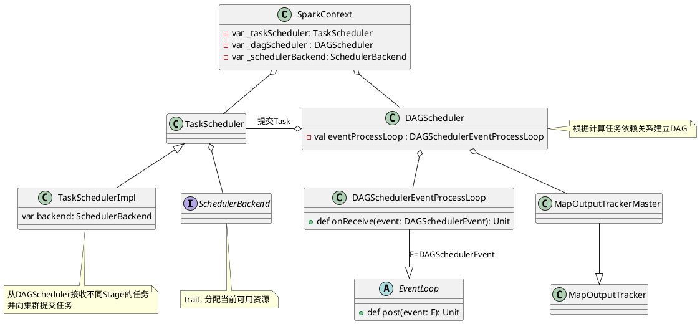
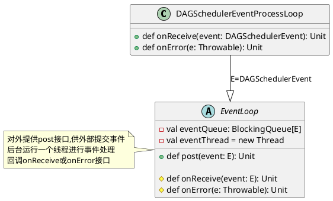
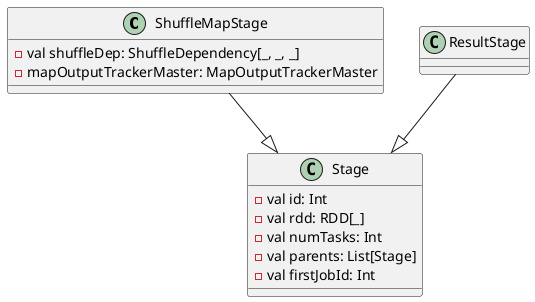

Scheduler(任务调度, 即组成应用的多个Job之间如何分配计算资源)模块作为Spark Core的核心模块之一。Spark对于DAG(Directed Acyclic Graph，有向无环图)的实现及不同执行阶段的划分和任务的提交执行，充分体现了其设计的优雅和高效。

任务调度模块主要包含两大部分，即DAGScheduler和TaskScheduler，它们负责将用户提交的计算任务按照DAG划分为不同的阶段并且将不同阶段的计算任务提交到集群进行最终的计算。
<center>
    
    <div>任务调度逻辑视图</div><br/>
</center>

- `DAGScheduler`主要负责分析用户提交的应用，并根据计算任务的依赖关系建立DAG，然后将DAG划分为不同的Stage(阶段)，其中每个Stage由可以并发执行的一组Task构成，这些Task的执行逻辑完全相同，只是作用于不同的数据。DAG在不同的资源管理框架(即部署方式，包括Standalone、Mesos、YARN、Local、EC2等)下的实现是相同的。DAGScheduler将这组Task划分完成后，会将这组Task提交到TaskScheduler。
- `TaskScheduler`通过Cluster Manager在集群中的某个Worker的Executor上启动任务。在Executor中运行的任务，如果缓存中没有计算结果，那么就需要开始计算，同时，计算的结果会回传到Driver或者保存在本地。在不同的资源管理框架下，TaskScheduler的实现方式是有差别的，最重要的实现是`org.apache.spark.scheduler.TaskSchedulerImpl`。对于Local、Standalone和Mesos来说，它们的TaskScheduler就是`TaskSchedulerImpl`；对于YARN Cluster和YARN Client的TaskScheduler的实现也是继承自`TaskSchedulerImpl`。

任务调度模块涉及的最重要的三个类是：
1. `org.apache.spark.scheduler.DAGScheduler`
2. `org.apache.spark.scheduler.SchedulerBackend`,是一个trait，作用是分配当前可用的资源，具体就是向当前等待分配计算资源的Task分配计算资源(即Executor)，并且在分配的Executor上启动Task，完成计算的调度过程。它使用reviveOffers完成上述的任务调度。`org.apache.spark.scheduler.cluster.CoarseGrainedSchedulerBackend`是SchedulerBackend的一个实现，同时YARN、Standalone和Mesos都是基于它加入了自身特有的逻辑。
3. `org.apache.spark.scheduler.TaskScheduler`也是一个trait，为创建它的SparkContext调度任务，即从DAGScheduler接收不同Stage的任务，并且向集群提交这些任务，并为执行特别慢的任务启动备份任务。TaskScheduler是以后实现多种任务调度器的基础，当前`org.apache.spark.scheduler.TaskSchedulerImpl`是唯一实现。TaskSchedulerImpl会在以下几种场景下调用org.apache.spark.scheduler.Scheduler-Backend#reviveOffers：
    1. 有新任务提交时。
    2. 有任务执行失败时。
    3. 计算节点（即Executor）不可用时。
    4. 某些任务执行过慢而需要为它重新分配资源时

任务调度逻辑图：
<center>
    
    <div>任务调度的逻辑图</div><br/>
</center>

# DAGScheduler实现
## DAGScheduler创建
DAGScheduler在SparkContext创建的时候创建的，由于DAGScheduler引用了TaskScheduler，因此需要先创建TaskScheduler
```scala
    // 创建TaskScheduler并调用TaskScheduler::initialize
    val (sched, ts) = SparkContext.createTaskScheduler(this, master)
    _schedulerBackend = sched
    _taskScheduler = ts
    // 创建DAGScheduler
    _dagScheduler = new DAGScheduler(this)
```

在`DAGSchedule`入参`SparkContext`的辅助构造器:
```scala
def this(sc: SparkContext) = this(sc, sc.taskScheduler)

// 辅助构造器
def this(sc: SparkContext, taskScheduler: TaskScheduler) = {
this(
    sc, taskScheduler, sc.listenerBus,
    sc.env.mapOutputTracker.asInstanceOf[MapOutputTrackerMaster],
    sc.env.blockManager.master, sc.env)
}
```
`this(sc, sc.taskScheduler)`调用主构造器：
```scala
// 主构造器
private[spark] class DAGScheduler(
    private[scheduler] val sc: SparkContext,
    private[scheduler] val taskScheduler: TaskScheduler,
    listenerBus: LiveListenerBus,
    // 运行在Driver端管理Shuffle Map Task的输出的
    // 下游的Task通过MapOutputTrackerMaster获取Shuffle输出的位置信息
    mapOutputTracker: MapOutputTrackerMaster,
    // 运行在Driver端的，管理整个Job的Block的信息
    blockManagerMaster: BlockManagerMaster,
    env: SparkEnv, clock: Clock = new SystemClock())
  extends Logging {
    // 将调度抽象为一系列的Event(时间)，例如Job提交对应于JobSubmitted
    // MapStageSubmitted对应于Map Stage提交等
    private[spark] var eventProcessLoop = new DAGSchedulerEventProcessLoop(this)
    ......
  }
```

`DAGScheduler`将调度抽象为一系列的Event(时间)，例如Job提交对应于`JobSubmitted`，MapStageSubmitted对应于Map Stage提交等(更多定义参看`core/src/main/scala/org/apache/spark/scheduler\DAGSchedulerEvent.scala`实现)，`DAGSchedulerEventProcessLoop`实现事件调度逻辑,例如
```scala
private[scheduler] sealed trait DAGSchedulerEvent

private[scheduler] case class JobSubmitted(...)
  extends DAGSchedulerEvent

private[scheduler] case class MapStageSubmitted(...)
  extends DAGSchedulerEvent
    ....
```




## Job提交
Job提交的调用流程
```scala
org.apache.spark.SparkContext#runJob
  org.apache.spark.scheduler.DAGScheduler#runJob
    org.apache.spark.scheduler.DAGScheduler#submitJob (生成并返回JobWaiter Object)
      // 提交JobSubmitted Event,Event放入eventQueue等待后台线程调度
      DAGSchedulerEventProcessLoop#post(JobSubmitted(...))
      

org.apache.spark.scheduler.DAGSchedulerEventProcessLoop#onReceive(JobSubmitted)
  org.apache.spark.scheduler.DAGScheduler#handleJobSubmitted
```

```plantuml
class DAGScheduler {
  - val eventProcessLoop : DAGSchedulerEventProcessLoop
  + def submitJob[T, U](rdd: RDD[T], func: (TaskContext, Iterator[T]) \n\t=> U,partitions: Seq[Int],callSite: CallSite,\n\tresultHandler: (Int, U) => Unit,properties: Properties): JobWaiter[U]
}

class DAGSchedulerEventProcessLoop {
  + def onReceive(event: DAGSchedulerEvent): Unit
  + def onError(e: Throwable): Unit
  + def onStop(): Unit
}

abstract class EventLoop {
  - val eventQueue: BlockingQueue[E]
  - val eventThread = new Thread

  + def post(event: E): Unit
  + def start(): Unit
  + def stop(): Unit
  # def onReceive(event: E): Unit
  # def onError(e: Throwable): Unit
  # def onStop(): Unit
  # def onStart(): Unit
}

DAGSchedulerEventProcessLoop -up-o DAGScheduler : 提交(post)JobSubmitted事件
DAGSchedulerEventProcessLoop -right-|> EventLoop : E=DAGSchedulerEvent
```

Job提交会为这个Job生成一个JobID，并生成一个JobWaiter实例例来监听Job执行状态，JobWaiter会监听Job的执行状态，而Job是由多个Task组成的，只有Job的所有Task都成功完成，Job才标记为成功；任意一个Task失败都会标记该Job失败。

```scala
def runJob[T, U](rdd: RDD[T], func: (TaskContext, Iterator[T]) => U,
    partitions: Seq[Int], callSite: CallSite,
    resultHandler: (Int, U) => Unit, properties: Properties): Unit = {

  // submitJob内部会为Job生成一个JobID，创建并返回一个JobWaiter实例
  val waiter = submitJob(rdd, func, partitions, callSite, resultHandler, properties)
        ......
}

def submitJob[T, U](rdd: RDD[T], func: (TaskContext, Iterator[T]) => U,
    partitions: Seq[Int], callSite: CallSite,
    resultHandler: (Int, U) => Unit, properties: Properties): JobWaiter[U] = {

  // 1. 创建Job ID
  val jobId = nextJobId.getAndIncrement()
  
  // 2. 创建JobListener(JobWaiter)实例来监听Job执行状态
  if (partitions.isEmpty) {
    // 2.1 创建共有0个task的JobWaiter，
            ......
    listenerBus.post(SparkListenerJobStart(jobId, time, Seq.empty, clonedProperties))
    listenerBus.post(SparkListenerJobEnd(jobId, time, JobSucceeded))
    return new JobWaiter[U](this, jobId, 0, resultHandler)
  }

  // 2.2 创建JobWaiter并提交JobSubmitted事件
  // DAGSchedulerEventProcessLoop::onReceive看到
  // 之后执行handleJobSubmitted
  val func2 = func.asInstanceOf[(TaskContext, Iterator[_]) => _]
  val waiter = new JobWaiter[U](this, jobId, partitions.size, resultHandler)
  eventProcessLoop.post(JobSubmitted(....))

  waiter
}
```

对于近似估计的Job，DAGScheduler会调用`runApproximateJob`，其逻辑类似，JobWaiter换成了`org.apache.spark.partial.ApproximateActionListener`
```scala
def runApproximateJob[T, U, R](rdd: RDD[T], func: (TaskContext, Iterator[T]) => U,
    evaluator: ApproximateEvaluator[U, R], callSite: CallSite,
    timeout: Long, properties: Properties): PartialResult[R] = {
  // 1. 创建Job ID
  val jobId = nextJobId.getAndIncrement()

  // 2. 创建JobListener(ApproximateActionListener)实例来监听Job执行状态
  if (rdd.partitions.isEmpty) {
    // 2.1 直接返回
            ......
    listenerBus.post(SparkListenerJobStart(jobId, time, Seq[StageInfo](), clonedProperties))
    listenerBus.post(SparkListenerJobEnd(jobId, time, JobSucceeded))
    return new PartialResult(evaluator.currentResult(), true)
  }


  // 2.2 创建ApproximateActionListener并提交JobSubmitted事件
  // 对于obSubmitted事件，执行handleJobSubmitted
  val listener = new ApproximateActionListener(rdd, func, evaluator, timeout)
  val func2 = func.asInstanceOf[(TaskContext, Iterator[_]) => _]
  eventProcessLoop.post(JobSubmitted(
    jobId, rdd, func2, rdd.partitions.indices.toArray, callSite, listener,
    JobArtifactSet.getActiveOrDefault(sc), clonedProperties))
  
  // 3. 异步等待结果，timeout毫秒超时
  listener.awaitResult()
}
```

### 调度事件处理
`DAGScheduler`将调度抽象为一系列的Event(时间)，例如Job提交对应于`JobSubmitted`，MapStageSubmitted对应于Map Stage提交等

`EventLoop`对外提供post接口,将事件添加到事件队列，后台有一个事件处理队列，取出事件进行处理，忽略异常和一些非关键信息了解主处理逻辑
```scala
private[spark] abstract class EventLoop[E](name: String) extends Logging {
  private val eventQueue: BlockingQueue[E] = new LinkedBlockingDeque[E]()
  private val stopped = new AtomicBoolean(false)

  private[spark] val eventThread = new Thread(name) {
    setDaemon(true)
    override def run(): Unit = {
      while (!stopped.get) {
        // 从队列中取出事件进行处理
        val event = eventQueue.take()
        try {
          // 子类实现onReceive，调用onReceive执行子类处理逻辑
          onReceive(event)
        } catch {
          case NonFatal(e) =>
            // 调用onError进行Error处理
            onError(e)
        }
      }
    }
  }

  // 外部接口提交事件
  def post(event: E): Unit = {
    if (!stopped.get) {
      if (eventThread.isAlive) {
        // 将事件放入事件队列
        eventQueue.put(event)
      } else {
        onError(new IllegalStateException(...))
      }
    }
  }
```
`DAGSchedulerEventProcessLoop::doOnReceive`对接收到的JobSubmitted Event处理，调用`dagScheduler.handleJobSubmitted`,忽略一些异常处理来了解其主执行流程
```scala
private[scheduler] class DAGSchedulerEventProcessLoop(dagScheduler: DAGScheduler)
  extends EventLoop[DAGSchedulerEvent]("dag-scheduler-event-loop") with Logging {

  // The main event loop of the DAG scheduler.
  override def onReceive(event: DAGSchedulerEvent): Unit = {
    doOnReceive(event)
  }

  private def doOnReceive(event: DAGSchedulerEvent): Unit = event match {
    // 通过createResultStage创建ResultStage
    // Job提交之后调用dagScheduler.handleJobSubmitted
    case JobSubmitted(jobId, rdd, func, partitions, callSite,
          listener, artifacts, properties) =>
      dagScheduler.handleJobSubmitted(jobId, rdd, func,
          partitions, callSite, listener, artifacts,properties)

    // 通过getOrCreateShuffleMapStage创建ShuffleMapStage
    case MapStageSubmitted(jobId, dependency, callSite, 
          listener, artifacts, properties) =>
      dagScheduler.handleMapStageSubmitted(jobId, dependency,
          callSite, listener, artifacts, properties)
      				......
  }
```

## Stage划分

`DAGScheduler#handleJobSubmitted`首先会根据RDD创建finalStage(也就是最后的那个stage)。然后创建ActiveJob后提交计算任务。在讨论这个过程的实现之前，先看一下究竟什么是Stage。

用户提交的计算任务是一个由RDD构成的DAG，如果RDD在转换的时候需要做Shuffle，那么这个Shuffle的过程就将这个DAG分为了不同的阶段(即Stage)。由于Shuffle的存在，不同的Stage不能并行计算，因为后面Stage的计算需要前面Stage的Shuffle的结果。而一个Stage由一组完全独立的计算任务（即Task）组成，每个Task的运算逻辑完全相同，只不过每个Task都会处理其所对应的Partition。其中，Partition的数量和Task的数量一致，即一个Partition会被该Stage的一个Task处理。

### 划分依据
那么RDD在哪种转换的时候需要Shuffle呢？这个取决于该RDD和它所依赖的RDD(s)的关系。RDD和它依赖的parent RDD(s)的关系有两种不同的类型，即窄依赖(narrow dependency)和宽依赖(wide dependency)。
- 对窄依赖，由于RDD每个Partition依赖固定数量的parent RDD的Partition，可以通过一个Task来处理这些Partition，而且这些Partition相互独立，所以这些Task可以并行执行。
- 宽依赖，由于需要Shuffle，只有所有的parent RDD的Partition Shuffle完成，新的Partition才会形成，接下来的Task才可以继续处理。宽依赖可以认为是DAG的分界线，或者说Spark根据宽依赖将Job划分为不同的阶段(Stage)。

### 划分过程


`DAGScheduler.handleJobSubmitted`忽略异常处理和非重点了解其实现主流程
```scala
private[scheduler] def handleJobSubmitted(jobId: Int,
    finalRDD: RDD[_], func: (TaskContext, Iterator[_]) => _,
    partitions: Array[Int], callSite: CallSite, listener: JobListener,
    artifacts: JobArtifactSet, properties: Properties): Unit = {
  var finalStage: ResultStage = null
  // 1. 创建finalStage,这个接口会获取宽依赖创建ShuffleMapStage
  finalStage = createResultStage(finalRDD, func, partitions, jobId, callSite)
  
  // Job submitted, clear internal data.
  barrierJobIdToNumTasksCheckFailures.remove(jobId)

  // 2. 创建ActiveJob
  val job = new ActiveJob(jobId, finalStage, callSite, listener, artifacts, properties)
  clearCacheLocs()

  val jobSubmissionTime = clock.getTimeMillis()
  jobIdToActiveJob(jobId) = job
  activeJobs += job

  // 3. 为finalStage设置ActiveJob
  finalStage.setActiveJob(job)
  val stageIds = jobIdToStageIds(jobId).toArray
  val stageInfos = stageIds.flatMap(id => stageIdToStage.get(id).map(_.latestInfo))
  listenerBus.post(SparkListenerJobStart(job.jobId, jobSubmissionTime, stageInfos,
      Utils.cloneProperties(properties)))

  // 4. Stage提交,这里会向TaskScheduler提交Task
  submitStage(finalStage)
}
```

```scala
private def createResultStage(
    rdd: RDD[_], func: (TaskContext, Iterator[_]) => _,
    partitions: Array[Int], jobId: Int,
    callSite: CallSite): ResultStage = {
  // 1. 广度优先遍历RDD依赖树获取ShuffleStage用于创建Stage
  val (shuffleDeps, resourceProfiles) = getShuffleDependenciesAndResourceProfiles(rdd)
  val resourceProfile = mergeResourceProfilesForStage(resourceProfiles)
  // 忽略barrier的处理, ......

  // 2. 将收集到的ShuffleDepency创建Stage
  val parents = getOrCreateParentStages(shuffleDeps, jobId)
  val id = nextStageId.getAndIncrement()

  // 3. 创建finalStage
  val stage = new ResultStage(id, rdd, func, partitions, parents,
      jobId, callSite, resourceProfile.id)
  stageIdToStage(id) = stage
  updateJobIdStageIdMaps(jobId, stage)
  stage
}
```

`DAGScheduler.getShuffleDependenciesAndResourceProfiles`根据RDD的依赖树获取ShuffleStage。
```scala
private[scheduler] def getShuffleDependenciesAndResourceProfiles(
    rdd: RDD[_]): (HashSet[ShuffleDependency[_, _, _]], HashSet[ResourceProfile]) = {
  // 存储parent dependency
  val parents = new HashSet[ShuffleDependency[_, _, _]]
  val resourceProfiles = new HashSet[ResourceProfile]
  // 存储已经访问过的RDD
  val visited = new HashSet[RDD[_]]
  val waitingForVisit = new ListBuffer[RDD[_]]
  waitingForVisit += rdd
  // 广度优先遍历RDD的依赖树
  while (waitingForVisit.nonEmpty) {
    val toVisit = waitingForVisit.remove(0)
    if (!visited(toVisit)) {
      visited += toVisit
      Option(toVisit.getResourceProfile()).foreach(resourceProfiles += _)
      // 逐个处理当前RDD依赖的parent RDD
      toVisit.dependencies.foreach {
        // 是ShuffleDependency依赖需要创建stage
        case shuffleDep: ShuffleDependency[_, _, _] =>
          parents += shuffleDep
        // 不是ShuffleDependency，那么属于同一stage
        case dependency =>
          waitingForVisit.prepend(dependency.rdd)
      }
    }
  }
  (parents, resourceProfiles)
}
```

`DAGScheduler.getOrCreateParentStages`为输入的不存在的ShufleMapStage创建Stage，并计算该ShuffleMapStage的RDD的shuffleMapDepency并创建ShuffleMapStage(即父Stage)。
```scala
private def getOrCreateParentStages(shuffleDeps: HashSet[ShuffleDependency[_, _, _]],
    firstJobId: Int): List[Stage] = {
  shuffleDeps.map { shuffleDep =>
    getOrCreateShuffleMapStage(shuffleDep, firstJobId)
  }.toList
}

private def getOrCreateShuffleMapStage(
    shuffleDep: ShuffleDependency[_, _, _],
    firstJobId: Int): ShuffleMapStage = {
  shuffleIdToMapStage.get(shuffleDep.shuffleId) match {
    // ShuffleMapStage已经存在,直接返回存储的stage
    case Some(stage) =>
      stage

    // 不存在,为ShuffleMapStage创建ShuffleMapStage
    case None =>
      // Create stages for all missing ancestor shuffle dependencies.
      getMissingAncestorShuffleDependencies(shuffleDep.rdd).foreach { dep =>
        if (!shuffleIdToMapStage.contains(dep.shuffleId)) {
          createShuffleMapStage(dep, firstJobId)
        }
      }
      createShuffleMapStage(shuffleDep, firstJobId)
  }
}

  def createShuffleMapStage[K, V, C](
      shuffleDep: ShuffleDependency[K, V, C], jobId: Int): ShuffleMapStage = {
    val rdd = shuffleDep.rdd
    val (shuffleDeps, resourceProfiles) = getShuffleDependenciesAndResourceProfiles(rdd)
    val resourceProfile = mergeResourceProfilesForStage(resourceProfiles)
  
    // 忽略Barrier操作....
  
    val numTasks = rdd.partitions.length
    val parents = getOrCreateParentStages(shuffleDeps, jobId)
    val id = nextStageId.getAndIncrement()

    // 创建ShuffleMapStage
    val stage = new ShuffleMapStage(id, rdd, numTasks, parents, jobId,
        rdd.creationSite, shuffleDep, mapOutputTracker, resourceProfile.id)
    stageIdToStage(id) = stage
    shuffleIdToMapStage(shuffleDep.shuffleId) = stage
    updateJobIdStageIdMaps(jobId, stage)

    if (!mapOutputTracker.containsShuffle(shuffleDep.shuffleId)) {
      mapOutputTracker.registerShuffle(shuffleDep.shuffleId, rdd.partitions.length,
        shuffleDep.partitioner.numPartitions)
    }
    stage
  }
```
