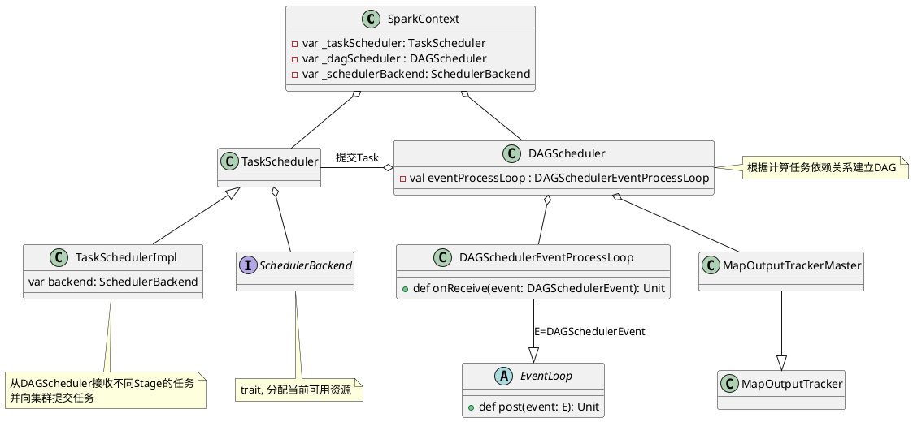

Scheduler(任务调度, 即组成应用的多个Job之间如何分配计算资源)模块作为Spark Core的核心模块之一。Spark对于DAG(Directed Acyclic Graph，有向无环图)的实现及不同执行阶段的划分和任务的提交执行，充分体现了其设计的优雅和高效。

任务调度模块主要包含两大部分，即DAGScheduler和TaskScheduler，它们负责将用户提交的计算任务按照DAG划分为不同的阶段并且将不同阶段的计算任务提交到集群进行最终的计算。
<center>
    
    <div>任务调度逻辑视图</div><br/>
</center>

- `DAGScheduler`主要负责分析用户提交的应用，并根据计算任务的依赖关系建立DAG，然后将DAG划分为不同的Stage(阶段)，其中每个Stage由可以并发执行的一组Task构成，这些Task的执行逻辑完全相同，只是作用于不同的数据。DAG在不同的资源管理框架(即部署方式，包括Standalone、Mesos、YARN、Local、EC2等)下的实现是相同的。DAGScheduler将这组Task划分完成后，会将这组Task提交到TaskScheduler。
- `TaskScheduler`通过Cluster Manager在集群中的某个Worker的Executor上启动任务。在Executor中运行的任务，如果缓存中没有计算结果，那么就需要开始计算，同时，计算的结果会回传到Driver或者保存在本地。在不同的资源管理框架下，TaskScheduler的实现方式是有差别的，最重要的实现是`org.apache.spark.scheduler.TaskSchedulerImpl`。对于Local、Standalone和Mesos来说，它们的TaskScheduler就是`TaskSchedulerImpl`；对于YARN Cluster和YARN Client的TaskScheduler的实现也是继承自`TaskSchedulerImpl`。

任务调度模块涉及的最重要的三个类是：
1. `org.apache.spark.scheduler.DAGScheduler`
2. `org.apache.spark.scheduler.SchedulerBackend`,是一个trait，作用是分配当前可用的资源，具体就是向当前等待分配计算资源的Task分配计算资源(即Executor)，并且在分配的Executor上启动Task，完成计算的调度过程。它使用reviveOffers完成上述的任务调度。`org.apache.spark.scheduler.cluster.CoarseGrainedSchedulerBackend`是SchedulerBackend的一个实现，同时YARN、Standalone和Mesos都是基于它加入了自身特有的逻辑。
3. `org.apache.spark.scheduler.TaskScheduler`也是一个trait，为创建它的SparkContext调度任务，即从DAGScheduler接收不同Stage的任务，并且向集群提交这些任务，并为执行特别慢的任务启动备份任务。TaskScheduler是以后实现多种任务调度器的基础，当前`org.apache.spark.scheduler.TaskSchedulerImpl`是唯一实现。TaskSchedulerImpl会在以下几种场景下调用org.apache.spark.scheduler.Scheduler-Backend#reviveOffers：
    1. 有新任务提交时。
    2. 有任务执行失败时。
    3. 计算节点（即Executor）不可用时。
    4. 某些任务执行过慢而需要为它重新分配资源时

任务调度逻辑图：
<center>
    
    <div>任务调度的逻辑图</div><br/>
</center>

# DAGScheduler实现
## DAGScheduler创建
DAGScheduler在SparkContext创建的时候创建的，由于DAGScheduler引用了TaskScheduler，因此需要先创建TaskScheduler
```scala
    // 创建TaskScheduler并调用TaskScheduler::initialize
    val (sched, ts) = SparkContext.createTaskScheduler(this, master)
    _schedulerBackend = sched
    _taskScheduler = ts
    // 创建DAGScheduler
    _dagScheduler = new DAGScheduler(this)
```

在`DAGSchedule`入参`SparkContext`的辅助构造器:
```scala
def this(sc: SparkContext) = this(sc, sc.taskScheduler)

// 辅助构造器
def this(sc: SparkContext, taskScheduler: TaskScheduler) = {
this(
    sc, taskScheduler, sc.listenerBus,
    sc.env.mapOutputTracker.asInstanceOf[MapOutputTrackerMaster],
    sc.env.blockManager.master, sc.env)
}
```
`this(sc, sc.taskScheduler)`调用主构造器：
```scala
// 主构造器
private[spark] class DAGScheduler(
    private[scheduler] val sc: SparkContext,
    private[scheduler] val taskScheduler: TaskScheduler,
    listenerBus: LiveListenerBus,
    // 运行在Driver端管理Shuffle Map Task的输出的
    // 下游的Task通过MapOutputTrackerMaster获取Shuffle输出的位置信息
    mapOutputTracker: MapOutputTrackerMaster,
    // 运行在Driver端的，管理整个Job的Block的信息
    blockManagerMaster: BlockManagerMaster,
    env: SparkEnv, clock: Clock = new SystemClock())
  extends Logging {
    // 将调度抽象为一系列的Event(时间)，例如Job提交对应于JobSubmitted
    // MapStageSubmitted对应于Map Stage提交等
    private[spark] var eventProcessLoop = new DAGSchedulerEventProcessLoop(this)
    ......
  }
```

`DAGScheduler`将调度抽象为一系列的Event(时间)，例如Job提交对应于`JobSubmitted`，MapStageSubmitted对应于Map Stage提交等(更多定义参看`core/src/main/scala/org/apache/spark/scheduler\DAGSchedulerEvent.scala`实现)，`DAGSchedulerEventProcessLoop`实现事件调度逻辑,例如
```scala
private[scheduler] sealed trait DAGSchedulerEvent

private[scheduler] case class JobSubmitted(...)
  extends DAGSchedulerEvent

private[scheduler] case class MapStageSubmitted(...)
  extends DAGSchedulerEvent
    ....
```




## Job提交
