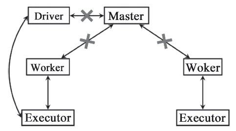
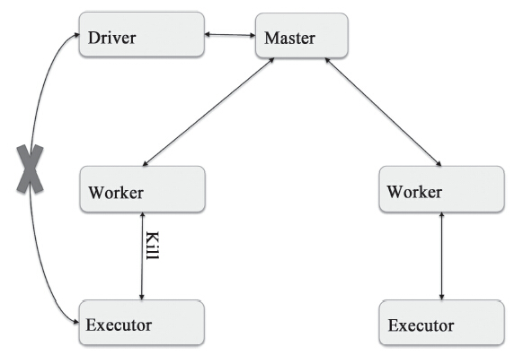
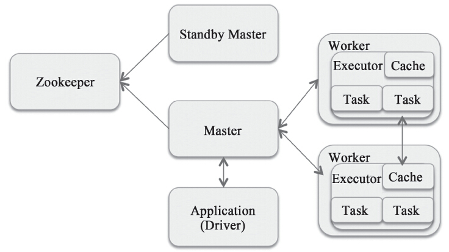

Spark的Cluster Manager有以下几种部署模式：Standalone，Mesos，YARN，EC2，Local。

# 运行模式
`SparkContext`的创建过程中，会通过传入的Master URL的值来确定不同的运行模式，并且创建不同的`SchedulerBackend`和`TaskScheduler`，参见`org.apache.spark.SparkContext#createTaskScheduler`

## Local模式
Master URL如果使用以下方式，那么就是以本地方式启动Spark：
1. `local`使用一个工作线程来运行计算任务，不会重新计算失败的计算任务。
2. `local[N]/local[*]`,对于local[N]，使用N个工作线程；对于`local[*]`，工作线程的数量取决于本机的CPU Core的数目，保证逻辑上一个工作线程可以使用一个CPU Core。和local一样，不会重新计算失败的计算任务。
3. `local[threads，maxFailures]`, `threads`指定工作线程的数目；`maxFailures`设置计算任务最大的失败重试次数。
4. `local-cluster[numSlaves，coresPerSlave，memoryPerSlave]`, 伪分布式模式，本机会运行Master和Worker。其中numSlaves设置了Worker的数目；coresPerSlave设置了Worker所能使用的CPU Core的数目；memoryPerSlave设置了每个Worker所能使用的内存数。

对于前3种方式，内部实现是相同的，区别就是启动的工作线程数和计算失败时重试的次数不一样。对于local模式来说，`SchedulerBackend`的实现是`org.apache.spark.scheduler.local.LocalSchedulerBackend`。`TaskScheduler`的实现是`org.apache.spark.scheduler.TaskSchedulerImpl`。


对于第4种伪分布式模式，实际上是在本地机器模拟了一个分布式环境，除了Master和Worker都运行在本机外，与Standalone模式并无区别。`SchedulerBackend`的实现是`org.apache.spark.scheduler.cluster.StandaloneSchedulerBackend`。`TaskScheduler`的实现也是`org.apache.spark.scheduler.TaskSchedulerImpl`。

## Mesos
Spark可以通过选项`spark.mesos.coarse`来设置是采用粗粒度的调度模式还是细粒度的调度模式。
### 粗粒度调度
`org.apache.spark.scheduler.cluster.CoarseGrainedSchedulerBackend`

### 细粒度调度

## Yarn
### YARN Cluster模式
YARN Cluster模式，就是通过Hadoop YARN来调度Spark Application所需要的资源。

### YARN Client模式
该模式和YARN Cluster模式的区别在于，用户提交的Application的SparkContext是在本机上运行，适合Application本身需要在本地进行交互的场景；而YARNCluster中，所有的计算都是在YARN的节点上运行的。

# 模块整体架构
Deploy模块采用的也是典型的Master/Slave架构，其中Master负责整个集群的资源调度和Application的管理。Slave(即Worker)接收Master的资源分配调度命令后启动Executor，由Executor完成最终的计算任务, Client则负责Application的创建和向Master注册Application，并且负责接收来自Executor的状态更新和计算结果等。

Deploy模块主要包含3个子模块：Master、Worker、Client，它们之间的通信通过AKKA完成。对于Master和Worker，它们本身就是一个Actor，可以直接通过AKKA实现通信。Client虽然本身不是一个Actor，这三者的主要职责如下：
1. Master：接收Worker的注册并管理所有的Worker，接收Client提交的Application，FIFO调度等待的Application并向Worker提交。
2. Worker：向Master注册自己，根据Master发送的Application配置进程环境，并启动`StandaloneExecutorBackend`。
3. Client：向Master注册并监控Application。当用户创建SparkContext时会实例化`SparkDeploySchedulerBackend`，而实例化`SparkDeploySchedulerBackend`的同时会启动Client，通过向Client传递启动参数和Application有关信息，Client向Master发送请求注册Application并且在计算节点上启动`StandaloneExecutorBackend`。

# 消息传递机制
Deploy模块之间主要通过AKKA通信，通过对各个子模块之间消息通信协议的梳理，可以分析每个子模块的功能职责

## Master和Worker
Master作为整个集群的管理者，需要Worker通过注册、汇报状态来维护整个集群的运行状态，并且通过这些状态来决定资源调度策略等。


|配置|默认值|参数意义|
| ---- | ---| -- |
|`spark.driver.host` | | loacal host name|
| `spark.driver.port` |Drive端口号 | 0|


Worker向Master发送的消息主要包含三类：
1. 注册：Worker启动时需要向Master注册，注册时需要汇报自身的信息。
2. 状态汇报：汇报Executor和Driver的运行状态；在Master故障恢复时，需要汇报Worker上当前运行的Executor和Driver的信息。
3. 报活心跳：Worker每隔指定周期会向Master发送报活的心跳。

Master向Worker发送的消息除了响应Worker的注册外，还有一些控制命令，包括让Worker重新注册、让Worker启动Executor或者Driver、停止Executor和Driver等。发送的消息定义位于`code/spark/core/src/main/scala/org/apache/spark/deploy/DeployMessage.scala`

```scala
// 
case class RegisterApplication(
    appDescription: ApplicationDescription,
    driver: RpcEndpointRef) extends DeployMessage

case class RegisteredApplication(appId: String,
    master: RpcEndpointRef) extends DeployMessage
```

```scala
case class RegisterWorker(
    id: String, host: String, port: Int,
    worker: RpcEndpointRef,
    cores: Int, memory: Int,
    workerWebUiUrl: String,
    masterAddress: RpcAddress,
    resources: Map[String, ResourceInformation] = Map.empty)
        extends DeployMessage {
    Utils.checkHost(host)
}

case class RegisteredWorker(
    master: RpcEndpointRef,
    masterWebUiUrl: String,
    masterAddress: RpcAddress,
    duplicate: Boolean) extends DeployMessage with RegisterWorkerResponse
```

```scala

```
## Master和Client

## Client和Executor

# 集群启动
| 配置参数                            | 默认值 | 参数意义                                                     |
| ----------------------------------- | ------ | ------------------------------------------------------------ |
| `spark.worker.timeout`              |        |                                                              |
| `spark.deploy.recoveryMode`         | NONE   | 恢复模式，支持四种：<br/>1. ZOOKEEPER<br/>2. FILESYSTEM<br/>3. CUSTOM<br/>4. NONE |
| `spark.deploy.zookeeper.url`        |        | ZooKeeper的Server地址                                        |
| `spark.deploy.zookeeper.dir`        |        | ZooKeeper保存集群元数据信息的根目录，<br/>其中保存的元数据信息包括Worker， Driver Client和Application |
| `spark.deploy.recoveryMode.factory` |        |                                                              |
| `spark.deploy.recoveryDirectory`    |        |                                                              |
| `spark.deploy.zookeeper.url`        |        |                                                              |
| `spark.deploy.zookeeper.dir`        |        |                                                              |
| `spark.deploy.maxExecutorRetries`   | 10     |                                                              |


## Master启动

Master的实现是`org.apache.spark.deploy.master.Master`。一个集群可以部署多个Master，以达到高可用性的目的，因此它还实现了`org.apache.spark.deploy.master.LeaderElectable`以在多个Master中选举出一个Leader。LeaderElectable是一个trait：
```scala
@DeveloperApi
trait LeaderElectionAgent {
  val masterInstance: LeaderElectable
  def stop(): Unit = {}
}

@DeveloperApi
trait LeaderElectable {
  def electedLeader(): Unit
  def revokedLeadership(): Unit
}
```

用户自定义的选举方式的Master也需要实现它。除了选举机制，还要注意的是Master元数据持久化的方式。Master保存了整个集群的元数据，包含Worker、Application和Driver Client。Spark的Standalone模式支持以下几种方式的元数据持久化方式和选举机制：

1. ZooKeeper
实现了基于ZooKeeper的选举机制，元数据信息会持久化到ZooKeeper中。Master故障后，ZooKeeper会在备份的Master中选举出新的Master，新的Master在启动后会从ZooKeeper中获取元数据信息并且恢复这些数据。

2. FILESYSTEM
集群的元数据信息会保存在本地文件系统，Master启动后则会立即成为Active的Master。如果不考虑机器本身的故障和在设置了Master进程退出后能自动重启的前提下，这种方式也是可以接受的。

3. CUSTOM
   这个是用户自定义的。如果需要自定义的机制，那么需要实现`org.apache.spark.deploy.master.StandaloneRecoveryModeFactory`，并且将实现的类的名字配置到spark.deploy.recoveryMode.factory。主要实现的是两个接口：
   
    ```scala
    @DeveloperApi
    abstract class StandaloneRecoveryModeFactory(
        conf: SparkConf, serializer: Serializer) {
    // 实现持久化数据和恢复数据，包括Worker、Application和Driver Client
    def createPersistenceEngine(): PersistenceEngine
   
    // 实现选举机制, 即从几个Standby的Master中选举出一个Master作为集群的管理者
    def createLeaderElectionAgent(master: LeaderElectable): 
            LeaderElectionAgent
    }
    ```
4. NONE。不会持久化集群的元数据，Master在启动后会立即接管集群的管理工作。
可以通过`spark.deploy.recoveryMode`进行设置。如果不设置，默认NONE，即没有备份的Master，集群所有历史的元数据信息在Master重启后都会丢失。

Master的进程启动后，ZooKeeper方式的选举机制会根据自身策略来选举出Leader；对于FILESYSTEM和NONE方式，进程启动后会立即成为Leader，通过调用`org.apache.spark.deploy.master.Master#electedLeader`来实现：
```scala
override def electedLeader(): Unit = {
    self.send(ElectedLeader)
}
```

被选举为Leader的Master，会首先读取集群的元数据信息，如果有读到的数据，那么Master的状态就会变为RecoveryState.RECOVERING，然后开始恢复数据和通知Worker、AppClient和Driver Client，Master已经更改，恢复结束后Master的状态会变成RecoveryState.ALIVE。对于没有读取任何数据的Master，状态会立即变成RecoveryState.ALIVE。Master只有在状态是RecoveryState.ALIVE时才可以对外服务，包括接受Worker、Application和Driver Client的注册和状态更新等。主要的实现逻辑：
```scala
  override def receive: PartialFunction[Any, Unit] = {
    // 处理当前的Master被选举为Leader的消息
    case ElectedLeader =>
      // 读取集群当前运行的Application, Driver Client和Worker
      val (storedApps, storedDrivers, storedWorkers) =
        persistenceEngine.readPersistedData(rpcEnv)
      // 如果所有的元数据都是空的，不需要恢复
      state = if (storedApps.isEmpty && storedDrivers.isEmpty &&
                storedWorkers.isEmpty) {
        RecoveryState.ALIVE
      } else {
        // 读到集群的元数据信息,Master的状态变为RecoveryState.RECOVERING
        RecoveryState.RECOVERING
      }

      if (state == RecoveryState.RECOVERING) {
        // 开始恢复集群之前的状态
        // 恢复实际上就是通知Application和Worker, Master已更改
        beginRecovery(storedApps, storedDrivers, storedWorkers)
        recoveryCompletionTask = forwardMessageThread.schedule(new Runnable {
          override def run(): Unit = Utils.tryLogNonFatalError {
            self.send(CompleteRecovery)
          }
        }, workerTimeoutMs, TimeUnit.MILLISECONDS)
      }
                ......
  }
```

如果可以读取到集群的元数据信息，对于已经有Application运行的集群来说，Master故障恢复时，需要将Application、Worker和Driver Client的元数据恢复的。恢复数据通过调用`beginRecovery`实现。对于Application，Master会将它的状态设置为UNKNOWN后通知AppClient，对于Worker采用类似的处理逻辑。忽略异常处理和非关键逻辑，了解相关实现：
```scala
  private def beginRecovery(storedApps: Seq[ApplicationInfo],
        storedDrivers: Seq[DriverInfo],
      storedWorkers: Seq[WorkerInfo]): Unit = {
    // 恢复Application, 将其状态置为ApplicationState.UNKNOWN
    // 之后通知AppClient
    for (app <- storedApps) {
      registerApplication(app)
      app.state = ApplicationState.UNKNOWN
      app.driver.send(MasterChanged(self, masterWebUiUrl))
    }

    for (driver <- storedDrivers) {
      // Driver Client,只在分配给的Worker出现问题时才重新调度它
      // 这里只是将它加到Master在内存中维护的Driver Client列表中
      drivers += driver
    }

    // 恢复Worker,将其状态置为WorkerState.UNKNOWN,之后通知Worker
    for (worker <- storedWorkers) {
      registerWorker(worker)
      worker.state = WorkerState.UNKNOWN
      worker.endpoint.send(MasterChanged(self, masterWebUiUrl))
    }
  }
```
---
恢复是以异步的方式通知AppClient和Worker，那么什么时候才会结束呢？首先，Master在接到
- AppClient的响应(消息`MasterChangeAcknowledged(appId)`)后,Application的状态切换为`ApplicationState.WAITING`
- Worker的响应（消息`WorkerSchedulerStateResponse(workerId, execResponses, driverResponses)`)后,Worker的状态切换到`WorkerState.ALIVE`
查看是不是所有的Application和Worker的状态都不是UNKNOWN了。如果确认都不是，则代表恢复已经完成。

若有部分AppClient或者Worker确实出了问题，长时间没有响应呢？Master还有第二个机制，即设置一个超时时间，如果超时之后仍有AppClient或者Worker未响应，那么Master还是会认为恢复已经结束。这个超时时间可以通过`spark.worker.timeout`来设置，默认超时时间为60秒.
```scala
// 后台线程，发送CheckForWorkerTimeOut消息
// 执行timeOutDeadWorkers操作
checkForWorkerTimeOutTask = forwardMessageThread.scheduleAtFixedRate(
      () => Utils.tryLogNonFatalError { self.send(CheckForWorkerTimeOut) },
      0, workerTimeoutMs, TimeUnit.MILLISECONDS)

  private def timeOutDeadWorkers(): Unit = {
    val currentTime = System.currentTimeMillis()
    val toRemove = workers.filter(
        _.lastHeartbeat < currentTime - workerTimeoutMs).toArray
    for (worker <- toRemove) {
      if (worker.state != WorkerState.DEAD) {
        val workerTimeoutSecs = TimeUnit.MILLISECONDS.toSeconds(workerTimeoutMs)
        removeWorker(worker,
            s"Not receiving heartbeat for $workerTimeoutSecs seconds")
      } else {
        if (worker.lastHeartbeat < currentTime - 
                ((reaperIterations + 1) * workerTimeoutMs)) {
          workers -= worker
        }
      }
    }
  }
```
---

Master在判定恢复已经结束时会调用`completeRecovery()`，由它来完成恢复的最终处理：
```scala
  private def completeRecovery(): Unit = {
    if (state != RecoveryState.RECOVERING) { return }
    state = RecoveryState.COMPLETING_RECOVERY

    // Kill所有没有响应消息的workers和application
    workers.filter(_.state == WorkerState.UNKNOWN).foreach(
      removeWorker(_, "Not responding for recovery"))
    apps.filter(_.state == ApplicationState.UNKNOWN).foreach(
        finishApplication)

    // 将所有已响应的application状态更新为RUNNING
    apps.filter(_.state == ApplicationState.WAITING).foreach(
        _.state = ApplicationState.RUNNING)

    // 对于未分配Worker的Driver Client(有可能Worker已经死掉)
    // 确定是否需要重新启动
    drivers.filter(_.worker.isEmpty).foreach { d =>
      if (d.desc.supervise) {
        // 需要重新启动Driver Client
        relaunchDriver(d)
      } else {
        // 将没有设置重启的Driver Client删除
        removeDriver(d.id, DriverState.ERROR, None)
      }
    }

    // 设置Master的状态为ALIVE, 此后Master开始正常工作
    state = RecoveryState.ALIVE
    // 开始新一轮的资源调度
    schedule()
  }
```
## Worker启动

| 配置参数                                     | 默认值 | 参数意义 |
| -------------------------------------------- | ------ | -------- |
| `spark.worker.preferConfiguredMasterAddress` | false  |          |


Worker启动只会做一件事情，就是向Master注册。在接到Worker的注册请求后，如果Master是Active的并且Worker没有注册过，那么Master会回复Worker消息RegisterWorker，表示Worker注册成功；若注册失败，Master会回复消息RegisterWorkerFailed，Worker接到该消息后直接退出(由于Worker会重复多次发送请求，因此退出前需要判断是否注册成功了，如果没有注册成功才会退出；如果已经注册成功了，那么忽略这个消息)。

Worker在向Master注册的时候有重试机制，即在指定时间如果收不到Master的响应，那么Worker会重新发送注册请求，至多重试16次。为了避免所有的Worker都在同一个时刻向Master发送注册请求，每次重试的时间间隔是随机的，前6次的重试间隔在5～15秒，而后10次的重试间隔在30～90秒。

在Worker刚启动时，会调用`org.apache.spark.deploy.worker.Worker#registerWithMaster`来进行注册。第一次调用`registerWithMaster`的时候除了向所有的Master发出注册请求
```scala
  // onStart调用该接口实现在启动时向Master注册
  private def registerWithMaster(): Unit = {
    registrationRetryTimer match {
      case None =>
        // 标记未注册成功
        registered = false
        // 向所有的master发起注册请求
        registerMasterFutures = tryRegisterAllMasters()
        // 记录重试次数, 初始化为0
        connectionAttemptCount = 0
        // 开启超时时间在5~15秒的定时器，超时触发重新注册任务
        registrationRetryTimer = Some(forwardMessageScheduler.scheduleAtFixedRate(
          () => Utils.tryLogNonFatalError {
            // 超时触发ReregisterWithMaster
            Option(self).foreach(_.send(ReregisterWithMaster)) },
          INITIAL_REGISTRATION_RETRY_INTERVAL_SECONDS,
          INITIAL_REGISTRATION_RETRY_INTERVAL_SECONDS,
          TimeUnit.SECONDS))
      case Some(_) =>
    }
  }
```
启动一个定时器，在超时时进行重新注册(`reregisterWithMaster`)。
```scala
  private def reregisterWithMaster(): Unit = {
    Utils.tryOrExit {
      connectionAttemptCount += 1
      if (registered) {
        cancelLastRegistrationRetry()
      } else if (connectionAttemptCount <= TOTAL_REGISTRATION_RETRIES) {
        // 没达到最大尝试次数(16), 重新向active master注册
        master match {
          case Some(masterRef) =>
            // registered == false && master != None表示和Master间连接断开
            // masterRef不可用，需要重新创建
            if (registerMasterFutures != null) {
              registerMasterFutures.foreach(_.cancel(true))
            }
            val masterAddress = if (preferConfiguredMasterAddress) 
                masterAddressToConnect.get else masterRef.address
            registerMasterFutures = Array(registerMasterThreadPool.submit(new Runnable {
              override def run(): Unit = {
                val masterEndpoint = rpcEnv.setupEndpointRef(
                        masterAddress, Master.ENDPOINT_NAME)
                  sendRegisterMessageToMaster(masterEndpoint)
              }
            }))
          case None =>
            if (registerMasterFutures != null) {
              registerMasterFutures.foreach(_.cancel(true))
            }
            // 向所有的Master发出注册请求
            registerMasterFutures = tryRegisterAllMasters()
        }

        // 尝试注册了INITIAL_REGISTRATION_RETRIES(6)以上
        // 启动一个超时时间30～90秒的定时任务来重试
        if (connectionAttemptCount == INITIAL_REGISTRATION_RETRIES) {
          registrationRetryTimer.foreach(_.cancel(true))
          registrationRetryTimer = Some(
            forwardMessageScheduler.scheduleAtFixedRate(
              () => Utils.tryLogNonFatalError { self.send(ReregisterWithMaster) },
              PROLONGED_REGISTRATION_RETRY_INTERVAL_SECONDS,
              PROLONGED_REGISTRATION_RETRY_INTERVAL_SECONDS,
              TimeUnit.SECONDS))
        }
      } else {
        // 达到最大重试次数16, 所有的Master都未响应，直接退出
        System.exit(1)
      }
    }
  }
```
注册成功后，Worker就可以对外服务了，即可以接收Master的指令等。

# 集群容错
容错(fault tolerance)指的是在一个系统的部分模块出现错误的情况下还能持续地对外提供服务；如果出现了服务质量的下降，这个下降也是和出错的严重性成正比的。对于没有容错的系统，即使一个微小的错误也可能会导致整个服务停止。

对于一个集群来说，机器故障、网络故障等都被视为常态，尤其是当集群达到一定规模后，可能每天都会有物理故障导致某台机器不能提供服务。对于分布式系统来说，应对这种场景的容错也是设计目标之一。接下来将从Master、Worker和Executor的异常退出出发，讨论Spark是如何处理的。


| 配置参数               | 默认值 | 参数意义 |
| ---------------------- | ------ | -------- |
| `spark.worker.timeout` |        | 60秒     |


## Master异常退出
如果Master异常退出，此时新的计算任务就无法进行提交了。虽然老的计算任务可以继续运行，由于状态更新等中断，很多功能也同时会受到影响。比如计算任务完成后的资源回收，这个回收指令是Master发送给Worker的。因此，Master的异常退出，是一个非常严重的错误。

集群可以部署多个Master，借助ZooKeeper的Leader选举机制选出一个Master作为集群的管理者，其他的都作为备份。因此，在这种情况下Master的异常退出，ZooKeeper会在备份的Master中选择一个充当集群的管理者。这个被新选出来的Master会首先从ZooKeeper中读取集群的元数据(包括Worker、DriverClient和Application的信息)进行数据恢复，然后告知Worker和AppClient，Master已经更改的消息。在收到所有的Worker和AppClient的响应或者超时后，Master就会变成ACTIVE的状态，并开始对外提供服务。因此，对于生产环境的系统，推荐使用这种方式.
<center>
    
    <div>Master的异常退出</div>
</center>
<br/>

对于使用FILESYSTEM方式的Master，推荐通过supervisor拉起Master进程。supervisor是用Python开发的一套通用的进程管理程序，能将一个普通的命令行进程变为后台daemon，并监控进程状态，异常退出时能自动重启。因此，如果不是由于机器故障导致的Master异常退出，那么Master在被supervisor重新拉起后，经过数据恢复和通知Worker和AppClient后，就可以正常对外服务了。生产环境不推荐使用这种方式，从长远的角度看，机器出故障的概率非常高，因此如果出现这种问题，整个集群可能会停服很久。

对于使用NONE方式的Master，如果也是通过supervisor拉起的话，那么和FILESYSTEM方式的唯一区别就是集群的元数据信息全部丢失。

对于用户自定义的方式，就需要根据用户的逻辑和实现来决定。

## Worker异常退出
对于一个集群来说，Worker的异常退出发生概率非常高。
<center>
    
    <div>Worker的异常退出</div>
</center>
<br/>

Worker退出时，集群是如何进行容错处理的呢？
1. Worker在退出前，会将所有运行在它上面的Executor和Driver Client删除。
    ```scala
    override def onStop(): Unit = {
                    ......
      // 杀死所有的executor
      executors.values.foreach(_.kill())
      // 杀死所有的Driver Client
      drivers.values.foreach(_.kill())
      // 停止Shuffle服务
      shuffleService.stop()
                    .......
    }
    ```
2. Worker需要周期性地向Master发送心跳消息，间隔周期是`spark.worker.timeout`(默认值60秒)设置的1/4。由于Worker的异常退出，使得它的心跳会超时，Master认为该Worker已经异常退出，那么Master会将该Worker上运行的所有Executor的状态标记为丢失(`ExecutorState.LOST`)，然后将这个状态更新通过消息`ExecutorUpdated`通知AppClient；对于该Worker上运行的Driver Client，如果它设置了需要重启(即设置了supervise），那么需要重新调度来重新启动这个Driver Client，否则直接将它删除，并且将状态设置为`DriverState.ERROR`。相关实现在`org.apache.spark.deploy.master.Master#removeWorker`
    ```scala
    private def removeWorker(worker: WorkerInfo, msg: String): Unit = {
      worker.setState(WorkerState.DEAD)
      idToWorker -= worker.id
      addressToWorker -= worker.endpoint.address
    
      // 将Worker上所有运行的Executor状态标记为ExecutorState.LOST
      // 发送ExecutorUpdated消息
      for (exec <- worker.executors.values) {
        exec.application.driver.send(ExecutorUpdated(exec.id,
          ExecutorState.LOST, Some(s"worker lost: $msg"), None, Some(worker.host)))
        exec.state = ExecutorState.LOST
        exec.application.removeExecutor(exec)
      }
    
      for (driver <- worker.drivers.values) {
        if (driver.desc.supervise) {
          // 设置了supervise的Driver Client,重新调度重启
          relaunchDriver(driver)
        } else {
          // 没有设置supervise,直接删除
          removeDriver(driver.id, DriverState.ERROR, None)
        }
      }
    
      // 发送WorkerRemoved消息通知Application Worker退出
      apps.filterNot(completedApps.contains(_)).foreach { app =>
        app.driver.send(WorkerRemoved(worker.id, worker.host, msg))
      }
    
      // 持久化worker信息
      persistenceEngine.removeWorker(worker)
      schedule()
    }
    ```

3. AppClient接到Master的StatusUpdate消息后会将状态更新汇报到Backend，而它会根据消息内容来判断是否是Executor异常退出。`StandaloneAppClient#receive`对接受到的消息处理：
    ```scala
      override def receive: PartialFunction[Any, Unit] = {
                  ......
      // Worker退出的ExecutorUpdated消息, 其中state是ExecutorState.LOST
      case ExecutorUpdated(id, state, message, exitStatus, workerHost) =>
        val fullId = appId + "/" + id
        if (ExecutorState.isFinished(state)) {
          // Executor Lost，执行backen的executorRemoved
          listener.executorRemoved(fullId, message.getOrElse(""),
              exitStatus, workerHost)
        } else if (state == ExecutorState.DECOMMISSIONED) {
          listener.executorDecommissioned(fullId,
            ExecutorDecommissionInfo(message.getOrElse(""), workerHost))
        }
    
      case WorkerRemoved(id, host, message) =>
        listener.workerRemoved(id, host, message)
    
                  ......
    }
    ```
    对于`StandaloneSchedulerBackend`
    ```scala
    override def executorRemoved(fullId: String,
    message: String, exitStatus: Option[Int],
      workerHost: Option[String]): Unit = {
      val reason: ExecutorLossReason = exitStatus match {
        case Some(ExecutorExitCode.HEARTBEAT_FAILURE) =>
          ExecutorExited(ExecutorExitCode.HEARTBEAT_FAILURE, exitCausedByApp = false, message)
        case Some(ExecutorExitCode.DISK_STORE_FAILED_TO_CREATE_DIR) =>
          ExecutorExited(ExecutorExitCode.DISK_STORE_FAILED_TO_CREATE_DIR,
            exitCausedByApp = false, message)
        case Some(code) => ExecutorExited(code, exitCausedByApp = true, message)
        case None => ExecutorProcessLost(message, workerHost, causedByApp = workerHost.isEmpty)
      }
      
      // 调用CoarseGrainedSchedulerBackend.removeExecutor
      removeExecutor(fullId.split("/")(1), reason)
    }
    ```
    `org.apache.spark.scheduler.cluster.CoarseGrainedSchedulerBackend.removeExecutor`
    ```scala
      private def removeExecutor(executorId: String, reason: ExecutorLossReason): Unit = {
        executorDataMap.get(executorId) match {
          case Some(executorInfo) =>
                  ......
            // 执行TaskSchedulerImpl.executorLost
            scheduler.executorLost(executorId, lossReason)
            listenerBus.post(SparkListenerExecutorRemoved(
              System.currentTimeMillis(), executorId, lossReason.toString))
          case None =>
            scheduler.sc.env.blockManager.master.removeExecutorAsync(executorId)
            listenerBus.post(SparkListenerExecutorRemoved(
              System.currentTimeMillis(), executorId, reason.toString))
        }
    }
    ```
    然后重新进行调度，Task会被分配新的Executor，完成最终的计算。


## Executor异常退出
Executor模块负责运行Task计算任务，并将计算结果回传到Driver。Spark支持多种资源调度框架，这些资源框架在为计算任务分配资源后，都使用Executor模块完成最终的计算。

了解Executor异常退出的容错机制前，需要先了解Executor的启动机制。Worker接收到Master的`LaunchExecutor`命令后，会创建`org.apache.spark.deploy.worker.ExecutorRunner`。
```scala
override def receive: PartialFunction[Any, Unit] = synchronized {
          .......
  case LaunchExecutor(masterUrl, appId, execId, rpId, appDesc, cores_, memory_, resources_) =>
    if (masterUrl != activeMasterUrl) {
      logWarning("Invalid Master (" + masterUrl + ") attempted to launch executor.")
    } else if (decommissioned) {
      logWarning("Asked to launch an executor while decommissioned. Not launching executor.")
    } else {
      // 创建Executor的工作目录
      val executorDir = new File(workDir, appId + "/" + execId)
      if (!executorDir.mkdirs()) {
          throw new IOException("Failed to create directory " + executorDir)
      }

      val appLocalDirs = appDirectories.getOrElse(appId, {
        val localRootDirs = Utils.getOrCreateLocalRootDirs(conf)
        val dirs = localRootDirs.flatMap { dir =>
          val appDir = Utils.createDirectory(dir, namePrefix = "executor")
          Utils.chmod700(appDir)
          Some(appDir.getAbsolutePath())
        }.toSeq
        dirs
      })
      appDirectories(appId) = appLocalDirs

      // 创建ExecutorRunner
      val manager = new ExecutorRunner(...)
      executors(appId + "/" + execId) = manager
      // 后台启动一个线程执行fetchAndRunExecutor操作
      // 这里Work向Master发送ExecutorStateChanged消息,触发Master重新调度
      // Master向Driver发送ExecutorUpdated消息
      manager.start()
      coresUsed += cores_
      memoryUsed += memory_
      addResourcesUsed(resources_)
    }
        ......
}
```

如果Executor退出，`ExecutorRunner`将向Work发送`ExecutorStateChanged`消息，Worker会将这个消息转发到Master(参见`syncExecutorStateWithMaster`)。由于Executor是异常退出，Master将会为该Application分配新的Executor。如果失败次数超过10次，那么将这个Application标记为失败
```scala
  private def fetchAndRunExecutor(): Unit = {
    try {
                ....
      val builder = CommandUtils.buildProcessBuilder(...)
            ......

      process = builder.start()
                ......
      val exitCode = process.waitFor()
      state = ExecutorState.EXITED
      val message = "Command exited with code " + exitCode
      worker.send(ExecutorStateChanged(appId, execId,
          state, Some(message), Some(exitCode)))
    } catch {
      case interrupted: InterruptedException =>
        logInfo("Runner thread for executor " + fullId + " interrupted")
        state = ExecutorState.KILLED
        killProcess(None)
      case e: Exception =>
        logError("Error running executor", e)
        state = ExecutorState.FAILED
        killProcess(Some(e.toString))
    }
  }
```

Master接收到`ExecutorStateChanged`进行消息处理
```scala
override def receiveAndReply(context: RpcCallContext): PartialFunction[Any, Unit] = {
                    ......
  case ExecutorStateChanged(appId, execId, state, message, exitStatus) =>
    val execOption = idToApp.get(appId).flatMap(
        app => app.executors.get(execId))
    execOption match {
      case Some(exec) =>
        val appInfo = idToApp(appId)
        val oldState = exec.state
        exec.state = state

        if (state == ExecutorState.RUNNING) {
          appInfo.resetRetryCount()
        }

        // 向Driver发送ExecutorUpdated，重新分配Executor
        exec.application.driver.send(ExecutorUpdated(
            execId, state, message, exitStatus, None))

        if (ExecutorState.isFinished(state)) {
          // Executor异常处理
          if (!appInfo.isFinished) {
            appInfo.removeExecutor(exec)
          }
          exec.worker.removeExecutor(exec)

          val normalExit = exitStatus == Some(0)
          if (!normalExit && oldState != ExecutorState.DECOMMISSIONED
            && appInfo.incrementRetryCount() >= maxExecutorRetries
            && maxExecutorRetries >= 0) {
            val execs = appInfo.executors.values
            if (!execs.exists(_.state == ExecutorState.RUNNING)) {
              // 超过最大尝试次数，将Application标记为失败
              // 并将app.id从idToApp中移除
              removeApplication(appInfo, ApplicationState.FAILED)
            }
          }
        }
        schedule()
            ......
}
```
# Master HA实现
Standalone是一个采用Master/Slave的典型架构，Master会出现单点故障(Single Point of Failure，SPOF)问题, Spark可以选用ZooKeeper来实现高可用性(High Availability，HA)。

ZooKeeper提供了一个Leader选举机制，利用这个机制可以保证虽然集群存在多个Master但是只有一个是Active的。当Active的Master出现故障时，另外的一个Standby Master会被选举出来。由于集群的信息，包括Worker、Driver Client和Application的信息都已经持久化到ZooKeeper中，因此在切换的过程中只会影响新Job的提交，对于正在进行的Job没有任何的影响。加入ZooKeeper的集群整体架构:

<center>
  
  <div>基于ZooKeeper的整体架构图</div>
</center>
<br/>


## Master启动的选举和数据恢复策略

除了集群的第一次启动，Master每次启动都会恢复集群当前的运行状态。这些状态包括当前正在运行的Application、DriverClient和Worker。当前Standalone模式支持四种策略：ZOOKEEPER, FILESYSTEM, CUSTOM,NONE。

| 配置参数                            | 默认值 | 参数意义                                                     |
| ----------------------------------- | ------ | ------------------------------------------------------------ |
| `spark.deploy.recoveryMode`         | NONE   | 恢复模式，支持四种：<br/>1. ZOOKEEPER<br/>2. FILESYSTEM<br/>3. CUSTOM<br/>4. NONE |
| `spark.deploy.zookeeper.url`        |        | ZooKeeper的Server地址                                        |
| `spark.deploy.zookeeper.dir`        |        | ZooKeeper保存集群元数据信息的根目录，<br/>其中保存的元数据信息包括Worker， Driver Client和Application |
| `spark.deploy.recoveryMode.factory` |        | CUSTOM模式自定义实现类                                       |

Master会在`onStart()`中根据`spark.deploy.recoveryMode`配置来选择不同的选举机制和元数据持久化/恢复机制：

```scala
override def onStart(): Unit = {
    ......
    val serializer = new JavaSerializer(conf)
    // 根据spark.deploy.recoveryMode构建persistenceEngine_
    val (persistenceEngine_, leaderElectionAgent_) = recoveryMode match {
      case "ZOOKEEPER" => // Zookeeper模式
        val zkFactory = new ZooKeeperRecoveryModeFactory(conf, serializer)
        (zkFactory.createPersistenceEngine(), zkFactory.createLeaderElectionAgent(this))
      case "FILESYSTEM" => // 使用系统文件模式
        val fsFactory = new FileSystemRecoveryModeFactory(conf, serializer)
        (fsFactory.createPersistenceEngine(), fsFactory.createLeaderElectionAgent(this))
      case "CUSTOM" => // 用户自定义模式
        val clazz = Utils.classForName(conf.get(RECOVERY_MODE_FACTORY))
        val factory = clazz.getConstructor(classOf[SparkConf], classOf[Serializer])
          .newInstance(conf, serializer)
          .asInstanceOf[StandaloneRecoveryModeFactory]
        (factory.createPersistenceEngine(), factory.createLeaderElectionAgent(this))
      case _ => // 无
        (new BlackHolePersistenceEngine(), new MonarchyLeaderAgent(this))
    }
    persistenceEngine = persistenceEngine_
    leaderElectionAgent = leaderElectionAgent_
}
```
`PersistenceEngine`实现了元数据的持久化和元数据恢复。

```scala
abstract class PersistenceEngine {
  // 元数据持久化
  def persist(name: String, obj: Object): Unit
  
  // 恢复元数据
  final def readPersistedData(rpcEnv: RpcEnv): (
      Seq[ApplicationInfo], Seq[DriverInfo], Seq[WorkerInfo]) = {
    rpcEnv.deserialize { () => (read[ApplicationInfo]("app_"),
            read[DriverInfo]("driver_"), read[WorkerInfo]("worker_"))
    }
  }

  // 
  def unpersist(name: String): Unit
    						......
}
```

`LeaderElectionAgent`实现Leader选举。

```scala
trait LeaderElectionAgent {
  val masterInstance: LeaderElectable
  def stop(): Unit = {}
}
```

对于FILESYSTEM 和NONE，`MonarchyLeaderAgent`创建时

```scala
private[spark] class MonarchyLeaderAgent(val masterInstance: LeaderElectable)
  extends LeaderElectionAgent {
  // 直接将传入的Master设置Leader
  masterInstance.electedLeader()
}
```

对于NONE来说，它不会持久化集群的任何数据，通过`org.apache.spark.deploy.master.BlackHolePersistenceEngine`

一个空实现，这样可以确保对外接口的统一。


##  Curator Framework简介


##  ZooKeeperLeaderElectionAgent的实现
采用Curator后，Spark不用管理与ZooKeeper的连接，数据读和写的接口更加简单. `ZooKeeperLeaderElectionAgent`实现了`LeaderLatchListener`接口
```scala
private[master] class ZooKeeperLeaderElectionAgent(
    val masterInstance: LeaderElectable, conf: SparkConf)
      extends LeaderLatchListener
      with LeaderElectionAgent with Logging  {......}
```
在`isLeader()`确认所属的Master被选为Leader后，向Master发送消息`ElectedLeader`，Master会在恢复了元数据后将自己的状态改为ALIVE。当`noLeader()`被调用时，它会向Master发送消息`RevokedLeadership`，此时，Master直接退出。

```scala
private def start(): Unit = {
  // 采用Curator管理与Zookeeper的连接
  zk = SparkCuratorUtil.newClient(conf)
  leaderLatch = new LeaderLatch(zk, workingDir)
  // 实现LeaderLatchListener
  leaderLatch.addListener(this)
  // 启动Leader的竞争和选举
  leaderLatch.start()
}
```

```scala
override def isLeader(): Unit = {
  synchronized {
    // 有可能状态已经再次改变，即Leader已再次变化，需要再次确认
    if (!leaderLatch.hasLeadership) {
      return
    }
    // 当选为Leader
    updateLeadershipStatus(true)
  }
}

override def notLeader(): Unit = {
  synchronized {
    // 有可能状态已经再次改变，即Leader已再次变化，需要再次确认
    if (leaderLatch.hasLeadership) {
      return
    }
    // 被剥夺Leader
    updateLeadershipStatus(false)
  }
}
```
`updateLeadershipStatus`逻辑很简单，就是向Master发送消息:
```scala
private def updateLeadershipStatus(isLeader: Boolean): Unit = {
  if (isLeader && status == LeadershipStatus.NOT_LEADER) {
    status = LeadershipStatus.LEADER
    // 通知Master已当选Leader
    masterInstance.electedLeader()
  } else if (!isLeader && status == LeadershipStatus.LEADER) {
    status = LeadershipStatus.NOT_LEADER
    // 通知Master，已被剥夺Leader
    masterInstance.revokedLeadership()
  }
}
```
# 参考资料
1. Spark技术内幕：深入解析Spark内核架构设计与实现原理