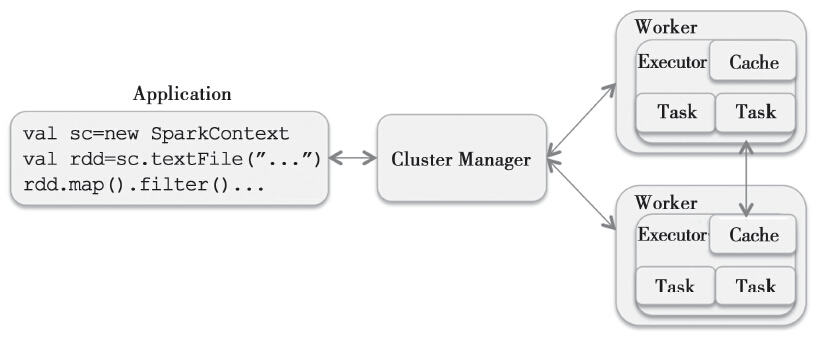

Executor模块负责运行Task计算任务，并将计算结果回传到Driver。Spark支持多种资源调度框架，这些资源框架在为计算任务分配资源后，最后都会使用Executor模块完成最终的计算。

每个Spark的Application都是从Spark-Context开始的，它通过Cluster Manager和Worker上的Executor建立联系，由每个Executor完成Application的部分计算任务。不同的Cluster Master，即资源调度框架的实现模式会有区别，但是任务的划分和调度都是由运行SparkContext端的Driver完成的，资源调度框架在为Application分配资源后，将Task分配到计算的物理单元Executor去处理。Spark计算的顶层逻辑关系图：
<center>
  
  <div>计算的顶层逻辑关系</div>
</center>
<br/>

# SchedulerBackend创建AppClient
`StandaloneSchedulerBackend`是Standalone模式的`SchedulerBackend`。在`org.apache.spark.scheduler.cluster.StandaloneSchedulerBackend#start`中会创建AppClient，而AppClient可以向Standalone的Master注册Application，然后Master会通过Application的信息为它分配Worker，包括每个Worker上使用CPU core的数目等。AppClient向Master注册Application时需要发送:
```scala
RegisteredApplication(appId: String, master: RpcEndpointRef)
```

---

`ApplicationDescription`包含一个Application的所有信息，包括:
```scala
private[spark] case class ApplicationDescription(
    // Application名字，可以通过spark.app.name设置
    name: String,
    // 最多可使用CPU core数量，可以通过spark.cores.max设置
    maxCores: Option[Int],
    // Worker Node拉起ExecutorBackend进程的Command
    // Worker接到Master LaunchExecutor
    // 通过ExecutorRunner启动这个Command
    // Command包含了启动一个Java进程所需要的信息，
    // 包括启动的ClassName、所需参数、环境信息等
    command: Command,
    // Application的web ui的hostname:port
    appUiUrl: String,
    defaultProfile: ResourceProfile,
    // 如果spark.eventLog.enabled(默认为false),设置为true，
    // eventLogFile就设置为spark.eventLog.dir定义的目录
    eventLogDir: Option[URI] = None,
    eventLogCodec: Option[String] = None,
    initialExecutorLimit: Option[Int] = None,
    user: String = System.getProperty("user.name", "<unknown>")){
      ......
    }
```
Command中比较重要的是Class Name和启动参数，在Standalone模式中，Class Name就是`org.apache.spark.executor.CoarseGrainedExecutorBackend`
```scala
val args = Seq(
  "--driver-url", driverUrl,
  "--executor-id", "{{EXECUTOR_ID}}",
  "--hostname", "{{HOSTNAME}}",
  "--cores", "{{CORES}}",
  "--app-id", "{{APP_ID}}",
  "--worker-url", "{{WORKER_URL}}",
  "--resourceProfileId", "{{RESOURCE_PROFILE_ID}}")

val command = Command(
  "org.apache.spark.executor.CoarseGrainedExecutorBackend",
  args, sc.executorEnvs, classPathEntries ++ testingClassPath, 
  libraryPathEntries, javaOpts)

// Application需要的信息
val appDesc = ApplicationDescription(sc.appName, maxCores, command,
  webUrl, defaultProfile = defaultProf, sc.eventLogDir,
  sc.eventLogCodec, initialExecutorLimit)

// 创建AppClient
// StandaloneSchedulerBackend是AppClient的Listener
client = new StandaloneAppClient(sc.env.rpcEnv,
    masters, appDesc, this, conf)
client.start()
```

`StandaloneSchedulerBackend`继承自`org.apache.spark.deploy.client.StandaloneAppClientListener`，主要为了确保AppClient在某种情况下能及时通知`StandaloneSchedulerBackend`更新状态。在以下情况中，AppClient会回调相关函数以通知`StandaloneSchedulerBackend`：
1. `RegisteredApplication`消息，向Master成功注册Application，即成功连接到集群。
2. `MasterChanged`消息，Master变更。
3. `ApplicationRemoved`Application由于不可恢复的错误停止了，这个时候需要重新提交出错的TaskSet。
4. `ExecutorAdded`消息，添加一个Executor。
5. `ExecutorUpdated`消息，删除一个Executor，可能有两个原因：一个是Executor退出了，这里可以得到Executor的退出码；另一个是由于Worker的退出导致其中运行的的Executor退出。这两种情况需要不同的逻辑来处理。

例如，在AppClient接到Master的`RegisteredApplication`消息后，会调用listener的相应接口进行状态更新
```scala
override def receive: PartialFunction[Any, Unit] = {
  case RegisteredApplication(appId_, masterRef) =>
    appId.set(appId_)
    registered.set(true)
    master = Some(masterRef)
    // 通知StandaloneSchedulerBackend
    listener.connected(appId.get)
          ......
}
```
## AppClient向Master注册Application
```scala
StandaloneSchedulerBackend
            |           
            |                RegisterApplication
  StandaloneAppClient     ------------------------>   Master
                          <------------------------
                            RegisteredApplication
```
在`org.apache.spark.deploy.client.StandaloneAppClient#onStart`会向Master发起注册Application的请求，相关调用栈如下：
```scala
onStart
  registerWithMaster
    // 向Master发起注册Application的请求
    registerWithMaster
```
`StandaloneAppClient#tryRegisterAllMasters`相关实现：
```scala
private def tryRegisterAllMasters(): Array[JFuture[_]] = {
  for (masterAddress <- masterRpcAddresses) yield {
    registerMasterThreadPool.submit(new Runnable {
      override def run(): Unit = try {
        if (registered.get) {
          return
        }
        val masterRef = rpcEnv.setupEndpointRef(
            masterAddress, Master.ENDPOINT_NAME)
        // 向Master发送请求注册Application
        masterRef.send(RegisterApplication(appDescription, self))
      } catch {
        case ie: InterruptedException => // Cancelled
        case NonFatal(e) => logWarning(s"....", e)
      }
    })
  }
}
```
Master接受到`RegisterApplication` 请求，会调用`Master`的`PersistenceEngine`持久化`Application`的元数据后，返回`RegisteredApplication`消息给AppClient表示注册成功；之后会开始新一轮的资源调度`Master#schedule()`
```scala
override def receive: PartialFunction[Any, Unit] = {
          ......
  case RegisterApplication(description, driver) =>
    if (state == RecoveryState.STANDBY) {
      // Standby的Master忽略注册消息
      // 如果AppClient发送请求到Standby的Master，
      // 会触发超时机制（默认是20s），超时会重试
    } else {
      val app = createApplication(description, driver)
      // 将app保存到Master维护的成员变量中, 参见下方梳理
      registerApplication(app)
      // 持久化元数据
      persistenceEngine.addApplication(app)
      // 返回RegisteredApplication消息给AppClient
      driver.send(RegisteredApplication(app.id, self))
      // 为处于待分配资源的Application分配资源
      // 每次有新的Application加入或者新的资源加入时
      // 都会调用schedule进行调度
      schedule()
    }
          ......
}
```

Master端在接到注册的请求后，将Application放到自己维护的成员变量数据结构：
```scala
  private[master] def registerApplication(
      app: ApplicationInfo): Unit = {
    val appAddress = app.driver.address
    if (addressToApp.contains(appAddress)) {
      return
    }

    applicationMetricsSystem.registerSource(app.appSource)
    // Master上所有的Application, HashSet[ApplicationInfo]
    apps += app
    // HashMap[String, ApplicationInfo]
    // app.id是在Master端分配的，格式是app-currentdate-nextAppNumber
    // 其中nextAppNumber是Master启动以来注册的Application的总数-1，取四位数。
    idToApp(app.id) = app
    // HashMap[RpcEndpointRef, ApplicationInfo]
    endpointToApp(app.driver) = app
    addressToApp(appAddress) = app
    // 等待被调度的Application
    waitingApps += app
  }
```
## Master根据AppClient的提交选择Worker
```scala
private def schedule(): Unit = {
  if (state != RecoveryState.ALIVE) {
    return
  }
  // Drivers take strict precedence over executors
  val shuffledAliveWorkers = Random.shuffle(workers.toSeq
      .filter(_.state == WorkerState.ALIVE))
  val numWorkersAlive = shuffledAliveWorkers.size
  var curPos = 0
  for (driver <- waitingDrivers.toList) {
    var launched = false
    var isClusterIdle = true
    var numWorkersVisited = 0
    while (numWorkersVisited < numWorkersAlive && !launched) {
      val worker = shuffledAliveWorkers(curPos)
      isClusterIdle = worker.drivers.isEmpty && worker.executors.isEmpty
      numWorkersVisited += 1
      if (canLaunchDriver(worker, driver.desc)) {
        val allocated = worker.acquireResources(driver.desc.resourceReqs)
        driver.withResources(allocated)
        launchDriver(worker, driver)
        waitingDrivers -= driver
        launched = true
      }
      curPos = (curPos + 1) % numWorkersAlive
    }
  }
  startExecutorsOnWorkers()
}
```

```scala
  private def launchDriver(worker: WorkerInfo, driver: DriverInfo): Unit = {
    worker.addDriver(driver)
    driver.worker = Some(worker)
    // 向Worker发送LaunchDriver的请求
    worker.endpoint.send(LaunchDriver(driver.id, driver.desc, driver.resources))
    driver.state = DriverState.RUNNING
  }
```
```scala
  private def startExecutorsOnWorkers(): Unit = {
    for (app <- waitingApps) {
      for (rpId <- app.getRequestedRPIds()) {
        val resourceDesc = app.getResourceDescriptionForRpId(rpId)
        val coresPerExecutor = resourceDesc.coresPerExecutor.getOrElse(1)
        if (app.coresLeft >= coresPerExecutor) {
          val usableWorkers = workers.toArray
            // 可用的Worker的标准：1. State是ALIVE
            .filter(_.state == WorkerState.ALIVE)
            // 2. mem, core等资源需求可以满足
            .filter(canLaunchExecutor(_, resourceDesc))
            // 3. 优选可用core数量多的
            .sortBy(_.coresFree).reverse
          val appMayHang = waitingApps.length == 1 &&
            waitingApps.head.executors.isEmpty && usableWorkers.isEmpty
          val assignedCores = scheduleExecutorsOnWorkers(
              app, rpId, resourceDesc, usableWorkers, spreadOutApps)
          for (pos <- usableWorkers.indices if assignedCores(pos) > 0) {
            allocateWorkerResourceToExecutors(app, assignedCores(pos),
              resourceDesc, usableWorkers(pos), rpId)
          }
        }
      }
    }
  }
```

```scala
private def allocateWorkerResourceToExecutors(app: ApplicationInfo,
    assignedCores: Int, resourceDesc: ExecutorResourceDescription,
    worker: WorkerInfo, rpId: Int): Unit = {
  val coresPerExecutor = resourceDesc.coresPerExecutor
  val numExecutors = coresPerExecutor.map {assignedCores / _}.getOrElse(1)
  val coresToAssign = coresPerExecutor.getOrElse(assignedCores)
  for (i <- 1 to numExecutors) {
    val allocated = worker.acquireResources(
        resourceDesc.customResourcesPerExecutor)
    val exec = app.addExecutor(worker, coresToAssign,
        resourceDesc.memoryMbPerExecutor, allocated, rpId)
    // 向Worker发送启动Executor的请求,参见下方
    launchExecutor(worker, exec)
    app.state = ApplicationState.RUNNING
  }
}
```
```scala
private def launchExecutor(worker: WorkerInfo, exec: ExecutorDesc):Unit = {
  // 更新Worker信息，可用core数和memory数减去本次分配的Executor占用的
  // 因此Worker的信息无需Worker主动汇报
  worker.addExecutor(exec)
  // 向Worker发送启动Executor的请求
  worker.endpoint.send(LaunchExecutor(masterUrl, exec.application.id,
    exec.id,exec.rpId, exec.application.desc, exec.cores, exec.memory,
    exec.resources))
  // 向AppClient的发送Executor已经添加的消息
  exec.application.driver.send(ExecutorAdded(exec.id, worker.id,
      worker.hostPort, exec.cores, exec.memory))
}
```

## Worker根据Master的资源分配结果创建Executor
Worker接收到来自Master的LaunchExecutor的消息后，会创建`org.apache.spark.deploy.worker.ExecutorRunner`。ExecutorRunner在`start`后台会启动一个线程执行`fetchAndRunExecutor`会将准备好的`org.apache.spark.deploy.ApplicationDescription`
以进程的形式启动。
```scala
private def fetchAndRunExecutor(): Unit = {
  try {
            ......
    val builder = CommandUtils.buildProcessBuilder(
      subsCommand, new SecurityManager(conf),
      memory, sparkHome.getAbsolutePath, substituteVariables)
            ......
    // 启动Application进程
    process = builder.start()
            ......

    state = ExecutorState.RUNNING
    worker.send(ExecutorStateChanged(appId, execId, state, None, None))

    val exitCode = process.waitFor()
          ......
  } catch {
    case interrupted: InterruptedException =>
      state = ExecutorState.KILLED
      killProcess(None)
    case e: Exception =>
      state = ExecutorState.FAILED
      killProcess(Some(e.toString))
  }
}
```
# Task的执行
`org.apache.spark.scheduler.cluster.CoarseGrainedSchedulerBackend.DriverActor#launchTasks`会将分配到Executor的Task进行分配：
```scala
private def launchTasks(tasks: Seq[Seq[TaskDescription]]): Unit = {
  for (task <- tasks.flatten) {
    val serializedTask = TaskDescription.encode(task)
                ......
      val executorData = executorDataMap(task.executorId)
      executorData.freeCores -= task.cpus
      task.resources.foreach { case (rName, rInfo) =>
        executorData.resourcesInfo(rName).acquire(rInfo.addresses)
      }
      // 发送LaunchTask消息
      executorData.executorEndpoint.send(LaunchTask(
          new SerializableBuffer(serializedTask)))
  }
}
```
`CoarseGrainedExecutorBackend`接受到`LaunchTask`消息,会调用Executor的launchTask启动Task

```scala
override def receive: PartialFunction[Any, Unit] = {
          ......
  case LaunchTask(data) =>
    if (executor == null) {
      exitExecutor(1, "Received LaunchTask command but executor was null")
    } else {
      // TaskDescription反序列化
      val taskDesc = TaskDescription.decode(data.value)
      taskResources.put(taskDesc.taskId, taskDesc.resources)
      // 启动Task
      executor.launchTask(this, taskDesc)
    }
            ......
}
```
`Executor#launchTask`会为这个Task生成一个`TaskRunner`(继承自`Runnable`)，`TaskRunner`的run中会执行Task。`TaskRunner`最终会被放到一个`ThreadPool`中去执行
```scala
  def launchTask(context: ExecutorBackend,
      taskDescription: TaskDescription): Unit = {
    val taskId = taskDescription.taskId
    // 创建TaskRunner
    val tr = createTaskRunner(context, taskDescription)
    runningTasks.put(taskId, tr)
          .......
    // 将TaskRunner放在ThreadPool中执行
    threadPool.execute(tr)
  }
```

## 依赖环境的创建和分发
在`CoarseGrainedExecutorBackend`接受到`LaunchTask`消息，会执行`TaskDescription.decode`进行反序列化
```scala

def decode(byteBuffer: ByteBuffer): TaskDescription = {
  val dataIn = new DataInputStream(new ByteBufferInputStream(byteBuffer))
          ......
  // Read artifacts(反序列化jars, files, archives)
  val artifacts = deserializeArtifacts(dataIn)

  // Read properties.
  val properties = new Properties()
      ......

  // Read cpus.
  val cpus = dataIn.readInt()

  // Read resources.
  val resources = deserializeResources(dataIn)

  // Create a sub-buffer for the serialized task into its own buffer
  // (to be deserialized later).
  val serializedTask = byteBuffer.slice()
  new TaskDescription(taskId, attemptNumber, executorId, name, index,
    partitionId, artifacts, properties, cpus, resources, serializedTask)
}
```
从序列化的Task中获取依赖的文件和依赖的位置信息后，`org.apache.spark.executor.Executor`会调用`updateDependencies`下载这些依赖：
```scala
private[executor] def updateDependencies(......): Unit = {
                ......
    // 获取Task执行依赖
    for ((name, timestamp) <- newFiles
        if state.currentFiles.getOrElse(name, -1L) < timestamp) {
      Utils.fetchFile(name, root, conf, hadoopConf, timestamp,
          useCache = !isLocal)
      state.currentFiles(name) = timestamp
    }
  
    for ((name, timestamp) <- newArchives if
        state.currentArchives.getOrElse(name, -1L) < timestamp) {
              ......
      val source = Utils.fetchFile(uriToDownload.toString,
          Utils.createTempDir(), conf, hadoopConf, timestamp,
          useCache = !isLocal, shouldUntar = false)
              ......
    }
}
```
依赖下载完成后，Executor就具备执行Task的能力了，之后，Executor通过TaskRunner执行任务。

## 任务执行
`Task#run`执行任务，相关实现：
```scala
override def run(): Unit = {
                ......
  task = ser.deserialize[Task[Any]](taskDescription.serializedTask,
      Thread.currentThread.getContextClassLoader)
                ......
  // 执行任务并计算执行时间
  taskStartTimeNs = System.nanoTime()
  taskStartCpu = if (threadMXBean.isCurrentThreadCpuTimeSupported) {
    threadMXBean.getCurrentThreadCpuTime
  } else 0L
  var threwException = true
  val value = Utils.tryWithSafeFinally {
    // 任务计算并将计算结果存入res
    val res = task.run(taskAttemptId = taskId,
      attemptNumber = taskDescription.attemptNumber,
      metricsSystem = env.metricsSystem,
      cpus = taskDescription.cpus,
      resources = taskDescription.resources,
      plugins = plugins)
    threwException = false
    res
  }
                ......
  val taskFinishNs = System.nanoTime()
  // 计算任务执行时间
  task.metrics.setExecutorRunTime(TimeUnit.NANOSECONDS.toMillis(
          (taskFinishNs - taskStartTimeNs)
          - task.executorDeserializeTimeNs))
}
```

```scala
  final def run(taskAttemptId: Long, attemptNumber: Int,
      metricsSystem: MetricsSystem, cpus: Int,
      resources: Map[String, ResourceInformation],
      plugins: Option[PluginContainer]): T = {
    SparkEnv.get.blockManager.registerTask(taskAttemptId)
    // 创建TaskContextImpl
    val taskContext = new TaskContextImpl(
      stageId, stageAttemptId, partitionId, taskAttemptId,
      attemptNumber, numPartitions, taskMemoryManager,
      localProperties, metricsSystem, metrics, cpus, resources)

    context = if (isBarrier) {
      new BarrierTaskContext(taskContext)
    } else {
      taskContext
    }

    TaskContext.setTaskContext(context)
    taskThread = Thread.currentThread()

    // 如果任务被杀，终止任务
    if (_reasonIfKilled != null) {
      kill(interruptThread = false, _reasonIfKilled)
    }

    plugins.foreach(_.onTaskStart())
    try {
      // 执行task.runTask,其中Task有ResultTask和ShuffleMapTask两种
      context.runTaskWithListeners(this)
    } finally {
      TaskContext.unset()
      InputFileBlockHolder.unset()
    }
  }
```

runTask（context）在不同的Task会有不同的实现。现在有两种Task：
1. `org.apache.spark.scheduler.ResultTask`
对于最后一个Stage，会根据生成结果的Partition来生成与Partition数量相同的ResultTask。然后，ResultTask会将计算的结果汇报到Driver端。具体实现如下：
    ```scala
    override def runTask(context: TaskContext): U = {
      // 获取反序列化实例
      val ser = SparkEnv.get.closureSerializer.newInstance()
      // 获取RDD和作用于RDD的函数
      val (rdd, func) = ser.deserialize[(RDD[T], (TaskContext,Iterator[T]) => U)](
        ByteBuffer.wrap(taskBinary.value),
        Thread.currentThread.getContextClassLoader)
      // 调用rdd.iterator执行rdd上的计算
      func(context, rdd.iterator(partition, context))
    }
    ```

2. `org.apache.spark.scheduler.ShuffleMapTask`. 对于非最后的Stage，会根据每个Stage的Partition数量来生成`ShuffleMapTask`。`ShuffleMapTask`会根据下游Task的Partition数量和Shuffle的策略来生成一系列文件。它的计算过程
    ```scala
    override def runTask(context: TaskContext): MapStatus = {
      // 获取反序列化实例
      val ser = SparkEnv.get.closureSerializer.newInstance()
      // 反序列话RDD和ShuffleDependency
      val rddAndDep = ser.deserialize[(RDD[_], ShuffleDependency[_, _, _])](
        ByteBuffer.wrap(taskBinary.value),
        Thread.currentThread.getContextClassLoader)

      val rdd = rddAndDep._1
      val dep = rddAndDep._2
      val mapId = if (SparkEnv.get.conf.get(config.SHUFFLE_USE_OLD_FETCH_PROTOCOL)) {
        partitionId
      } else context.taskAttemptId()
      dep.shuffleWriterProcessor.write(rdd, dep, mapId, context, partition)
    }
    ```
    `org.apache.spark.shuffle.ShuffleWriteProcessor#write`的主要实现：
    ```scala
    def write(rdd: RDD[_], dep: ShuffleDependency[_, _, _], mapId: Long, 
          context: TaskContext, partition: Partition): MapStatus = {
      var writer: ShuffleWriter[Any, Any] = null
      val manager = SparkEnv.get.shuffleManager
      // 从ShuffleManager中获取到Writer
      writer = manager.getWriter[Any, Any](
        dep.shuffleHandle, mapId, context, createMetricsReporter(context))
      // 调用rdd开始计算，并且将计算结果通过writer写入文件系统
      writer.write(rdd.iterator(partition, context)
          .asInstanceOf[Iterator[_ <: Product2[Any, Any]]])
      // 关闭writer，并将计算结果返回
      val mapStatus = writer.stop(success = true)
      if (mapStatus.isDefined) {
        if (dep.shuffleMergeAllowed && dep.getMergerLocs.isEmpty) {
          val mapOutputTracker = SparkEnv.get.mapOutputTracker
          val mergerLocs =
            mapOutputTracker.getShufflePushMergerLocations(dep.shuffleId)
          if (mergerLocs.nonEmpty) {
            dep.setMergerLocs(mergerLocs)
          }
        }
        if (!dep.shuffleMergeFinalized) {
          manager.shuffleBlockResolver match {
            case resolver: IndexShuffleBlockResolver =>
              val dataFile = resolver.getDataFile(dep.shuffleId, mapId)
              new ShuffleBlockPusher(SparkEnv.get.conf)
                .initiateBlockPush(dataFile, writer.getPartitionLengths(),
                dep, partition.index)
            case _ =>
          }
        }
      }
      mapStatus.get
    }
    ```
## 任务结果处理
## Driver端的处理


# 参数设置
