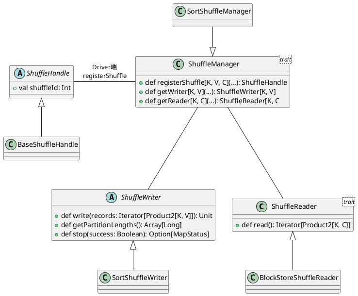
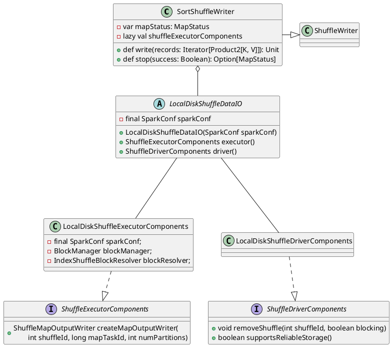

对于Shuffle来说，如果不持久化这个中间结果，一旦数据丢失，就需要重新计算依赖的全部RDD，因此有必要持久化这个中间结果。

接下来会深入分析每个Shuffle Map Task结束时，数据是如何持久化(即Shuffle Write)以使得下游的Task可以获取到其需要处理的数据的(即ShuffleRead)。


# 创建shuffleManager
`org.apache.spark.SparkEnv#create`中根据用户的`spark.shuffle.manager`创建shuffleManager实例(即`org.apache.spark.shuffle.sort.SortShuffleManager`), 相关实现：
```scala
private def create(......) {
                    ......
    val shortShuffleMgrNames = Map(
      "sort" -> classOf[org.apache.spark.shuffle.sort.SortShuffleManager].getName,
      "tungsten-sort" -> classOf[org.apache.spark.shuffle.sort.SortShuffleManager].getName)
    // 读取用户的spark.shuffle.manager配置
    val shuffleMgrName = conf.get(config.SHUFFLE_MANAGER)
    val shuffleMgrClass = shortShuffleMgrNames.getOrElse(
        	shuffleMgrName.toLowerCase(Locale.ROOT), shuffleMgrName)
    // 创建shuffleManager实例
    val shuffleManager = Utils.instantiateSerializerOrShuffleManager[ShuffleManager](
      shuffleMgrClass, conf, isDriver)
                    ......
}
```


```plantuml
class SparkEnv {
	+ val shuffleManager: ShuffleManager
}

class ShuffleManager <trait>{
  + def registerShuffle[K, V, C](...): ShuffleHandle
  + def unregisterShuffle(shuffleId: Int): Boolean

  + def getWriter[K, V](...): ShuffleWriter[K, V]
  + def getReader[K, C](...): ShuffleReader[K, C]

  + def shuffleBlockResolver(): ShuffleBlockResolver
  + def stop(): Unit
}

SortShuffleManager -up-|> ShuffleManager : ShuffleDependency构造registerShuffle
ShuffleManager -up-o SparkEnv : 根据spark.shuffle.manager用户设置创建
```

Driver中的ShuffleManager负责注册Shuffle的元数据，比如shuffleId等，`SortShuffleManager#registerShuffle`的主要实现：
```scala
override def registerShuffle[K, V, C](shuffleId: Int,
    dependency: ShuffleDependency[K, V, C]): ShuffleHandle = {
  if (SortShuffleWriter.shouldBypassMergeSort(conf, dependency)) {
    // 非map-side aggregation且
    // dep.partitioner.numPartitions <= spark.shuffle.sort.bypassMergeThreshold配置
    new BypassMergeSortShuffleHandle[K, V](
      shuffleId, dependency.asInstanceOf[ShuffleDependency[K, V, V]])
  } else if (SortShuffleManager.canUseSerializedShuffle(dependency)) {
    // 目前不会走到这里，恒为false
    new SerializedShuffleHandle[K, V](
      shuffleId, dependency.asInstanceOf[ShuffleDependency[K, V, V]])
  } else {
    new BaseShuffleHandle(shuffleId, dependency)
  }
}
```

# Shuffle Pluggable框架
Driver和每个Executor都会持有一个ShuffleManager, `spark.shuffle.manager`配置可以指定shuffleManager并由`SparkEnv`创建。Driver中的ShuffleManager负责注册Shuffle的元数据，比如shuffleId等, Executor中的ShuffleManager则负责读和写Shuffle的数据，主要接口：
1. Diver注册元数据信息
    ```scala
    def registerShuffle[K, V, C](shuffleId: Int,
        dependency: ShuffleDependency[K, V, C]): ShuffleHandle
    ```
    
2. Executor获得Shuffle Writer和Shuffle Reader来读和写Shuffle数据
    ```scala
    // 根据Shuffle Map Task的ID为其创建Shuffle Writer
    def getWriter[K, V](handle: ShuffleHandle, mapId: Long,
      context: TaskContext,
      metrics: ShuffleWriteMetricsReporter): ShuffleWriter[K, V]

    def getReader[K, C](handle: ShuffleHandle,
      startMapIndex: Int, endMapIndex: Int,
      startPartition: Int, endPartition: Int,
      context: TaskContext,
      metrics: ShuffleReadMetricsReporter): ShuffleReader[K, C]
    ```

Shuffle机制的主要类图

# Sort Based Shuffle Write

Executor上执行Shuffle Map Task时，最终会调用`org.apache.spark.scheduler.ShuffleMapTask`的`runTask`:
```scala
override def runTask(context: TaskContext): MapStatus = {
                    ......
    val ser = SparkEnv.get.closureSerializer.newInstance()
    val rddAndDep = ser.deserialize[(RDD[_], ShuffleDependency[_, _, _])](
        ByteBuffer.wrap(taskBinary.value), Thread.currentThread.getContextClassLoader)

    val rdd = rddAndDep._1
    val dep = rddAndDep._2
    val mapId = if (SparkEnv.get.conf.get(config.SHUFFLE_USE_OLD_FETCH_PROTOCOL)) {
        partitionId
    } else context.taskAttemptId()
    // shuffle write, 数据持久化
    dep.shuffleWriterProcessor.write(rdd, dep, mapId, context, partition)
}
```

`org.apache.spark.shuffle.ShuffleWriteProcessor#write`主要逻辑

```scala
def write(rdd: RDD[_], dep: ShuffleDependency[_, _, _],
  	mapId: Long, context: TaskContext, partition: Partition): MapStatus = {
  var writer: ShuffleWriter[Any, Any] = null
  // 从SparkEnv中获得shuffleManager
  // 默认是che.spark.shuffle.sort.SortShuffleManager
  val manager = SparkEnv.get.shuffleManager
  // 从manager里获取ShuffleWriter
  writer = manager.getWriter[Any, Any](dep.shuffleHandle, mapId,
    context, createMetricsReporter(context))
  
  // 调用rdd进行计算，运算结果通过Writer进行持久化
  // 对于BaseShuffleHandle, writer是org.apache.spark.shuffle.sort.SortShuffleWriter
  writer.write(rdd.iterator(partition, context)
               .asInstanceOf[Iterator[_ <: Product2[Any, Any]]])
  // 写入完成, 元数据信息写入org.apache.spark.scheduler.MapStatus
  // Task可以通过MapStatus取得需要处理的数据
  val mapStatus = writer.stop(success = true)
  if (mapStatus.isDefined) {
    if (dep.shuffleMergeAllowed && dep.getMergerLocs.isEmpty) {
      val mapOutputTracker = SparkEnv.get.mapOutputTracker
      val mergerLocs = mapOutputTracker.getShufflePushMergerLocations(dep.shuffleId)
      if (mergerLocs.nonEmpty) {
        dep.setMergerLocs(mergerLocs)
      }
    }
    if (!dep.shuffleMergeFinalized) {
      manager.shuffleBlockResolver match {
        case resolver: IndexShuffleBlockResolver =>
          val dataFile = resolver.getDataFile(dep.shuffleId, mapId)
          new ShuffleBlockPusher(SparkEnv.get.conf)
            .initiateBlockPush(dataFile, writer.getPartitionLengths(), dep, partition.index)
        case _ =>
      }
    }
  }
  mapStatus.get
}
```
## ShuffleWriter

对于`BaseShuffleHandle`, writer是`org.apache.spark.shuffle.sort.SortShuffleWriter`

主要接口`org.apache.spark.shuffle.sortSortShuffleWriter#write`：
```scala
override def write(records: Iterator[Product2[K, V]]): Unit = {
  sorter = if (dep.mapSideCombine) {
    new ExternalSorter[K, V, C](context, dep.aggregator,
      Some(dep.partitioner), dep.keyOrdering, dep.serializer)
  } else {
    new ExternalSorter[K, V, V](context, aggregator = None,
      Some(dep.partitioner), ordering = None, dep.serializer)
  }
  // 会根据当前内存统计信息判断是否需要spill到磁盘
  sorter.insertAll(records)

  val mapOutputWriter = shuffleExecutorComponents.createMapOutputWriter(
    dep.shuffleId, mapId, dep.partitioner.numPartitions)
  sorter.writePartitionedMapOutput(dep.shuffleId, mapId,
    mapOutputWriter, writeMetrics)
  partitionLengths = mapOutputWriter.commitAllPartitions(
    sorter.getChecksums).getPartitionLengths
  mapStatus = MapStatus(blockManager.shuffleServerId, partitionLengths, mapId)
}
```

# Shuffle Map Task运算结果的处理

## Executor端的处理

## Driver端的处理

# 相关配置
| 参数                                      | 默认值                                                       | 参数意义                                                     |
| ----------------------------------------- | ------------------------------------------------------------ | ------------------------------------------------------------ |
| `spark.shuffle.manager`                   | `sort`                                                       | 参数可能取值和对应的shuffleManagerer：<br/>1.`sort`对应`org.apache.spark.shuffle.sort.SortShuffleManager`<br/>2.`tungsten-sort`对应的`org.apache.spark.shuffle.sort.SortShuffleManager` |
| `spark.shuffle.sort.bypassMergeThreshold` | 200                                                          |                                                              |
| `spark.shuffle.sort.io.plugin.class`      | `org.apache.spark.shuffle.sort.`<br/>`io.LocalDiskShuffleDataIO` | 用于shuffle IO的类名                                         |
