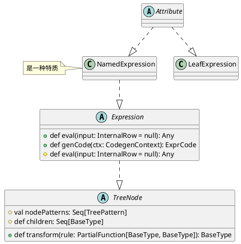
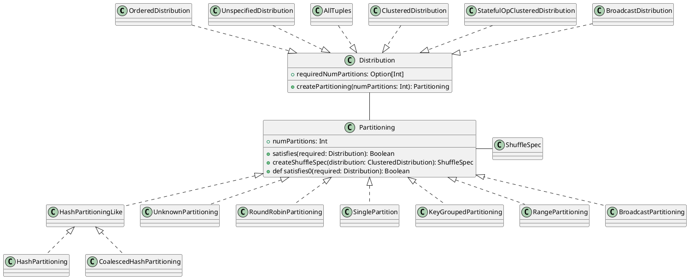

Spark SQL这类SQL-on-Hadoop解决方案和传统的MPP解决方案在架构上存在很大差异。根据Hadoop生态系统的特点，SQL-on-Hadoop解决方案从架构上来看可以简单地划分为三层结构。
- 最上层是应用(语言)层，应用层为用户提供数据管理查询的接口，不同的SQL-on-Hadoop系统往往提供各自的SQL语法特性，如Hive的HiveQL、Pig的PigLatin和Spark SQL的DataFrame等。在大数据场景下，应用层也包含一些针对特别需求的接口，如BlinkDB所支持的近似查询功能等。
- 应用层之下是分布式执行层，SQL-on-Hadoop系统通过一定的规则或策略将SQL语句转换为对应的计算模型。除MapReduce、Spark等通用的计算框架外，分布式执行层可能是某些系统自定义的计算单元，例如Impala中的Query Exec Engine等。分布式执行层通过接口访问数据存储层中的数据，并完成相应的计算任务。
- 底层是数据存储层，主要负责对关系数据表这样的逻辑视图进行存储与管理。目前，各种SQL-on-Hadoop数据存储层基本都支持分布式文件系统HDFS和分布式NoSQL数据库。

总的来看，SQL-on-Hadoop解决方案类似“堆积木”​，各层之间松耦合，并可以灵活组合。数据存储层与分布式执行层之间通过特定的数据读写接口进行数据的交互。这种分层解耦的方式一方面具有通用性（各层可以分别分离为子系统）和灵活性（彼此能够互相组合）的优势，另一方面隔离了各层的特性，限制了深度集成优化的空间。

# Parser
```scala
class CatalystSqlParser extends AbstractSqlParser {
  override val astBuilder: AstBuilder = new AstBuilder
}

// Concrete parser for Spark SQL statements
class SparkSqlParser extends AbstractSqlParser {
  val astBuilder = new SparkSqlAstBuilder()
  private val substitutor = new VariableSubstitution()

  protected override def parse[T](command: String)(toResult: SqlBaseParser => T): T = {
    super.parse(substitutor.substitute(command))(toResult)
  }
}
```
Catalyst中提供了直接面向用户的ParseInterface接口，该接口中包含了对SQL语句、Expression表达式和TableIdentifier数据表标识符的解析方法。AbstractSqlParser是实现了ParseInterface的虚类，其中定义了返回AstBuilder的函数。CatalystSqlParser仅用于Catalyst内部，而SparkSqlParser用于外部调用。比较核心的是AstBuilder，它继承了ANTLR4生成的默认SqlBaseBaseVisitor，用于生成SQL对应的抽象语法树AST(UnresolvedLogicalPlan)；SparkSqlAstBuilder继承AstBuilder，并在其基础上定义了一些DDL语句的访问操作，主要在SparkSqlParser中调用。

```plantuml
class CatalystSqlParser {
  - val astBuilder: AstBuilder
}
note top: 仅用于Catalyst内部

class SparkSqlParser {
  - val astBuilder = new SparkSqlAstBuilder
}
note top: 用于外部调用

abstract class AbstractSqlParser {
  + def parsePlan(sqlText: String): LogicalPlan
  + def parseExpression(sqlText: String): Expression
  + def parseTableIdentifier(sqlText: String): TableIdentifier
}

class ParserInterface {
  + parsePlan(sqlText: String): LogicalPlan
  + parseExpression(sqlText: String): Expression
  + parseTableIdentifier(sqlText: String): TableIdentifier
  + parseFunctionIdentifier(sqlText: String): FunctionIdentifier
  + parseMultipartIdentifier(sqlText: String): Seq[String]
  + parseQuery(sqlText: String): LogicalPlan
}

SparkSqlParser -down-|> AbstractSqlParser
CatalystSqlParser -down-|> AbstractSqlParser
AbstractSqlParser -down-|> ParserInterface

CatalystSqlParser -right-- AstBuilder
AstBuilder -down-|> DataTypeAstBuilder
DataTypeAstBuilder -down.|> SqlBaseParserBaseVisitor

ParserInterface -down.|> DataTypeParserInterface
```
# Catalyst重要概念


## InternalRow体系

```plantuml
abstract class InternalRow {
  + def numFields: Int
  + setNullAt(i: Int): Unit
  + update(i: Int, value: Any): Unit
  + def setBoolean(i: Int, value: Boolean): Unit = update(i, value)
  + def setByte(i: Int, value: Byte): Unit = update(i, value)
  + def setShort(i: Int, value: Short): Unit = update(i, value)
  + def setInt(i: Int, value: Int): Unit = update(i, value)
  + def setLong(i: Int, value: Long): Unit = update(i, value)
  + def setFloat(i: Int, value: Float): Unit = update(i, value)
  + def setDouble(i: Int, value: Double): Unit = update(i, value)
  + def setDecimal(i: Int, value: Decimal, precision: Int): Unit = update(i, value)
  + def setInterval(i: Int, value: CalendarInterval): Unit = update(i, value)
  + def toSeq(fieldTypes: Seq[DataType]): Seq[Any]
  + def toSeq(schema: StructType): Seq[Any]
}

class MutableColumnarRow {
  + int rowId
  - WritableColumnVector[] columns
}

class BaseGenericInternalRow {
  # def genericGet(ordinal: Int): Any
}
note right : 是一种特质

class GenericInternalRow {
  # def genericGet(ordinal: Int) = values(ordinal)
}

class JoinedRow {
  - var row1: InternalRow
  - var row2: InternalRow
}

ProjectingInternalRow -down.|> InternalRow
MutableColumnarRow -down.|> InternalRow

BaseGenericInternalRow -down.|> InternalRow
GenericInternalRow -down.|> BaseGenericInternalRow

UnsafeRow -down.|> InternalRow
JoinedRow -down.|> InternalRow
```

## TreeNode体系
```plantuml
abstract class TreeNode {
  + children: Seq[BaseType]
}

abstract class QueryPlan {
  + def output: Seq[Attribute]
}

abstract class LogicalPlan {
}
note top : 逻辑算子树

abstract class SparkPlan {}
note top : 物理算子树

QueryPlan -down.|> TreeNode
TreeNode -down.|> Product
TreeNode -down.|> TreePatternBits

LogicalPlan -down.|> QueryPlan
SparkPlan -down.|> QueryPlan
```

```scala
abstract class TreeNode[BaseType <: TreeNode[BaseType]]
  extends Product with TreePatternBits with WithOrigin {
          ......
  // Catalyst提供了节点位置功能(Origin)
  // 可以根据TreeNode定位到对应SQL字符串行数和起始位置
  override val origin: Origin = CurrentOrigin.get

  // 获取当前TreeNode所有叶子节点
  def collectLeaves(): Seq[BaseType]
  // 先序遍历所有节点并返回第一个满足条件的节点
  def collectFirst[B](pf: PartialFunction[BaseType, B]): Option[B]
  // 将当前节点的子节点替换为新节点
  final def withNewChildren(newChildren: Seq[BaseType]): BaseType
  // 用先序遍历的方式将Rule应用于所有节点
  def transformDown(rule: PartialFunction[BaseType, BaseType]): BaseType
  // 用后序遍历的方式将Rule应用于所有节点
  def transformUp(rule: PartialFunction[BaseType, BaseType]): BaseType
          ......
}
```
## Expression体系
表达式一般指的是不需要触发执行引擎而能够直接进行计算的单元,通过Expression进行表达，主要定义了5个方面的操作，包括基本属性, 核心操作, 输入输出, 字符串表示和等价性判断
```scala
abstract class Expression extends TreeNode[Expression] {
  /********* 1. 基本属性 *********/
  // 标记表达式能否在查询执行之前直接静态计算
  // foldable为true的情况有两种: 
  // 1. 表达式为Literal类型，例如常量
  // 2. 当且仅当其子表达式中foldable都为true时
  def foldable: Boolean = false
  // 标记表达式是否为确定性的，即每次执行eval函数的输出是否都相同
  lazy val deterministic: Boolean
  // 标记表达式是否可能输出Null值
  def nullable: Boolean
  def stateful: Boolean = false

  /********* 2. 核心操作 **********/
  // 表达式对应的处理逻辑, 是其他模块调用该表达式的主要接口
  def eval(input: InternalRow = null): Any
  // 用于生成表达式对应的Java代码
  def genCode(ctx: CodegenContext): ExprCode
  protected def doGenCode(ctx: CodegenContext, ev: ExprCode): ExprCode

  /********** 3. 输入输出 *********/
  lazy val resolved: Boolean
  def dataType: DataType
  def childrenResolved
  // 该Expression中会涉及的属性值
  def references: AttributeSet = _references

  /********** 4. 等价性判断 *********/
  // 返回经过规范化(Canonicalize)处理后的表达式
  // 规范化处理会在确保输出结果相同的前提下通过一些规则对表达式重写
  // 具体逻辑可以参见Canonicalize工具类
  lazy val canonicalized: Expression = withCanonicalizedChildren
  // 判断两个表达式在语义上是否等价
  final def semanticEquals(other: Expression): Boolean
  def semanticHash(): Int = canonicalized.hashCode()

  /********* 5. 字符串表示 ***********/
  override def toString: String
  def sql: String
  def prettyName: String
}
```
```plantuml
abstract class Expression {
  + eval(input: InternalRow = null): Any
}

class Unevaluable {}
note top: 非可执行表达式,即调用eval函数会抛异常

abstract class LeafExpression {
}
note bottom : 叶子节点表达式

abstract class UnaryExpression {}
note bottom : 一元表达式,质保函一个子节点，如abs等

abstract class BinaryExpression {}
note bottom : 二元表达式,例如加减乘除等

abstract class TernaryExpression {}
abstract class QuaternaryExpression {}
abstract class QuinaryExpression {}
abstract class SeptenaryExpression {}

Expression -right.|> TreeNode : 也是TreeNode

Unevaluable -down.|> Expression
RuntimeReplaceable -down.|> Expression
NonSQLExpression -down.|> Expression

LeafExpression -up.|> Expression
UnaryExpression -up.|> Expression
BinaryExpression -up.|> Expression
TernaryExpression -up.|> Expression
QuaternaryExpression -up.|> Expression
QuinaryExpression -up.|> Expression
SeptenaryExpression -down.|> Expression
```

Catalyst执行主流程
<div>

</img>
</div>

```scala
class QueryExecution(...) {
  protected def planner = sparkSession.sessionState.planner

  // 1. analyzer阶段,与catalog绑定生成LogicalPlan
  lazy val analyzed: LogicalPlan = {
    val plan = executePhase(QueryPlanningTracker.ANALYSIS) {
      sparkSession.sessionState.analyzer.executeAndCheck(logical, tracker)
    }
    plan
  }

  // 2. optimizer阶段，对LogicalPlan优化，生成Optimized LogicalPlan
  lazy val optimizedPlan: LogicalPlan = {
    executePhase(QueryPlanningTracker.OPTIMIZATION) {
      val plan = sparkSession.sessionState.optimizer.executeAndTrack(
          withCachedData.clone(), tracker)
      plan.setAnalyzed()
      plan
    }
  }

  // 3. SparkPlan阶段,Optimized LogicalPlan转换成PhysicalPlan
  lazy val sparkPlan: SparkPlan = {
    executePhase(QueryPlanningTracker.PLANNING) {
      QueryExecution.createSparkPlan(sparkSession, planner, optimizedPlan.clone())
    }
  }

  // 4. prepareForExecution阶段,将PhysicalPlan转换成Executed PhysicalPlan
  lazy val executedPlan: SparkPlan = {
    val plan = executePhase(QueryPlanningTracker.PLANNING) {
      QueryExecution.prepareForExecution(preparations, sparkPlan.clone())
    }
    tracker.setReadyForExecution()
    plan
  }

  // 5. execute阶段执行物理计划，得到RDD
  lazy val toRdd: RDD[InternalRow] = new SQLExecutionRDD(
    executedPlan.execute(), sparkSession.sessionState.conf)
}
```
## Rule
```plantuml
abstract class RuleExecutor {
  # def batches: Seq[Batch]
  # val excludedOnceBatches: Set[String]

  + def executeAndTrack(plan: TreeType, tracker: QueryPlanningTracker): TreeType
  + def execute(plan: TreeType): TreeType
}
note right : 外层调用executeAndTrack，主要执行execute函数\nexecute实现串行地apply Rule

class Batch {
  + name: String
  + strategy: Strategy
  + rules: Rule[TreeType]*
}
note left : a batch of rules

abstract class Rule {
  # lazy val ruleId
  + val ruleName: String
  + def apply(plan: TreeType): TreeType
}
note top : 用户实现apply函数完成自定义动作

abstract class Strategy {
  + def maxIterations: Int
  + def errorOnExceed: Boolean = false
  + def maxIterationsSetting: String = null
}

class SQLConfHelper {
  + def conf: SQLConf = SQLConf.get
}
note left : 特质

class SQLConf {
  + def optimizerExcludedRules: Option[String]
}

Batch -up-o RuleExecutor
Rule -up-o Batch
Rule -down-|> SQLConfHelper
Strategy -up-o Batch

SQLConf -up-o SQLConfHelper
```
Analyzer和Optimizer都继承自RuleExecutor，是RuleExecutor的一种实现。

```plantuml
class Analyzer {
  + def resolver: Resolver
  + def batches: Seq[Batch]
}

SparkOptimizer -down-|> Optimizer
Optimizer -down.|> RuleExecutor

Analyzer -down.|> RuleExecutor
```

## transform

```plantuml
abstract class TreeNode {
  + lazy val treePatternBits: BitSet
  # val nodePatterns: Seq[TreePattern]
  + def children: Seq[BaseType]

  + def transform(rule: PartialFunction[BaseType, BaseType]): BaseType
  + def transformDown(rule: PartialFunction[BaseType, BaseType]): BaseType
  + def transformUp(rule: PartialFunction[BaseType, BaseType]): BaseType
}
note top : transform实际上执行的是transformDown

class TreePattern {}
note right : 枚举

TreePattern -up-o TreeNode

```
# analyze
```scala
class Analyzer(override val catalogManager: CatalogManager) extends RuleExecutor[LogicalPlan]
  with CheckAnalysis with SQLConfHelper with ColumnResolutionHelper
```
```scala
abstract class LogicalPlan extends QueryPlan[LogicalPlan]
  with AnalysisHelper with LogicalPlanStats
  with LogicalPlanDistinctKeys with QueryPlanConstraints
  with Logging

// A logical plan node with single child.
trait UnaryNode extends LogicalPlan with UnaryLike[LogicalPlan]

// A logical plan node with no children.
trait LeafNode extends LogicalPlan with LeafLike[LogicalPlan]

// A logical plan node with a left and right child.
trait BinaryNode extends LogicalPlan with BinaryLike[LogicalPlan]
```

```scala
abstract class Attribute extends LeafExpression with NamedExpression with NullIntolerant {

  @transient
  override lazy val references: AttributeSet = AttributeSet(this)

  def withNullability(newNullability: Boolean): Attribute
  def withQualifier(newQualifier: Seq[String]): Attribute
  def withName(newName: String): Attribute
  def withMetadata(newMetadata: Metadata): Attribute
  def withExprId(newExprId: ExprId): Attribute
  def withDataType(newType: DataType): Attribute

  override def toAttribute: Attribute = this
  def newInstance(): Attribute

}
```


```scala
/* An expression with one input and one output. The output is by default evaluated to null
 * if the input is evaluated to null.*/
abstract class UnaryExpression extends Expression with UnaryLike[Expression]

// A leaf expression, i.e. one without any child expressions.
abstract class LeafExpression extends Expression with LeafLike[Expression]

/**
 * An expression with one input and one output. The output is by default evaluated to null
 * if the input is evaluated to null.
 */
abstract class UnaryExpression extends Expression with UnaryLike[Expression]

/**
 * An expression with two inputs and one output. The output is by default evaluated to null
 * if any input is evaluated to null.
 */
abstract class BinaryExpression extends Expression with BinaryLike[Expression]

/**
 * An expression with three inputs and one output. The output is by default evaluated to null
 * if any input is evaluated to null.
 */
abstract class TernaryExpression extends Expression with TernaryLike[Expression]

/**
 * An expression with four inputs and one output. The output is by default evaluated to null
 * if any input is evaluated to null.
 */
abstract class QuaternaryExpression extends Expression with QuaternaryLike[Expression]

/**
 * An expression with five inputs and one output. The output is by default evaluated to null if
 * any input is evaluated to null.
 */
abstract class QuinaryExpression extends Expression {

/**
 * An expression with six inputs + 7th optional input and one output.
 * The output is by default evaluated to null if any input is evaluated to null.
 */
abstract class SeptenaryExpression extends Expression {

/**
 * A trait used for resolving nullable flags, including `nullable`, `containsNull` of [[ArrayType]]
 * and `valueContainsNull` of [[MapType]], containsNull, valueContainsNull flags of the output date
 * type. This is usually utilized by the expressions (e.g. [[CaseWhen]]) that combine data from
 * multiple child expressions of non-primitive types.
 */
trait ComplexTypeMergingExpression extends Expression {
```
# optimizer

```scala
class SparkOptimizer(
    catalogManager: CatalogManager,
    catalog: SessionCatalog,
    experimentalMethods: ExperimentalMethods)
  extends Optimizer(catalogManager)
```

```plantuml
class SparkOptimizer {
  - earlyScanPushDownRules: Seq[Rule[LogicalPlan]]
  - preCBORules: Seq[Rule[LogicalPlan]]
  - def defaultBatches: Seq[Batch]
  - def nonExcludableRules: Seq[String]
}

abstract class Optimizer {
  + def defaultBatches: Seq[Batch]
  + def batches: Seq[Batch]
}
note left : dbatches = defaultBatches - optimizerExcludedRules

abstract class RuleExecutor {
  # def batches: Seq[Batch]
  + executeAndTrack(plan: TreeType, tracker: QueryPlanningTracker): TreeType
}

class Batch {
  + name: String
  + strategy: Strategy
  + rules: Rule[TreeType]*
}
note left : a batch of rules

abstract class Rule {
  # lazy val ruleId
  + val ruleName: String
  + def apply(plan: TreeType): TreeType
}

abstract class Strategy {
  + def maxIterations: Int
  + def errorOnExceed: Boolean = false
  + def maxIterationsSetting: String = null
}

class SQLConfHelper {
  + def conf: SQLConf = SQLConf.get
}
note left : 特质

class SQLConf {
  + def optimizerExcludedRules: Option[String]
}

SparkOptimizer -down-|> Optimizer
Optimizer -down.|> RuleExecutor
Optimizer -down.|> SQLConfHelper

CatalogManager -left-o Optimizer
Batch -up-o RuleExecutor
Rule -up-o Batch
SQLConfHelper -up-|> Rule
Strategy -up-o Batch

SQLConf -left-o SQLConfHelper
```

# SparkPlan
```scala
/**
 * When planning take() or collect() operations, this special node is inserted at the top of
 * the logical plan before invoking the query planner.
 *
 * Rules can pattern-match on this node in order to apply transformations that only take effect
 * at the top of the logical query plan.
 */
case class ReturnAnswer(child: LogicalPlan) extends UnaryNode {
  override def maxRows: Option[Long] = child.maxRows
  override def output: Seq[Attribute] = child.output
  override protected def withNewChildInternal(newChild: LogicalPlan): ReturnAnswer =
    copy(child = newChild)
}
```

# 物理计划

