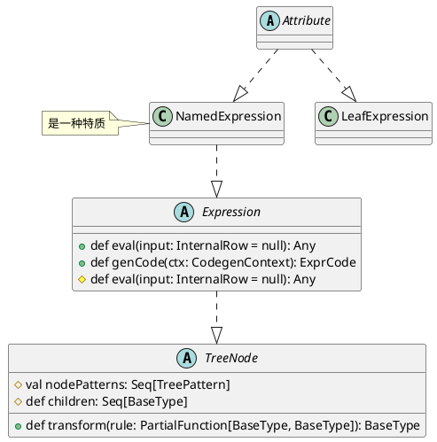

Catalyst执行主流程
<div>

</img>
</div>

```scala
class QueryExecution(...) {
  protected def planner = sparkSession.sessionState.planner

  // 1. analyzer阶段,与catalog绑定生成LogicalPlan
  lazy val analyzed: LogicalPlan = {
    val plan = executePhase(QueryPlanningTracker.ANALYSIS) {
      sparkSession.sessionState.analyzer.executeAndCheck(logical, tracker)
    }
    plan
  }

  // 2. optimizer阶段，对LogicalPlan优化，生成Optimized LogicalPlan
  lazy val optimizedPlan: LogicalPlan = {
    executePhase(QueryPlanningTracker.OPTIMIZATION) {
      val plan = sparkSession.sessionState.optimizer.executeAndTrack(
          withCachedData.clone(), tracker)
      plan.setAnalyzed()
      plan
    }
  }

  // 3. SparkPlan阶段,Optimized LogicalPlan转换成PhysicalPlan
  lazy val sparkPlan: SparkPlan = {
    executePhase(QueryPlanningTracker.PLANNING) {
      QueryExecution.createSparkPlan(sparkSession, planner, optimizedPlan.clone())
    }
  }

  // 4. prepareForExecution阶段,将PhysicalPlan转换成Executed PhysicalPlan
  lazy val executedPlan: SparkPlan = {
    val plan = executePhase(QueryPlanningTracker.PLANNING) {
      QueryExecution.prepareForExecution(preparations, sparkPlan.clone())
    }
    tracker.setReadyForExecution()
    plan
  }

  // 5. execute阶段执行物理计划，得到RDD
  lazy val toRdd: RDD[InternalRow] = new SQLExecutionRDD(
    executedPlan.execute(), sparkSession.sessionState.conf)
}
```
## Rule
```plantuml
abstract class RuleExecutor {
  # def batches: Seq[Batch]
  # val excludedOnceBatches: Set[String]

  + def executeAndTrack(plan: TreeType, tracker: QueryPlanningTracker): TreeType
  + def execute(plan: TreeType): TreeType
}
note right : 外层调用executeAndTrack，主要执行execute函数\nexecute实现串行地apply Rule

class Batch {
  + name: String
  + strategy: Strategy
  + rules: Rule[TreeType]*
}
note left : a batch of rules

abstract class Rule {
  # lazy val ruleId
  + val ruleName: String
  + def apply(plan: TreeType): TreeType
}
note top : 用户实现apply函数完成自定义动作

abstract class Strategy {
  + def maxIterations: Int
  + def errorOnExceed: Boolean = false
  + def maxIterationsSetting: String = null
}

class SQLConfHelper {
  + def conf: SQLConf = SQLConf.get
}
note left : 特质

class SQLConf {
  + def optimizerExcludedRules: Option[String]
}

Batch -up-o RuleExecutor
Rule -up-o Batch
Rule -down-|> SQLConfHelper
Strategy -up-o Batch

SQLConf -up-o SQLConfHelper
```
Analyzer和Optimizer都继承自RuleExecutor，是RuleExecutor的一种实现。

```plantuml
class Analyzer {
  + def resolver: Resolver
  + def batches: Seq[Batch]
}

SparkOptimizer -down-|> Optimizer
Optimizer -down.|> RuleExecutor

Analyzer -down.|> RuleExecutor
```

## transform

```plantuml
abstract class TreeNode {
  + lazy val treePatternBits: BitSet
  # val nodePatterns: Seq[TreePattern]
  + def children: Seq[BaseType]

  + def transform(rule: PartialFunction[BaseType, BaseType]): BaseType
  + def transformDown(rule: PartialFunction[BaseType, BaseType]): BaseType
  + def transformUp(rule: PartialFunction[BaseType, BaseType]): BaseType
}
note top : transform实际上执行的是transformDown

class TreePattern {}
note right : 枚举

TreePattern -up-o TreeNode

```
# analyze
```scala
class Analyzer(override val catalogManager: CatalogManager) extends RuleExecutor[LogicalPlan]
  with CheckAnalysis with SQLConfHelper with ColumnResolutionHelper
```
```scala
abstract class LogicalPlan extends QueryPlan[LogicalPlan]
  with AnalysisHelper with LogicalPlanStats
  with LogicalPlanDistinctKeys with QueryPlanConstraints
  with Logging

// A logical plan node with single child.
trait UnaryNode extends LogicalPlan with UnaryLike[LogicalPlan]

// A logical plan node with no children.
trait LeafNode extends LogicalPlan with LeafLike[LogicalPlan]

// A logical plan node with a left and right child.
trait BinaryNode extends LogicalPlan with BinaryLike[LogicalPlan]
```

```scala
abstract class Attribute extends LeafExpression with NamedExpression with NullIntolerant {

  @transient
  override lazy val references: AttributeSet = AttributeSet(this)

  def withNullability(newNullability: Boolean): Attribute
  def withQualifier(newQualifier: Seq[String]): Attribute
  def withName(newName: String): Attribute
  def withMetadata(newMetadata: Metadata): Attribute
  def withExprId(newExprId: ExprId): Attribute
  def withDataType(newType: DataType): Attribute

  override def toAttribute: Attribute = this
  def newInstance(): Attribute

}
```


```scala
/* An expression with one input and one output. The output is by default evaluated to null
 * if the input is evaluated to null.*/
abstract class UnaryExpression extends Expression with UnaryLike[Expression]

// A leaf expression, i.e. one without any child expressions.
abstract class LeafExpression extends Expression with LeafLike[Expression]

/**
 * An expression with one input and one output. The output is by default evaluated to null
 * if the input is evaluated to null.
 */
abstract class UnaryExpression extends Expression with UnaryLike[Expression]

/**
 * An expression with two inputs and one output. The output is by default evaluated to null
 * if any input is evaluated to null.
 */
abstract class BinaryExpression extends Expression with BinaryLike[Expression]

/**
 * An expression with three inputs and one output. The output is by default evaluated to null
 * if any input is evaluated to null.
 */
abstract class TernaryExpression extends Expression with TernaryLike[Expression]

/**
 * An expression with four inputs and one output. The output is by default evaluated to null
 * if any input is evaluated to null.
 */
abstract class QuaternaryExpression extends Expression with QuaternaryLike[Expression]

/**
 * An expression with five inputs and one output. The output is by default evaluated to null if
 * any input is evaluated to null.
 */
abstract class QuinaryExpression extends Expression {

/**
 * An expression with six inputs + 7th optional input and one output.
 * The output is by default evaluated to null if any input is evaluated to null.
 */
abstract class SeptenaryExpression extends Expression {

/**
 * A trait used for resolving nullable flags, including `nullable`, `containsNull` of [[ArrayType]]
 * and `valueContainsNull` of [[MapType]], containsNull, valueContainsNull flags of the output date
 * type. This is usually utilized by the expressions (e.g. [[CaseWhen]]) that combine data from
 * multiple child expressions of non-primitive types.
 */
trait ComplexTypeMergingExpression extends Expression {
```
# optimizer

```scala
class SparkOptimizer(
    catalogManager: CatalogManager,
    catalog: SessionCatalog,
    experimentalMethods: ExperimentalMethods)
  extends Optimizer(catalogManager)
```

```plantuml
class SparkOptimizer {
  - earlyScanPushDownRules: Seq[Rule[LogicalPlan]]
  - preCBORules: Seq[Rule[LogicalPlan]]
  - def defaultBatches: Seq[Batch]
  - def nonExcludableRules: Seq[String]
}

abstract class Optimizer {
  + def defaultBatches: Seq[Batch]
  + def batches: Seq[Batch]
}
note left : dbatches = defaultBatches - optimizerExcludedRules

abstract class RuleExecutor {
  # def batches: Seq[Batch]
  + executeAndTrack(plan: TreeType, tracker: QueryPlanningTracker): TreeType
}

class Batch {
  + name: String
  + strategy: Strategy
  + rules: Rule[TreeType]*
}
note left : a batch of rules

abstract class Rule {
  # lazy val ruleId
  + val ruleName: String
  + def apply(plan: TreeType): TreeType
}

abstract class Strategy {
  + def maxIterations: Int
  + def errorOnExceed: Boolean = false
  + def maxIterationsSetting: String = null
}

class SQLConfHelper {
  + def conf: SQLConf = SQLConf.get
}
note left : 特质

class SQLConf {
  + def optimizerExcludedRules: Option[String]
}

SparkOptimizer -down-|> Optimizer
Optimizer -down.|> RuleExecutor
Optimizer -down.|> SQLConfHelper

CatalogManager -left-o Optimizer
Batch -up-o RuleExecutor
Rule -up-o Batch
SQLConfHelper -up-|> Rule
Strategy -up-o Batch

SQLConf -left-o SQLConfHelper
```

# SparkPlan
```scala
/**
 * When planning take() or collect() operations, this special node is inserted at the top of
 * the logical plan before invoking the query planner.
 *
 * Rules can pattern-match on this node in order to apply transformations that only take effect
 * at the top of the logical query plan.
 */
case class ReturnAnswer(child: LogicalPlan) extends UnaryNode {
  override def maxRows: Option[Long] = child.maxRows
  override def output: Seq[Attribute] = child.output
  override protected def withNewChildInternal(newChild: LogicalPlan): ReturnAnswer =
    copy(child = newChild)
}
```