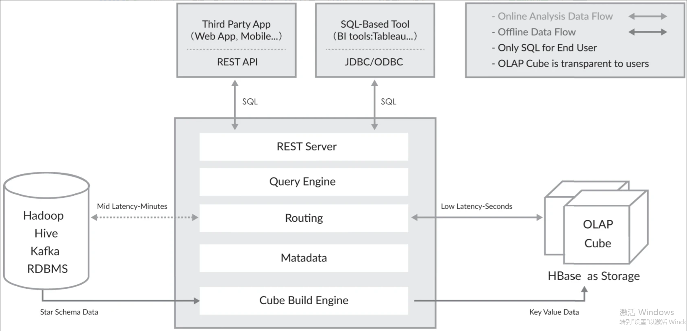

Apache Kylin 怎样解决关键问题
Apache Kylin 的初衷就是解决千亿、万亿条记录的秒级查询问题，其中的关键就是打破查询时间随着数据量呈线性增长的这一规律。仔细思考大数据 OLAP，我们可以注意到两个事实。
1. 大数据查询要的一般是统计结果，是多条记录经过聚合函数计算后的统计值。原始的记录则不是必需的，或者被访问的频率和概率极低。
2. 聚合是按维度进行的，而维度的聚合可能性是有限的，一般不随数据的膨胀而线性增长。

基于以上两点，我们得到一个新的思路—预计算。应尽量多地预先计算聚合结果，在查询时刻也尽量使用预计算的结果得出查询结果，从而避免直接扫描可能无限增长的原始记录。

<b>预计算就是Kylin在大规模并行处理和列式存储之外，提供给大数据分析的第三个关键技术。</b>

# 工作原理
Apache Kylin 的工作原理本质上是 MOLAP（Multidimensional Online Analytical Processing） Cube，也就是多维立方体分析。这是数据分析中相当经典的理论，在关系型数据库年代就有广泛应用。在MOLAP中，维度是观察数据的角度，度量是被聚合的统计值，也是聚合运算的结果，它一般是连续值。给定一个数据模型，可以对其上所有维度进行组合。对于 N 个维度来说，所有组合的可能性有$2^N$种。对每一种维度的组合，将度量做聚合运算，运算的结果保存为一个物化视图，称为Cuboid。将所有维度组合的Cuboid 作为一个整体，被称为Cube。所以简单来说，一个Cube就是许多按维度聚合的物化视图的集合。

Apache Kylin 的工作原理就是对数据模型做 Cube 预计算，并利用计算的结果加速查询。过程如下：
1. 指定数据模型，定义维度和度量。
2. 预计算 Cube，计算所有 Cuboid 并将其保存为物化视图。
3. 执行查询时，读取 Cuboid，进行加工运算产生查询结果。

由于 Kylin 的查询过程不会扫描原始记录，而是通过预计算预先完成表的关联、聚合等复杂运算，并利用预计算的结果来执行查询，因此其速度相比非预计算的查询技术一般要快一个到两个数量级。并且在超大数据集上其优势更明显。当数据集达到千亿乃至万亿级别时，Kylin 的速度甚至可以超越其他非预计算技术 1000 倍以上。

# 技术架构

    
    
Apache Kylin 技术架构

Apache Kylin v1.5 版本引入了“可扩展架构”的概念。Rest Server、Cube Build Engine 和数据源表示的抽象层。可扩展是指 Kylin 可以对其三个主要依赖模块—数据源、构建引擎和存储引擎，做任意的扩展和替换。Apache Kylin v1.5版本的系统架构进行了重构，将数据源、构建引擎、存储引擎三大主要依赖模块抽象为接口，而 Hive、MapReduce、HBase 只是默认实现。其他实现还有：数据源还可以是 Kafka、Hadoop 或 RDBMS；构建引擎还可以是 Spark、Flink。

# 参考资料
- [Apache Kylin 权威指南（一）：背景历史和使命](https://www.infoq.cn/article/5uiCHpEWdA5d2os0dFUi)
- [Apache Kylin 权威指南（二）：工作原理](https://www.infoq.cn/article/BgVUvlmqNlg8kLCiLkqq)
- [Apache Kylin 权威指南（三）：技术架构](https://www.infoq.cn/article/LbG0YuQQQVywrdl1aIkT)

