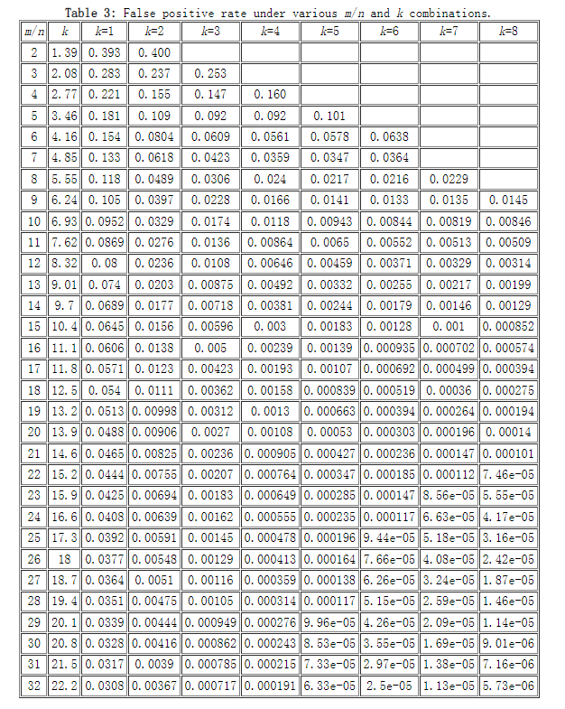

布隆滤波器中，集合大小$n$、哈希函数的个数$k$和位数组大小$m$和误判率之间的关系:
$$
\begin{array}{l}
误判率pfp & \approx & (1−e^\frac{-kn}{m})^k
\end{array}
$$
假设n和m已知，即已知位数组大小和集合元素个数，设定多少个哈希函数误判率能够达到最低呢？经过分析，最优的哈希函数个数为：
$$
\begin{array}{l}
k &=& \frac{m}{n} ln2
\end{array}
$$
假设已知集合大小n，并设定好误判率p，需要计算给BF分配多大内存合适，即确定m的大小。
$$
\begin{array}{l}
m &=& -\frac{nlnp}{(ln2)^2}
\end{array}
$$
当$\frac{m}{n}$固定，存在一个$k$使得误判率$p$最低，这就是k的最右取值。如表就展示了不同m/n和$k$的误判率

<center>
    	
        <div>
        <a href="https://pages.cs.wisc.edu/~cao/papers/summary-cache/node8.html#SECTION00053000000000000000"> 不同m/n和k的误判率,点击参看更多</a>
    </div>
</center>

ClickHouse就利用了查表的原理，根据输入的误判率的大小，反推出k和$\frac{m}{n}$的大小。相关实现详见`src\Interpreters\BloomFilterHash.h`中的`calculationBestPractices`函数。

```C++
/**
 * @brief   理论上，在m/n固定的情况下，存在一个k值使得误判概率p最小。其中:
 *              m : 位数组的个数
 *              k : Hash函数的个数
 *              n : 集合的大小，放入BloomFiliter中元素的个数
 *          该函数实现可以根据用户传入的误判率的大小反推出该bf的最佳k和m/n取值,类似于loookupTable原理
 * 
 * @param max_conflict_probability      最大误判概率
 * @return std::pair<size_t, size_t>    由m/n和hash函数个数k组成的pair
 */
static std::pair<size_t, size_t> calculationBestPractices(double max_conflict_probability) {
    // 查表的最大行数,即m/n的最大值为20    
    static const size_t MAX_BITS_PER_ROW = 20;
    // hash函数的最大个数，即15    
    static const size_t MAX_HASH_FUNCTION_COUNT = 15;

    // m/n固定,表格中误差率最低对应的k的值    
    static const size_t min_probability_index_each_bits[] =
        {0, 0, 1, 2, 3, 3, 4, 5, 6, 6, 7, 8, 8, 9, 10, 10, 11, 12, 12, 13, 14};
	// 差误差表格,横轴为m/n,纵轴为k
    static const long double probability_lookup_table[MAX_BITS_PER_ROW + 1]
                [MAX_HASH_FUNCTION_COUNT] = {
            ...... // 省略
    };
    
    // 其中, bits_per_row代表m/n,size_of_hash_functions代表Hash函数个数k
    for (size_t bits_per_row = 1; bits_per_row < MAX_BITS_PER_ROW; ++bits_per_row) {
        // 存在m/n和k的最小误差率小于用户输入的误判率
        if (probability_lookup_table[bits_per_row][min_probability_index_each_bits[bits_per_row]]
            	            <= max_conflict_ {
            // k越大,误差率越小, 这里获取到的是小于用户输入误差率的最大的hash函数个数(k)                                                
            size_t max_size_of_hash_functions = min_probability_index_each_bits[bits_per_row];
            // 从最大的k开始递减，查找最小满足误判率的k值                        
            for (size_t size_of_hash_functions = max_size_of_hash_functions;
                 	                 size_of_hash_functions > 0; --size_o                f_hash_functions)
                if (probability_lookup_table[bits_per_row][size_of_hash_functions]
                    	                    > max_conflict_probability)
                    return std::pair<size_t, size_t>(bits_per_row, size_of_hash_functions + 1);
        }
    }
	// 不存在满足用户要求的误判率的数据，返回最大m/n和k
    //     也就是表格中最小的误判率对应的m/n和k
    return std::pair<size_t, size_t>(MAX_BITS_PER_ROW - 1, 
                                                                          min_probability_index_each_bits[MAX_BITS_PER_ROW - 1]);
}
```


ClickHouse的`BloomFilter`的实现源码位于`src\Interpreters\BloomFilter.cpp`,代码实现`BloomFilterParameters`封装了BF相关输入参数。

```C++
// BloomFiliter构造关键参数
struct BloomFilterParameters {
    // 位数组大小
    size_t filter_size;
    // Hash函数的个数
    size_t filter_hashes;
    // 哈希函数的random seed
    size_t seed;
};
```


布隆过滤器实际上将数据压缩成bit信息。ClickHouse中`BloomFilter`负责实现布隆过滤器的功能，根据位数组的个数m，将相关数据存在在`std::vector<UInt64>`的数组中。

```C++
class BloomFilter {
public:
    using UnderType = UInt64;
    using Container = std::vector<UnderType>;
private:
   	// 位数组大小
        size_t s
    // Hash函数个数    ize;
    size_t hashes;
    // hash函数random seed    
    size_t seed;
    // 采用UInt64数组进行数据存储,即UInt64数据存储基本单位
    // 根据位数组大小size计算出需要的UInt64的个数即words
    // 参见BloomFilter的构造函数                
    size_t words;
    // 位数组空间    
    Container filter;    
};

BloomFilter::BloomFilter(size_t size_, size_t hashes_, size_t seed_)
    : size(size_), hashes(hashes_), seed(seed_),
	// UnderType即UInt64是位数组空间的基本单位
	// 向上取整，计算需要的最少的UnderType的个数
    words((size + sizeof(UnderType) - 1) / sizeof(UnderType)),
    filter(words, 0) {}    
```


主要的功能接口:

```C++
//  布隆过滤器加入数据
void BloomFilter::add(const char * data, size_t len) {
    // 1. 由CityHash64生成两个Hash值, hash1和hash2
    size_t hash1 = CityHash_v1_0_2::CityHash64WithSeed(data, len, seed);
    size_t hash2 = CityHash_v1_0_2::CityHash64WithSeed(data, len, SEED_GEN_A * seed + SEED_GEN_B);

    for (size_t i = 0; i < hashes; ++i) {
        // 2. 计算bit偏移
        size_t pos = (hash1 + i * hash2 + i * i) % (8 * size);
        // 3. 每个word包含64位，通过或运算修改word内bit的0-1分布
        filter[pos / (8 * sizeof(UnderType))] |= (1ULL << (pos % (8 * sizeof(UnderType))));
    }
}

// 查找元素是否存在
bool BloomFilter::find(const char * data, size_t len) {
    size_t hash1 = CityHash_v1_0_2::CityHash64WithSeed(data, len, seed);
    size_t hash2 = CityHash_v1_0_2::CityHash64WithSeed(data, len, SEED_GEN_A * seed + SEED_GEN_B);

    for (size_t i = 0; i < hashes; ++i) {
        // 按照插入数据的方式计算bit偏移        
        size_t pos = (hash1 + i * hash2 + i * i) % (8 * size);
        // 存在任意位不在集合中,则判定肯定不存在        
        if (!(filter[pos / (8 * sizeof(UnderType))] & (1ULL << (pos % (8 * sizeof(UnderType))))))
            return false;
    }
    // 否则判定数据在集合中    
    return true;
}

// 判断布隆过滤器是否为空
UInt64 BloomFilter::isEmpty() const {
    for (size_t i = 0; i < words; ++i)
        // 存在不为0的元素，则非空        
        if (filter[i] != 0) return false;
    return true;
}
```


```C++
// 在当前布隆过滤器中的所有数据也都在bf过滤器中
bool BloomFilter::contains(const BloomFilter & bf) {
    for (size_t i = 0; i < words; ++i) {
        if ((filter[i] & bf.filter[i]) != bf.filter[i])
            return false;
    }
    return true;
}
```


# 参考资料

1. [Counting Bloom Filter最早的论文](https://pages.cs.wisc.edu/~jussara/papers/00ton.pdf)
2. 大数据日知录

