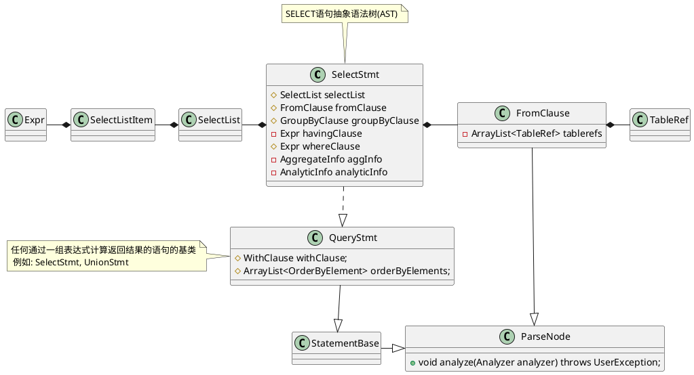
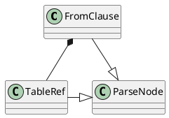

Doris新优化器(Nereids)将每个RBO和CBO的优化点以规则的形式呈现。对于每一个规则，新优化器都提供了一组用于描述查询计划形状的模式(Pattern)，可以精确的匹配可优化的查询计划。基于此，新优化器可以更好的支持诸如多层子查询嵌套等更为复杂的查询语句。且新优化器CBO基于先进的 Cascades 框架，使用了更为丰富的数据统计信息，并应用了维度更科学的代价模型, 使得新优化器在面对多表 Join 的查询时，更加得心应手。

[Doris官网](https://doris.apache.org/zh-CN/docs/dev/query-acceleration/nereids)提供的数据: TPC-H SF100 查询速度比较。环境为 3BE，新优化器使用原始 SQL ，执行 SQL 前收集了统计信息。旧优化器使用手工调优 SQL。可以看到，新优化器在无需手工优化查询的情况下，总体查询时间与旧优化器手工优化后的查询时间相近。
<center>
    
</center>

首先了解其使用方法,Doris 2.0的版本默认开启新优化器

```shell
# 开启新的查询优化器
SET enable_nereids_planner=true;

# 自动回退到旧版查询优化
SET enable_fallback_to_original_planner=true;
```

# 查询优化配置参数

Doris支持设置一些会话级参数，了解一些查询优化相关的配置参数

```shell
SET enable_dphyp_optimizer=true;
SET enable_dphyp_trace=true;
```

```shell
# 默认为false
SET plan_nereids_dump=true;

# 默认为false,在选择plan前打印Memo(参见NereidsPlanner::plan)
SET dump_nereids_memo=true;

# 默认值为1
SET nth_optimized_plan=XX;
```

SQL进入Doris会进行SQL解析，Doris新版查询优化器采用Antlr4词法分析器，对应配置文件 `DorisLexer.g4`，以及Antlr4  LL(*)语法分析，对应的语法分析文件为`DorisParser.g4`，SQL语句会被解析为抽象语法树(AST)，例如常见的SELECT语句被解析为`SelectStmt`。


# 主流程

`ConnectProcessor`的`handleQuery`接口负责实现对Query查询的处理，这开始对Nereids全新查询优化器的调用，删除一些非重点和异常处理代码了解Nereids查询优化器的主调用流程

```java
private void handleQuery(MysqlCommand mysqlCommand) {        
    // 1. convert statement to Java string
    // packetBuf表示从channel读到的一包数据
    byte[] bytes = packetBuf.array(); 
    int ending = packetBuf.limit() - 1;
    while (ending >= 1 && bytes[ending] == '\0') ending--;
    String originStmt = new String(bytes, 1, ending, StandardCharsets.UTF_8);
    
    // 2. Nereids处理Query Command, do not support prepare and execute now
    List<StatementBase> stmts = null;
    if (mysqlCommand == MysqlCommand.COM_QUERY &&
        ctx.getSessionVariable().isEnableNereidsPlanner()) {
        // 2.1 Nereids parser解析,采用Antlr4，对应文件为DorisParser.g4
        //     这里借助LogicalPlanBuilder得到了逻辑计划
        //     将<LogicalPlan, StatementContext>保存在LogicalPlanAdapter
        //      
        //     其中, LogicalPlanBuilder来构建logical plan
        stmts = new NereidsParser().parseSQL(originStmt);
    }
    

    // stmts == null when Nereids cannot planner this query or Nereids is disabled.
    if (stmts == null) {
        stmts = parse(originStmt);
    }

    List<String> origSingleStmtList = null;
    if (stmts.size() > 1) { // split originStmt to multi singleStmts
        origSingleStmtList = SqlUtils.splitMultiStmts(originStmt);
    }
    
    for (int i = 0; i < stmts.size(); ++i) {
        StatementBase parsedStmt = stmts.get(i);
        parsedStmt.setOrigStmt(new OriginStatement(originStmt, i));
        parsedStmt.setUserInfo(ctx.getCurrentUserIdentity());
        // parsedStmt保存在StmtExecutor的parsedStmt私有变量中
        // 参见StmtExecutor构造,之后传递给NereidsPlanner的plan接口来优化
        executor = new StmtExecutor(ctx, parsedStmt);
        ctx.setExecutor(executor);

        // 2.2 execute By Nereids
        executor.execute();
        if (i != stmts.size() - 1) {
            ctx.getState().serverStatus |= MysqlServerStatusFlag.SERVER_MORE_RESULTS_EXISTS;
            if (ctx.getState().getStateType() != MysqlStateType.ERR) {
                finalizeCommand();
            }
        }
        // execute failed, skip remaining stmts
        if (ctx.getState().getStateType() == MysqlStateType.ERR) break;
    }
}
```

可见`StmtExecutor`的`execute`是新查询优化器的主要实现在这里。

```java
public void execute() throws Exception {
    UUID uuid = UUID.randomUUID();
    TUniqueId queryId = new TUniqueId(uuid.getMostSignificantBits(),
                                      uuid.getLeastSignificantBits());
    execute(queryId);
}

public void execute(TUniqueId queryId) throws Exception {
    if (parsedStmt instanceof LogicalPlanAdapter
            || (parsedStmt == null && sessionVariable.isEnableNereidsPlanner())) {
        executeByNereids(queryId);
    }
}

private void executeByNereids(TUniqueId queryId) throws Exception {
    parseByNereids();
    LogicalPlan logicalPlan = ((LogicalPlanAdapter) parsedStmt).getLogicalPlan();
    if (logicalPlan instanceof Command) {
        	.....
        // 例如,将query查询结果插入到table中表示为
        // InsertIntoTableCommand(Query())
        // 下面run接口通过Nereids优化器对query进行优化
        ((Command) logicalPlan).run(context, this);
    } else {
        // 创建NereidsPlanner并调用plan进行analyze和optimize
        planner = new NereidsPlanner(statementContext);
        planner.plan(parsedStmt, context.getSessionVariable().toThrift()/*TQueryOptions*/);
        checkBlockRules();
        handleQueryWithRetry(queryId);
    }
}
```

`NereidsPlanner`类图：
```plantuml
class NereidsPlanner {
    - CascadesContext cascadesContext
    - StatementContext statementContext
    + void plan(StatementBase queryStmt, TQueryOptions queryOptions)\n\tthrows UserException
}

CascadesContext -up-o NereidsPlanner
StatementContext -up-o NereidsPlanner
```
接下来，了解一下`NereidsPlanner`的`plan`实现
```java
@Override
public void plan(StatementBase queryStmt, org.apache.doris.thrift.TQueryOptions queryOptions) {
    LogicalPlanAdapter logicalPlanAdapter = (LogicalPlanAdapter) queryStmt;
    ExplainLevel explainLevel = getExplainLevel(queryStmt.getExplainOptions());
    LogicalPlan parsedPlan = logicalPlanAdapter.getLogicalPlan();
    setParsedPlan(parsedPlan);
    
    // 1. 初始化Require属性为PhysicalProperties.GATHER
    PhysicalProperties requireProperties = buildInitRequireProperties();

    // 2. Do analyze and optimize for query plan实现流程参见下面
    Plan resultPlan = plan(parsedPlan, requireProperties, explainLevel);
    statementContext.getStopwatch().stop();
    setOptimizedPlan(resultPlan);
    if (explainLevel.isPlanLevel) return;
   
    // 3. translate PhysicalPlan to PlanFragment
    physicalPlan = (PhysicalPlan) resultPlan;
    PlanTranslatorContext planTranslatorContext = new PlanTranslatorContext(cascadesContext);
    PhysicalPlanTranslator physicalPlanTranslator = new PhysicalPlanTranslator(planTranslatorContext,
            statementContext.getConnectContext().getStatsErrorEstimator());
    PlanFragment root = physicalPlanTranslator.translatePlan(physicalPlan);

    scanNodeList.addAll(planTranslatorContext.getScanNodes());
    descTable = planTranslatorContext.getDescTable();
    fragments = new ArrayList<>(planTranslatorContext.getPlanFragments());
    for (int seq = 0; seq < fragments.size(); seq++) {
        fragments.get(seq).setFragmentSequenceNum(seq);
    }
    // set output exprs
    logicalPlanAdapter.setResultExprs(root.getOutputExprs());
    ArrayList<String> columnLabelList =
        physicalPlan.getOutput().stream().map(NamedExpression::getName)
            .collect(Collectors.toCollection(ArrayList::new));
    logicalPlanAdapter.setColLabels(columnLabelList);
    logicalPlanAdapter.setViewDdlSqls(statementContext.getViewDdlSqls());
}
```
## 查询优化主实现
查询优化RBO和CBO主要实现在
```java
public Plan plan(LogicalPlan plan, PhysicalProperties requireProperties, ExplainLevel explainLevel) {
    // 1. 在将逻辑计划拷贝到Memo前进行预处理(pre-process)
    //    e.g. process SET_VAR hint
    plan = preprocess(plan);

    // 2. 初始化CascadesContext
    initCascadesContext(plan, requireProperties);
    try (Lock lock = new Lock(plan, cascadesContext)) {
        // 3. analyze this query
        analyze();

        // 4. rule-based optimize(RBO)
        rewrite();

        // 5. optimize(CBO)
        optimize();

        // 6. choose Nth Plan
        int nth = cascadesContext.getConnectContext().getSessionVariable().getNthOptimizedPlan();
        PhysicalPlan physicalPlan = chooseNthPlan(getRoot(), requireProperties, nth);
        
        // 7. 借助PlanPostProcessor实现rewrite PhysicalPlan to new PhysicalPlan
        physicalPlan = postProcess(physicalPlan);
        return physicalPlan;
    } catch { }
}
```

# Parser


以SELECT语句来了解AST的表达
```
select_stmt ::=
  select_clause:selectList
    limit_clause:limitClause
  {: RESULT = new SelectStmt(selectList, null, null, null, null, null, limitClause); :}
  | select_clause:selectList
    from_clause:fromClause
    where_clause:wherePredicate
    group_by_clause:groupByClause
    having_clause:havingPredicate
    order_by_clause:orderByClause
    limit_clause:limitClause
  {:
    RESULT = new SelectStmt(selectList, fromClause, wherePredicate,
                            groupByClause, havingPredicate, orderByClause,
                            limitClause);
  :}
  | value_clause:valueClause order_by_clause:orderByClause limit_clause:limitClause
  {:
      RESULT = new SelectStmt(valueClause, orderByClause, limitClause);
  :}
  ;
```

## SELECT AST

SELECT语句的AST用`SelectStmt`来表示



```java
// SELECT语句的AST树
public class SelectStmt extends QueryStmt {
    protected SelectList selectList;
    private final ArrayList<String> colLabels; // lower case column labels
    protected FromClause fromClause;
    protected GroupByClause groupByClause;
    private List<Expr> originalExpr;

    private Expr havingClause;  // original having clause
    protected Expr whereClause;
    // havingClause with aliases and agg output resolved
    private Expr havingPred;
    private Expr originalWhereClause;

    // set if we have any kind of aggregation operation, include SELECT DISTINCT
    private AggregateInfo aggInfo;
    // set if we have analytic function
    private AnalyticInfo analyticInfo;
}

/**
 * Abstract base class for any statement that returns results
 *  via a list of result expressions. eg SelectStmt or UnionStmt.
 *  
 *  它实现了analyze接口实现对Orderby和Limit的analyze
 * */
public abstract class QueryStmt extends StatementBase implements Queriable {
    protected WithClause withClause;
    protected ArrayList<OrderByElement> orderByElements;

    @Override
    public void analyze(Analyzer analyzer) throws AnalysisException, UserException {
        if (isAnalyzed()) {
            return;
        }
        super.analyze(analyzer);
        analyzeLimit(analyzer);
        if (hasWithClause()) {
            withClause.analyze(analyzer);
        }
    }

    private void analyzeLimit(Analyzer analyzer) throws AnalysisException {
        limitElement.analyze(analyzer);
    }
}
// Glue interface for QueryStmt and LogicalPlanAdaptor
public interface Queriable {
    boolean hasOutFileClause();
    OutFileClause getOutFileClause();
    boolean isExplain();
    ExplainOptions getExplainOptions();
    List<Expr> getResultExprs();
    ArrayList<String> getColLabels();
    String toDigest();
}

public abstract class StatementBase implements ParseNode {

}

public interface ParseNode {
    /**
     * Perform semantic analysis of node and all of its children.
     * Throws exception if any errors found.
     */
    void analyze(Analyzer analyzer) throws UserException;
    String toSql();
}
```

```java
public class SelectList {
    private boolean isDistinct;
    private boolean isExcept;
    private Map<String, String> optHints;
    private List<OrderByElement> orderByElements;
    private final List<SelectListItem> items;
}

public class SelectListItem {
    private Expr expr;
    private final TableName tblName;
    private final boolean isStar;
    private String alias;
}
```

### From子句
在SELECT的AST中，From子句采用`FromClause`表示，其内部持有一系列`TableRef`

```java
public class FromClause implements ParseNode, Iterable<TableRef> {
    private final ArrayList<TableRef> tablerefs;
    private boolean analyzed = false;
    private boolean needToSql = false;
    // join reorder会改变表顺序，调用reset导致初始的表顺序丢失
    // 下次执行analyze,可能会导致'unable to find column xxx'的报错
    // 这里保存,并在reset时恢复原始的表顺序
    private final ArrayList<TableRef> originalTableRefOrders = new ArrayList<TableRef>();
}

public class TableRef implements ParseNode, Writable {
    protected TableName name;
    protected String[] aliases;
    protected List<Long> sampleTabletIds;
    private PartitionNames partitionNames = null;
    // 用户添加的Hint
    private ArrayList<String> commonHints;
    protected TableSample tableSample;
    private TableSnapshot tableSnapshot;
}
```

### 表达式Expr
```java
public abstract class Expr extends TreeNode<Expr>
    	implements ParseNode, Cloneable, Writable, ExprStats {

}
```

```java
public class FunctionCallExpr extends Expr {

}
```

### 列
```java
// 列表达数据结构
public class SlotRef extends Expr {
    private TableName tblName;
    private TableIf table = null;
    private TupleId tupleId = null;
    private String col;
    private String label; 
    // results of analysis
    protected SlotDescriptor desc;
}
```

### GroupBy子句
```java
/**
 * support normal GROUP BY clause and extended GROUP BY clause like
 * ROLLUP, GROUPING SETS, CUBE syntax like
 *   SELECT a, b, SUM( c ) FROM tab1 GROUP BY GROUPING SETS ( (a, b), (a), (b), ( ) );
 *   SELECT a, b,c, SUM( d ) FROM tab1 GROUP BY ROLLUP(a,b,c)
 *   SELECT a, b,c, SUM( d ) FROM tab1 GROUP BY CUBE(a,b,c)
 *   GROUP BY `GROUPING SETS` ｜ `CUBE` ｜ `ROLLUP` is an extension to  GROUP BY clause.
 */
public class GroupByClause implements ParseNode {
    // max num of distinct sets in grouping sets clause
    private static final int MAX_GROUPING_SETS_NUM = 64;
    // max num of distinct expressions
    private boolean analyzed = false;
    private boolean exprGenerated = false;
    private GroupingType groupingType;
    private ArrayList<Expr> groupingExprs;
    private ArrayList<Expr> oriGroupingExprs;
    // reserve this info for toSQL
    private List<ArrayList<Expr>> groupingSetList;
}
```
### 窗口
在parser中可以看到,下面的定义
```
analytic_expr ::=
  function_call_expr:e KW_OVER LPAREN opt_partition_by_clause:p order_by_clause:o opt_window_clause:w RPAREN
  {:
    FunctionCallExpr f = (FunctionCallExpr)e;
    f.setIsAnalyticFnCall(true);
    RESULT = new AnalyticExpr(f, p, o, w);
  :}
  %prec KW_OVER
  ;
```
可见窗口的函数中的函数是`FunctionCallExpr`,它和分区，orderby和frame一起组成可`AnalyticExpr`。

```java
public class AnalyticExpr extends Expr {
    // 函数，例如SUM，COUNT等
    private FunctionCallExpr fnCall;
    // 分区条件
    private final List<Expr> partitionExprs;
    // Order by条件
    private List<OrderByElement> orderByElements = Lists.newArrayList();
    // Frame
    private AnalyticWindow window;
};

public class AnalyticWindow {
    // 表示ROWS或RANGE
    private final Type type;
    private final Boundary leftBoundary;
    private Boundary rightBoundary;
}
```

### OrderBy子句
```java
public class OrderByElement {
    private Expr expr;
    private final boolean isAsc;
    // 表示NULL的排序，true表示NULLS FIRST, false表示NULLS LAST
    private final Boolean nullsFirstParam;
}
```
### Limit子句
```java
public class LimitElement {
    public static LimitElement NO_LIMIT = new LimitElement();
    private long limit;
    private long offset;
}
```
### 子查询

子查询也当作表达式
```java
public class Subquery extends Expr {
    // The QueryStmt of the subquery.
    protected QueryStmt stmt;
    // A subquery has its own analysis context
    protected Analyzer analyzer;
}
```

```java
public class ColumnRefExpr extends Expr {
    private String columnName;
    private int columnId;
    private boolean isNullable;
}
```

## DDL AST
```java
public class CreateTableStmt extends DdlStmt {

}

public abstract class DdlStmt extends StatementBase {}

public abstract class StatementBase implements ParseNode {}

```


# 转换成逻辑计划
通过`LogicalPlanBuilder`的`visitRegularQuerySpecification`来实现将SELECT语句转换成逻辑计划`LogicalPlan`,结合`fe/fe-core/src/main/antlr4/org/apache/doris/nereids/DorisParser.g4`一起看。

`fe/fe-core/src/main/antlr4/org/apache/doris/parser/DorisSqlSeparator.g4`

```java
// NereidsParser的parse接口
private <T> T parse(String sql, Function<DorisParser, ParserRuleContext> parseFunction) {
    ParserRuleContext tree = toAst(sql, parseFunction);
    LogicalPlanBuilder logicalPlanBuilder = new LogicalPlanBuilder();
    return (T) logicalPlanBuilder.visit(tree);
}
```
```java
public class LogicalPlanBuilder extends DorisParserBaseVisitor<Object> {
}
```


```java
// All DDL and DML commands' super class.
public abstract class Command extends AbstractPlan implements LogicalPlan {}

// Abstract class for all concrete plan node.
public abstract class AbstractPlan extends AbstractTreeNode<Plan> implements Plan {
    protected final Statistics statistics;
    protected final PlanType type;
    protected final Optional<GroupExpression> groupExpression;
    protected final Supplier<LogicalProperties> logicalPropertiesSupplier;
};

// Abstract class for all logical plan in Nereids.
public interface LogicalPlan extends Plan {}

// Abstract class for all plan node.
public interface Plan extends TreeNode<Plan> {}
```

```java
public class InsertIntoTableCommand extends Command
    	implements ForwardWithSync, Explainable {
}
```


```java
/**
 * A relation that contains only one row consist of some constant expressions.
 * e.g. select 100, 'value'
 */
public class UnboundOneRowRelation extends LogicalRelation implements Unbound, OneRowRelation {

}
```

```java
// Abstract class for all logical plan that have no child.
public abstract class LogicalLeaf extends AbstractLogicalPlan
        implements LeafPlan, OutputSavePoint {
    public abstract List<Slot> computeOutput();
}
```

```java
public class LogicalLimit<CHILD_TYPE extends Plan>
        extends LogicalUnary<CHILD_TYPE> implements Limit {}
```

```java
public class LogicalSubQueryAlias<CHILD_TYPE extends Plan>
    extends LogicalUnary<CHILD_TYPE> {
    private final List<String> qualifier;
    private final Optional<List<String>> columnAliases;
}
```
对于[row to clumn](https://doris.apache.org/docs/1.2/advanced/lateral-view/)通过`LATERAL VIEW`语法实现，在生成逻辑算子时，会生成一个`LogicalGenerate`算子，相关实现参见`withGenerate`.
```java
// plan for table generator, the statement like:
// SELECT * FROM tbl LATERAL VIEW EXPLODE(c1) g as (gc1);
public class LogicalGenerate<CHILD_TYPE extends Plan>
    extends LogicalUnary<CHILD_TYPE> implements Generate {
        
}
```

`visitTableValuedFunction`生成
```java
public class UnboundTVFRelation extends LogicalRelation
        implements TVFRelation, Unbound {

}
```

```java
// The node of logical plan for sub query and alias
public class LogicalSubQueryAlias<CHILD_TYPE extends Plan>
        extends LogicalUnary<CHILD_TYPE> {
    
}
```

`withCte`
```java
// Logical Node for CTE
public class LogicalCTE<CHILD_TYPE extends Plan>
        extends LogicalUnary<CHILD_TYPE> {

}
```

```java
public class LogicalJoin<LEFT_CHILD_TYPE extends Plan, RIGHT_CHILD_TYPE extends Plan>
        extends LogicalBinary<LEFT_CHILD_TYPE, RIGHT_CHILD_TYPE> implements Join {
    private final JoinType joinType;
    private final List<Expression> otherJoinConjuncts;
    private final List<Expression> hashJoinConjuncts;
    private final JoinHint hint;

    // When the predicate condition contains subqueries and disjunctions
    // the join will be marked as MarkJoin.
    private final Optional<MarkJoinSlotReference> markJoinSlotReference;

    // Use for top-to-down join reorder
    private final JoinReorderContext joinReorderContext = new JoinReorderContext();
}
```

```java
public class LogicalWindow<CHILD_TYPE extends Plan>
        extends LogicalUnary<CHILD_TYPE> implements Window {}
```


# NereidsPlanner

## Preprocess

```java
/**
 * PlanPreprocessors: before copy the plan into the memo,
 * we use this rewriter to rewrite plan by visitor.
 */
public class PlanPreprocessors {
    private final StatementContext statementContext;

    public PlanPreprocessors(StatementContext statementContext) {
        this.statementContext = Objects.requireNonNull(
            statementContext, "statementContext can not be null");
    }

    public LogicalPlan process(LogicalPlan logicalPlan) {
        LogicalPlan resultPlan = logicalPlan;
        for (PlanPreprocessor processor : getProcessors()) {
            resultPlan = (LogicalPlan) resultPlan.accept(processor, statementContext);
        }
        return resultPlan;
    }

    public List<PlanPreprocessor> getProcessors() {
        // add processor if we need
        return ImmutableList.of(
                new EliminateLogicalSelectHint(),
                new TurnOffPipelineForDml()
        );
    }
}
```


```java
// PlanPreprocessor: a PlanVisitor to rewrite LogicalPlan to new LogicalPlan.
public abstract class PlanPreprocessor extends DefaultPlanRewriter<StatementContext> {

}

/**
 * Default implementation for plan rewriting, delegating to child plans and rewrite current root
 * when any one of its children changed.
 */
public abstract class DefaultPlanRewriter<C> extends PlanVisitor<Plan, C> {
    @Override
    public Plan visit(Plan plan, C context) {
        return visitChildren(this, plan, context);
    }
}

// Base class for the processing of logical and physical plan
// 这里定义了一系列的visitXXX的接口
public abstract class PlanVisitor<R, C> implements CommandVisitor<R, C>,
		RelationVisitor<R, C>, SinkVisitor<R, C> {
   public abstract R visit(Plan plan, C context);

   // 例如, EliminateLogicalSelectHint类中的visitLogicalSelectHint
   public R visitLogicalSelectHint(LogicalSelectHint<? extends Plan> hint, C context) {
        return visit(hint, context);
    }
}
```


```java
public interface CustomRewriter {
    // entrance method
    Plan rewriteRoot(Plan plan, JobContext jobContext);
}
```


```java
public class EliminateLogicalSelectHint extends PlanPreprocessor implements CustomRewriter {
    
}
```

## analyze

根据元数据进行语义检查。

```java
public class NereidsPlanner extends Planner {
	private void analyze() {
        // Nereids将操作统一表示为Job(基类AbstractBatchJobExecutor)
        // 对外提供execute接口对上层的job分别执行
        cascadesContext.newAnalyzer().analyze();
    }
}

public class CascadesContext implements ScheduleContext {
    public Analyzer newAnalyzer() {
        return new Analyzer(this);
    }
}
```

可见`org.apache.doris.nereids.jobs.executor.Analyzer`负责实现`analyze`

```java
public interface RewriteJob {
    void execute(JobContext jobContext);
    boolean isOnce();
}
```


```java
/**
 * Bind symbols according to metadata in the catalog, perform semantic analysis, etc.
 */
public class Analyzer extends AbstractBatchJobExecutor {
    public static final List<RewriteJob> DEFAULT_ANALYZE_JOBS =
        	buildAnalyzeJobs(Optional.empty());
    private final List<RewriteJob> jobs;
        private static List<RewriteJob> buildAnalyzeJobs(
            	Optional<CustomTableResolver> customTableResolver) {
        return jobs(
            topDown(new AnalyzeCTE()),
            .....
        );
}

/**
 * Base class for executing all jobs.
 * Each batch of rules will be uniformly executed.
 */
public abstract class AbstractBatchJobExecutor {
    protected CascadesContext cascadesContext;
    // 获取需要执行的一系列Job
    public abstract List<RewriteJob> getJobs();
    
    // 将待处理规则(表示为RewriteJob)并对外提供execute接口来执行任务
    public void execute() {
        for (int i = 0; i < getJobs().size(); i++) {
            JobContext jobContext = cascadesContext.getCurrentJobContext();
            RewriteJob currentJob = getJobs().get(i);
            if (currentJob instanceof CostBasedRewriteJob) {
                List<RewriteJob> remainJobs = getJobs().subList(i + 1, getJobs().size()).stream()
                        .filter(j -> !(j instanceof CostBasedRewriteJob))
                        .collect(Collectors.toList());
                jobContext.setRemainJobs(remainJobs);
            }
            do {
                jobContext.setRewritten(false);
                currentJob.execute(jobContext);
            } while (!currentJob.isOnce() && jobContext.isRewritten());
        }
    }
}
```


```java
public class AnalyzeCTE extends OneAnalysisRuleFactory {}

// abstract class for all rule factories build one rule used in analysis stage.
public abstract class OneAnalysisRuleFactory
        extends OnePlanRuleFactory implements AnalysisRuleFactory {
}

// abstract class for all rule factories build one plan rule.
public abstract class OnePlanRuleFactory extends OneRuleFactory
    	implements PlanRuleFactory {
}

/**
 * interface for all rule factories used in analysis stage.
 */
public interface AnalysisRuleFactory extends PlanRuleFactory, GeneratedPlanPatterns {
    @Override
    default RulePromise defaultPromise() {
        return RulePromise.ANALYSIS;
    }
}

// interface for all plan rule factories.
public interface PlanRuleFactory extends RuleFactory {
}

// interface for all rule factories for build some rules.
public interface RuleFactory extends Patterns {
    List<Rule> buildRules();

    @Override
    RulePromise defaultPromise();
}
```


### AnalyseCTE

```java
// 这里会生成LogicalCTEProducer和LogicalCTEAnchor
public class AnalyzeCTE extends OneAnalysisRuleFactory {}
```


## rewrite

```java
public class NereidsPlanner extends Planner {
	private void rewrite() {
        Rewriter.getWholeTreeRewriter(cascadesContext).execute();
        NereidsTracer.logImportantTime("EndRewritePlan");
    }
}
```

```java
// Apply rules to rewrite logical plan.
public class Rewriter extends AbstractBatchJobExecutor {
    private static final List<RewriteJob> CTE_CHILDREN_REWRITE_JOBS = jobs(
        .......
    );
       
    public static Rewriter getWholeTreeRewriterWithoutCostBasedJobs(
        	CascadesContext cascadesContext) {
        return new Rewriter(cascadesContext, WHOLE_TREE_REWRITE_JOBS_WITHOUT_COST_BASED);
    }
}
```

