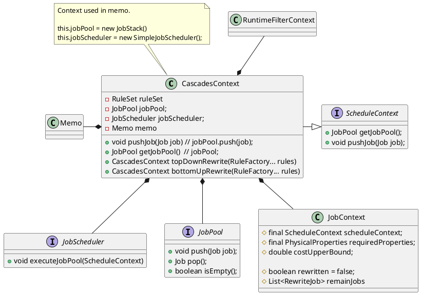
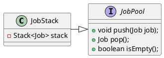
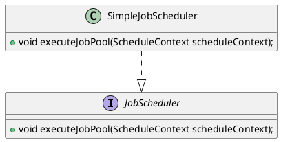

```java
public class CascadesContext implements ScheduleContext {

    // in analyze/rewrite stage, the plan will storage in this field
    private Plan plan;
    // in optimize stage, the plan will storage in the memo
    private Memo memo;
    private final StatementContext statementContext;

    private final CTEContext cteContext;
    private final RuleSet ruleSet;
    private final JobPool jobPool;
    private final JobScheduler jobScheduler;
    private JobContext currentJobContext;
    // subqueryExprIsAnalyzed: whether the subquery has been analyzed.
    private final Map<SubqueryExpr, Boolean> subqueryExprIsAnalyzed;
    private final RuntimeFilterContext runtimeFilterContext;
    private Optional<Scope> outerScope = Optional.empty();
    private Map<Long, TableIf> tables = null;

    private boolean isRewriteRoot;
    private volatile boolean isTimeout = false;

    // current process subtree, represent outer plan if empty
    private final Optional<CTEId> currentTree;
    private final Optional<CascadesContext> parent;
}

public interface ScheduleContext {
    JobPool getJobPool();
    void pushJob(Job job);
}

public class JobContext {
    // use for optimizer
    protected final ScheduleContext scheduleContext;
    protected final PhysicalProperties requiredProperties;
    protected double costUpperBound;

    // use for rewriter
    protected boolean rewritten = false;
    protected List<RewriteJob> remainJobs = Collections.emptyList();
}
```


## Job
```java

```
## JobPool
```java
public interface JobPool {
    void push(Job job);
    Job pop();
    boolean isEmpty();
}

// LIFO implementation of {@link JobPool}.
public class JobStack implements JobPool {
    Stack<Job> stack = new Stack<>();
}
```



## JobScheduler
```java
// Single thread, serial scheduler
public class SimpleJobScheduler implements JobScheduler {
    void executeJobPool(ScheduleContext scheduleContext);
}

// Scheduler to schedule jobs in Nereids.
public interface JobScheduler {
    void executeJobPool(ScheduleContext scheduleContext);
}

public interface ScheduleContext {
    JobPool getJobPool();
    void pushJob(Job job);
}
```
